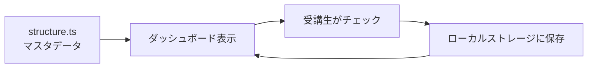
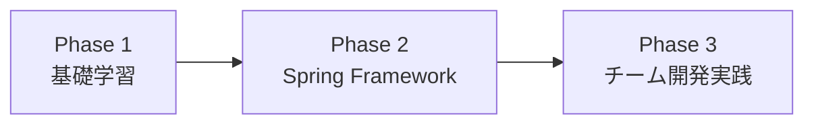

# プログラミングブートキャンプ教材 - 全体設計書

**対象:** プログラミング未経験者（特に文系出身者）
**期間:** 約1〜3ヶ月（全29日間のカリキュラム）

---

## 1. プロジェクト概要

### 1.1 目的
- プログラミング未経験者を、**実践的なWebアプリケーション開発ができる人材**に育成すること。
- 開発の楽しさを体験すること。

### 1.2 コンセプト
- **原則から説明**：プログラミングの大前提（上から下に実行、インデント、ブロック等）から丁寧に教える
- **必要性から理解**：「なぜその技術が必要か」の背景を説明し、納得感を持って学習できるようにする
- **実践重視**：最終的にチーム開発でWebアプリケーションを作成できるレベルを目指す

### 1.3 成果物
- Docusaurus形式のWebサイト教材
- 受講生の進捗を可視化するダッシュボード機能
- 各章の達成目標に対応した演習問題

### 1.4 教材の閲覧方針
- **印刷は想定していない**
- **ブラウザ閲覧に最適化**して問題ない
- スクロール、インタラクティブなコンポーネント（OneCompilerCodeBlock等）を積極的に活用
- ページの長さは気にせず、教育的に適切な粒度で章を構成

---

## 2. 対象者の特性と教育方針

### 2.1 受講生プロフィール
- **大半が文系出身のプログラミング未経験者**
- 「変数」「関数」「オブジェクト」などの概念に初めて触れる
- IT用語やプログラミング特有の考え方に慣れていない

### 2.2 教育方針

#### 2.2.1 原則から説明する
プログラミング経験者には自明なことも、初学者には明示的に説明する必要がある。

**説明すべき大原則:**
- プログラムは**上から下に実行される**
- **インデント（字下げ）**で構造を表現する
- **`{}`（波括弧）**でブロックを作り、処理をまとめる
- **セミコロン`;`**で文の終わりを示す（Java）
- **変数**はデータを一時保存する箱
- **型**は変数に入れられるデータの種類を決める

#### 2.2.2 必要性から理解させる
「なぜこの技術が必要か」を先に説明することで、学習のモチベーションを高める。

**説明の例:**

| 技術 | 「ないと何が困るか」 | 「だから必要」 |
|------|---------------------|---------------|
| **ループ（for, while）** | 同じ処理を100回書く必要がある | 繰り返しを簡潔に書くためにループが必要 |
| **メソッド** | 同じコードを何度もコピペする必要がある | 再利用可能にするためにメソッドが必要 |
| **クラス** | データと処理がバラバラで管理が大変 | データと処理をまとめるためにクラスが必要 |
| **継承** | 似たようなクラスを何度も書く必要がある | 共通部分を再利用するために継承が必要 |
| **例外処理** | エラーが起きたときプログラムが止まってしまう | エラーに対処するために例外処理が必要 |

#### 2.2.3 専門用語には必ず注釈を入れる
初学者は専門用語に慣れていないため、必ず説明を付ける。

**注釈の例:**
- コンパイル（人間が書いたコードを機械語に変換すること）
- インスタンス（クラスという設計図から作られた実体）
- メソッド（特定の処理をまとめたもの。他の言語では「関数」とも呼ぶ）
- パラメータ（メソッドに渡す値。「引数」とも呼ぶ）

#### 2.2.4 文体ルール
- **「である調」**で統一
- 簡潔でわかりやすい文章
- 冗長な表現を避け、本質を端的に伝える

---

## 3. ダッシュボード設計

### 3.1 目的
受講生が**自分の学習進捗を可視化**し、モチベーションを維持できるようにする。

### 3.2 仕組み

#### 3.2.1 データの保存場所
受講生のブラウザの**ローカルストレージ**に進捗データを保存する。

#### 3.2.2 マスタデータ
`docs/src/structure.ts`が**達成目標のマスタデータ**である。
全ての章（Topic）と達成目標（Question）がここに定義されている。

#### 3.2.3 進捗管理の流れ


### 3.3 達成の定義
**全ての達成目標（Question）が達成済みであれば、研修達成とする。**

各章（Topic）ごとに複数の達成目標（Question）があり、それら全てを達成することで、その章が完了したとみなす。

### 3.4 structure.tsの構造

#### 3.4.1 カテゴリ（Category）
教材の大分類。以下の7つがある：

| カテゴリ | 内容 |
|----------|------|
| `java/basics` | Java基礎文法 |
| `java/oop` | Javaオブジェクト指向 |
| `java/stdlib` | Java標準ライブラリ |
| `db` | データベース（SQL） |
| `git` | Git |
| `frontend` | HTML/CSS/JavaScript |
| `spring` | Spring Framework |

#### 3.4.2 トピック（Topic）
各章に対応する。1つのカテゴリに複数のトピックが属する。

**構造:**
```typescript
interface Topic {
  id: string;           // ファイル名（例：variables_and_types）
  label: string;        // ダッシュボードに表示される名前（例：変数と型）
  category: Category;   // 所属カテゴリ（例：java/basics）
  questions: Question[]; // 達成目標の配列
}
```

#### 3.4.3 達成目標（Question）
各トピックに対する学習目標。

**構造:**
```typescript
interface Question {
  id: string;              // 自動生成されるID（例：java/basics/variables_and_types#k1）
  title: string;           // 達成目標の内容（例：「変数とは何かを説明できる」）
  type: QuestionType;      // KNOW / READ / WRITE
  difficulty: Difficulty;  // Easy / Medium / Hard
}
```

**Questionの3つのタイプ:**

| タイプ | 意味 | 例 |
|--------|------|-----|
| **KNOW** | 知識・理解 | 「変数とは何かを説明できる」 |
| **READ** | 読解 | 「与えられたコードの実行結果を予測できる」 |
| **WRITE** | 実装 | 「変数を使ったプログラムを実装できる」 |

---

## 4. 演習問題設計

### 4.1 基本原則
**1つの達成目標（Question）に対して、1つの演習問題を作成する。**

### 4.2 対応関係

#### 4.2.1 structure.tsの定義
```typescript
withAutoIds({
  id: "variables_and_types",
  label: "変数と型",
  category: "java/basics",
  questions: [
    {
      title: "変数とは何かを説明できる",
      type: "KNOW",
      difficulty: Difficulty.Easy,
    },
    // 自動生成されるID: "java/basics/variables_and_types#k1"
  ],
})
```

#### 4.2.2 対応する演習問題ファイル
```
docs/src/questions/java/basics/variables_and_types/k1.mdx
```

### 4.3 演習問題のファイル名規則
- **KNOW**タイプ：`k1.mdx`, `k2.mdx`, `k3.mdx`, ...
- **READ**タイプ：`r1.mdx`, `r2.mdx`, `r3.mdx`, ...
- **WRITE**タイプ：`w1.mdx`, `w2.mdx`, `w3.mdx`, ...

### 4.4 演習問題の作成タイミング
教材本文の作成が全て完了した後に、演習問題を作成する。
こちらの指示があるまでは作成の必要はない。

---

## 5. カリキュラム全体のスコープ

### 5.1 全体の流れ（3つのPhase）



### 5.2 Phase 1: 基礎学習（Day 1-15）

#### Day 1: 自己紹介 / Java(変数、演算子)
- Javaとは
- 変数と型
- 演算子

#### Day 2: Java(条件分岐)
- if文、if-else
- switch文

#### Day 3: Java(繰り返し、配列) / ChatGPTを活用した学習法
- for文、while文、do-while文
- 配列の基礎
- ChatGPTを使った効果的な学習方法

#### Day 4: HTML(マークダウン言語とは、セレクタとCSS、インライン要素とブロック要素、aタグ、img)
- HTML基礎
- CSS基礎
- セレクタ
- リンクと画像

#### Day 5: DB(DBとは、INSERT, UPDATE, DELETE)
- データベースの基礎
- CRUDのうちC, U, D（作成、更新、削除）

#### Day 6: Java(メソッド)
- メソッドの定義と呼び出し
- 引数と戻り値
- オーバーロード

#### Day 7: Java(複数クラスを用いた開発) / Git
- パッケージとimport
- 複数クラスの連携
- Gitの基本操作

#### Day 8: Java(オブジェクト指向①[クラス、フィールド、メソッド])
- クラスとオブジェクト
- フィールドとメソッド
- インスタンスの生成

#### Day 9: Java(オブジェクト指向②[コンストラクタ]) / HTML(form, label, input)
- コンストラクタの役割
- オーバーロード
- HTMLフォーム要素

#### Day 10: DB(SELECT, sort, group by)
- SELECT文
- ORDER BY（並び替え）
- GROUP BY（グループ化）

#### Day 11: Java(オブジェクト指向③[継承、インターフェース])
- 継承の基礎
- superキーワード
- インターフェース

#### Day 12: Java(カプセル化)
- アクセス修飾子
- getter/setter
- カプセル化の意義

#### Day 13: Java(例外処理)
- 例外とは
- try-catch-finally
- 例外の種類

#### Day 14: Java(コレクション) / HTML(様々なUIの名称、Bootstrap)
- List、Set、Map
- ジェネリクス
- BootstrapによるUI構築

#### Day 15: Java(日時) / DB(正規化、JOIN)
- LocalDate、LocalTime、LocalDateTime
- データベース正規化
- JOIN（テーブル結合）

---

### 5.3 Phase 2: Spring Framework（Day 16-19）

#### Day 16: Webアプリ概要 / Spring(MVC、ルーティングからビューの表示、コントローラ)
- MVCモデルの基礎
- ルーティング
- コントローラとビュー

#### Day 17: Spring(GET/POST、フォームからビューへの受け渡し、バリデーション) / チーム演習課題
- GETとPOST
- フォームデータの受け取り
- バリデーション

#### Day 18: Spring(MyBatisを用いたDB操作、Service)
- MyBatisの基礎
- Mapperインターフェース
- サービス層の設計

#### Day 19: Spring(Spring Securityを用いた認証認可)
- 認証と認可
- Spring Securityの導入
- ログイン機能の実装

---

### 5.4 Phase 3: チーム開発実践（Day 20-29）

#### Day 20: Gitを用いたチーム開発手法 / チーム演習
- ブランチ戦略
- プルリクエスト
- コンフリクト解決

#### Day 21: テスト技法 / チーム演習
- 単体テストの基礎
- テストケースの設計

#### Day 22: JUnit / チーム演習
- JUnitの使い方
- アサーション
- テストの実行

#### Day 23: バグ修正演習 / チーム演習
- デバッグ手法
- ログの読み方

#### Day 24-28: チーム演習
- チームでWebアプリケーションを開発
- 要件定義、設計、実装、テスト

#### Day 29: 成果物発表会
- 各チームの成果物を発表
- 相互フィードバック

---

## 6. 技術スタック

### 6.1 言語・フレームワーク
| 技術 | バージョン | 用途 |
|------|-----------|------|
| Java | 17以降 | バックエンド開発 |
| Spring Boot | 3.x | Webアプリケーションフレームワーク |
| MyBatis | 3.x | O/Rマッパー |
| Thymeleaf | 3.x | テンプレートエンジン |
| HTML/CSS | - | フロントエンド |
| JavaScript | ES6+ | フロントエンド（最小限） |
| Bootstrap | 5.x | CSSフレームワーク |

### 6.2 ツール
| ツール | 用途 |
|--------|------|
| Git | バージョン管理 |
| GitHub | リモートリポジトリ |
| IntelliJ IDEA / Eclipse | IDE |
| MySQL / PostgreSQL | データベース |

### 6.3 教材プラットフォーム
| 技術 | 用途 |
|------|------|
| Docusaurus | 教材サイト生成 |
| React | ダッシュボードUI |
| TypeScript | structure.ts定義 |
| MUI (Material-UI) | UIコンポーネント |
| Recharts | 進捗グラフ表示 |

---

## 7. 教材の章立て方針

### 7.1 基本原則
- **スケジュールは「教えるべき内容」の参考資料**として活用
- **章構成は教育的に適切な粒度で設計**する
- スケジュールの「Day X」に縛られず、自然な章分けを行う

### 7.2 各技術分野の設計書
各技術分野ごとに、以下の設計書を作成する：

| 設計書 | 対応するカリキュラム | カテゴリ |
|--------|---------------------|----------|
| `01_java-design.md` | Day 1-3, 6-15 | java/basics, java/oop, java/stdlib |
| `02_html-css-design.md` | Day 4, 9, 14 | frontend |
| `03_sql-design.md` | Day 5, 10, 15 | db |
| `04_git-design.md` | Day 7, 20 | git |
| `05_spring-design.md` | Day 16-19 | spring（既存教材を活用） |

### 7.3 各章の構成
各教材ファイル（`.mdx`）には、以下のセクションを含める：

```markdown
# 章タイトル

## この章で学ぶこと
- 学習目標を箇条書き

## なぜこの技術が必要か
- 技術の必要性・背景を説明

## 基本概念
- 技術の基本的な説明

## 実例
- サンプルコード（できるだけ実行可能なもの）

## まとめ
- 章の要点を振り返り

## 演習（リンク）
- `docs/src/questions/`配下の演習問題へのリンク
```

---

## 8. 実装ロードマップ

### 基本方針
各技術分野について、**設計 → 教材作成 → structure.ts追加**のサイクルを繰り返す。
全ての設計を終えてから教材作成に移るのではなく、1つの分野ごとに完結させていく。

### Phase 1: 全体設計
- [x] 全体設計書の作成（本ドキュメント）

### Phase 2: Java教材の作成
- [x] Java設計書の作成
- [ ] Java教材の作成（16章）
- [ ] structure.tsへのJava関連Topic追加

### Phase 3: HTML/CSS教材の作成
- [ ] HTML/CSS設計書の作成
- [ ] HTML/CSS教材の作成
- [ ] structure.tsへのHTML/CSS関連Topic追加

### Phase 4: SQL教材の作成
- [ ] SQL設計書の作成
- [ ] SQL教材の作成
- [ ] structure.tsへのSQL関連Topic追加

### Phase 5: Git教材の作成
- [ ] Git設計書の作成
- [ ] Git教材の作成
- [ ] structure.tsへのGit関連Topic追加

### Phase 6: 演習問題作成フェーズ
- 各達成目標に対応する演習問題の作成

### Phase 7: レビュー・改善フェーズ
- 教材の相互レビュー
- サンプルコードの動作確認
- 誤字脱字のチェック

---

## 9. 補足事項

### 9.1 既存教材の扱い
- **Spring教材**（`docs/docs/spring/`）は完成度が高いため、そのまま保持する
- **ダッシュボード機能**も完成度が高いため、保持する
- その他の空のファイルや仮のファイルは、新しい教材に置き換える

### 9.2 今後の拡張
- チーム開発演習の詳細カリキュラム
- JUnitテスト技法の詳細教材
- バグ修正演習の具体的な課題

---

以上
