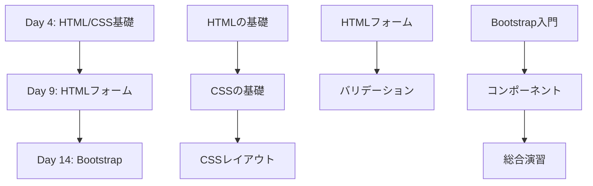

# HTML/CSS/Bootstrap教材設計書

## 設計方針

### 対象者
- **プログラミング未経験者（特に文系出身者）**
- HTMLやCSSの知識はゼロから始める
- Javaの基礎（変数、条件分岐、繰り返し、クラス、オブジェクト指向など）は学習済み

### 学習期間と時間配分
- **全3日間**（Day 4, Day 9, Day 14）
- **各日の構成**: 午前3時間（講義）+ 午後3時間（実習）
- **合計**: 講義9時間 + 実習9時間 = 18時間

### 学習範囲
- **HTML**: 基本的なタグ、セマンティックHTML、フォーム要素
- **CSS**: セレクタ、ボックスモデル、レイアウト（Flexbox含む）、レスポンシブデザインの基礎
- **Bootstrap**: コンポーネント、グリッドシステム、レスポンシブデザイン
- **JavaScript**: 含めない（別途Spring教材で学習）
- **開発者ツール**: 含めない（別途説明）

### 教育方針
1. **必要性から理解させる**: 「その技術がないと何が困るのか」を先に説明
2. **体験重視**: まず動かしてみる、やってみることを重視
3. **超スモールステップ**: 各Stepは5〜10分で完了できる粒度
4. **実行可能なコード**: OneCompilerCodeBlockを活用してブラウザ上で実行

---

## 全体構成

### 章立て一覧

| 章番号 | 章タイトル | 対応日程 | 所要時間（講義+実習） |
|--------|-----------|---------|---------------------|
| 1 | HTMLの基礎 | Day 4 午前 | 1.5h + 1.5h |
| 2 | CSSの基礎 | Day 4 午前〜午後 | 1.5h + 1.5h |
| 3 | CSSレイアウトとセレクタ | Day 4 午後 | 1.5h + 1.5h |
| 4 | HTMLフォーム | Day 9 午前 | 1.5h + 1.5h |
| 5 | フォームとバリデーション | Day 9 午後 | 1.5h + 1.5h |
| 6 | Bootstrap入門 | Day 14 午前 | 1.5h + 1.5h |
| 7 | Bootstrapコンポーネントとグリッド | Day 14 午後 | 1.5h + 1.5h |
| 8 | レスポンシブデザイン総合演習 | Day 14 午後 | 1.5h + 1.5h |

**合計**: 8章、講義12時間 + 実習12時間（調整可能）

### 3日間の学習の流れ

**学習の流れの設計意図**:
1. **Day 4**: HTMLとCSSの基礎を固める。タグの役割、CSSセレクタ、ボックスモデル、Flexboxを学ぶ。
2. **Day 9**: フォーム要素を学び、実際のWebアプリケーションに必要な入力欄を作成できるようにする。
3. **Day 14**: Bootstrapで効率的にUIを構築し、レスポンシブデザインを実現する。

---

## 各章の詳細

### 第1章: HTMLの基礎

#### 対応日程
Day 4 午前（前半）

#### 学習目標（この章で得られるスキル）
- ✅ HTMLの役割を説明できる
- ✅ HTMLタグの基本構造を理解できる
- ✅ 見出し、段落、リストを作成できる
- ✅ リンクと画像を配置できる

#### 含める内容の詳細

1. **Webページの仕組み**
   - HTMLはWebページの骨組み
   - ブラウザがHTMLを読み込んで表示する仕組み

2. **HTMLタグの基本**
   - タグの書き方（開始タグと終了タグ）
   - 基本的なHTML文書の構造（`<!DOCTYPE html>`, `<html>`, `<head>`, `<body>`）

3. **文章構造のタグ**
   - 見出し（`<h1>`〜`<h6>`）
   - 段落（`
`）
   - 改行（` `）
   - 水平線（`
`）

4. **リスト**
   - 順序なしリスト（`<ul>`, `<li>`）
   - 順序付きリスト（`<ol>`, `<li>`）

5. **リンクと画像**
   - リンク（`<a href="...">`）
   - 画像（``）

#### Stepの構成案

- **Step 0: まず体験してみよう**
  - 「HTMLがないとどうなるか」を体験
  - プレーンテキストだけのページと、HTML構造化されたページを比較

- **Step 1: HTMLタグの基本構造**
  - タグの書き方
  - 基本的なHTML文書の構造

- **Step 2: 見出しと段落**
  - `<h1>`〜`<h6>`, `
`の使い方
  - セマンティックな見出しレベルの重要性

- **Step 3: リスト**
  - `<ul>`, `<ol>`, `<li>`の使い方

- **Step 4: リンクと画像**
  - `<a>`, ``の使い方
  - 相対パスと絶対パス

- **Step 5: セマンティックHTML**
  - `<header>`, `<nav>`, `<main>`, `<footer>`, `<article>`, `<section>`の役割
  - なぜセマンティックHTMLが重要か（アクセシビリティ、SEO）

- **Step 6: やってみよう（複数の小課題）**
  - 自己紹介ページを作成
  - 見出し、段落、リスト、リンク、画像を含む簡単なページ

- **Step 7: まとめ**

- **よくある質問**

#### 実践課題のアイデア（Step 8）

1. **自己紹介ページ**
   - 見出し、段落、リスト、画像を使って自分を紹介するページを作成

2. **好きな本・映画の紹介ページ**
   - 見出し、リスト、リンク（Amazon、公式サイトなど）を使用

3. **レシピページ**
   - 材料リスト（`<ul>`）、手順（`<ol>`）、画像を配置

#### 所要時間の目安
- 講義: 1.5時間
- 実習: 1.5時間

---

### 第2章: CSSの基礎

#### 対応日程
Day 4 午前（後半）〜午後（前半）

#### 学習目標（この章で得られるスキル）
- ✅ CSSの役割を説明できる
- ✅ CSSをHTMLに適用できる
- ✅ 色、フォント、サイズを変更できる
- ✅ ボックスモデルを理解できる

#### 含める内容の詳細

1. **CSSの役割**
   - CSSはWebページの見た目を整える
   - HTMLが構造、CSSが装飾

2. **CSSの書き方**
   - セレクタ、プロパティ、値
   - CSSをHTMLに適用する3つの方法（インライン、内部、外部）

3. **基本的なスタイル**
   - 色（`color`, `background-color`）
   - フォント（`font-size`, `font-family`, `font-weight`）
   - テキスト（`text-align`, `text-decoration`）

4. **ボックスモデル**
   - `margin`, `padding`, `border`
   - 内側の余白と外側の余白の違い

5. **displayプロパティ**
   - `block`, `inline`, `inline-block`の違い

#### Stepの構成案

- **Step 0: まず体験してみよう**
  - 「CSSがないとどうなるか」を体験
  - CSSなしのページと、CSSありのページを比較

- **Step 1: CSSの基本構造**
  - セレクタ、プロパティ、値
  - CSSをHTMLに適用する方法

- **Step 2: 色とフォント**
  - `color`, `background-color`, `font-size`, `font-family`

- **Step 3: ボックスモデル**
  - `margin`, `padding`, `border`の違い
  - 図解で理解する

- **Step 4: displayプロパティ**
  - `block`, `inline`, `inline-block`の違い

- **Step 5: やってみよう（複数の小課題）**
  - 第1章で作成したHTMLにスタイルを適用

- **Step 6: まとめ**

- **よくある質問**

#### 実践課題のアイデア（Step 8）

1. **カードデザイン**
   - ボックスモデルを使って、カード風のデザインを作成

2. **ボタンのスタイリング**
   - `padding`, `border`, `background-color`を使ってボタンを作成

3. **ヘッダーとフッター**
   - `background-color`, `padding`, `text-align`を使ってヘッダーとフッターを作成

#### 所要時間の目安
- 講義: 1.5時間
- 実習: 1.5時間

---

### 第3章: CSSレイアウトとセレクタ

#### 対応日程
Day 4 午後（後半）

#### 学習目標（この章で得られるスキル）
- ✅ クラスセレクタとIDセレクタを使い分けられる
- ✅ Flexboxで要素を横並びにできる
- ✅ Flexboxで要素を中央揃えできる
- ✅ レスポンシブデザインの基礎を理解できる

#### 含める内容の詳細

1. **CSSセレクタの詳細**
   - 要素セレクタ、クラスセレクタ、IDセレクタ
   - 複合セレクタ（子孫セレクタ、子セレクタ）

2. **Flexboxの基礎**
   - `display: flex`
   - `flex-direction`, `justify-content`, `align-items`
   - Flexboxで横並びレイアウトを実現

3. **レスポンシブデザインの基礎**
   - `@media`クエリ
   - 画面幅に応じたレイアウト変更

4. **実用的なレイアウトパターン**
   - ヘッダー・メイン・フッター構造
   - カラムレイアウト

#### Stepの構成案

- **Step 0: まず体験してみよう**
  - 「Flexboxがないとどうなるか」を体験
  - floatやposition、tableを使った旧来のレイアウトの難しさ

- **Step 1: セレクタの種類**
  - 要素、クラス、IDセレクタの使い分け

- **Step 2: Flexboxの基本**
  - `display: flex`, `flex-direction`

- **Step 3: Flexboxで配置を制御**
  - `justify-content`, `align-items`

- **Step 4: レスポンシブデザインの基礎**
  - `@media`クエリ

- **Step 5: やってみよう（複数の小課題）**
  - Flexboxでナビゲーションバーを作成
  - 2カラムレイアウトを作成

- **Step 6: まとめ**

- **よくある質問**

#### 実践課題のアイデア（Step 8）

1. **ナビゲーションバー**
   - Flexboxを使って横並びのナビゲーションバーを作成

2. **カード一覧**
   - Flexboxを使って複数のカードを横並びに配置

3. **レスポンシブレイアウト**
   - `@media`クエリを使って、画面幅に応じてレイアウトを変更

#### 所要時間の目安
- 講義: 1.5時間
- 実習: 1.5時間

---

### 第4章: HTMLフォーム

#### 対応日程
Day 9 午前

#### 学習目標（この章で得られるスキル）
- ✅ フォームの役割を説明できる
- ✅ `<form>`, `<input>`, `<label>`を使える
- ✅ テキスト入力、パスワード入力、チェックボックス、ラジオボタンを作成できる
- ✅ `<select>`でドロップダウンを作成できる

#### 含める内容の詳細

1. **フォームとは**
   - ユーザーからデータを受け取る仕組み
   - ログインフォーム、お問い合わせフォーム、検索フォームなど

2. **基本的なフォーム要素**
   - `<form>`タグ
   - `<input>`タグ（text, password, email, number）
   - `<label>`タグ

3. **選択系の入力**
   - チェックボックス（`<input type="checkbox">`）
   - ラジオボタン（`<input type="radio">`）
   - ドロップダウン（`<select>`, `<option>`）

4. **複数行テキスト**
   - `<textarea>`

5. **ボタン**
   - `<button>`, `<input type="submit">`

#### Stepの構成案

- **Step 0: まず体験してみよう**
  - 「フォームがないとどうなるか」を体験
  - Webサービスがユーザー入力を受け取れない状況をイメージ

- **Step 1: 基本的なフォーム**
  - `<form>`, `<input type="text">`, `<label>`

- **Step 2: 様々な入力タイプ**
  - password, email, number

- **Step 3: チェックボックスとラジオボタン**
  - `<input type="checkbox">`, `<input type="radio">`

- **Step 4: ドロップダウン**
  - `<select>`, `<option>`

- **Step 5: テキストエリアとボタン**
  - `<textarea>`, `<button>`

- **Step 6: やってみよう（複数の小課題）**
  - お問い合わせフォームを作成
  - アンケートフォームを作成

- **Step 7: まとめ**

- **よくある質問**

#### 実践課題のアイデア（Step 8）

1. **ログインフォーム**
   - メールアドレスとパスワードの入力欄を作成

2. **お問い合わせフォーム**
   - 名前、メール、件名、お問い合わせ内容（`<textarea>`）

3. **アンケートフォーム**
   - ラジオボタン、チェックボックス、ドロップダウンを組み合わせる

#### 所要時間の目安
- 講義: 1.5時間
- 実習: 1.5時間

---

### 第5章: フォームとバリデーション

#### 対応日程
Day 9 午後

#### 学習目標（この章で得られるスキル）
- ✅ HTML5のバリデーション属性を使える
- ✅ 必須入力を設定できる
- ✅ 入力形式を制限できる
- ✅ プレースホルダーを設定できる

#### 含める内容の詳細

1. **バリデーションとは**
   - ユーザーの入力をチェックする仕組み
   - クライアント側バリデーションとサーバー側バリデーション

2. **HTML5のバリデーション属性**
   - `required`（必須入力）
   - `minlength`, `maxlength`（文字数制限）
   - `min`, `max`（数値の範囲）
   - `pattern`（正規表現）

3. **入力補助**
   - `placeholder`（プレースホルダー）
   - `autocomplete`（自動補完）

4. **CSSでフォームをスタイリング**
   - `:focus`, `:invalid`, `:valid`擬似クラス

#### Stepの構成案

- **Step 0: まず体験してみよう**
  - 「バリデーションがないとどうなるか」を体験
  - 不正なデータが送信されてしまう問題

- **Step 1: 必須入力**
  - `required`属性

- **Step 2: 文字数制限**
  - `minlength`, `maxlength`

- **Step 3: 数値の範囲**
  - `min`, `max`

- **Step 4: パターンマッチング**
  - `pattern`（正規表現）

- **Step 5: 入力補助**
  - `placeholder`, `autocomplete`

- **Step 6: CSSでスタイリング**
  - `:focus`, `:invalid`, `:valid`

- **Step 7: やってみよう（複数の小課題）**
  - バリデーション付きのフォームを作成

- **Step 8: まとめ**

- **よくある質問**

#### 実践課題のアイデア（Step 8）

1. **会員登録フォーム**
   - メールアドレス、パスワード（8文字以上）、確認用パスワード

2. **予約フォーム**
   - 日付、人数（1〜10人）、連絡先

3. **評価フォーム**
   - 星評価（1〜5）、コメント（10文字以上）

#### 所要時間の目安
- 講義: 1.5時間
- 実習: 1.5時間

---

### 第6章: Bootstrap入門

#### 対応日程
Day 14 午前

#### 学習目標（この章で得られるスキル）
- ✅ Bootstrapの役割を説明できる
- ✅ BootstrapをHTMLに導入できる
- ✅ Bootstrapのユーティリティクラスを使える
- ✅ ボタン、カード、アラートなどの基本コンポーネントを使える

#### 含める内容の詳細

1. **Bootstrapとは**
   - CSSフレームワークの役割
   - なぜBootstrapを使うのか（効率化、レスポンシブ対応）

2. **Bootstrapの導入**
   - CDNを使った導入方法
   - 基本的なHTML構造

3. **ユーティリティクラス**
   - `m-*`, `p-*`（マージン、パディング）
   - `text-*`, `bg-*`（テキスト色、背景色）
   - `d-*`（display）

4. **基本コンポーネント**
   - ボタン（`btn`, `btn-primary`など）
   - カード（`card`, `card-body`など）
   - アラート（`alert`, `alert-success`など）

5. **UIコンポーネントの名称**
   - Header, Footer, Navbar, Sidebar, Card, Modal, Badge, etc.

#### Stepの構成案

- **Step 0: まず体験してみよう**
  - 「Bootstrapがないとどうなるか」を体験
  - 自分でCSSを書いた場合とBootstrapを使った場合の違い

- **Step 1: Bootstrapの導入**
  - CDNリンクをHTMLに追加

- **Step 2: ユーティリティクラス**
  - `m-*`, `p-*`, `text-*`, `bg-*`

- **Step 3: ボタン**
  - `btn`, `btn-primary`, `btn-secondary`, `btn-lg`, `btn-sm`

- **Step 4: カード**
  - `card`, `card-body`, `card-title`, `card-text`

- **Step 5: アラート**
  - `alert`, `alert-success`, `alert-danger`, `alert-warning`

- **Step 6: UIコンポーネントの名称**
  - Header, Footer, Navbar, Sidebar, Card, Modal, Badge

- **Step 7: やってみよう（複数の小課題）**
  - Bootstrapでページを作成

- **Step 8: まとめ**

- **よくある質問**

#### 実践課題のアイデア（Step 8）

1. **プロフィールカード**
   - カードコンポーネントを使って、プロフィール情報を表示

2. **通知アラート**
   - アラートコンポーネントを使って、成功・エラーメッセージを表示

3. **アクションボタン**
   - 様々なスタイルのボタンを配置

#### 所要時間の目安
- 講義: 1.5時間
- 実習: 1.5時間

---

### 第7章: Bootstrapコンポーネントとグリッド

#### 対応日程
Day 14 午後（前半）

#### 学習目標（この章で得られるスキル）
- ✅ Bootstrapのグリッドシステムを使える
- ✅ レスポンシブなレイアウトを作成できる
- ✅ Navbar（ナビゲーションバー）を作成できる
- ✅ フォームをBootstrapでスタイリングできる

#### 含める内容の詳細

1. **グリッドシステムの基本**
   - `container`, `row`, `col`
   - 12カラムシステム

2. **レスポンシブグリッド**
   - `col-sm-*`, `col-md-*`, `col-lg-*`, `col-xl-*`
   - 画面幅に応じたカラム数の変更

3. **Navbar（ナビゲーションバー）**
   - `navbar`, `navbar-brand`, `navbar-nav`
   - レスポンシブなナビゲーション

4. **Bootstrapフォーム**
   - `form-control`, `form-label`
   - `form-group`, `form-row`

#### Stepの構成案

- **Step 0: まず体験してみよう**
  - 「グリッドシステムがないとどうなるか」を体験
  - レスポンシブ対応の難しさ

- **Step 1: グリッドシステムの基本**
  - `container`, `row`, `col-*`

- **Step 2: レスポンシブグリッド**
  - `col-sm-*`, `col-md-*`, `col-lg-*`

- **Step 3: Navbar**
  - `navbar`, `navbar-brand`, `navbar-nav`

- **Step 4: Bootstrapフォーム**
  - `form-control`, `form-label`

- **Step 5: やってみよう（複数の小課題）**
  - レスポンシブなページレイアウトを作成
  - Navbarを配置

- **Step 6: まとめ**

- **よくある質問**

#### 実践課題のアイデア（Step 8）

1. **3カラムレイアウト**
   - グリッドシステムを使って、サイドバー・メイン・広告欄の3カラムレイアウト

2. **ナビゲーションバー付きページ**
   - Navbarを配置し、レスポンシブに対応

3. **フォームページ**
   - Bootstrapのフォームスタイルを使って、会員登録ページを作成

#### 所要時間の目安
- 講義: 1.5時間
- 実習: 1.5時間

---

### 第8章: レスポンシブデザイン総合演習

#### 対応日程
Day 14 午後（後半）

#### 学習目標（この章で得られるスキル）
- ✅ HTML/CSS/Bootstrapを組み合わせてページを作成できる
- ✅ レスポンシブなWebページを作成できる
- ✅ 実際のWebサイトのレイアウトを再現できる
- ✅ これまで学んだ技術を統合して活用できる

#### 含める内容の詳細

1. **総合演習の目的**
   - これまで学んだHTML/CSS/Bootstrapの知識を統合
   - 実際のWebサイトに近いページを作成

2. **演習課題**
   - ランディングページの作成
   - ポートフォリオサイトの作成
   - ブログサイトの作成

3. **レビューとフィードバック**
   - 他の受講生の作品を見る
   - 改善点を見つける

#### Stepの構成案

- **Step 0: 課題の説明**
  - どんなページを作るかを理解する

- **Step 1: 設計**
  - どんなレイアウトにするかを考える
  - ワイヤーフレームを描く

- **Step 2: HTML構造の作成**
  - セマンティックHTMLで構造を作る

- **Step 3: Bootstrapでレイアウト**
  - グリッドシステムとコンポーネントを使う

- **Step 4: CSSでカスタマイズ**
  - 細かいスタイルを調整

- **Step 5: レスポンシブ対応の確認**
  - 画面幅を変えて確認

- **Step 6: まとめと振り返り**
  - 何ができるようになったか

- **よくある質問**

#### 実践課題のアイデア（Step 8）

1. **ランディングページ**
   - ヒーローセクション、特徴紹介、お問い合わせフォーム

2. **ポートフォリオサイト**
   - 自己紹介、スキル一覧、プロジェクト紹介

3. **ブログサイト**
   - 記事一覧、サイドバー、カテゴリ検索

#### 所要時間の目安
- 講義: 1.5時間
- 実習: 1.5時間

---

## 実習課題

### Day 4 実習（午後）

**課題1: 自己紹介ページの作成**
- HTMLで構造を作成
- CSSでスタイリング
- Flexboxでレイアウト

**課題2: カード一覧ページ**
- Flexboxを使って横並びのカードを配置
- レスポンシブ対応

### Day 9 実習（午後）

**課題1: お問い合わせフォームの作成**
- 名前、メール、件名、お問い合わせ内容
- バリデーション付き

**課題2: アンケートフォーム**
- ラジオボタン、チェックボックス、ドロップダウン
- バリデーション付き

### Day 14 実習（午後）

**総合演習: ランディングページまたはポートフォリオサイト**
- Bootstrap使用
- レスポンシブ対応
- Navbar、Hero、Features、Footer

---

## 各章の達成目標（structure.tsへの追加内容案）

### 第1章: HTMLの基礎
- HTMLの役割を説明できる（KNOW, Easy）
- HTMLタグの基本構造を理解できる（KNOW, Easy）
- 見出しと段落を作成できる（WRITE, Easy）
- リストを作成できる（WRITE, Easy）
- リンクを作成できる（WRITE, Easy）
- 画像を配置できる（WRITE, Easy）
- セマンティックHTMLを説明できる（KNOW, Medium）

### 第2章: CSSの基礎
- CSSの役割を説明できる（KNOW, Easy）
- CSSセレクタを説明できる（KNOW, Easy）
- 色とフォントを変更できる（WRITE, Easy）
- ボックスモデルを説明できる（KNOW, Medium）
- marginとpaddingを使い分けられる（WRITE, Medium）
- displayプロパティを説明できる（KNOW, Medium）

### 第3章: CSSレイアウトとセレクタ
- クラスセレクタとIDセレクタを使い分けられる（WRITE, Easy）
- Flexboxで要素を横並びにできる（WRITE, Medium）
- Flexboxで要素を中央揃えできる（WRITE, Medium）
- レスポンシブデザインの基礎を説明できる（KNOW, Medium）
- @mediaクエリを使える（WRITE, Medium）

### 第4章: HTMLフォーム
- フォームの役割を説明できる（KNOW, Easy）
- テキスト入力を作成できる（WRITE, Easy）
- チェックボックスとラジオボタンを作成できる（WRITE, Easy）
- ドロップダウンを作成できる（WRITE, Easy）
- フォームとlabelの関連付けができる（WRITE, Medium）

### 第5章: フォームとバリデーション
- バリデーションの役割を説明できる（KNOW, Easy）
- 必須入力を設定できる（WRITE, Easy）
- 文字数制限を設定できる（WRITE, Easy）
- 数値の範囲を制限できる（WRITE, Medium）
- プレースホルダーを設定できる（WRITE, Easy）

### 第6章: Bootstrap入門
- Bootstrapの役割を説明できる（KNOW, Easy）
- BootstrapをHTMLに導入できる（WRITE, Easy）
- Bootstrapのユーティリティクラスを使える（WRITE, Easy）
- ボタンコンポーネントを使える（WRITE, Easy）
- カードコンポーネントを使える（WRITE, Easy）
- UIコンポーネントの名称を説明できる（KNOW, Medium）

### 第7章: Bootstrapコンポーネントとグリッド
- グリッドシステムを説明できる（KNOW, Medium）
- グリッドシステムでレイアウトを作成できる（WRITE, Medium）
- レスポンシブグリッドを作成できる（WRITE, Medium）
- Navbarを作成できる（WRITE, Medium）
- Bootstrapでフォームをスタイリングできる（WRITE, Medium）

### 第8章: レスポンシブデザイン総合演習
- HTML/CSS/Bootstrapを組み合わせてページを作成できる（WRITE, Hard）
- レスポンシブなWebページを作成できる（WRITE, Hard）
- 実際のWebサイトのレイアウトを再現できる（WRITE, Hard）

---

## 設計上の注意点

### 1. JavaScriptは含めない
- Day 14時点では、JavaScriptは学習していない
- インタラクティブな機能（モーダル、ドロップダウンなど）は、Bootstrapの基本的な機能（data-bs-toggle など）のみ使用
- JavaScript詳細はSpring教材で学習

### 2. 開発者ツールは別途説明
- ブラウザの開発者ツールの使い方は、この教材には含めない
- 別途、講義で説明する想定

### 3. 実習時間の確保
- 各章で1.5時間の実習時間を確保
- 講師がサポートしながら、自分で手を動かす時間を重視

### 4. OneCompilerCodeBlockの活用
- HTMLはOneCompilerCodeBlockで実行可能
- ただし、CSSやBootstrapの複雑なレイアウトは、CodePen埋め込みも検討

### 5. 既存教材との整合性
- 既存のJava教材と同様の文体（である調）
- 同様の章構成（Step 0から始まり、実践課題、まとめ、よくある質問）
- MDXの記述ルール（改行、強調記号、表の扱い）を遵守

---

## 次のステップ

1. **設計のレビュー**
   - この設計書をユーザーに確認してもらう
   - 章立て、内容、所要時間が適切か

2. **教材作成の開始**
   - 設計が承認されたら、第1章から順に教材を作成
   - Java教材と同様の構成とスタイルで作成

3. **structure.tsへの追加**
   - 各章の達成目標をstructure.tsに追加
   - カテゴリ: `frontend`

4. **演習問題の作成**
   - Phase 6で、各達成目標に対応する演習問題を作成

---

## critical files for implementation

以下のファイルが、この設計を実装する際に最も重要である：

1. `/Users/hirochinko/workspace/programming-bootcamp/docs/docs/java/basics/01_java_basics.mdx`
   - **理由**: 章構成のテンプレートとして参考にする。Step 0から始まり、実践課題、まとめ、よくある質問という構成を踏襲。

2. `/Users/hirochinko/workspace/programming-bootcamp/docs/src/structure.ts`
   - **理由**: 各章の達成目標を追加するマスタデータファイル。frontendカテゴリに新しいTopicとQuestionsを追加。

3. `/Users/hirochinko/workspace/programming-bootcamp/.claude/CLAUDE.md`
   - **理由**: MDXの記述ルール、文体ルール、構成ルールが記載されており、教材作成時に常に参照する必要がある。

4. `/Users/hirochinko/workspace/programming-bootcamp/docs/docs/frontend/introduction.md`
   - **理由**: 既存のフロントエンド教材。どのような内容が既にあるかを確認し、重複を避ける。

5. `/Users/hirochinko/workspace/programming-bootcamp/docs/src/components/OneCompilerCodeBlock.tsx`（推測）
   - **理由**: HTMLコードを実行可能な形で表示するコンポーネント。教材内で頻繁に使用する。
