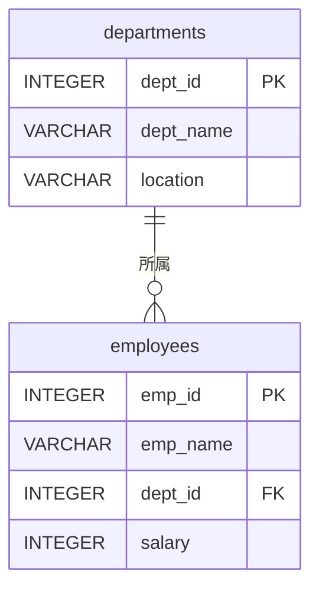
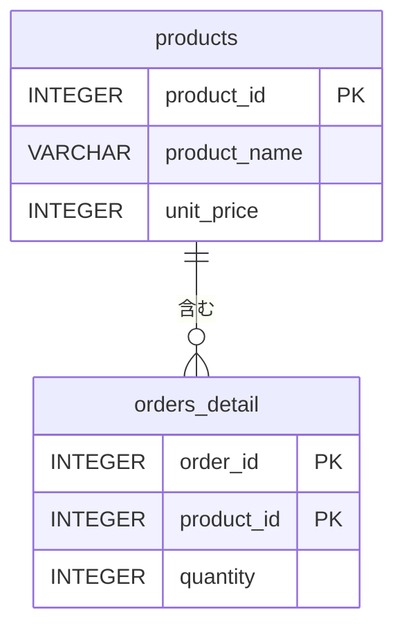
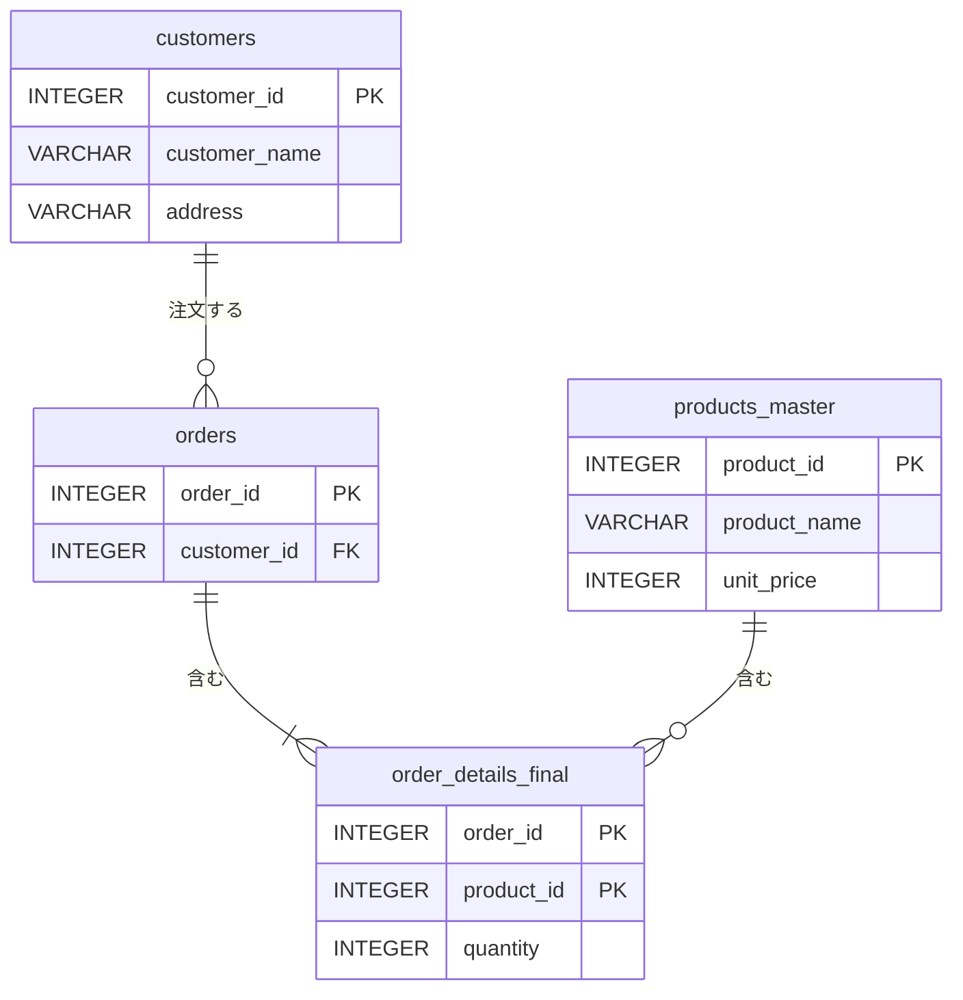

import { OneCompilerCodeBlock } from "@site/src/components/OneCompilerCodeBlock";

# テーブルの分割と正規化

この章で得られるスキル：
- ✅ なぜテーブルを分割する必要があるのかを説明できる
- ✅ 更新不整合（更新異常、挿入異常、削除異常）を説明できる
- ✅ 第1正規形、第2正規形、第3正規形を理解している
- ✅ 非正規形のテーブルを正規化できる
- ✅ 正規化のメリットとデメリットを説明できる

---

## Step 0: まず体験してみよう

### シナリオ：1つのテーブルに全部詰め込んだら？

ある会社で、社員と部門の情報を **1つのテーブル** で管理しているとする。
以下のSQLを実行して、問題を体験してみよう。

<OneCompilerCodeBlock
  language="postgresql"
  codeId="TODO"
  code={`-- 1つのテーブルに全部詰め込んだ例
CREATE TABLE employee_department (
    emp_id INTEGER PRIMARY KEY,
    emp_name VARCHAR(50) NOT NULL,
    dept_id INTEGER NOT NULL,
    dept_name VARCHAR(50) NOT NULL,
    dept_location VARCHAR(50) NOT NULL,
    salary INTEGER CHECK (salary > 0)
);

INSERT INTO employee_department VALUES (1, '田中太郎', 1, '営業部', '東京', 350000);
INSERT INTO employee_department VALUES (2, '佐藤花子', 2, '開発部', '大阪', 400000);
INSERT INTO employee_department VALUES (3, '鈴木一郎', 2, '開発部', '大阪', 320000);
INSERT INTO employee_department VALUES (4, '高橋美咲', 1, '営業部', '東京', 280000);

-- 営業部の所在地を「横浜」に変更してみよう
UPDATE employee_department SET dept_location = '横浜' WHERE emp_id = 1;

-- 確認：営業部の所在地が食い違っている！
SELECT * FROM employee_department ORDER BY emp_id;
`}
/>

田中太郎の営業部は「横浜」になったが、高橋美咲の営業部は「東京」のままである。
**同じ情報が複数行に散らばっているため、一部だけ更新すると食い違いが起きる。**

:::caution 重要
1つのテーブルに全てのデータを詰め込むと、データの食い違いが頻繁に起きる。
この問題を解決するのが **正規化（テーブルの分割）** である。
:::

---

## Step 1: 正規化とは何か

### 正規化の目的

**正規化** とは、テーブルを適切に分割して **データの重複を排除** し、**整合性を保つ** 手法である。

先ほどの例では、「営業部」「東京」という情報が2行に重複して存在していた。
テーブルを分割すれば、部門情報は1箇所だけに保存され、食い違いが起きなくなる。



上の図は **ER図**（Entity-Relationship Diagram）と呼ばれ、テーブル間の関係を表す。
詳しくは第9章で学ぶが、ここでは「テーブルを分割した結果」を視覚的に確認しよう。

### 正規化の段階

正規化にはいくつかの段階がある。実務では **第3正規形** までを適用するのが一般的である。

| 段階 | 名称 | 排除するもの |
|------|------|-------------|
| 第1正規形（1NF） | 繰り返し項目の排除 | 1つのセルに複数の値が入っている状態 |
| 第2正規形（2NF） | 部分関数従属の排除 | 主キーの一部だけで決まる列 |
| 第3正規形（3NF） | 推移的関数従属の排除 | 主キー以外の列で決まる列 |

:::tip ポイント
正規化は「理論的に正しいテーブル設計」を目指すための手法である。
難しい用語が出てくるが、やっていることは **「同じ情報を複数箇所に持たない」** という単純な原則に基づいている。
:::

---

## Step 2: 更新不整合の3つの種類

テーブルが正規化されていないと、3種類の **更新不整合** が発生する。

### 更新異常（Update Anomaly）

同じ情報が複数行にあるため、一部だけ更新すると食い違いが起きる。

<OneCompilerCodeBlock
  language="postgresql"
  codeId="TODO"
  code={`CREATE TABLE employee_department (
    emp_id INTEGER PRIMARY KEY,
    emp_name VARCHAR(50) NOT NULL,
    dept_id INTEGER NOT NULL,
    dept_name VARCHAR(50) NOT NULL,
    dept_location VARCHAR(50) NOT NULL,
    salary INTEGER CHECK (salary > 0)
);

INSERT INTO employee_department VALUES (1, '田中太郎', 1, '営業部', '東京', 350000);
INSERT INTO employee_department VALUES (2, '佐藤花子', 2, '開発部', '大阪', 400000);
INSERT INTO employee_department VALUES (3, '鈴木一郎', 2, '開発部', '大阪', 320000);
INSERT INTO employee_department VALUES (4, '高橋美咲', 1, '営業部', '東京', 280000);

-- 更新異常：開発部の所在地を「福岡」に変更（1行だけ更新）
UPDATE employee_department SET dept_location = '福岡' WHERE emp_id = 2;

-- 佐藤花子は「福岡」、鈴木一郎は「大阪」のまま → 食い違い！
SELECT emp_name, dept_name, dept_location
FROM employee_department
WHERE dept_id = 2;
`}
/>

### 挿入異常（Insert Anomaly）

本来独立したデータなのに、他のデータがないと登録できない。

例えば、新しい部門「マーケティング部」を作りたいが、まだ社員がいない。
`emp_id` が主キーなので、社員なしでは部門情報を登録できない。

### 削除異常（Delete Anomaly）

あるデータを削除したら、関係ない情報まで消えてしまう。

<OneCompilerCodeBlock
  language="postgresql"
  codeId="TODO"
  code={`CREATE TABLE employee_department (
    emp_id INTEGER PRIMARY KEY,
    emp_name VARCHAR(50) NOT NULL,
    dept_id INTEGER NOT NULL,
    dept_name VARCHAR(50) NOT NULL,
    dept_location VARCHAR(50) NOT NULL,
    salary INTEGER CHECK (salary > 0)
);

INSERT INTO employee_department VALUES (1, '田中太郎', 1, '営業部', '東京', 350000);
INSERT INTO employee_department VALUES (2, '佐藤花子', 2, '開発部', '大阪', 400000);
INSERT INTO employee_department VALUES (3, '鈴木一郎', 3, '人事部', '東京', 320000);

-- 鈴木一郎を退職処理で削除
DELETE FROM employee_department WHERE emp_id = 3;

-- 人事部の情報も一緒に消えてしまった！
SELECT DISTINCT dept_name, dept_location FROM employee_department;
`}
/>

:::note まとめ
3つの不整合は全て **「同じ情報が複数箇所にある」** ことが原因である。
テーブルを適切に分割すれば、これらの問題は解消される。
:::

---

## Step 3: 第1正規形（1NF）

### ルール：各セルには単一の値だけを入れる

第1正規形の条件は、 **1つのセルに複数の値を入れない（繰り返し項目を排除する）** ことである。

#### NG例：1つのセルに複数の値

| 社員ID | 名前 | スキル |
|--------|------|--------|
| 1 | 田中太郎 | Java, SQL, HTML |
| 2 | 佐藤花子 | Python, SQL |

「スキル」列に複数の値がカンマ区切りで入っている。
この状態では「SQLができる社員」を検索するのが困難である。

#### OK例：第1正規形に変換

| 社員ID | 名前 | スキル |
|--------|------|--------|
| 1 | 田中太郎 | Java |
| 1 | 田中太郎 | SQL |
| 1 | 田中太郎 | HTML |
| 2 | 佐藤花子 | Python |
| 2 | 佐藤花子 | SQL |

各セルが単一の値になった。ただし、この形にもまだ重複が多い。
さらにテーブルを分割して改善する必要がある。

<OneCompilerCodeBlock
  language="postgresql"
  codeId="TODO"
  code={`-- 第1正規形に違反するデータ構造をテーブルで表現
-- PostgreSQLでは1セルに複数値は持てないが、
-- 別テーブルに分割する前と後を比較する

-- 改善前（繰り返しを行で表現）
CREATE TABLE employee_skills_before (
    emp_id INTEGER,
    emp_name VARCHAR(50),
    skill VARCHAR(50)
);

INSERT INTO employee_skills_before VALUES (1, '田中太郎', 'Java');
INSERT INTO employee_skills_before VALUES (1, '田中太郎', 'SQL');
INSERT INTO employee_skills_before VALUES (1, '田中太郎', 'HTML');
INSERT INTO employee_skills_before VALUES (2, '佐藤花子', 'Python');
INSERT INTO employee_skills_before VALUES (2, '佐藤花子', 'SQL');

-- 名前が重複している → さらに分割が必要
SELECT * FROM employee_skills_before;

-- 改善後（テーブルを分割）
CREATE TABLE employees_1nf (
    emp_id INTEGER PRIMARY KEY,
    emp_name VARCHAR(50) NOT NULL
);

CREATE TABLE skills (
    emp_id INTEGER REFERENCES employees_1nf(emp_id),
    skill VARCHAR(50),
    PRIMARY KEY (emp_id, skill)
);

INSERT INTO employees_1nf VALUES (1, '田中太郎');
INSERT INTO employees_1nf VALUES (2, '佐藤花子');

INSERT INTO skills VALUES (1, 'Java');
INSERT INTO skills VALUES (1, 'SQL');
INSERT INTO skills VALUES (1, 'HTML');
INSERT INTO skills VALUES (2, 'Python');
INSERT INTO skills VALUES (2, 'SQL');

-- 名前の重複がなくなった
SELECT e.emp_name, s.skill
FROM employees_1nf e, skills s
WHERE e.emp_id = s.emp_id;
`}
/>

---

## Step 4: 第2正規形（2NF）

### ルール：主キーの一部だけで決まる列を分離する

第2正規形の条件は、 **部分関数従属を排除する** ことである。
これは「複合主キー（2つ以上の列で構成される主キー）のテーブル」で問題になる。

#### 例：注文明細テーブル

| 注文ID | 商品ID | 商品名 | 単価 | 数量 |
|--------|--------|--------|------|------|
| 1 | 101 | ノートPC | 80000 | 2 |
| 1 | 102 | マウス | 3000 | 5 |
| 2 | 101 | ノートPC | 80000 | 1 |

主キーは **（注文ID, 商品ID）** の組み合わせである。
しかし、 **商品名** と **単価** は **商品ID だけで決まる**。
これが **部分関数従属** である。

```
（注文ID, 商品ID） → 数量       ← 主キー全体で決まる ✅
（商品ID）         → 商品名、単価  ← 主キーの一部で決まる ❌ 部分関数従属
```

#### 解決：商品情報を別テーブルに分離



<OneCompilerCodeBlock
  language="postgresql"
  codeId="TODO"
  code={`-- 第2正規形への変換

-- 変換前：部分関数従属がある
CREATE TABLE order_detail_before (
    order_id INTEGER,
    product_id INTEGER,
    product_name VARCHAR(50),
    unit_price INTEGER,
    quantity INTEGER,
    PRIMARY KEY (order_id, product_id)
);

INSERT INTO order_detail_before VALUES (1, 101, 'ノートPC', 80000, 2);
INSERT INTO order_detail_before VALUES (1, 102, 'マウス', 3000, 5);
INSERT INTO order_detail_before VALUES (2, 101, 'ノートPC', 80000, 1);

-- 商品名が重複している
SELECT * FROM order_detail_before;

-- 変換後：商品テーブルを分離（第2正規形）
CREATE TABLE products (
    product_id INTEGER PRIMARY KEY,
    product_name VARCHAR(50) NOT NULL,
    unit_price INTEGER NOT NULL
);

CREATE TABLE order_details (
    order_id INTEGER,
    product_id INTEGER REFERENCES products(product_id),
    quantity INTEGER NOT NULL,
    PRIMARY KEY (order_id, product_id)
);

INSERT INTO products VALUES (101, 'ノートPC', 80000);
INSERT INTO products VALUES (102, 'マウス', 3000);

INSERT INTO order_details VALUES (1, 101, 2);
INSERT INTO order_details VALUES (1, 102, 5);
INSERT INTO order_details VALUES (2, 101, 1);

-- 商品名の重複がなくなった
SELECT od.order_id, p.product_name, p.unit_price, od.quantity
FROM order_details od, products p
WHERE od.product_id = p.product_id;
`}
/>

:::tip ポイント
第2正規形は「複合主キー」のテーブルで問題になる。
主キーが1列だけのテーブルは、自動的に第2正規形を満たしている。
:::

---

## Step 5: 第3正規形（3NF）

### ルール：主キー以外の列で決まる列を分離する

第3正規形の条件は、 **推移的関数従属を排除する** ことである。
「主キー → 列A → 列B」のように、主キー以外の列を経由して決まる列がある状態が問題となる。

#### 例：社員テーブル

| 社員ID | 名前 | 部門ID | 部門名 | 所在地 |
|--------|------|--------|--------|--------|
| 1 | 田中太郎 | 1 | 営業部 | 東京 |
| 2 | 佐藤花子 | 2 | 開発部 | 大阪 |
| 3 | 鈴木一郎 | 2 | 開発部 | 大阪 |

```
社員ID → 部門ID → 部門名、所在地   ← 推移的関数従属 ❌
```

**部門名** と **所在地** は **社員ID** から直接決まるのではなく、 **部門ID** を経由して決まる。

#### 解決：部門情報を別テーブルに分離

<OneCompilerCodeBlock
  language="postgresql"
  codeId="TODO"
  code={`-- 第3正規形への変換

-- 変換前：推移的関数従属がある（Step 0と同じテーブル）
CREATE TABLE emp_dept_before (
    emp_id INTEGER PRIMARY KEY,
    emp_name VARCHAR(50) NOT NULL,
    dept_id INTEGER NOT NULL,
    dept_name VARCHAR(50) NOT NULL,
    dept_location VARCHAR(50) NOT NULL
);

INSERT INTO emp_dept_before VALUES (1, '田中太郎', 1, '営業部', '東京');
INSERT INTO emp_dept_before VALUES (2, '佐藤花子', 2, '開発部', '大阪');
INSERT INTO emp_dept_before VALUES (3, '鈴木一郎', 2, '開発部', '大阪');

SELECT * FROM emp_dept_before;

-- 変換後：部門テーブルを分離（第3正規形）
CREATE TABLE departments (
    dept_id INTEGER PRIMARY KEY,
    dept_name VARCHAR(50) NOT NULL UNIQUE,
    location VARCHAR(50)
);

CREATE TABLE employees (
    emp_id INTEGER PRIMARY KEY,
    emp_name VARCHAR(50) NOT NULL,
    dept_id INTEGER REFERENCES departments(dept_id)
);

INSERT INTO departments VALUES (1, '営業部', '東京');
INSERT INTO departments VALUES (2, '開発部', '大阪');

INSERT INTO employees VALUES (1, '田中太郎', 1);
INSERT INTO employees VALUES (2, '佐藤花子', 2);
INSERT INTO employees VALUES (3, '鈴木一郎', 2);

-- 部門名の重複がなくなった
SELECT e.emp_id, e.emp_name, d.dept_name, d.location
FROM employees e, departments d
WHERE e.dept_id = d.dept_id;
`}
/>

これで Step 0 で起きた問題が解決される。部門の所在地を変更するには、departments テーブルの1行を更新するだけで済む。

---

## Step 6: 正規化の実践

### 非正規形から第3正規形までの手順

以下の非正規形のテーブルを段階的に正規化してみよう。

**受注管理テーブル（非正規形）**

| 受注ID | 顧客名 | 顧客住所 | 商品1 | 単価1 | 数量1 | 商品2 | 単価2 | 数量2 |
|--------|--------|---------|-------|-------|-------|-------|-------|-------|
| 1 | 山田商事 | 東京 | ノートPC | 80000 | 2 | マウス | 3000 | 5 |
| 2 | 鈴木工業 | 大阪 | キーボード | 5000 | 10 | - | - | - |

### 手順1：第1正規形（繰り返し項目の排除）

「商品1」「商品2」という繰り返し項目を排除する。

| 受注ID | 顧客名 | 顧客住所 | 商品名 | 単価 | 数量 |
|--------|--------|---------|--------|------|------|
| 1 | 山田商事 | 東京 | ノートPC | 80000 | 2 |
| 1 | 山田商事 | 東京 | マウス | 3000 | 5 |
| 2 | 鈴木工業 | 大阪 | キーボード | 5000 | 10 |

### 手順2：第2正規形（部分関数従属の排除）

主キー **（受注ID, 商品名）** のうち、 **受注ID だけで決まる列** （顧客名、顧客住所）を分離する。

### 手順3：第3正規形（推移的関数従属の排除）

**受注ID → 顧客名 → 顧客住所** の推移的関数従属を解消するため、顧客テーブルを分離する。

#### 最終結果



<OneCompilerCodeBlock
  language="postgresql"
  codeId="TODO"
  code={`-- 正規化の実践：受注管理を第3正規形に

-- 顧客テーブル
CREATE TABLE customers (
    customer_id INTEGER PRIMARY KEY,
    customer_name VARCHAR(50) NOT NULL,
    address VARCHAR(50)
);

-- 受注テーブル
CREATE TABLE orders (
    order_id INTEGER PRIMARY KEY,
    customer_id INTEGER REFERENCES customers(customer_id)
);

-- 商品テーブル
CREATE TABLE products_master (
    product_id INTEGER PRIMARY KEY,
    product_name VARCHAR(50) NOT NULL,
    unit_price INTEGER NOT NULL
);

-- 受注明細テーブル
CREATE TABLE order_details_final (
    order_id INTEGER REFERENCES orders(order_id),
    product_id INTEGER REFERENCES products_master(product_id),
    quantity INTEGER NOT NULL,
    PRIMARY KEY (order_id, product_id)
);

-- データ投入
INSERT INTO customers VALUES (1, '山田商事', '東京');
INSERT INTO customers VALUES (2, '鈴木工業', '大阪');

INSERT INTO orders VALUES (1, 1);
INSERT INTO orders VALUES (2, 2);

INSERT INTO products_master VALUES (101, 'ノートPC', 80000);
INSERT INTO products_master VALUES (102, 'マウス', 3000);
INSERT INTO products_master VALUES (103, 'キーボード', 5000);

INSERT INTO order_details_final VALUES (1, 101, 2);
INSERT INTO order_details_final VALUES (1, 102, 5);
INSERT INTO order_details_final VALUES (2, 103, 10);

-- 結合して元のデータを再現
SELECT o.order_id, c.customer_name, c.address,
       p.product_name, p.unit_price, od.quantity,
       p.unit_price * od.quantity AS subtotal
FROM orders o
JOIN customers c ON o.customer_id = c.customer_id
JOIN order_details_final od ON o.order_id = od.order_id
JOIN products_master p ON od.product_id = p.product_id
ORDER BY o.order_id, p.product_name;
`}
/>

:::note 確認してみよう
- 顧客の住所を変更するには、customers テーブルの1行だけを更新すればよい
- 新しい商品を追加するとき、受注がなくても products_master に登録できる
- 受注を削除しても、顧客情報や商品情報は消えない
:::

---

## Step 7: 正規化のバランス

### 正規化しすぎのデメリット

正規化を徹底するとテーブル数が増え、データを取得するたびに **JOIN** （結合、次章で詳しく学ぶ）が必要になる。

| 正規化のレベル | メリット | デメリット |
|---------------|---------|-----------|
| 正規化が少ない | JOINが少なく検索が速い | データの重複・不整合が起きやすい |
| 適度な正規化（第3正規形） | 整合性が保たれ、更新も安全 | 適度なJOINが必要 |
| 過度な正規化 | 重複が完全に排除される | JOINが多くなり、パフォーマンスが悪化 |

### 実務での判断基準

- **基本は第3正規形まで** を適用する
- **読み取り頻度が非常に高い** テーブルでは、あえて非正規化することもある
- **レポート用テーブル** など、更新されないデータは非正規化が許容される
- **AIにテーブル設計を相談** する際も、「第3正規形を目標に」と伝えると適切な設計を提案してもらえる

:::caution 注意
初学者のうちは「正規化しすぎ」を心配する必要はない。
まずは **第3正規形を正しく適用できる** ことが大切である。
非正規化を検討するのは、パフォーマンス問題が実際に発生してからで十分である。
:::

---

## Step 8: 実践課題

### 課題1：非正規形のテーブルを正規化しよう

以下のテーブルには正規化の問題がある。第3正規形まで正規化せよ。

**図書管理テーブル（非正規形）**

| 図書ID | タイトル | 著者 | 出版社 | 出版社住所 | 貸出者名 |
|--------|---------|------|--------|-----------|---------|
| 1 | Java入門 | 山田太郎 | 技術出版 | 東京 | 田中一郎 |
| 2 | SQL入門 | 山田太郎 | 技術出版 | 東京 | 佐藤花子 |
| 3 | Web入門 | 鈴木次郎 | Web出版 | 大阪 | NULL |

**ヒント：**
- 出版社名 → 出版社住所 は推移的関数従属
- 著者情報は別テーブルに分離すべきか検討する

### 課題2：正規化前後のメリット・デメリットを説明しよう

課題1の正規化前と正規化後について、以下の観点で比較せよ。
- データの更新しやすさ
- データの検索の手間
- テーブル数の変化

### 課題3：正規化を実装してみよう

課題1の正規化結果をSQL（CREATE TABLE + INSERT）で実装し、JOINで元のデータを再現してみよう。

<OneCompilerCodeBlock
  language="postgresql"
  codeId="TODO"
  code={`-- 課題3：ここにCREATE TABLE文とINSERT文を書こう

-- 例：出版社テーブル
-- CREATE TABLE publishers (
--     publisher_id INTEGER PRIMARY KEY,
--     publisher_name VARCHAR(50) NOT NULL,
--     address VARCHAR(50)
-- );

-- あなたのコードをここに書いてください
SELECT 'ここにCREATE TABLE文とINSERT文を書いて、JOINで元データを再現しよう' AS message;
`}
/>

---

## まとめ

この章では、 **正規化** について学んだ。

### 🎯 達成できたこと
- ✅ テーブル分割の必要性を説明できる
- ✅ 更新不整合の3つの種類（更新異常、挿入異常、削除異常）を説明できる
- ✅ 第1正規形、第2正規形、第3正規形を理解している
- ✅ 非正規形のテーブルを正規化できる
- ✅ 正規化のメリットとデメリットを説明できる

### 📚 学んだ内容
- 1つのテーブルにデータを詰め込むと、更新不整合（更新異常、挿入異常、削除異常）が起きる
- 第1正規形：各セルには単一の値だけを入れる
- 第2正規形：主キーの一部だけで決まる列を分離する
- 第3正規形：主キー以外の列で決まる列を分離する
- 実務では第3正規形までの適用が一般的

### 🚀 次のステップ
次の章では、 **テーブルの結合（JOIN）** について学ぶ。
正規化でテーブルを分割した後、必要なデータをどのように再構成するかを学ぶ。

---

## 💡 よくある質問

### Q1: 第4正規形以降もあるの？

**A:** ある。第4正規形（多値従属性の排除）、第5正規形（結合従属性の排除）などが存在する。しかし、実務で第4正規形以降を意識する場面はほとんどない。第3正規形まで理解していれば十分である。

### Q2: 正規化すると検索が遅くなるのでは？

**A:** テーブルが分割されるとJOINが必要になるため、理論上は遅くなる可能性がある。しかし、データベースには **インデックス** という仕組みがあり、適切に設定すればJOINのパフォーマンスは十分に速い。初学者のうちは正規化を優先し、パフォーマンスは後から考えれば良い。

### Q3: 「関数従属」って何？

**A:** 「列Aの値が決まると、列Bの値が一意に決まる」という関係を **関数従属**（A → B）と呼ぶ。例えば「社員ID → 社員名」は関数従属である。社員IDが決まれば社員名は1つに決まるからである。

### Q4: AIに正規化を任せてもいい？

**A:** AIは正規化の提案が得意である。ただし、ビジネス要件（どのデータが重要か、どんなクエリが多いか）は人間が判断する必要がある。AIに「このテーブルを第3正規形に正規化して」と依頼し、結果をレビューするのが効果的である。

### Q5: 非正規化が必要な場面は？

**A:** 主に以下の場面で非正規化が検討される。
- **レポートテーブル**: 集計結果を事前に計算して保存する
- **ログテーブル**: 大量のデータを高速に書き込む必要がある
- **キャッシュテーブル**: 頻繁にアクセスされるデータを冗長に保持する
いずれも、パフォーマンス上の理由で意図的に行うものであり、初学者が心配する必要はない。
