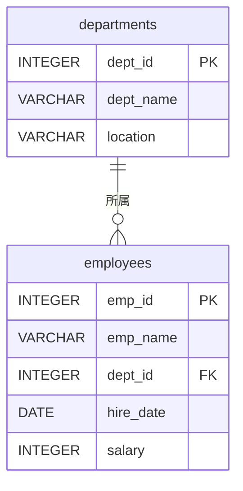
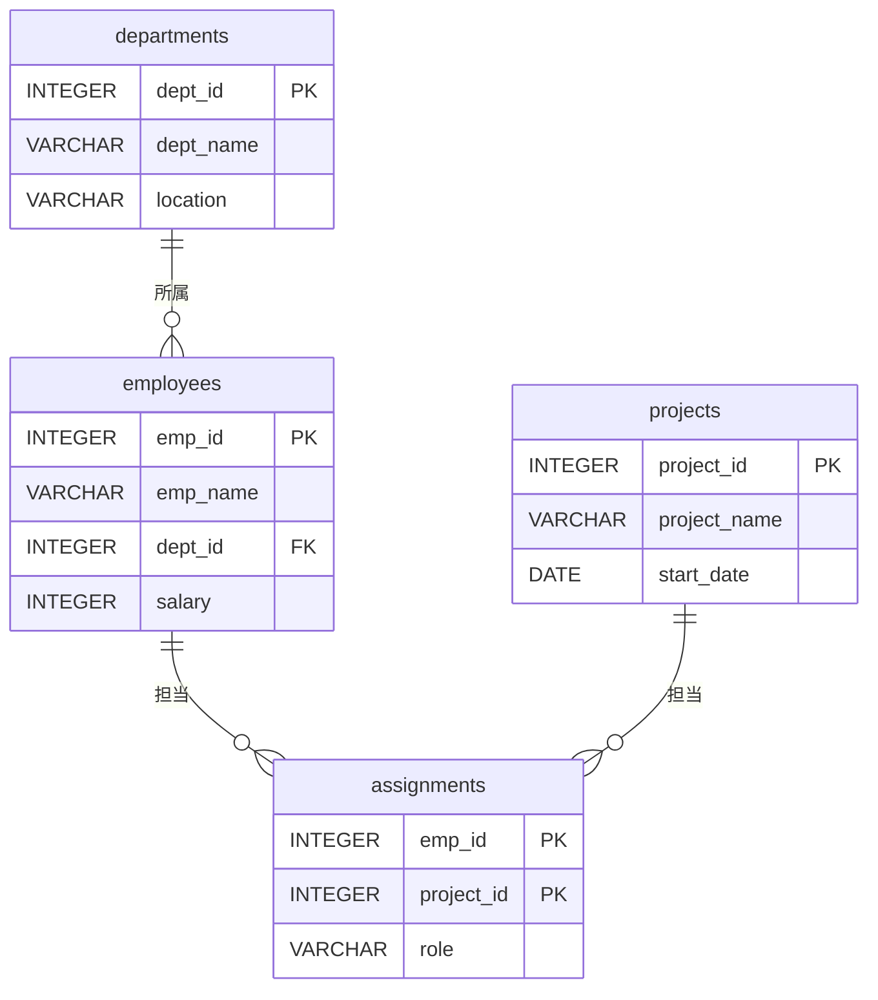

import { OneCompilerCodeBlock } from "@site/src/components/OneCompilerCodeBlock";

# テーブルの結合

この章で得られるスキル：
- ✅ JOINの必要性を説明できる
- ✅ INNER JOINで2つのテーブルを結合できる
- ✅ LEFT OUTER JOINで外部結合ができる
- ✅ 自己結合ができる
- ✅ 3つ以上のテーブルを結合できる
- ✅ JOINとWHERE、GROUP BYを組み合わせられる

---

## Step 0: まず体験してみよう

### シナリオ：社員の名前と部門名を一緒に表示したい

前章で学んだ通り、テーブルは正規化によって分割されている。
社員テーブルには **部門ID** しかなく、 **部門名** は部門テーブルにある。

社員の名前と部門名を一緒に表示するにはどうすればよいか？

<OneCompilerCodeBlock
  language="postgresql"
  codeId="TODO"
  code={`CREATE TABLE departments (
    dept_id INTEGER PRIMARY KEY,
    dept_name VARCHAR(50) NOT NULL UNIQUE,
    location VARCHAR(50)
);

CREATE TABLE employees (
    emp_id INTEGER PRIMARY KEY,
    emp_name VARCHAR(50) NOT NULL,
    dept_id INTEGER REFERENCES departments(dept_id),
    hire_date DATE NOT NULL,
    salary INTEGER CHECK (salary > 0),
    email VARCHAR(100) UNIQUE
);

INSERT INTO departments VALUES (1, '営業部', '東京');
INSERT INTO departments VALUES (2, '開発部', '大阪');
INSERT INTO departments VALUES (3, '人事部', '東京');
INSERT INTO departments VALUES (4, '広報部', '福岡');

INSERT INTO employees VALUES (1, '田中太郎', 1, '2020-04-01', 350000, 'tanaka@example.com');
INSERT INTO employees VALUES (2, '佐藤花子', 2, '2021-04-01', 400000, 'sato@example.com');
INSERT INTO employees VALUES (3, '鈴木一郎', 2, '2022-04-01', 320000, 'suzuki@example.com');
INSERT INTO employees VALUES (4, '高橋美咲', 3, '2023-04-01', 280000, 'takahashi@example.com');
INSERT INTO employees VALUES (5, '伊藤健太', 1, '2021-10-01', 330000, 'ito@example.com');
INSERT INTO employees VALUES (6, '渡辺あかり', NULL, '2024-01-15', 300000, 'watanabe@example.com');

-- 社員テーブルだけでは部門名がわからない
SELECT emp_name, dept_id FROM employees;

-- JOINで部門名も一緒に表示できる！
SELECT e.emp_name, d.dept_name
FROM employees e
INNER JOIN departments d ON e.dept_id = d.dept_id;
`}
/>

**JOIN** を使うと、分割されたテーブルを結合して必要な情報をまとめて取得できる。

:::tip ポイント
正規化でテーブルを分割するから、JOINで結合する必要がある。
「分割」と「結合」はセットで理解しよう。
:::

---

## Step 1: JOINの基本概念

### なぜJOINが必要か

正規化によってテーブルを分割すると、関連するデータが複数のテーブルに散らばる。



社員テーブルの `dept_id` が、部門テーブルの `dept_id` への **外部キー** になっている。
この外部キーが、テーブル結合の **橋渡し** をする。

### JOINの種類

| 種類 | 説明 | 結果 |
|------|------|------|
| **INNER JOIN** | 両方のテーブルに一致するデータだけ取得 | 一致しないデータは除外 |
| **LEFT OUTER JOIN** | 左側テーブルの全データ + 一致する右側データ | 一致しない右側はNULL |
| **RIGHT OUTER JOIN** | 右側テーブルの全データ + 一致する左側データ | 一致しない左側はNULL |
| **CROSS JOIN** | 全ての組み合わせ（直積） | めったに使わない |

実務で最も使うのは **INNER JOIN** と **LEFT OUTER JOIN** である。

---

## Step 2: INNER JOIN（内部結合）

### 基本構文

```sql
SELECT 列名
FROM テーブル1
INNER JOIN テーブル2 ON テーブル1.列名 = テーブル2.列名;
```

**ON句** で結合条件を指定する。通常は外部キーと主キーの一致を条件にする。

<OneCompilerCodeBlock
  language="postgresql"
  codeId="TODO"
  code={`CREATE TABLE departments (
    dept_id INTEGER PRIMARY KEY,
    dept_name VARCHAR(50) NOT NULL UNIQUE,
    location VARCHAR(50)
);

CREATE TABLE employees (
    emp_id INTEGER PRIMARY KEY,
    emp_name VARCHAR(50) NOT NULL,
    dept_id INTEGER REFERENCES departments(dept_id),
    hire_date DATE NOT NULL,
    salary INTEGER CHECK (salary > 0),
    email VARCHAR(100) UNIQUE
);

INSERT INTO departments VALUES (1, '営業部', '東京');
INSERT INTO departments VALUES (2, '開発部', '大阪');
INSERT INTO departments VALUES (3, '人事部', '東京');
INSERT INTO departments VALUES (4, '広報部', '福岡');

INSERT INTO employees VALUES (1, '田中太郎', 1, '2020-04-01', 350000, 'tanaka@example.com');
INSERT INTO employees VALUES (2, '佐藤花子', 2, '2021-04-01', 400000, 'sato@example.com');
INSERT INTO employees VALUES (3, '鈴木一郎', 2, '2022-04-01', 320000, 'suzuki@example.com');
INSERT INTO employees VALUES (4, '高橋美咲', 3, '2023-04-01', 280000, 'takahashi@example.com');
INSERT INTO employees VALUES (5, '伊藤健太', 1, '2021-10-01', 330000, 'ito@example.com');
INSERT INTO employees VALUES (6, '渡辺あかり', NULL, '2024-01-15', 300000, 'watanabe@example.com');

-- INNER JOIN：社員名と部門名を結合
SELECT e.emp_name, d.dept_name, d.location
FROM employees e
INNER JOIN departments d ON e.dept_id = d.dept_id;
`}
/>

### INNER JOINの特徴

結果を確認すると、 **渡辺あかり** （dept_id が NULL）と **広報部** （社員がいない）は表示されない。
INNER JOINは **両方のテーブルに一致するデータだけ** を返すためである。

:::note やってみよう
上のコードのSELECT文を変更して、 `e.salary` も表示してみよう。
:::

---

## Step 3: テーブルの別名（エイリアス）

### なぜ別名が必要か

JOINでは複数のテーブルに同じ名前の列がある場合がある。例えば、どちらのテーブルの `dept_id` かを明確にする必要がある。

```sql
-- テーブル名をそのまま書くと長い
SELECT employees.emp_name, departments.dept_name
FROM employees
INNER JOIN departments ON employees.dept_id = departments.dept_id;

-- 別名を使うと短く書ける
SELECT e.emp_name, d.dept_name
FROM employees e
INNER JOIN departments d ON e.dept_id = d.dept_id;
```

### 別名の付け方

| 書き方 | 例 |
|--------|-----|
| `テーブル名 AS 別名` | `employees AS e` |
| `テーブル名 別名` | `employees e` |

`AS` は省略可能である。実務ではどちらも使われるが、短い別名を使うのが一般的である。

:::caution 注意
別名を付けたら、そのクエリ内ではテーブル名の代わりに別名を使う。
`FROM employees e` と書いた後で `employees.emp_name` と書くとエラーになる場合がある。
:::

---

## Step 4: LEFT OUTER JOIN（左外部結合）

### INNER JOINでは取りこぼすデータがある

Step 2で見たように、INNER JOINは **一致しないデータを除外** する。
部門に所属していない社員や、社員のいない部門が結果に含まれない。

**全社員を表示しつつ、部門名がわかる社員は部門名も表示したい** という場合は **LEFT OUTER JOIN** を使う。

<OneCompilerCodeBlock
  language="postgresql"
  codeId="TODO"
  code={`CREATE TABLE departments (
    dept_id INTEGER PRIMARY KEY,
    dept_name VARCHAR(50) NOT NULL UNIQUE,
    location VARCHAR(50)
);

CREATE TABLE employees (
    emp_id INTEGER PRIMARY KEY,
    emp_name VARCHAR(50) NOT NULL,
    dept_id INTEGER REFERENCES departments(dept_id),
    hire_date DATE NOT NULL,
    salary INTEGER CHECK (salary > 0),
    email VARCHAR(100) UNIQUE
);

INSERT INTO departments VALUES (1, '営業部', '東京');
INSERT INTO departments VALUES (2, '開発部', '大阪');
INSERT INTO departments VALUES (3, '人事部', '東京');
INSERT INTO departments VALUES (4, '広報部', '福岡');

INSERT INTO employees VALUES (1, '田中太郎', 1, '2020-04-01', 350000, 'tanaka@example.com');
INSERT INTO employees VALUES (2, '佐藤花子', 2, '2021-04-01', 400000, 'sato@example.com');
INSERT INTO employees VALUES (3, '鈴木一郎', 2, '2022-04-01', 320000, 'suzuki@example.com');
INSERT INTO employees VALUES (4, '高橋美咲', 3, '2023-04-01', 280000, 'takahashi@example.com');
INSERT INTO employees VALUES (5, '伊藤健太', 1, '2021-10-01', 330000, 'ito@example.com');
INSERT INTO employees VALUES (6, '渡辺あかり', NULL, '2024-01-15', 300000, 'watanabe@example.com');

-- INNER JOIN：部門未所属の渡辺あかりが表示されない
SELECT e.emp_name, d.dept_name
FROM employees e
INNER JOIN departments d ON e.dept_id = d.dept_id;

-- LEFT JOIN：全社員が表示される（部門名がない場合はNULL）
SELECT e.emp_name, d.dept_name
FROM employees e
LEFT OUTER JOIN departments d ON e.dept_id = d.dept_id;
`}
/>

### INNER JOIN と LEFT JOIN の比較

| 結合方法 | 渡辺あかり（部門なし） | 広報部（社員なし） |
|----------|---------------------|-------------------|
| INNER JOIN | ❌ 表示されない | ❌ 表示されない |
| LEFT JOIN（employees が左） | ✅ 部門名はNULL | ❌ 表示されない |
| LEFT JOIN（departments が左） | ❌ 表示されない | ✅ 社員名はNULL |

:::tip ポイント
`LEFT OUTER JOIN` は `LEFT JOIN` と省略して書ける。実務ではこの省略形の方がよく使われる。
:::

### NULLを使って「一致しないデータ」を見つける

LEFT JOINとIS NULLを組み合わせると、 **どの部門にも所属していない社員** を見つけられる。

<OneCompilerCodeBlock
  language="postgresql"
  codeId="TODO"
  code={`CREATE TABLE departments (
    dept_id INTEGER PRIMARY KEY,
    dept_name VARCHAR(50) NOT NULL UNIQUE,
    location VARCHAR(50)
);

CREATE TABLE employees (
    emp_id INTEGER PRIMARY KEY,
    emp_name VARCHAR(50) NOT NULL,
    dept_id INTEGER REFERENCES departments(dept_id),
    hire_date DATE NOT NULL,
    salary INTEGER CHECK (salary > 0),
    email VARCHAR(100) UNIQUE
);

INSERT INTO departments VALUES (1, '営業部', '東京');
INSERT INTO departments VALUES (2, '開発部', '大阪');
INSERT INTO departments VALUES (3, '人事部', '東京');
INSERT INTO departments VALUES (4, '広報部', '福岡');

INSERT INTO employees VALUES (1, '田中太郎', 1, '2020-04-01', 350000, 'tanaka@example.com');
INSERT INTO employees VALUES (2, '佐藤花子', 2, '2021-04-01', 400000, 'sato@example.com');
INSERT INTO employees VALUES (3, '鈴木一郎', 2, '2022-04-01', 320000, 'suzuki@example.com');
INSERT INTO employees VALUES (4, '高橋美咲', 3, '2023-04-01', 280000, 'takahashi@example.com');
INSERT INTO employees VALUES (5, '伊藤健太', 1, '2021-10-01', 330000, 'ito@example.com');
INSERT INTO employees VALUES (6, '渡辺あかり', NULL, '2024-01-15', 300000, 'watanabe@example.com');

-- 部門に所属していない社員を見つける
SELECT e.emp_name
FROM employees e
LEFT JOIN departments d ON e.dept_id = d.dept_id
WHERE d.dept_id IS NULL;

-- 社員がいない部門を見つける
SELECT d.dept_name
FROM departments d
LEFT JOIN employees e ON d.dept_id = e.dept_id
WHERE e.emp_id IS NULL;
`}
/>

---

## Step 5: 自己結合

### 同じテーブル同士を結合する

社員テーブルに「上司ID」があるケースを考える。上司も社員テーブルに存在する。
このように、 **同じテーブルを2回参照** して結合するのが **自己結合** である。

<OneCompilerCodeBlock
  language="postgresql"
  codeId="TODO"
  code={`CREATE TABLE employees_with_manager (
    emp_id INTEGER PRIMARY KEY,
    emp_name VARCHAR(50) NOT NULL,
    manager_id INTEGER REFERENCES employees_with_manager(emp_id),
    salary INTEGER CHECK (salary > 0)
);

INSERT INTO employees_with_manager VALUES (1, '山本部長', NULL, 600000);
INSERT INTO employees_with_manager VALUES (2, '田中課長', 1, 450000);
INSERT INTO employees_with_manager VALUES (3, '佐藤花子', 2, 400000);
INSERT INTO employees_with_manager VALUES (4, '鈴木一郎', 2, 320000);
INSERT INTO employees_with_manager VALUES (5, '高橋美咲', 1, 350000);

-- 自己結合：社員名と上司名を表示
SELECT e.emp_name AS 社員名,
       m.emp_name AS 上司名
FROM employees_with_manager e
LEFT JOIN employees_with_manager m ON e.manager_id = m.emp_id;
`}
/>

### 自己結合のポイント

- 同じテーブルを2回使うので、 **別名が必須** である
- 上の例では `e`（社員として）と `m`（上司として）の2つの別名を付けている
- 山本部長の `manager_id` は NULL なので、LEFT JOINを使って上司名を NULL として表示している

:::note やってみよう
上のコードを修正して、上司がいない社員（= 最上位の管理者）だけを表示してみよう。
ヒント：`WHERE m.emp_id IS NULL` を追加する。
:::

---

## Step 6: 3つ以上のテーブルの結合

### JOINを連続して書く

実務では、3つ以上のテーブルを結合することも多い。
JOINを連続して書くことで、複数のテーブルをつなげられる。

<OneCompilerCodeBlock
  language="postgresql"
  codeId="TODO"
  code={`CREATE TABLE departments (
    dept_id INTEGER PRIMARY KEY,
    dept_name VARCHAR(50) NOT NULL UNIQUE,
    location VARCHAR(50)
);

CREATE TABLE employees (
    emp_id INTEGER PRIMARY KEY,
    emp_name VARCHAR(50) NOT NULL,
    dept_id INTEGER REFERENCES departments(dept_id),
    hire_date DATE NOT NULL,
    salary INTEGER CHECK (salary > 0)
);

CREATE TABLE projects (
    project_id INTEGER PRIMARY KEY,
    project_name VARCHAR(100) NOT NULL,
    start_date DATE
);

CREATE TABLE assignments (
    emp_id INTEGER REFERENCES employees(emp_id),
    project_id INTEGER REFERENCES projects(project_id),
    role VARCHAR(50),
    PRIMARY KEY (emp_id, project_id)
);

INSERT INTO departments VALUES (1, '営業部', '東京');
INSERT INTO departments VALUES (2, '開発部', '大阪');
INSERT INTO departments VALUES (3, '人事部', '東京');

INSERT INTO employees VALUES (1, '田中太郎', 1, '2020-04-01', 350000);
INSERT INTO employees VALUES (2, '佐藤花子', 2, '2021-04-01', 400000);
INSERT INTO employees VALUES (3, '鈴木一郎', 2, '2022-04-01', 320000);
INSERT INTO employees VALUES (4, '高橋美咲', 3, '2023-04-01', 280000);

INSERT INTO projects VALUES (1, 'ECサイト開発', '2024-01-01');
INSERT INTO projects VALUES (2, '社内システム改修', '2024-04-01');

INSERT INTO assignments VALUES (1, 1, 'リーダー');
INSERT INTO assignments VALUES (2, 1, 'メンバー');
INSERT INTO assignments VALUES (3, 1, 'メンバー');
INSERT INTO assignments VALUES (2, 2, 'リーダー');
INSERT INTO assignments VALUES (4, 2, 'メンバー');

-- 3テーブル結合：社員名、部門名、プロジェクト名を表示
SELECT e.emp_name, d.dept_name, p.project_name, a.role
FROM employees e
INNER JOIN departments d ON e.dept_id = d.dept_id
INNER JOIN assignments a ON e.emp_id = a.emp_id
INNER JOIN projects p ON a.project_id = p.project_id
ORDER BY p.project_name, a.role;
`}
/>

### テーブル間の関係



`assignments` は社員とプロジェクトの **中間テーブル** である。
社員とプロジェクトは **多対多** の関係にあり、中間テーブルを介して結合する（詳しくは第9章で学ぶ）。

---

## Step 7: JOINとWHERE、GROUP BYの組み合わせ

### JOINした結果をWHEREで絞り込む

JOINで結合した結果に対して、WHEREで条件を指定できる。

<OneCompilerCodeBlock
  language="postgresql"
  codeId="TODO"
  code={`CREATE TABLE departments (
    dept_id INTEGER PRIMARY KEY,
    dept_name VARCHAR(50) NOT NULL UNIQUE,
    location VARCHAR(50)
);

CREATE TABLE employees (
    emp_id INTEGER PRIMARY KEY,
    emp_name VARCHAR(50) NOT NULL,
    dept_id INTEGER REFERENCES departments(dept_id),
    hire_date DATE NOT NULL,
    salary INTEGER CHECK (salary > 0)
);

INSERT INTO departments VALUES (1, '営業部', '東京');
INSERT INTO departments VALUES (2, '開発部', '大阪');
INSERT INTO departments VALUES (3, '人事部', '東京');

INSERT INTO employees VALUES (1, '田中太郎', 1, '2020-04-01', 350000);
INSERT INTO employees VALUES (2, '佐藤花子', 2, '2021-04-01', 400000);
INSERT INTO employees VALUES (3, '鈴木一郎', 2, '2022-04-01', 320000);
INSERT INTO employees VALUES (4, '高橋美咲', 3, '2023-04-01', 280000);
INSERT INTO employees VALUES (5, '伊藤健太', 1, '2021-10-01', 330000);
INSERT INTO employees VALUES (6, '渡辺あかり', 2, '2023-07-01', 300000);

-- JOINとWHERE：東京勤務の社員を表示
SELECT e.emp_name, d.dept_name, d.location
FROM employees e
INNER JOIN departments d ON e.dept_id = d.dept_id
WHERE d.location = '東京';

-- JOINとGROUP BY：部門ごとの社員数と平均給与
SELECT d.dept_name,
       COUNT(*) AS 社員数,
       ROUND(AVG(e.salary)) AS 平均給与
FROM employees e
INNER JOIN departments d ON e.dept_id = d.dept_id
GROUP BY d.dept_name
ORDER BY 平均給与 DESC;

-- JOINとGROUP BY + HAVING：社員が2人以上の部門
SELECT d.dept_name,
       COUNT(*) AS 社員数
FROM employees e
INNER JOIN departments d ON e.dept_id = d.dept_id
GROUP BY d.dept_name
HAVING COUNT(*) >= 2;
`}
/>

### SQLの実行順序（JOIN含む）

JOINを含むSQLの実行順序は以下の通りである。

| 順番 | 句 | 処理内容 |
|------|-----|---------|
| 1 | FROM + JOIN | テーブルを結合する |
| 2 | WHERE | 行を絞り込む |
| 3 | GROUP BY | グループ化する |
| 4 | HAVING | グループを絞り込む |
| 5 | SELECT | 列を選択・計算する |
| 6 | ORDER BY | 並び替える |
| 7 | LIMIT | 件数を制限する |

:::caution 注意
JOINはWHEREよりも先に実行される。そのため、 **結合条件はON句に書き、絞り込み条件はWHEREに書く** のが正しい使い分けである。
:::

---

## Step 8: 実践課題

### 課題1：社員の詳細情報を表示しよう

社員名、部門名、プロジェクト名、役割を一覧表示するSQLを書こう。
プロジェクトに参加していない社員も表示すること（LEFT JOINを使う）。

### 課題2：部門ごとの集計を表示しよう

部門名ごとの社員数と平均給与を表示するSQLを書こう。
社員がいない部門も表示すること。

### 課題3：上司と部下の関係を表示しよう

自己結合を使って、各社員とその上司の名前を表示するSQLを書こう。

<OneCompilerCodeBlock
  language="postgresql"
  codeId="TODO"
  code={`CREATE TABLE departments (
    dept_id INTEGER PRIMARY KEY,
    dept_name VARCHAR(50) NOT NULL UNIQUE,
    location VARCHAR(50)
);

CREATE TABLE employees (
    emp_id INTEGER PRIMARY KEY,
    emp_name VARCHAR(50) NOT NULL,
    dept_id INTEGER REFERENCES departments(dept_id),
    manager_id INTEGER REFERENCES employees(emp_id),
    hire_date DATE NOT NULL,
    salary INTEGER CHECK (salary > 0)
);

CREATE TABLE projects (
    project_id INTEGER PRIMARY KEY,
    project_name VARCHAR(100) NOT NULL
);

CREATE TABLE assignments (
    emp_id INTEGER REFERENCES employees(emp_id),
    project_id INTEGER REFERENCES projects(project_id),
    role VARCHAR(50),
    PRIMARY KEY (emp_id, project_id)
);

INSERT INTO departments VALUES (1, '営業部', '東京');
INSERT INTO departments VALUES (2, '開発部', '大阪');
INSERT INTO departments VALUES (3, '人事部', '東京');
INSERT INTO departments VALUES (4, '広報部', '福岡');

INSERT INTO employees VALUES (1, '山本部長', 1, NULL, '2015-04-01', 600000);
INSERT INTO employees VALUES (2, '田中課長', 2, 1, '2018-04-01', 450000);
INSERT INTO employees VALUES (3, '佐藤花子', 2, 2, '2021-04-01', 400000);
INSERT INTO employees VALUES (4, '鈴木一郎', 2, 2, '2022-04-01', 320000);
INSERT INTO employees VALUES (5, '高橋美咲', 3, 1, '2023-04-01', 280000);
INSERT INTO employees VALUES (6, '渡辺あかり', NULL, NULL, '2024-01-15', 300000);

INSERT INTO projects VALUES (1, 'ECサイト開発');
INSERT INTO projects VALUES (2, '社内システム改修');

INSERT INTO assignments VALUES (2, 1, 'リーダー');
INSERT INTO assignments VALUES (3, 1, 'メンバー');
INSERT INTO assignments VALUES (4, 1, 'メンバー');
INSERT INTO assignments VALUES (2, 2, 'リーダー');
INSERT INTO assignments VALUES (5, 2, 'メンバー');

-- 課題1：社員名、部門名、プロジェクト名、役割を表示
-- プロジェクト未参加の社員もLEFT JOINで表示すること
-- ここにSQLを書こう

-- 課題2：部門名ごとの社員数と平均給与を表示
-- 社員がいない部門も表示すること
-- ここにSQLを書こう

-- 課題3：各社員とその上司の名前を表示（自己結合）
-- ここにSQLを書こう

SELECT 'ここに課題1〜3のSQLを書いてみよう' AS message;
`}
/>

---

## まとめ

この章では、 **テーブルの結合（JOIN）** について学んだ。

### 🎯 達成できたこと
- ✅ JOINの必要性を説明できる
- ✅ INNER JOINで2つのテーブルを結合できる
- ✅ テーブルに別名を付けられる
- ✅ LEFT OUTER JOINで外部結合ができる
- ✅ 自己結合ができる
- ✅ 3つ以上のテーブルを結合できる
- ✅ JOINとWHERE、GROUP BYを組み合わせられる

### 📚 学んだ内容
- テーブルを正規化（分割）したから、JOINで結合する必要がある
- INNER JOINは両方のテーブルに一致するデータだけを返す
- LEFT JOINは左側テーブルの全データを返し、一致しない右側はNULLになる
- 自己結合は同じテーブルを2回参照して結合する（別名が必須）
- JOINはWHERE、GROUP BY、HAVINGと組み合わせて使える

### 🚀 次のステップ
次の章では、 **ER図とデータベース設計** について学ぶ。
テーブルの関係を視覚的に表現する方法と、設計のプロセスを学ぶ。

---

## 💡 よくある質問

### Q1: INNER JOINとLEFT JOINのどちらを使えばいい？

**A:** 「一致しないデータも表示したいか」で判断する。例えば「全社員を表示したいが、部門名がない場合もある」ならLEFT JOIN、「部門に所属している社員だけでよい」ならINNER JOINを使う。迷ったらLEFT JOINの方が安全（データの取りこぼしがない）である。

### Q2: RIGHT JOINは使わないの？

**A:** RIGHT JOINはLEFT JOINの左右を入れ替えたものであり、FROMに書くテーブルの順序を変えればLEFT JOINで代用できる。読みやすさのため、LEFT JOINに統一するのが一般的である。

### Q3: JOINの結合条件を間違えるとどうなる？

**A:** 結合条件が不適切だと **直積**（CROSS JOIN）のような結果になり、意図しない大量のデータが返される。例えば社員5人と部門3つでON句なしにJOINすると15行（5×3）になる。必ずON句で正しい結合条件を指定しよう。

### Q4: JOINを使うとパフォーマンスは大丈夫？

**A:** 適切なインデックス（特に外部キー列）があれば、JOINのパフォーマンスは十分に速い。数万件程度のデータであれば、JOINを3〜4つ連続しても問題ない。パフォーマンスが気になるのは数百万件以上のデータを扱う場合である。

### Q5: AIにJOINのSQLを書かせてもいい？

**A:** 複雑なJOINはAIに書かせるのが効率的である。ただし、INNER JOINとLEFT JOINの使い分けが要件に合っているか、結合条件が正しいかは必ずレビューしよう。特に「NULLのデータを含めるかどうか」は要件次第なので、AIに正確に伝える必要がある。
