import { OneCompilerCodeBlock } from "@site/src/components/OneCompilerCodeBlock";

# ER図とデータベース設計

この章で得られるスキル：
- ✅ ER図の必要性を説明できる
- ✅ エンティティ、属性、リレーションシップを識別できる
- ✅ カーディナリティ（1対多、多対多）を説明できる
- ✅ 多対多を中間テーブルで解決できる
- ✅ ER図からCREATE TABLE文を書ける
- ✅ 要件からER図を作成できる

---

## Step 0: まず体験してみよう

### シナリオ：チームでデータベース設計を議論する

ある開発チームで、ECサイトのデータベースを設計することになった。

**Aさん：** 「商品テーブルと注文テーブルを作ろう」
**Bさん：** 「注文テーブルに商品名も入れておこう」
**Cさん：** 「それだと1つの注文で複数商品を買えないよ」
**Bさん：** 「じゃあ商品1、商品2、商品3の列を作る？」
**Aさん：** 「それだと4個以上買えない...」

→ 口頭の議論では、全員の認識が食い違いやすい。

### ER図で解決

以下のER図を見れば、テーブルの構成と関係が **一目で** わかる。

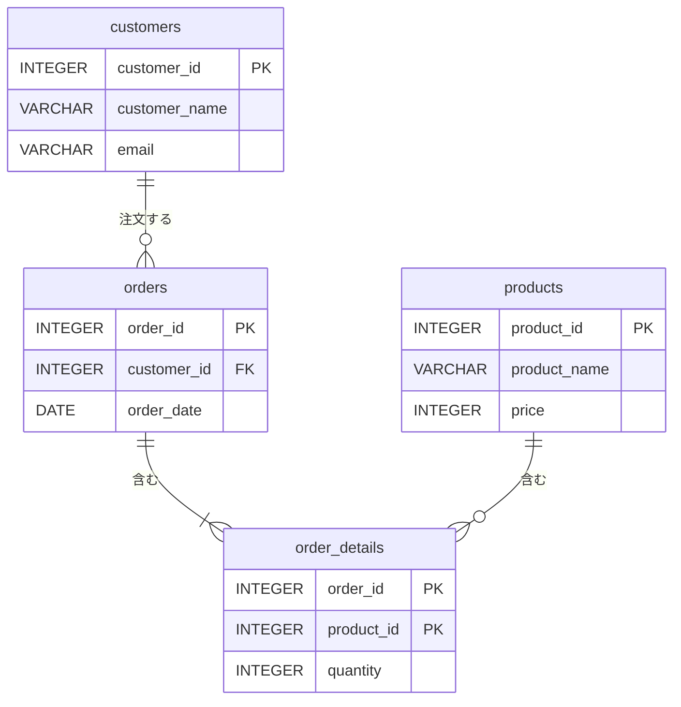

:::tip ポイント
ER図は **データベース設計の共通言語** である。
チーム全員が同じ図を見ながら議論することで、認識のズレを防げる。
:::

---

## Step 1: ER図とは

### Entity-Relationship Diagram（実体関連図）

**ER図** （Entity-Relationship Diagram）とは、データベースの設計を視覚的に表現する図である。

| 要素 | 意味 | 図での表現 |
|------|------|-----------|
| **エンティティ** | データベースで管理する「モノ」 | 長方形（テーブルに対応） |
| **属性** | エンティティが持つ情報 | エンティティ内の列挙（列に対応） |
| **リレーションシップ** | エンティティ同士の関係 | 線で結ぶ（外部キーに対応） |

### ER図の記法

ER図にはいくつかの記法があるが、本教材では **IE記法（Crow's foot記法）** を使う。
これは実務で最もよく使われる記法である。

### ER図を描くツール

| ツール | 特徴 |
|--------|------|
| **Mermaid** | テキストからER図を生成。本教材で使用 |
| **draw.io** | 無料のWebベース作図ツール。直感的に操作できる |
| **MySQL Workbench** | MySQL付属。既存のDBからER図を自動生成できる |
| **A5:SQL Mk-2** | 日本製の無料ツール。ER図作成とSQL実行が可能 |

:::note Mermaidについて
Mermaidはテキストベースでダイアグラムを記述できるツールである。
本教材のER図はすべてMermaidで描かれている。MarkdownファイルやGitHub上でも表示できるため、チーム開発との相性が良い。
:::

---

## Step 2: エンティティ（実体）

### エンティティとは

**エンティティ** とは、データベースで管理したい「モノ」や「概念」のことである。
ER図では長方形で表現し、データベースの **テーブル** に対応する。

### エンティティの見つけ方

要件から「管理したいモノ」を洗い出す。

**例：社員管理システム**
- 「社員」を管理したい → **employees** エンティティ
- 「部門」を管理したい → **departments** エンティティ
- 「プロジェクト」を管理したい → **projects** エンティティ

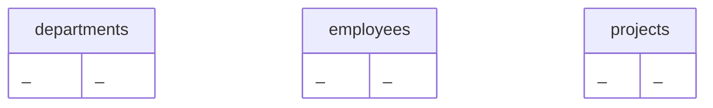

:::tip ポイント
要件の中で **名詞** として登場するものがエンティティの候補になる。
「社員は部門に所属する」→ 社員と部門がエンティティ、「所属する」がリレーションシップ。
:::

---

## Step 3: 属性

### 属性とは

**属性** とは、エンティティが持つ情報のことである。
ER図ではエンティティの中に列挙し、データベースの **列（カラム）** に対応する。

### 属性の種類

| 種類 | 説明 | 例 |
|------|------|-----|
| **主キー（PK）** | エンティティを一意に識別する属性 | 社員ID、注文ID |
| **外部キー（FK）** | 他のエンティティへの参照 | 部門ID（社員テーブル内） |
| **一般属性** | その他の属性 | 名前、給与、日付 |

### Mermaidでの表現

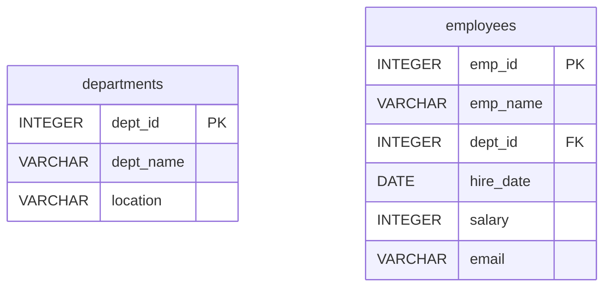

主キーには `PK`、外部キーには `FK` を付記する。
データ型（INTEGER、VARCHAR など）も記載すると、CREATE TABLE文に変換しやすい。

---

## Step 4: リレーションシップ（関連）

### リレーションシップとは

**リレーションシップ** とは、エンティティ同士の関係のことである。
ER図では **線** で表現し、データベースの **外部キー** で実現される。

### 社員と部門の関係

「社員は部門に所属する」という関係をER図で表現する。

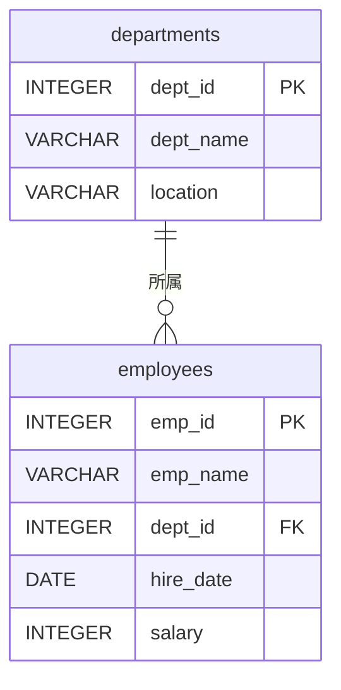

`departments ||--o{ employees` の意味：
- `||` → departments 側は **1つ**（1つの部門に対して）
- `o{` → employees 側は **0以上**（0人以上の社員が所属）

つまり「1つの部門に0人以上の社員が所属する」という関係を表している。

---

## Step 5: カーディナリティ

### カーディナリティとは

**カーディナリティ** とは、リレーションシップの「数の関係」を表すものである。

### IE記法（Crow's foot記法）の読み方

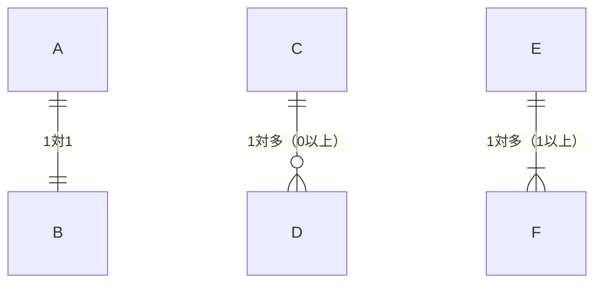

| 記号 | 意味 | 説明 |
|------|------|------|
| `||` | ちょうど1 | 必ず1つだけ対応する |
| `o{` | 0以上（任意） | 0個でも複数でもよい |
| `\|{` | 1以上（必須） | 少なくとも1つは必要 |
| `o\|` | 0または1 | あってもなくてもよい |

### 代表的なカーディナリティ

#### 1対多（最も一般的）

「1つの部門に複数の社員が所属する」

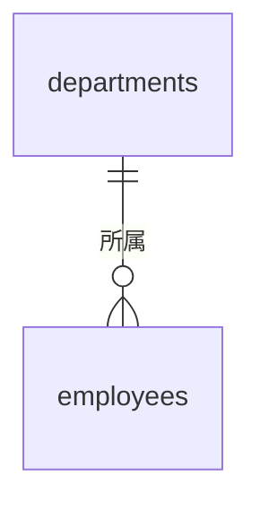

- 1つの部門 → 0人以上の社員
- 1人の社員 → 1つの部門（NULLの場合は0）

#### 1対1（あまり使わない）

「1人の社員に1つの個人情報」

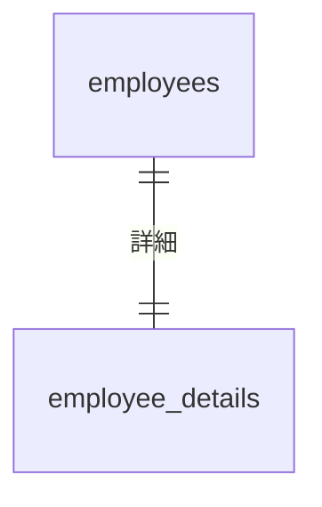

#### 多対多（中間テーブルが必要）

「社員とプロジェクトの関係」— 1人の社員が複数のプロジェクトに参加し、1つのプロジェクトに複数の社員が参加する。

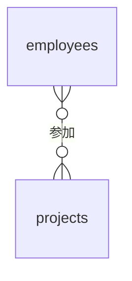

:::caution 重要
多対多の関係は、そのままではデータベースのテーブルで表現できない。
次のStepで **中間テーブル** を使った解決方法を学ぶ。
:::

---

## Step 6: 多対多の解決

### 中間テーブルの導入

多対多の関係は、 **中間テーブル** を挟んで **2つの1対多** に分解する。

#### 変換前：多対多

#### 変換後：中間テーブルで2つの1対多に

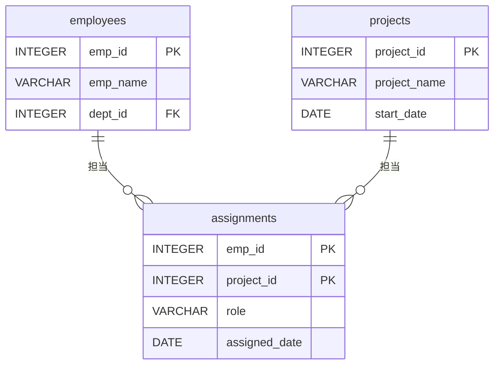

### 中間テーブルのポイント

- **主キー** は両方のエンティティの主キーの **複合主キー** にする
- 中間テーブルには **追加の属性** を持たせることもある（役割、配属日など）
- 外部キーで両方のテーブルを参照する

<OneCompilerCodeBlock
  language="postgresql"
  codeId="TODO"
  code={`-- 多対多を中間テーブルで解決

CREATE TABLE employees (
    emp_id INTEGER PRIMARY KEY,
    emp_name VARCHAR(50) NOT NULL
);

CREATE TABLE projects (
    project_id INTEGER PRIMARY KEY,
    project_name VARCHAR(100) NOT NULL
);

-- 中間テーブル（多対多を2つの1対多に分解）
CREATE TABLE assignments (
    emp_id INTEGER REFERENCES employees(emp_id),
    project_id INTEGER REFERENCES projects(project_id),
    role VARCHAR(50),
    assigned_date DATE,
    PRIMARY KEY (emp_id, project_id)
);

INSERT INTO employees VALUES (1, '田中太郎');
INSERT INTO employees VALUES (2, '佐藤花子');
INSERT INTO employees VALUES (3, '鈴木一郎');

INSERT INTO projects VALUES (1, 'ECサイト開発');
INSERT INTO projects VALUES (2, '社内システム改修');

INSERT INTO assignments VALUES (1, 1, 'リーダー', '2024-01-01');
INSERT INTO assignments VALUES (2, 1, 'メンバー', '2024-01-01');
INSERT INTO assignments VALUES (2, 2, 'リーダー', '2024-04-01');
INSERT INTO assignments VALUES (3, 1, 'メンバー', '2024-02-01');

-- 社員とプロジェクトの関係を表示
SELECT e.emp_name, p.project_name, a.role
FROM assignments a
INNER JOIN employees e ON a.emp_id = e.emp_id
INNER JOIN projects p ON a.project_id = p.project_id
ORDER BY p.project_name, a.role;
`}
/>

:::note 多対多を見つけるコツ
「AはBに複数対応し、BもAに複数対応する」関係を見つけたら多対多である。
- 社員とプロジェクト：1人が複数プロジェクト、1プロジェクトに複数社員 → 多対多
- 学生と授業：1学生が複数授業、1授業に複数学生 → 多対多
- 商品とカテゴリ：1商品が複数カテゴリ、1カテゴリに複数商品 → 多対多
:::

---

## Step 7: ER図からSQLへ

### ER図をCREATE TABLE文に変換する

ER図の各要素は、以下のようにSQLに対応する。

| ER図の要素 | SQLの対応 |
|-----------|-----------|
| エンティティ | CREATE TABLE文 |
| 属性 | 列（カラム）の定義 |
| 主キー（PK） | PRIMARY KEY |
| 外部キー（FK） | REFERENCES（外部キー制約） |
| 1対多のリレーションシップ | 「多」側のテーブルに外部キー列を追加 |
| 多対多のリレーションシップ | 中間テーブルを作成 |

### 変換手順

以下のER図をSQLに変換してみよう。

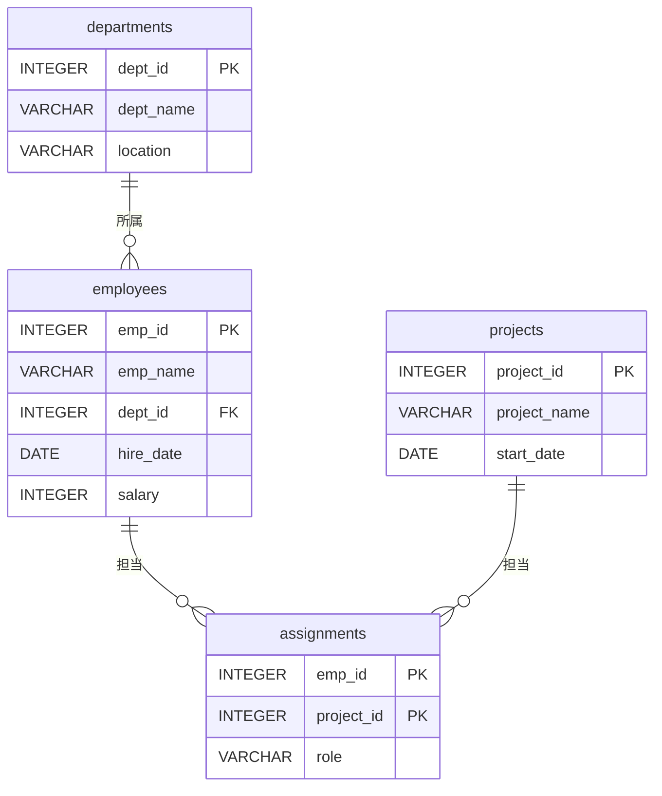

**手順1：** エンティティ → テーブル（外部キーを持たないテーブルから作成）
**手順2：** 属性 → 列定義（PK、データ型、NOT NULLなどの制約）
**手順3：** リレーションシップ → 外部キー制約

<OneCompilerCodeBlock
  language="postgresql"
  codeId="TODO"
  code={`-- ER図からSQLへの変換

-- 手順1：外部キーを持たないテーブルから作成
CREATE TABLE departments (
    dept_id INTEGER PRIMARY KEY,
    dept_name VARCHAR(50) NOT NULL UNIQUE,
    location VARCHAR(50)
);

-- 手順2：外部キーを持つテーブル（参照先が先に存在する必要がある）
CREATE TABLE employees (
    emp_id INTEGER PRIMARY KEY,
    emp_name VARCHAR(50) NOT NULL,
    dept_id INTEGER REFERENCES departments(dept_id),
    hire_date DATE NOT NULL,
    salary INTEGER CHECK (salary > 0)
);

CREATE TABLE projects (
    project_id INTEGER PRIMARY KEY,
    project_name VARCHAR(100) NOT NULL,
    start_date DATE
);

-- 手順3：中間テーブル（多対多のリレーションシップ）
CREATE TABLE assignments (
    emp_id INTEGER REFERENCES employees(emp_id),
    project_id INTEGER REFERENCES projects(project_id),
    role VARCHAR(50),
    PRIMARY KEY (emp_id, project_id)
);

-- データ投入
INSERT INTO departments VALUES (1, '営業部', '東京');
INSERT INTO departments VALUES (2, '開発部', '大阪');

INSERT INTO employees VALUES (1, '田中太郎', 1, '2020-04-01', 350000);
INSERT INTO employees VALUES (2, '佐藤花子', 2, '2021-04-01', 400000);
INSERT INTO employees VALUES (3, '鈴木一郎', 2, '2022-04-01', 320000);

INSERT INTO projects VALUES (1, 'ECサイト開発', '2024-01-01');
INSERT INTO projects VALUES (2, '社内システム改修', '2024-04-01');

INSERT INTO assignments VALUES (1, 1, 'リーダー');
INSERT INTO assignments VALUES (2, 1, 'メンバー');
INSERT INTO assignments VALUES (2, 2, 'リーダー');
INSERT INTO assignments VALUES (3, 1, 'メンバー');

-- 全テーブルを結合して確認
SELECT e.emp_name, d.dept_name, p.project_name, a.role
FROM employees e
INNER JOIN departments d ON e.dept_id = d.dept_id
INNER JOIN assignments a ON e.emp_id = a.emp_id
INNER JOIN projects p ON a.project_id = p.project_id
ORDER BY e.emp_name;
`}
/>

:::caution テーブル作成の順序
外部キー制約がある場合、 **参照先のテーブルを先に作成する** 必要がある。
上の例では departments → employees → projects → assignments の順序で作成している。
削除する際は逆順（assignments → employees → departments）で行う。
:::

---

## Step 8: 実践課題

### 課題1：ECサイトのER図を読み取ろう

以下のER図を読み取り、各テーブルの役割とリレーションシップを説明せよ。

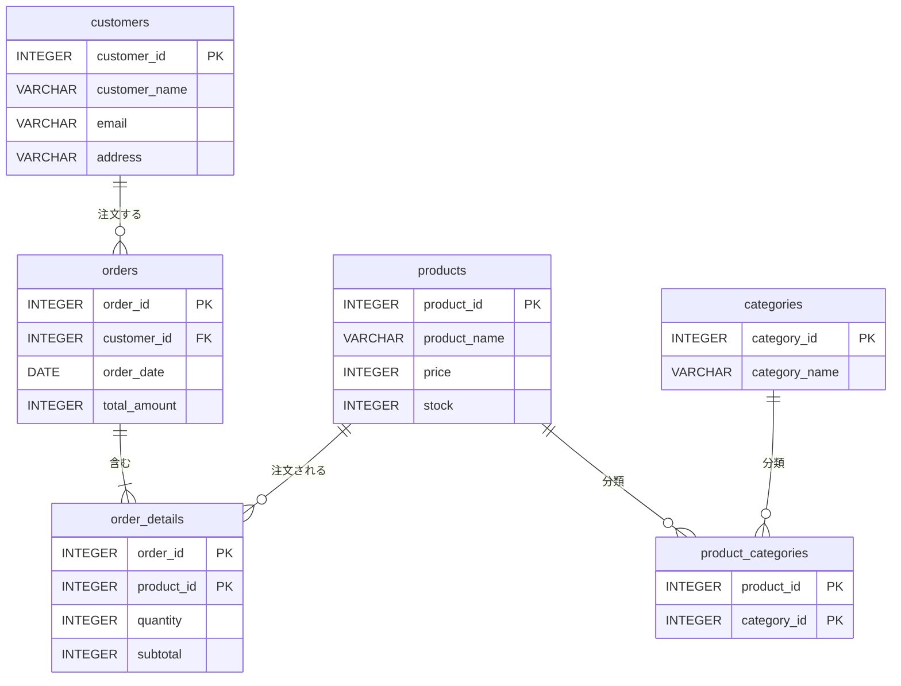

**確認ポイント：**
- 顧客と注文の関係は？（1対多 or 多対多？）
- 注文と商品の関係は？ 中間テーブルはどれ？
- 商品とカテゴリの関係は？ なぜ中間テーブルが必要？

### 課題2：ER図からCREATE TABLE文を書こう

課題1のER図をもとに、CREATE TABLE文を書いてみよう。

<OneCompilerCodeBlock
  language="postgresql"
  codeId="TODO"
  code={`-- 課題2：ECサイトのER図からCREATE TABLE文を作成

-- ヒント：外部キーを持たないテーブルから作成する
-- 1. categories
-- 2. customers
-- 3. products
-- 4. orders（customersを参照）
-- 5. order_details（orders, productsを参照）
-- 6. product_categories（products, categoriesを参照）

-- ここにCREATE TABLE文を書こう

-- テストデータの投入例
-- INSERT INTO categories VALUES (1, '電子機器');
-- INSERT INTO categories VALUES (2, 'アクセサリ');
-- INSERT INTO customers VALUES (1, '山田太郎', 'yamada@example.com', '東京都');
-- INSERT INTO products VALUES (1, 'ノートPC', 80000, 50);
-- INSERT INTO products VALUES (2, 'マウス', 3000, 200);

SELECT 'ここにCREATE TABLE文を書いてみよう' AS message;
`}
/>

### 課題3：要件からER図を考えよう

以下の要件から、ER図（テーブル構成）を考えよう。

**図書館管理システムの要件：**
- 図書を管理する（タイトル、著者名、出版年、ISBN）
- 会員を管理する（名前、住所、電話番号）
- 会員は図書を借りることができる（貸出日、返却予定日、実際の返却日）
- 1冊の図書を複数の会員が借りられる（時期が異なれば可）
- 1人の会員は複数冊の図書を同時に借りられる

**考えるべきポイント：**
- エンティティは何か？（名詞を抽出）
- 図書と会員の関係は？（1対多？多対多？）
- 中間テーブルは必要か？

---

## まとめ

この章では、 **ER図とデータベース設計** について学んだ。

### 🎯 達成できたこと
- ✅ ER図の必要性を説明できる
- ✅ エンティティ、属性、リレーションシップを識別できる
- ✅ カーディナリティ（1対多、多対多）を説明できる
- ✅ 多対多を中間テーブルで解決できる
- ✅ ER図からCREATE TABLE文を書ける
- ✅ 要件からER図を作成できる

### 📚 学んだ内容
- ER図はデータベース設計の共通言語であり、チームでの認識共有に不可欠
- エンティティ（テーブル）、属性（列）、リレーションシップ（外部キー）が基本要素
- カーディナリティで「数の関係」を表す（1対1、1対多、多対多）
- 多対多は中間テーブルを導入して2つの1対多に分解する
- ER図からCREATE TABLE文を機械的に変換できる
- テーブル作成の順序は外部キーの参照先を先にする

### 🚀 次のステップ
これでデータベースの基礎学習は完了である。
ここで学んだSQLとデータベース設計の知識は、Spring教材のMyBatis（Day 10）でJavaアプリケーションからデータベースにアクセスする際に活かされる。

---

## 💡 よくある質問

### Q1: ER図のツールは何を使えばいい？

**A:** 初学者には **draw.io** が直感的で使いやすい。チーム開発では **Mermaid** がGitHubとの相性が良い（テキストで管理できるため差分が見やすい）。実務では **MySQL Workbench** や **A5:SQL Mk-2** で既存のDBからER図を自動生成することも多い。

### Q2: ER図のIE記法とChen記法の違いは？

**A:** IE記法（Crow's foot記法）はリレーションシップを線の端の記号で表し、実務で広く使われている。Chen記法はリレーションシップをひし形で表す、学術的な記法である。本教材ではIE記法に統一している。

### Q3: 多対多はいつも中間テーブルが必要？

**A:** はい。リレーショナルデータベースでは、多対多の関係を直接テーブルで表現できないため、必ず中間テーブルが必要になる。中間テーブルには結合するだけの最小限の列（両方の主キー）に加えて、関係に付随する属性（役割、日付など）を持たせることもできる。

### Q4: AIにER図を描かせてもいい？

**A:** AIはER図の作成が得意である。「〇〇システムのER図をMermaid記法で描いて」と依頼すると、適切なER図を提案してくれる。ただし、以下のポイントは人間がレビューする必要がある。
- ビジネス要件が正しく反映されているか
- カーディナリティ（1対多 or 多対多）が正しいか
- 中間テーブルに必要な属性が含まれているか

### Q5: 実務ではER図をどのタイミングで描く？

**A:** 通常は **要件定義** または **基本設計** のフェーズでER図を作成する。先にER図を描いてからCREATE TABLE文を作成する流れが一般的である。開発が進む中でER図を更新していくことも重要で、ER図とデータベースの実態がずれないように管理する。
