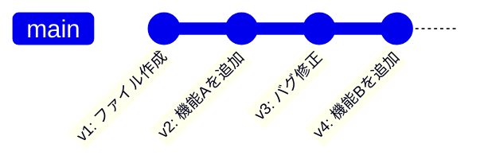
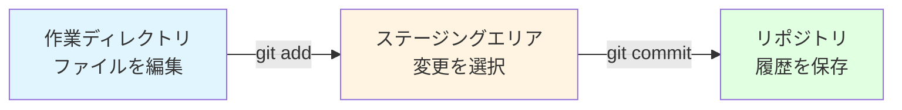

# バージョン管理とGit

この章で得られるスキル：
- ✅ バージョン管理がない場合の問題点を説明できる
- ✅ Gitとは何かを説明できる
- ✅ Gitの3つのエリア（作業ディレクトリ、ステージ、リポジトリ）を説明できる
- ✅ リポジトリ、コミット、ブランチの用語を説明できる
- ✅ Gitの初期設定（user.name、user.email）ができる

---

## Step 0: まず体験してみよう

### シナリオ：チームでJavaプログラムを開発している

ある開発チームで、Aさんが `Main.java` を編集していた。
同じ時間に、Bさんも `Main.java` を編集していた。

Aさんがファイルを保存した。
→ その直後、Bさんが上書き保存した。
→ **Aさんの変更が消えてしまった！**

### 「ファイル名でバージョン管理」の限界

仕方なく、チームではファイル名にバージョンを付けて管理することにした。

```
Main_v1.java
Main_v2.java
Main_最終版.java
Main_最終版_田中修正.java
Main_最終版_田中修正_佐藤追加.java  ← どれが最新？
```

:::caution 重要
ファイル名でバージョンを管理する方法は、すぐに破綻する。
「どれが最新か」「誰がいつ何を変えたか」がわからなくなり、チーム開発では致命的な問題になる。
:::

→ **Git** を使えば、「いつ・誰が・何を変えたか」が自動で記録される。
この章ではその仕組みを学んでいこう。

---

## Step 1: バージョン管理がない世界の問題

ファイルのコピーや名前変更でバージョン管理をしようとすると、以下の問題が起きる。

| 問題 | 具体例 |
|------|--------|
| **上書き事故** | 他の人の変更を上書きして消してしまう |
| **どれが最新かわからない** | `最終版`、`最終版2`、`最終版_修正` が乱立する |
| **変更を追跡できない** | いつの変更でバグが混入したか特定できない |
| **複数人の変更を統合できない** | AさんとBさんの変更を手作業で合わせるのは困難 |

これらの問題は、プログラミングに限った話ではない。
レポートや設計書など、複数人で編集するあらゆるファイルで起きうる問題である。

:::info バージョン管理は開発者の必須スキル
どの開発現場でも、バージョン管理ツールは必ず使われている。
「バージョン管理ができない」は、採用時に大きなマイナス要因になる。
今のうちにしっかり身につけておこう。
:::

---

## Step 2: Gitとは

### 分散型バージョン管理システム

**Git（ギット）** とは、ファイルの変更履歴を管理するためのツールである。
正式には **分散型バージョン管理システム（DVCS: Distributed Version Control System）** と呼ばれる。

Gitを使うと、以下のことができる。

- ファイルの変更履歴を **時系列で記録** する
- いつでも **任意の時点の状態に戻せる**
- **誰がいつ何を変えたか** が一目でわかる
- 複数人の変更を **安全に統合** できる

### 「写真を撮る」ようにファイルの状態を保存する

Gitでは、ファイルの状態を保存することを **コミット（commit）** と呼ぶ。
「写真を撮るように」、ある時点のファイルの状態をまるごと保存するイメージである。



各コミットには「いつ・誰が・何を変えたか」が記録されている。
過去のどの時点にも戻れるため、「うっかり壊してしまった」場合も安心である。

:::note 補足
Gitは2005年にLinux（リナックス）の開発者であるLinus Torvalds（リーナス・トーバルズ）が作ったツールである。
現在では世界中のほぼすべてのソフトウェア開発でGitが使われている。
:::

---

## Step 3: Gitの3つのエリア

Gitには、ファイルが通過する **3つのエリア** がある。
この概念はGitを理解する上で最も重要なので、しっかり覚えよう。

| エリア | 英語名 | 役割 |
|--------|--------|------|
| **作業ディレクトリ** | Working Directory | 実際にファイルを編集する場所 |
| **ステージングエリア** | Staging Area | コミットする変更を選ぶ場所 |
| **リポジトリ** | Repository | 変更履歴が保存される場所 |



### なぜステージングエリアがあるのか？

「変更をすべて記録するなら、作業ディレクトリから直接リポジトリに保存すればよいのでは？」と思うかもしれない。

ステージングエリアがあることで、**コミットする変更を選べる** ようになる。
例えば、3つのファイルを変更したが、そのうち2つだけ先にコミットしたい場合に便利である。

:::tip ポイント
3つのエリアを理解することが、Git操作の土台になる。
次の章以降で実際にコマンドを使いながら、何度も確認していく。
:::

---

## Step 4: 基本用語の整理

Gitでよく使う用語をまとめておく。
すべてを一度に覚える必要はない。実際に使いながら自然に身についていく。

| 用語 | 読み方 | 意味 |
|------|--------|------|
| **リポジトリ（repository）** | リポジトリ | プロジェクトの全ファイルと変更履歴を保存する場所 |
| **コミット（commit）** | コミット | ある時点のファイル状態を保存した記録。「スナップショット」とも呼ぶ |
| **ブランチ（branch）** | ブランチ | 開発の流れを分岐させる仕組み。第5章で詳しく学ぶ |
| **マージ（merge）** | マージ | 分岐した変更を統合する操作。第5章で詳しく学ぶ |
| **リモート（remote）** | リモート | ネットワーク上の共有リポジトリ。第3章で詳しく学ぶ |
| **プッシュ（push）** | プッシュ | ローカルの変更をリモートに送る操作。第3章で詳しく学ぶ |
| **プル（pull）** | プル | リモートの変更をローカルに取り込む操作。第3章で詳しく学ぶ |
| **クローン（clone）** | クローン | リモートリポジトリをローカルにコピーする操作。第3章で詳しく学ぶ |

:::note 補足
用語が多いように感じるが、まずは **リポジトリ** と **コミット** の2つを覚えれば十分である。
他の用語は、該当する章で詳しく学ぶ。
:::

---

## Step 5: Gitの初期設定

Gitを使い始める前に、 **名前** と **メールアドレス** を設定する必要がある。
この情報は、コミットに「誰が変更したか」を記録するために使われる。

### user.name の設定

ターミナル（コマンドプロンプト）を開いて、以下のコマンドを実行する。

```bash
git config --global user.name "自分の名前"
```

例：

```bash
git config --global user.name "Taro Tanaka"
```

### user.email の設定

```bash
git config --global user.email "自分のメールアドレス"
```

例：

```bash
git config --global user.email "taro.tanaka@example.com"
```

### 設定の確認

正しく設定できたか確認するには、以下のコマンドを実行する。

```bash
git config --list
```

出力の中に `user.name` と `user.email` が表示されれば成功である。

```
user.name=Taro Tanaka
user.email=taro.tanaka@example.com
```

:::caution 重要
`--global` オプションを付けると、そのPCのすべてのリポジトリで同じ設定が使われる。
この設定は一度だけ行えばよい。
:::

:::tip ポイント
名前はローマ字表記が一般的である。
メールアドレスは、後の章で設定するGitHubアカウントと同じものを使うと管理しやすい。
:::

---

## Step 6: Spring開発での位置づけ

このブートキャンプでは、最終的にチームでSpring Bootを使ったWebアプリケーションを開発する。

チーム開発では、全員がGitを使ってコードを共有する。
具体的には、以下のようなワークフローで開発を進める。

1. 各自がローカルで機能を開発する
2. 開発した機能をGitHubにプッシュする
3. チームメンバーがコードをレビューする
4. 問題なければメインのコードに統合する

この流れについては、第6章・第7章で詳しく学ぶ。
まずは次の章から、Gitの基本操作を一つずつ身につけていこう。

---

## まとめ

この章では、 **バージョン管理とGit** について学んだ。

### 🎯 達成できたこと
- ✅ バージョン管理がない場合の問題点を説明できるようになった
- ✅ Gitとは何かを説明できるようになった
- ✅ Gitの3つのエリアの役割を説明できるようになった
- ✅ 基本用語（リポジトリ、コミット等）を説明できるようになった
- ✅ Gitの初期設定ができるようになった

### 📚 学んだ内容
- ファイル名によるバージョン管理は「どれが最新かわからない」「変更が追跡できない」等の問題がある
- Gitは変更履歴を「コミット」という単位で時系列に記録する
- Gitには「作業ディレクトリ → ステージングエリア → リポジトリ」の3つのエリアがある
- ステージングエリアがあることで、コミットする変更を選択できる
- `git config` で名前とメールアドレスを設定する

### 🚀 次のステップ
次の章では、 **Gitの基本操作** を学ぶ。
実際にリポジトリを作成し、ファイルの変更をコミットする操作を体験しよう。

---

## 💡 よくある質問

### Q1: GitとGitHubは同じものか？

**A:** 違うものである。 **Git** はファイルの変更履歴を管理するツール（ソフトウェア）であり、自分のPC上で動作する。 **GitHub** はGitのリポジトリをインターネット上で共有するためのWebサービスである。Gitは「道具」、GitHubは「道具を使って作品を共有する場所」と考えるとわかりやすい。GitHubについては第3章で学ぶ。

### Q2: Gitは難しいと聞いたが、初心者でも使えるか？

**A:** 日常的に使う操作は限られており、基本操作（add, commit, push, pull）を覚えれば十分に使える。この教材では、よく使う操作を中心に段階的に学んでいくので安心してほしい。高度な操作は必要になったときに学べばよい。

### Q3: Gitは開発以外でも使えるのか？

**A:** 使える。Gitはテキストファイルであれば何でもバージョン管理できる。設計書、論文、設定ファイルなどの管理にも活用されている。ただし、画像やExcelファイルなどのバイナリファイル（人間が直接読めない形式のファイル）は差分の確認が難しいため、テキストファイルでの利用が最も効果的である。

### Q4: 「分散型」とは何か？なぜ重要なのか？

**A:** 「分散型」とは、各開発者のPC上にリポジトリの完全なコピーがあることを意味する。インターネットに接続していなくてもコミットや履歴の確認ができる。また、サーバーが壊れても、誰かのPCにあるリポジトリから復旧できるという利点がある。

### Q5: バージョン管理ツールはGit以外にもあるのか？

**A:** ある。かつては **SVN（Subversion）** や **CVS** が広く使われていた。しかし、現在ではGitが事実上の標準（デファクトスタンダード）であり、新規プロジェクトのほぼすべてでGitが採用されている。Git以外のツールを学ぶ必要は現時点ではない。
