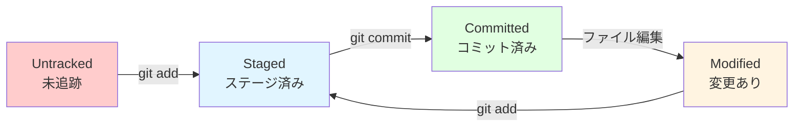
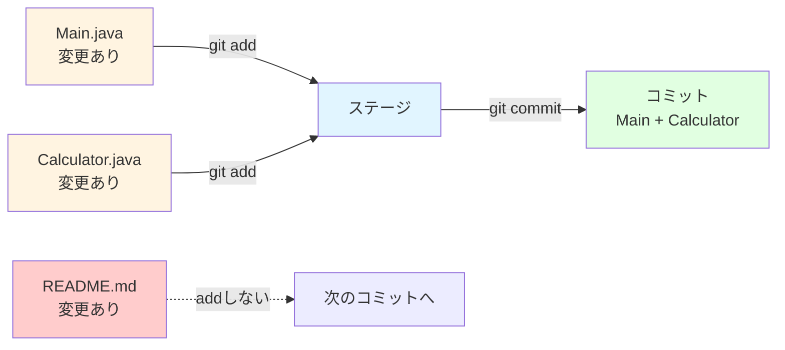
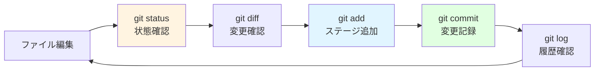

# Gitの基本操作

この章で得られるスキル：
- ✅ `git init` でリポジトリを作成できる
- ✅ `git status` で現在の状態を確認できる
- ✅ `git add` でファイルをステージに追加できる
- ✅ `git commit` で変更を記録できる
- ✅ `git log` で履歴を確認できる
- ✅ `git diff` で変更内容を確認できる
- ✅ `.gitignore` で管理対象外のファイルを指定できる

---

## Step 0: まず体験してみよう

まずは細かい説明の前に、Gitの基本操作を一通り体験してみよう。
ターミナル（コマンドプロンプト）を開いて、以下のコマンドを順番に実行する。

```bash
mkdir hello-git
cd hello-git
git init
```

これでGitリポジトリが作成された。続けてファイルを作成し、記録してみよう。

```bash
echo "Hello, Git!" > hello.txt
git add hello.txt
git commit -m "最初のコミット"
```

最後に、履歴を確認する。

```bash
git log
```

→ たった数行のコマンドで、ファイルの変更履歴が記録された！

:::tip ポイント
今はコマンドの意味がわからなくても大丈夫である。
この章で一つずつ丁寧に学んでいく。
:::

---

## Step 1: git init — リポジトリの作成

### リポジトリとは

**リポジトリ（repository）** とは、プロジェクトの全ファイルと変更履歴を保存する場所である。
「このフォルダをGitで管理しますよ」と宣言するのが `git init` コマンドである。

### リポジトリの作成

```bash
mkdir hello-git
cd hello-git
git init
```

実行すると、以下のようなメッセージが表示される。

```
Initialized empty Git repository in /home/user/hello-git/.git/
```

### .git ディレクトリ

`git init` を実行すると、フォルダの中に `.git` という隠しディレクトリが作成される。
このディレクトリの中にGitの管理情報が保存されている。

:::caution 重要
`.git` ディレクトリの中身を直接編集したり削除したりしてはいけない。
Gitの管理情報が壊れ、変更履歴がすべて失われる可能性がある。
:::

---

## Step 2: git status — 現在の状態を確認する習慣

### git status とは

`git status` は、リポジトリの現在の状態を表示するコマンドである。
**Gitで最も頻繁に使うコマンド** なので、こまめに実行する習慣をつけよう。

### ファイルの3つの状態

`git status` を実行すると、ファイルは以下のいずれかの状態で表示される。



| 状態 | 表示 | 意味 |
|------|------|------|
| **Untracked** | `Untracked files:` | まだGitで追跡していない新しいファイル |
| **Modified** | `Changes not staged for commit:` | 追跡中のファイルが変更されたが、まだステージに追加していない |
| **Staged** | `Changes to be committed:` | 次のコミットに含まれるファイル |

### 実際に確認してみよう

新しいファイルを作成して `git status` を実行する。

```bash
echo "public class Main {}" > Main.java
git status
```

出力：

```
On branch main

No commits yet

Untracked files:
  (use "git add <file>..." to include in what will be committed)
        Main.java

nothing added to commit but untracked files present (use "git add" to track)
```

`Main.java` が **Untracked files** （未追跡）として表示されている。
Gitにまだ認識されていない状態である。

:::tip ポイント
Gitの操作に迷ったら、まず `git status` を実行しよう。
現在の状態と、次に何をすればよいかのヒントが表示される。
:::

---

## Step 3: git add — ステージに追加する

### ステージングとは

`git add` は、ファイルを **ステージングエリア** に追加するコマンドである。
ステージに追加されたファイルが、次の `git commit` で記録される。

### 特定のファイルをステージに追加する

```bash
git add Main.java
```

実行後に `git status` で確認すると、状態が変わっている。

```
Changes to be committed:
  (use "git rm --cached <file>..." to unstage)
        new file:   Main.java
```

`Main.java` が **Changes to be committed** （ステージ済み）になった。

### すべての変更をステージに追加する

```bash
git add .
```

`.`（ドット）は「現在のディレクトリ」を意味する。
変更されたすべてのファイルが一度にステージに追加される。

### なぜステージが必要なのか

ステージングエリアがあることで、**コミットする変更を選べる** 。



例えば、3つのファイルを変更したが、関連する2つだけを先にコミットしたい場合に便利である。

:::note 補足
最初のうちは `git add .` ですべてをステージに追加しても構わない。
慣れてきたら、コミットの内容を意識してファイルを選択する習慣をつけよう。
:::

---

## Step 4: git commit — 変更を記録する

### コミットとは

`git commit` は、ステージに追加された変更を **リポジトリに記録** するコマンドである。
これにより、ファイルの状態が「スナップショット」として保存される。

### コミットの実行

```bash
git commit -m "Main.javaを作成"
```

`-m` オプションの後に **コミットメッセージ** を書く。
コミットメッセージは、「何を変更したか」を簡潔に記録するためのものである。

出力：

```
[main (root-commit) a1b2c3d] Main.javaを作成
 1 file changed, 1 insertion(+)
 create mode 100644 Main.java
```

### 良いコミットメッセージの書き方

コミットメッセージは、後から履歴を見返すときに重要な手がかりになる。

| 評価 | 例 | 理由 |
|------|------|------|
| ❌ 悪い | `修正` | 何を修正したかわからない |
| ❌ 悪い | `更新` | 何を更新したかわからない |
| ❌ 悪い | `test` | 意味がわからない |
| ✅ 良い | `Calculatorクラスに足し算メソッドを追加` | 何をしたか明確 |
| ✅ 良い | `READMEにプロジェクトの使い方を記載` | 何をしたか明確 |
| ✅ 良い | `ゼロ除算のバグを修正` | 何を修正したか明確 |

:::caution 重要
コミットメッセージは **「何を変更したか」が一目でわかるように** 書く。
チーム開発では、他のメンバーがメッセージを見てコミットの内容を理解する。
曖昧なメッセージは、後で必ず困ることになる。
:::

### コミットIDについて

各コミットには **コミットID** と呼ばれる一意の識別子が付与される。
`a1b2c3d` のようなランダムな英数字の文字列（ハッシュ値）である。

コミットIDを使って、特定のコミットを参照したり、そのコミットの状態に戻したりできる。
コミットIDは先頭の7文字程度で識別できる。

---

## Step 5: git log — 履歴を確認する

### コミット履歴の表示

`git log` は、コミット履歴を時系列で表示するコマンドである。

```bash
git log
```

出力例：

```
commit a1b2c3d4e5f6a7b8c9d0e1f2a3b4c5d6e7f8a9b0
Author: Taro Tanaka <taro.tanaka@example.com>
Date:   Mon Feb 10 09:30:00 2026 +0900

    Main.javaを作成
```

表示される情報：
- **commit**: コミットID（ハッシュ値）
- **Author**: コミットした人の名前とメールアドレス（`git config` で設定したもの）
- **Date**: コミットした日時
- **メッセージ**: コミットメッセージ

### 簡潔な一覧表示

```bash
git log --oneline
```

出力例：

```
a1b2c3d Main.javaを作成
```

1行に1コミットが表示されるため、全体の流れを把握しやすい。

### 直近N件を表示

```bash
git log -n 5
```

直近5件のコミットだけを表示する。
履歴が増えてきたときに便利である。

---

## Step 6: git diff — 何が変わったかを確認する

### 変更内容の確認

`git diff` は、ファイルの変更内容を表示するコマンドである。
**コミットする前に「何を変えたか」を確認する** ために使う。

### 作業ディレクトリの変更を確認

`Main.java` を編集してみよう。

```java
public class Main {
    public static void main(String[] args) {
        System.out.println("Hello, Git!");
    }
}
```

変更後に `git diff` を実行する。

```bash
git diff
```

出力例：

```diff
diff --git a/Main.java b/Main.java
--- a/Main.java
+++ b/Main.java
@@ -1 +1,5 @@
-public class Main {}
+public class Main {
+    public static void main(String[] args) {
+        System.out.println("Hello, Git!");
+    }
+}
```

- **`-`** で始まる行は **削除された行** （赤で表示されることが多い）
- **`+`** で始まる行は **追加された行** （緑で表示されることが多い）

### ステージ済みの変更を確認

`git add` した後の変更を確認するには、`--staged` オプションを付ける。

```bash
git diff --staged
```

:::tip ポイント
`git commit` する前に `git diff` で変更内容を確認する習慣をつけよう。
意図しない変更が含まれていないかをチェックすることで、バグの混入を防げる。
:::

---

## Step 7: .gitignore — 管理対象外のファイルを指定する

### .gitignore とは

プロジェクトの中には、Gitで管理する必要のないファイルがある。
**`.gitignore`** ファイルを作成し、そこにファイル名やパターンを書くことで、Gitの追跡対象から除外できる。

### Java開発でよく除外するファイル

`.gitignore` ファイルをプロジェクトのルートに作成し、以下の内容を書く。

```
# コンパイル済みファイル
*.class

# IDE設定ファイル
.idea/
.vscode/
*.iml

# ビルド出力
target/
build/

# OSが自動生成するファイル
.DS_Store
Thumbs.db
```

### なぜこれらを除外するのか

| 除外対象 | 理由 |
|----------|------|
| `*.class` | Javaのコンパイルで自動生成される。ソースコードがあれば再生成できる |
| `.idea/` / `.vscode/` | IDEの個人設定ファイル。各自の環境で異なるため共有しない |
| `target/` / `build/` | ビルド出力は容量が大きく、ソースから再生成できる |
| `.DS_Store` | macOSが自動生成するファイル。プロジェクトとは無関係 |

### .gitignore 自体はGitで管理する

`.gitignore` ファイルそのものは、Git管理対象にする。

```bash
git add .gitignore
git commit -m ".gitignoreを追加"
```

チーム全員で同じファイルを除外するために、リポジトリに含めるのが一般的である。

:::caution 重要
`.gitignore` に書いたパターンは、まだGitに追跡されていないファイルにのみ有効である。
すでに `git add` してしまったファイルは、`.gitignore` に追加しても追跡が続く。
その場合は `git rm --cached ファイル名` で追跡を解除する必要がある。
:::

---

## Step 8: 実践課題

### 課題1：Javaプロジェクトの作成とコミット

1. `hello-git` ディレクトリを作成し、`git init` でリポジトリを作成せよ
2. 以下の `Main.java` を作成し、コミットせよ

```java
public class Main {
    public static void main(String[] args) {
        System.out.println("Hello, Git!");
    }
}
```

### 課題2：変更の確認とコミット

1. `Main.java` の出力メッセージを `"Hello, Version Control!"` に変更せよ
2. `git diff` で変更内容を確認せよ
3. 確認後、変更をコミットせよ（適切なコミットメッセージを付けること）

### 課題3：.gitignore の設定

1. `.gitignore` ファイルを作成し、`*.class` と `.idea/` を除外する設定を書け
2. `.gitignore` をコミットせよ
3. テスト用に `Main.class` ファイルを作成し、`git status` で追跡されていないことを確認せよ

### 課題4：履歴の確認

1. `git log --oneline` を実行し、これまでの全コミット履歴を確認せよ
2. 3つ以上のコミットが記録されていることを確認せよ

---

## まとめ

この章では、 **Gitの基本操作** について学んだ。

### 🎯 達成できたこと
- ✅ `git init` でリポジトリを作成できるようになった
- ✅ `git status` で現在の状態を確認できるようになった
- ✅ `git add` でファイルをステージに追加できるようになった
- ✅ `git commit` で変更を記録できるようになった
- ✅ `git log` で履歴を確認できるようになった
- ✅ `git diff` で変更内容を確認できるようになった
- ✅ `.gitignore` で管理対象外のファイルを設定できるようになった

### 📚 学んだ内容
- `git init` でディレクトリをGitリポジトリにする
- `git status` でファイルの状態（Untracked / Modified / Staged）を確認する
- `git add` で変更をステージに追加し、`git commit` で記録する
- `git log` で履歴を確認し、`git diff` で変更内容を確認する
- `.gitignore` で不要なファイルを追跡対象から除外する
- コミットメッセージは「何を変更したか」が一目でわかるように書く

### 🚀 次のステップ
次の章では、 **GitHubとリモート操作** を学ぶ。
ローカルのリポジトリをGitHubに保存し、どこからでもアクセスできるようにしよう。

### 基本操作サイクル

Gitの基本操作は、以下のサイクルの繰り返しである。
このサイクルを体に覚えさせることが大切である。



---

## 💡 よくある質問

### Q1: `git add .` と `git add ファイル名` はどちらを使えばよいか？

**A:** 最初のうちは `git add .` で全ファイルを追加して構わない。ただし、慣れてきたら `git add ファイル名` で必要なファイルだけを選択する方がよい。理由は、コミットの内容を明確にでき、不要なファイルを誤ってコミットするリスクを減らせるためである。

### Q2: コミットメッセージは日本語でもよいか？

**A:** チームのルールによる。日本語のチームであれば日本語で書いて問題ない。英語で書くのが一般的な場合もある。大切なのは **チーム全員が統一すること** である。このブートキャンプでは日本語で書いてよい。

### Q3: `git init` を間違ったフォルダで実行してしまった場合はどうすればよいか？

**A:** 作成された `.git` ディレクトリを削除すればよい。ターミナルで `rm -rf .git` を実行すると、Gitの管理情報がすべて削除される。ただし、コミット済みの履歴もすべて失われるので注意すること。

### Q4: コミットはどのくらいの頻度でするべきか？

**A:** 「1つの意味のある変更」ごとにコミットするのが理想的である。例えば、「メソッドを1つ追加した」「バグを1つ修正した」のような単位がよい。大量の変更を1つのコミットにまとめると、後から変更を追跡しにくくなる。

### Q5: `git diff` の出力が長くて読みにくい場合はどうすればよいか？

**A:** `git diff` の出力は、上下の矢印キーでスクロールできる。終了するには `q` キーを押す。変更が多い場合は `git diff ファイル名` で特定のファイルだけの変更を確認するのがおすすめである。
