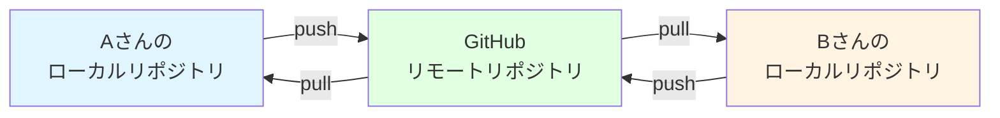
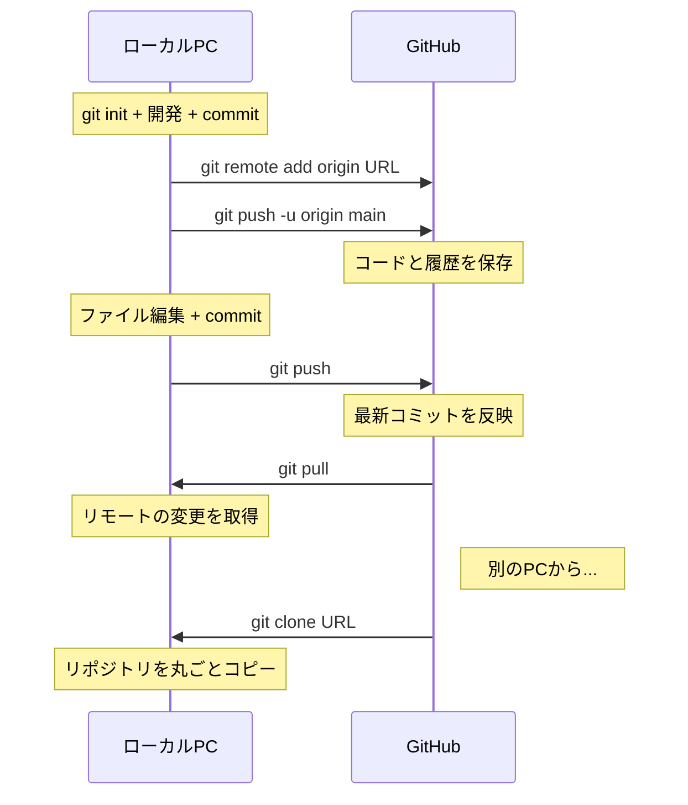

# GitHubとリモート操作

この章で得られるスキル：
- ✅ GitHubの役割を説明できる
- ✅ GitHubアカウントを作成し、リポジトリを作成できる
- ✅ HTTPS + Personal Access Token でGitHub接続を設定できる
- ✅ `git push` でローカルの変更をリモートに送れる
- ✅ `git pull` でリモートの変更をローカルに取り込める
- ✅ `git clone` で既存リポジトリをコピーできる

---

## Step 0: まず体験してみよう

### シナリオ：PCが壊れたらコードが全部消える

第2章まで、ローカルのPC上でGitを使ってきた。
しかし、コードと履歴は自分のPCの中にしか存在しない。

**もしPCが壊れたら？**
→ これまで書いたコードも、コミット履歴も、すべて失われてしまう。

**USBメモリにバックアップする？**
→ 「どっちが最新？」問題が再び発生する。

:::caution 重要
ローカルだけでGitを使っている限り、PCの故障やディスクの破損でコードを失うリスクがある。
コードをインターネット上の安全な場所にも保存しておく必要がある。
:::

→ **GitHub** を使えば、コードと履歴をクラウドに安全に保存できる。
さらに、チームメンバーとコードを共有することもできる。

---

## Step 1: GitHubとは

### リモートリポジトリのホスティングサービス

**GitHub（ギットハブ）** は、Gitのリポジトリをインターネット上で管理・共有するためのWebサービスである。

前の章で学んだ、自分のPC上にあるリポジトリを **ローカルリポジトリ** と呼ぶ。
一方、GitHub上にあるリポジトリを **リモートリポジトリ** と呼ぶ。



### GitHubを使う理由

| 目的 | 説明 |
|------|------|
| **バックアップ** | PCが壊れてもコードが失われない |
| **どこからでもアクセス** | 自宅でも学校でも同じプロジェクトにアクセスできる |
| **チーム開発** | 複数人でコードを共有・統合できる |
| **コードレビュー** | Pull Requestで変更内容をチームで確認できる（第6章で学ぶ） |

:::note 補足
GitHub以外にも **GitLab** や **Bitbucket** など、同様のサービスがある。
基本的な使い方は共通しているので、GitHubで学んだ知識は他のサービスにも応用できる。
このブートキャンプではGitHubを使用する。
:::

---

## Step 2: GitHubアカウント作成とリポジトリ作成

### GitHubアカウントの作成

1. [https://github.com](https://github.com) にアクセスする
2. 「Sign up」をクリックする
3. メールアドレス、パスワード、ユーザー名を入力する
4. メール認証を完了する

:::tip ポイント
ユーザー名は今後ずっと使うものである。本名のローマ字表記や、短く覚えやすい名前がおすすめである。
就職活動でGitHubアカウントを見られることもあるため、ふざけた名前は避けよう。
:::

### リポジトリの作成（GitHub上の操作）

1. GitHubにログインし、右上の「+」ボタン → 「New repository」をクリック
2. 以下の設定を入力する

| 項目 | 設定 |
|------|------|
| **Repository name** | `hello-git`（プロジェクト名） |
| **Description** | `Git学習用のリポジトリ`（任意） |
| **Public / Private** | `Private`（個人練習なのでPrivateでよい） |
| **Initialize this repository** | **チェックしない**（ローカルに既にリポジトリがあるため） |

3. 「Create repository」をクリック

作成後、画面にリポジトリのURL（`https://github.com/ユーザー名/hello-git.git`）が表示される。
このURLは次のステップで使う。

---

## Step 3: HTTPS接続の設定（Personal Access Token）

### なぜ認証が必要か

GitHubにコードを送る（push）には、「自分がこのリポジトリの持ち主である」ことを証明する必要がある。
誰でもpushできたら、他人のリポジトリを勝手に書き換えられてしまう。

この認証に使うのが **Personal Access Token（パーソナルアクセストークン、通称PAT）** である。

### Personal Access Token の作成手順

1. GitHubにログインした状態で、右上のアイコン → **Settings** をクリック
2. 左メニューの一番下にある **Developer settings** をクリック
3. **Personal access tokens** → **Tokens (classic)** をクリック
4. **Generate new token** → **Generate new token (classic)** をクリック
5. 以下を設定する

| 項目 | 設定 |
|------|------|
| **Note** | `bootcamp`（何に使うトークンか分かるメモ） |
| **Expiration** | `90 days`（有効期限） |
| **Select scopes** | **`repo`** にチェックを入れる |

6. 「Generate token」をクリック
7. 表示されたトークン（`ghp_` で始まる文字列）を **コピーして安全な場所に保存** する

:::caution 重要
トークンはこの画面を閉じると **二度と表示されない** 。
必ずコピーして、パスワードマネージャーやメモ帳に保存しておくこと。
もし忘れた場合は、新しいトークンを作成し直す。
:::

:::warning 注意
**トークンはパスワードと同じもの** である。
- ソースコードの中に書かない
- 他の人に教えない
- GitHubの公開リポジトリにアップロードしない
:::

---

## Step 4: git push — ローカルの変更をリモートに送る

### リモートリポジトリの登録

まず、ローカルリポジトリに「どのGitHubリポジトリと連携するか」を教える。

```bash
git remote add origin https://github.com/ユーザー名/hello-git.git
```

- `origin` はリモートリポジトリに付ける名前（慣習的に `origin` を使う）
- URLはGitHubでリポジトリを作成したときに表示されたもの

登録できたか確認するには、以下のコマンドを実行する。

```bash
git remote -v
```

出力例：

```
origin  https://github.com/taro-tanaka/hello-git.git (fetch)
origin  https://github.com/taro-tanaka/hello-git.git (push)
```

### 最初のプッシュ

```bash
git push -u origin main
```

初回実行時にユーザー名とパスワードを聞かれる。

- **Username**: GitHubのユーザー名
- **Password**: Step 3で作成した **Personal Access Token** （GitHubのパスワードではない）

:::caution 重要
パスワード欄には、GitHubのログインパスワードではなく、 **Personal Access Token** を入力する。
GitHubはセキュリティ上の理由から、パスワードによるHTTPS認証を廃止している。
:::

`-u` オプションは「上流ブランチの設定」を意味する。
これにより、次回以降は `git push` だけでプッシュできるようになる。

### 2回目以降のプッシュ

```bash
# ファイルを編集 → add → commit した後
git push
```

`-u origin main` は最初の1回だけでよい。

### GitHubで確認

プッシュ後、ブラウザでGitHubのリポジトリページを開くと、ファイルとコミット履歴が表示される。

---

## Step 5: git pull — リモートの変更をローカルに取り込む

### git pull とは

`git pull` は、リモートリポジトリの最新の変更をローカルに取り込むコマンドである。

```bash
git pull origin main
```

上流ブランチを設定済みであれば、以下だけでよい。

```bash
git pull
```

### いつ git pull するか

| タイミング | 理由 |
|------------|------|
| **作業開始前** | 他のメンバーが変更をプッシュしている可能性があるため |
| **プッシュ前** | リモートに自分の知らない変更がある場合、プッシュが拒否されるため |

:::tip ポイント
チーム開発では、 **毎朝の作業開始時に `git pull` する** 習慣をつけよう。
リモートの最新状態を取り込んでから作業を始めることで、後からのコンフリクト（衝突）を防げる。
コンフリクトについては第5章で詳しく学ぶ。
:::

---

## Step 6: git clone — 既存リポジトリをコピーする

### git clone とは

`git clone` は、リモートリポジトリをローカルに丸ごとコピーするコマンドである。

```bash
git clone https://github.com/ユーザー名/hello-git.git
```

実行すると、現在のディレクトリに `hello-git` フォルダが作成され、その中にリポジトリの全ファイルと全履歴がコピーされる。

### clone と init の違い

| コマンド | 用途 | リモートとの接続 |
|----------|------|-----------------|
| `git init` | **新しい**リポジトリを作る | なし（手動で `git remote add` が必要） |
| `git clone` | **既存の**リポジトリをコピーする | 自動的に設定される |

`git clone` した後は、`git remote` が自動的に設定されているため、すぐに `git push` や `git pull` ができる。

### clone を使う場面

- 別のPCで同じプロジェクトの開発を続けたいとき
- チームメンバーのリポジトリを自分のPCにコピーしたいとき
- オープンソースのプロジェクトを手元で試したいとき

---

## Step 7: push / pull / clone の操作フロー

ここまで学んだ操作の全体像を図で確認しよう。



:::info まとめ：3つのリモート操作
- **push**: ローカル → リモートに変更を送る（「郵便を送る」イメージ）
- **pull**: リモート → ローカルに変更を取り込む（「郵便を受け取る」イメージ）
- **clone**: リモートのリポジトリをローカルに丸ごとコピーする（「引っ越し」イメージ）
:::

---

## Step 8: GitHubの画面の見方

GitHubのリポジトリページには、さまざまな情報が表示される。
ここでは主な画面要素を紹介する。

### Code タブ

- ファイル一覧とディレクトリ構造が表示される
- ファイルをクリックすると内容を閲覧できる
- `README.md` がある場合、リポジトリのトップページに自動表示される

### コミット履歴

- 「X commits」のリンクをクリックすると、全コミット履歴が表示される
- 各コミットをクリックすると、そのコミットでの変更内容（diff）が確認できる

### Blame機能

- ファイルを開いた状態で「Blame」ボタンをクリックすると、各行が「いつ・誰に」書かれたかがわかる
- バグの原因調査などで便利

### Issues / Pull Requests タブ

- **Issues**: バグ報告や機能要望を管理する
- **Pull Requests**: コードの変更をチームでレビュー・マージする（第6章で詳しく学ぶ）

---

## Step 9: 実践課題

### 課題1：GitHubリポジトリの作成とプッシュ

1. GitHubに `hello-git` リポジトリを作成せよ（Privateでよい）
2. 第2章で作成したローカルの `hello-git` リポジトリに、リモートを登録せよ
3. `git push -u origin main` でプッシュせよ
4. GitHubのWebページで、ファイルとコミット履歴が正しく表示されることを確認せよ

### 課題2：クローンの確認

1. デスクトップなど別の場所に、先ほどプッシュしたリポジトリをクローンせよ
2. クローンしたフォルダの中にファイルが正しくコピーされていることを確認せよ
3. `git log --oneline` でコミット履歴が引き継がれていることを確認せよ

### 課題3：push / pull のサイクル

1. クローン先でファイルを変更し、コミットしてプッシュせよ
2. 元のディレクトリに戻り、`git pull` で最新の変更を取り込めることを確認せよ

---

## まとめ

この章では、 **GitHubとリモート操作** について学んだ。

### 🎯 達成できたこと
- ✅ GitHubの役割を説明できるようになった
- ✅ GitHubアカウントを作成し、リポジトリを作成できるようになった
- ✅ HTTPS + Personal Access Token でGitHub接続を設定できるようになった
- ✅ `git push` でローカルの変更をリモートに送れるようになった
- ✅ `git pull` でリモートの変更をローカルに取り込めるようになった
- ✅ `git clone` で既存リポジトリをコピーできるようになった

### 📚 学んだ内容
- GitHubはリモートリポジトリのホスティングサービスである
- Personal Access Token（PAT）でHTTPS認証を行う
- `git remote add` でリモートリポジトリを登録する
- `git push` でローカルの変更をリモートに送り、`git pull` で取り込む
- `git clone` でリモートリポジトリをローカルに丸ごとコピーする
- 作業開始前に `git pull` する習慣が重要

### 🚀 次のステップ
Day 7で学ぶGitの入門はここまでである。
次の章では、 **変更の取り消しとバージョンの復元** を学ぶ。
間違えた操作を安全に元に戻す方法を身につけよう。

---

## 💡 よくある質問

### Q1: HTTPS と SSH のどちらを使うべきか？

**A:** このブートキャンプでは **HTTPS + Personal Access Token** を推奨する。SSHは設定が複雑で環境差異も大きいため、初学者にはHTTPSの方が取り組みやすい。実務ではSSHを使うこともあるが、必要になったときに学べばよい。

### Q2: Personal Access Token の有効期限が切れたらどうなるか？

**A:** `git push` や `git pull` 時に認証エラーが発生する。その場合は、GitHubのSettings → Developer settings → Personal access tokens から新しいトークンを作成し直せばよい。

### Q3: Public と Private はどう使い分けるか？

**A:** **Public** は誰でもコードを閲覧できる。オープンソースプロジェクトや、ポートフォリオとして公開したい場合に使う。 **Private** は自分と招待した人だけがアクセスできる。練習用や、仕事のコードには Private を使うのが一般的である。

### Q4: `git push` したときに「rejected（拒否）」と表示された場合はどうすればよいか？

**A:** リモートに自分の知らない変更がある場合に発生する。まず `git pull` でリモートの変更を取り込んでから、再度 `git push` すればよい。チーム開発では、他のメンバーがプッシュした変更を取り込む必要がある。

### Q5: GitHubのリポジトリを削除したい場合はどうすればよいか？

**A:** リポジトリのSettings画面の一番下にある「Delete this repository」から削除できる。ただし、リモートリポジトリを削除しても、ローカルリポジトリは残る。逆に、ローカルを削除してもリモートは残る。

### Q6: `git push` でパスワードを毎回聞かれるのが面倒な場合はどうすればよいか？

**A:** Gitの **資格情報ヘルパー（credential helper）** を設定すると、トークンを記憶してくれる。macOSの場合は `git config --global credential.helper osxkeychain`、Windowsの場合は `git config --global credential.helper manager` を実行すると、次回以降はパスワードの入力が不要になる。
