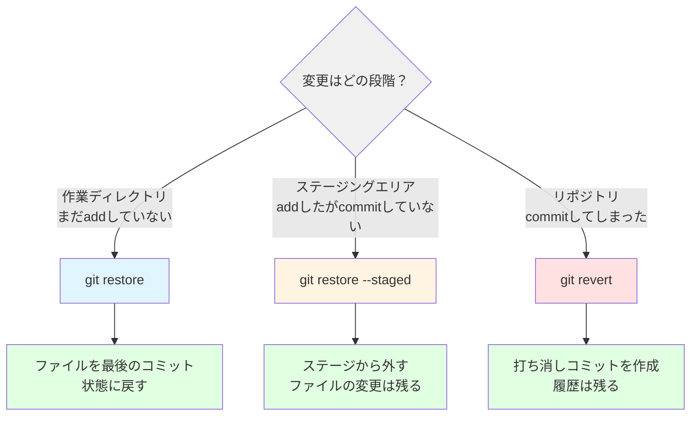
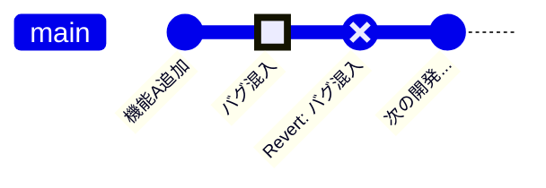

# 変更の取り消しとバージョンの復元

この章で得られるスキル：
- ✅ 取り消し操作の全体像を説明できる
- ✅ `git restore` で作業ディレクトリの変更を元に戻せる
- ✅ `git restore --staged` でステージの取り消しができる
- ✅ `git revert` でコミットを安全に取り消せる
- ✅ `git log --oneline` と `git show` で過去のコミットを確認できる

---

## Step 0: まず体験してみよう

### シナリオ：うっかりファイルを壊してしまった

`Calculator.java` にメソッドを追加していたら、間違えてファイルの中身を大幅に壊してしまった。

```java
// 本来のコード
public class Calculator {
    public int add(int a, int b) {
        return a + b;
    }
}
```

```java
// うっかり壊してしまったコード
public class Calculator {
    public int add(int a, int b) {
        return a - b;  // 間違えて引き算にしてしまった！
    }

    public int divide(int a, int b) {
        return a / b;  // ゼロ除算のチェックを忘れた！
    }
}
```

さらに、この壊れたコードをコミットしてしまった場合はどうすればよいだろうか？

:::caution 重要
開発中にミスをすることは日常茶飯事である。
重要なのは「ミスをしないこと」ではなく、 **「ミスを安全に元に戻せること」** である。
:::

→ Gitには、状況に応じた **3つの取り消し方法** がある。この章で1つずつ学んでいこう。

---

## Step 1: 取り消し操作の全体像

Gitでは、 **変更がどの段階にあるか** によって、使うコマンドが異なる。



| 段階 | コマンド | 効果 |
|------|---------|------|
| 作業ディレクトリの変更 | `git restore ファイル名` | ファイルを最後のコミット状態に戻す |
| ステージ済みの変更 | `git restore --staged ファイル名` | ステージから外す（変更内容は残る） |
| コミット済みの変更 | `git revert コミットID` | 打ち消しコミットを作成する |

:::tip ポイント
この決定木を覚えておけば、どんな場面でも適切な取り消し操作を選べる。
迷ったら「変更はどの段階にあるか？」を考えよう。
:::

---

## Step 2: 作業ディレクトリの変更を元に戻す（git restore）

### 基本的な使い方

`git restore` は、作業ディレクトリのファイルを **最後のコミット状態に戻す** コマンドである。

```bash
git restore ファイル名
```

### やってみよう

1. `Calculator.java` を適当に変更する（メソッド名を変えるなど）
2. `git status` で変更を確認する
3. `git restore Calculator.java` を実行する
4. ファイルが元に戻っていることを確認する

```bash
# ファイルを変更した状態
git status
# → modified: Calculator.java

# 変更を元に戻す
git restore Calculator.java

# 確認
git status
# → nothing to commit, working tree clean
```

### 全ファイルの変更を一括で戻す

```bash
git restore .
```

`.`（ドット）を指定すると、すべての変更ファイルが元に戻る。

:::warning 注意
`git restore` で戻した変更は **元に戻せない** 。
コミットしていない変更は完全に失われる。
本当に不要な変更かどうか、 `git diff` で確認してから実行しよう。
:::

### いつ使うか

- 試行錯誤した結果、最初からやり直したいとき
- 間違った編集をしてしまい、コミット前の状態に戻したいとき

---

## Step 3: ステージの取り消し（git restore --staged）

### 基本的な使い方

`git restore --staged` は、 `git add` でステージに追加したファイルを **ステージから外す** コマンドである。

```bash
git restore --staged ファイル名
```

### やってみよう

1. `Calculator.java` を変更する
2. `git add Calculator.java` でステージに追加する
3. `git status` で「Changes to be committed」にあることを確認する
4. `git restore --staged Calculator.java` を実行する
5. `git status` で「Changes not staged for commit」に戻っていることを確認する

```bash
# ファイルを変更してステージに追加
git add Calculator.java
git status
# → Changes to be committed:
# →   modified: Calculator.java

# ステージから外す
git restore --staged Calculator.java
git status
# → Changes not staged for commit:
# →   modified: Calculator.java
```

### ステージ解除とファイル復元の違い

| コマンド | 効果 |
|---------|------|
| `git restore --staged ファイル名` | ステージから外す（ **変更内容は残る** ） |
| `git restore ファイル名` | ファイルを元に戻す（ **変更内容が消える** ） |

:::caution 重要
`git restore --staged` は、ステージから外すだけであり、ファイルの変更内容は作業ディレクトリに残る。
ファイルの変更自体も元に戻したい場合は、続けて `git restore ファイル名` を実行する必要がある。
:::

### いつ使うか

- 間違えて `git add` してしまったファイルをステージから外したいとき
- コミットする前に、ステージの内容を整理したいとき

---

## Step 4: コミットの取り消し（git revert）

### 基本的な使い方

`git revert` は、指定したコミットの変更を **打ち消す新しいコミット** を作成するコマンドである。

```bash
git revert コミットID
```

### コミットIDの確認方法

`git revert` を使うには、取り消したいコミットのIDが必要である。
`git log --oneline` で確認しよう。

```bash
git log --oneline
# 出力例：
# a1b2c3d 割り算メソッドを追加
# e4f5g6h 掛け算メソッドを追加
# i7j8k9l 最初のコミット
```

コミットIDは先頭の7文字（例：`a1b2c3d`）で指定できる。

### やってみよう

1. `Calculator.java` にバグを含むメソッドを追加してコミットする
2. `git log --oneline` で、取り消したいコミットのIDを確認する
3. `git revert コミットID` を実行する
4. エディタが開くので、コミットメッセージを確認して保存する
5. `git log --oneline` で、打ち消しコミットが追加されていることを確認する

```bash
# バグを含むコミットのIDを確認
git log --oneline
# → a1b2c3d バグを含むメソッドを追加

# revertを実行
git revert a1b2c3d
# → エディタが開き「Revert "バグを含むメソッドを追加"」というメッセージが表示される
# → 保存して閉じる

# 確認
git log --oneline
# → f0e1d2c Revert "バグを含むメソッドを追加"
# → a1b2c3d バグを含むメソッドを追加
# → ...
```

### revert は「打ち消しコミット」を追加する

`git revert` は元のコミットを削除するのではなく、 **元のコミットを打ち消す新しいコミットを追加** する。
そのため、変更の履歴が完全に残り、安全に取り消すことができる。



:::info revert と reset の違い
`git revert` の他に `git reset` というコマンドもある。
`git reset` はコミット履歴自体を巻き戻すコマンドだが、 **push済みのコミットに使うと危険** である。
チーム開発では必ず `git revert` を使うこと。
`git reset` については、このステップの最後にコラムで紹介する。
:::

### いつ使うか

- コミット済みの変更にバグが見つかったとき
- すでにpushした変更を取り消したいとき（revert後にpushすれば、チームにも反映される）

---

## Step 5: 過去のコミットの確認

取り消し操作を行う前に、過去のコミット内容を正しく確認できることが重要である。

### git log --oneline — コミット一覧を表示

```bash
git log --oneline
```

出力例：

```
a1b2c3d (HEAD -> main) Revert "割り算メソッドを追加"
e4f5g6h 割り算メソッドを追加
i7j8k9l 掛け算メソッドを追加
m0n1o2p 足し算メソッドを追加
q3r4s5t 最初のコミット
```

直近N件だけ表示したい場合は `-n` オプションを使う。

```bash
git log --oneline -n 5
```

### git show — 特定のコミットの内容を確認

`git show` を使うと、特定のコミットで **何がどう変わったか** を確認できる。

```bash
git show コミットID
```

出力には以下の情報が含まれる。

- コミットID、作成者、日時、メッセージ
- 変更されたファイルとその差分（`+` が追加行、`-` が削除行）

```bash
git show e4f5g6h
# → commit e4f5g6h
# → Author: Taro Tanaka <taro@example.com>
# → Date:   Mon Feb 9 10:00:00 2026
# →
# →     割り算メソッドを追加
# →
# → diff --git a/Calculator.java b/Calculator.java
# → +    public int divide(int a, int b) {
# → +        return a / b;
# → +    }
```

### やってみよう

1. `git log --oneline` で過去のコミット一覧を確認せよ
2. 気になるコミットのIDをコピーし、`git show コミットID` で内容を確認せよ
3. revertしたコミットの差分と、元のコミットの差分を比較してみよう

:::tip ポイント
`git log` と `git show` は「何が起きたかを調べる」ためのコマンドである。
取り消し操作の前に必ず使い、 **何を戻そうとしているか** を確認する習慣をつけよう。
:::

---

## Step 6: 実践課題

### 課題1：作業ディレクトリの変更を元に戻す

1. `Calculator.java` のメソッドを意図的に壊せ（例：`return a + b;` を `return 0;` に変更）
2. `git diff` で変更内容を確認せよ
3. `git restore Calculator.java` で変更を元に戻せ
4. ファイルが正しく復元されたことを確認せよ

### 課題2：ステージの取り消し

1. `Calculator.java` を変更し、`git add` でステージに追加せよ
2. `git status` で「Changes to be committed」にあることを確認せよ
3. `git restore --staged Calculator.java` でステージから外せ
4. `git status` で「Changes not staged for commit」に戻っていることを確認せよ

### 課題3：コミットの取り消し

1. `Calculator.java` にバグを含むメソッドを追加し、コミットせよ
2. `git log --oneline` でコミットIDを確認せよ
3. `git revert コミットID` でコミットを取り消せ
4. `git log --oneline` で打ち消しコミットが追加されていることを確認せよ
5. `Calculator.java` がバグ追加前の状態に戻っていることを確認せよ

### 課題4：総合問題

以下の状況を想定し、適切な取り消しコマンドを選んで実行せよ。

1. ファイルを編集したが、まだ `git add` していない → どのコマンドで戻す？
2. `git add` したが、まだ `git commit` していない → どのコマンドで戻す？
3. `git commit` まで完了してしまった → どのコマンドで戻す？

---

## コラム：git reset について

`git reset` は、コミット履歴自体を巻き戻すコマンドである。
実務では使われることもあるが、 **チーム開発では原則使わない** 。

### 3つのモード

| モード | コマンド | 作業ディレクトリ | ステージ | コミット履歴 |
|--------|---------|-----------------|---------|-------------|
| `--soft` | `git reset --soft HEAD~1` | そのまま | そのまま | 巻き戻す |
| `--mixed` | `git reset HEAD~1` | そのまま | 戻す | 巻き戻す |
| `--hard` | `git reset --hard HEAD~1` | 戻す | 戻す | 巻き戻す |

### なぜ危険なのか

- `git reset` は **コミット履歴を書き換える** ため、push済みのコミットに使うと他のメンバーに影響が出る
- `--hard` は作業ディレクトリの変更も消えるため、データが完全に失われる
- チーム開発では「履歴を書き換えない」`git revert` を使うべき

:::warning 注意
`git reset` は十分にGitを理解してから使うこと。
このブートキャンプでは、 **`git revert` を使えば安全に取り消しができる** ことを覚えておこう。
:::

---

## まとめ

この章では、 **変更の取り消しとバージョンの復元** について学んだ。

### 🎯 達成できたこと
- ✅ 取り消し操作の全体像（決定木）を説明できるようになった
- ✅ `git restore` で作業ディレクトリの変更を元に戻せるようになった
- ✅ `git restore --staged` でステージの取り消しができるようになった
- ✅ `git revert` でコミットを安全に取り消せるようになった
- ✅ `git log --oneline` と `git show` で過去のコミットを確認できるようになった

### 📚 学んだ内容
- 取り消し操作は「変更がどの段階にあるか」で使うコマンドが決まる
- `git restore` は作業ディレクトリの変更を元に戻す（元に戻せない操作）
- `git restore --staged` はステージから外す（ファイルの変更は残る）
- `git revert` はコミットを打ち消す新しいコミットを作成する（安全な操作）
- `git log --oneline` と `git show` で履歴を確認してから取り消し操作を行う

### 🚀 次のステップ
次の章では、 **ブランチとマージ** について学ぶ。
開発の流れを分岐させ、安全に新機能を開発する方法を身につけよう。

---

## 💡 よくある質問

### Q1: git restore と git checkout の違いは？

**A:** `git checkout` はGitの古いコマンドで、ブランチの切り替えとファイルの復元の両方に使われていた。Git 2.23以降、ファイルの復元は `git restore`、ブランチの切り替えは `git switch` に分離された。この教材では新しいコマンドを使用している。

### Q2: git revert でコンフリクトが起きることはあるか？

**A:** ある。revert対象のコミット以降に同じ箇所を変更している場合、コンフリクトが発生する。その場合は、コンフリクトマーカーを手動で解決し、`git add` → `git commit` で完了する。コンフリクトの解決方法は第5章で詳しく学ぶ。

### Q3: 間違えて git restore してしまった場合、元に戻せるか？

**A:** コミットしていない変更を `git restore` で戻した場合、 **元に戻す方法はない** 。コミットしていない変更はGitの管理対象外だからである。重要な変更は、こまめにコミットしておくことが最善の対策である。

### Q4: 複数のコミットをまとめて取り消したい場合はどうすればよいか？

**A:** `git revert` を複数回実行するか、範囲を指定して `git revert HEAD~3..HEAD` のように取り消すことができる。ただし、複数コミットの取り消しは複雑になりやすいため、まずは1つずつ取り消す方法を確実に使えるようにしよう。

### Q5: git revert の後、revert自体を取り消したくなった場合はどうすればよいか？

**A:** revert コミット自体をさらに `git revert` すればよい。revertは通常のコミットなので、それを再びrevertすることで元の変更が復活する。
