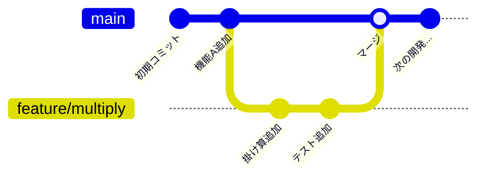
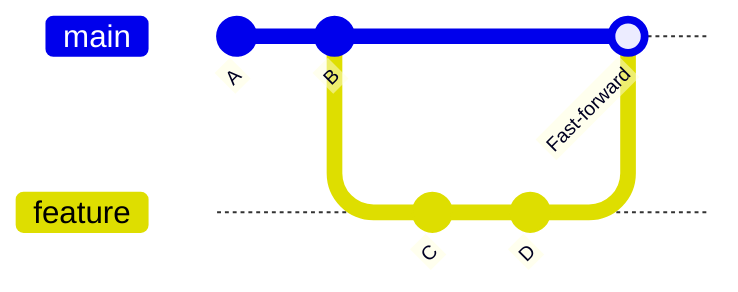
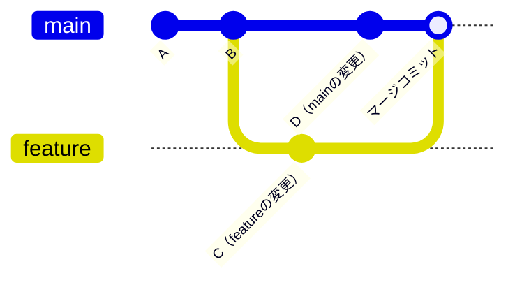
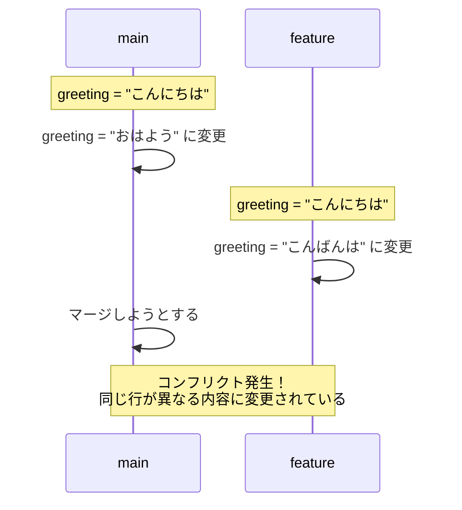
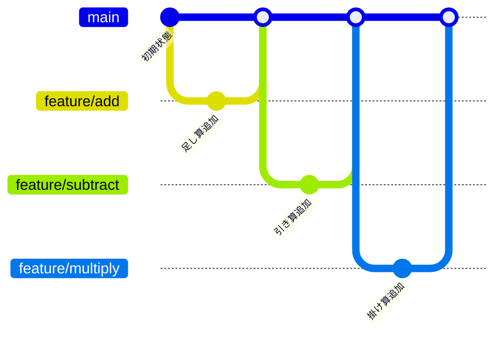

# ブランチとマージ

この章で得られるスキル：
- ✅ ブランチの概念を図で説明できる
- ✅ `git branch` / `git switch` でブランチを作成・切り替えできる
- ✅ ブランチ上で作業してコミットできる
- ✅ `git merge` でブランチを統合できる
- ✅ マージコンフリクトを手動で解決できる
- ✅ main + feature ブランチのブランチ戦略を説明できる

---

## Step 0: まず体験してみよう

### シナリオ：mainブランチを壊さずに新機能を追加したい

`Calculator.java` に掛け算メソッドを追加したい。
しかし、mainブランチには動作するコードが入っており、壊したくない。

もしmainで直接開発して失敗したら、チーム全員に影響が出る。

→ **ブランチ** を使えば、mainを安全に保ちながら別の場所で開発できる。

```bash
git switch -c feature/multiply   # 新しいブランチを作成して切り替え
# Calculator.java に掛け算メソッドを追加
git add Calculator.java
git commit -m "掛け算メソッドを追加"
git switch main                  # mainブランチに戻る
# → Calculator.java は元のまま！（掛け算メソッドはない）
git merge feature/multiply       # マージ
# → mainにも掛け算メソッドが追加された！
```

:::tip ポイント
ブランチは **「並行世界」** のようなものである。
mainの世界はそのまま保ちつつ、別の世界（ブランチ）で自由に開発できる。
完成したら、その世界をmainに統合（マージ）する。
:::

---

## Step 1: ブランチとは

### ブランチの概念

**ブランチ（branch）** とは、開発の流れを分岐させる仕組みである。

- **mainブランチ**: 常に動作するコードが入っているブランチ。「本番」の世界。
- **featureブランチ**: 新機能を開発するための一時的なブランチ。「開発中」の世界。



featureブランチで完成した機能は、 **マージ** によってmainブランチに統合される。

### なぜブランチが必要か

| mainだけで開発すると... | ブランチを使うと... |
|------------------------|-------------------|
| 開発中のコードがmainに混ざる | 完成するまでmainに影響しない |
| 失敗した場合、mainを壊してしまう | 失敗してもブランチを捨てれば済む |
| 複数人が同時に開発しにくい | 各自がfeatureブランチで独立に開発できる |

:::info ブランチは開発現場の標準
どの開発チームでも、mainに直接コミットすることは原則禁止されている。
必ずfeatureブランチを作成し、完成後にマージするのが基本ワークフローである。
:::

---

## Step 2: ブランチの作成と切り替え

### ブランチ一覧を確認する

```bash
git branch
```

出力例：

```
* main
```

`*` が付いているのが、現在いるブランチである。

### 新しいブランチを作成する

```bash
git branch ブランチ名
```

例：

```bash
git branch feature/multiply
```

ブランチを作成しただけでは、まだmainブランチにいる。

### ブランチを切り替える

```bash
git switch ブランチ名
```

例：

```bash
git switch feature/multiply
```

### 作成と切り替えを同時に行う

```bash
git switch -c ブランチ名
```

例：

```bash
git switch -c feature/subtract
```

これが最もよく使うパターンである。

### やってみよう

1. `git branch` で現在のブランチを確認せよ
2. `git switch -c feature/multiply` で新しいブランチを作成・切り替えせよ
3. `git branch` で、ブランチが増えていることと `*` の位置を確認せよ

```bash
git branch
# → * main

git switch -c feature/multiply
# → Switched to a new branch 'feature/multiply'

git branch
# →   main
# → * feature/multiply
```

### ブランチ名の規約

チーム開発では、ブランチ名に規約を設けることが多い。

| 接頭辞 | 用途 | 例 |
|--------|------|-----|
| `feature/` | 新機能の開発 | `feature/multiply`, `feature/login` |
| `fix/` | バグ修正 | `fix/divide-by-zero`, `fix/typo` |

:::caution 重要
ブランチ名にはスペースを含められない。
英語の小文字とハイフン（`-`）を使い、何をするブランチかがわかる名前にしよう。
:::

---

## Step 3: ブランチ上での作業

### ブランチ上でのadd / commit

ブランチ上での操作は、通常のGit操作と全く同じである。

```bash
# feature/multiply ブランチにいることを確認
git branch
# → * feature/multiply

# ファイルを変更
# Calculator.java に掛け算メソッドを追加

# いつも通り add → commit
git add Calculator.java
git commit -m "掛け算メソッドを追加"
```

### ブランチを切り替えるとファイルが変わる

ここが重要なポイントである。
ブランチを切り替えると、 **作業ディレクトリのファイルがそのブランチの状態に変わる** 。

```bash
# feature/multiply ブランチ → 掛け算メソッドがある
git switch main
# main ブランチ → 掛け算メソッドがない！

git switch feature/multiply
# feature/multiply ブランチ → 掛け算メソッドが戻る！
```

### やってみよう

1. `feature/multiply` ブランチで `Calculator.java` に掛け算メソッドを追加してコミットせよ
2. `git switch main` でmainに切り替え、 `Calculator.java` に掛け算メソッドがないことを確認せよ
3. `git switch feature/multiply` に戻り、掛け算メソッドがあることを確認せよ

:::warning 注意
ブランチを切り替える前に、変更をコミットしておくこと。
コミットしていない変更がある状態で切り替えると、変更が別のブランチに持ち越される場合がある。
:::

---

## Step 4: ブランチの統合（git merge）

### 基本的なマージの流れ

featureブランチの作業が完了したら、mainブランチに統合する。

```bash
# 1. mainブランチに切り替える
git switch main

# 2. featureブランチをマージする
git merge feature/multiply
```

**必ずmainブランチに移動してから** `git merge` を実行する。
「mainの中にfeatureの変更を取り込む」というイメージである。

### やってみよう

1. `git switch main` でmainブランチに切り替えせよ
2. `git merge feature/multiply` を実行せよ
3. `Calculator.java` に掛け算メソッドが追加されていることを確認せよ
4. `git log --oneline` でマージの結果を確認せよ

### Fast-forwardマージ

mainブランチが featureブランチ作成後に変更されていない場合、 **Fast-forward（早送り）マージ** が行われる。
これはmainのポインタをfeatureブランチの先端に移動するだけの、最も単純なマージである。



### 三方マージ（Three-way merge）

mainブランチもfeatureブランチ作成後に変更されている場合、 **三方マージ** が行われる。
この場合、2つのブランチの変更を統合する **マージコミット** が自動的に作成される。



:::note 補足
Fast-forwardマージか三方マージかは、Gitが自動的に判断する。
開発者が意識する必要はほとんどないが、`git log --oneline --graph` で違いを確認できる。
:::

---

## Step 5: マージコンフリクトの解決

### コンフリクトとは

2人が **同じファイルの同じ行** を異なる内容に変更してマージしようとすると、 **コンフリクト（衝突）** が発生する。
Gitはどちらの変更を採用すべきか判断できないため、人間に解決を委ねる。



### コンフリクトマーカーの読み方

コンフリクトが発生すると、ファイルの中に以下のようなマーカーが挿入される。

```
<<<<<<< HEAD
おはようございます     ← 現在のブランチ（main）の内容
=======
こんばんは             ← マージしようとしているブランチの内容
>>>>>>> feature/greeting
```

| マーカー | 意味 |
|---------|------|
| `<<<<<<< HEAD` | 現在のブランチの変更の開始 |
| `=======` | 区切り線 |
| `>>>>>>> ブランチ名` | マージしようとしているブランチの変更の終了 |

### コンフリクトの解決手順

1. コンフリクトが起きたファイルを開く
2. コンフリクトマーカー（`<<<<<<<`, `=======`, `>>>>>>>`）を削除する
3. 正しい内容に修正する
4. `git add` でステージに追加する
5. `git commit` でマージコミットを作成する

```bash
# コンフリクト発生
git merge feature/greeting
# → CONFLICT (content): Merge conflict in Greeting.java
# → Automatic merge failed; fix conflicts and then commit the result.

# ファイルを開いてマーカーを削除し、正しい内容に修正
# （エディタで編集）

# 修正後
git add Greeting.java
git commit -m "コンフリクトを解決: 挨拶を統合"
```

### やってみよう（意図的にコンフリクトを起こす）

1. mainブランチで、`Greeting.java` を作成し「こんにちは」と書いてコミットせよ
2. `git switch -c feature/greeting` でブランチを作成し、「こんばんは」に変更してコミットせよ
3. `git switch main` に戻り、「おはようございます」に変更してコミットせよ
4. `git merge feature/greeting` を実行し、コンフリクトが発生することを確認せよ
5. コンフリクトマーカーを削除し、適切な内容に修正してコミットせよ

:::tip ポイント
コンフリクトは怖いものではない。
Gitが「ここは人間に判断してほしい」と教えてくれているだけである。
マーカーを削除して正しい内容を選べば、安全に解決できる。
:::

---

## Step 6: ブランチ戦略（main + feature branch）

### 基本ルール

チーム開発では、以下のルールでブランチを運用する。

1. **mainブランチで直接コミットしない**
2. 新機能や修正は **featureブランチ** で開発する
3. 完成したらmainにマージする
4. マージ済みのブランチは削除する



### ブランチの削除

マージ済みのブランチは、不要なので削除する。

```bash
# マージ済みブランチの削除
git branch -d feature/multiply

# ブランチ一覧で削除されたことを確認
git branch
```

:::caution 重要
`git branch -d` はマージ済みのブランチのみ削除できる（安全装置）。
マージしていないブランチを削除するには `-D`（大文字）が必要だが、変更が失われるため注意が必要である。
:::

---

## Step 7: 実践課題

### 課題1：featureブランチで引き算メソッドを追加

1. `git switch -c feature/subtract` でブランチを作成せよ
2. `Calculator.java` に引き算メソッドを追加し、コミットせよ
3. `git switch main` に戻り、`git merge feature/subtract` でマージせよ
4. `git branch -d feature/subtract` でブランチを削除せよ

### 課題2：featureブランチで割り算メソッドを追加

1. `git switch -c feature/divide` でブランチを作成せよ
2. `Calculator.java` に割り算メソッド（ゼロ除算チェック付き）を追加し、コミットせよ
3. mainにマージし、ブランチを削除せよ

### 課題3：コンフリクトの体験と解決

1. mainブランチで `Greeting.java` を作成し、挨拶メッセージを書いてコミットせよ
2. `feature/morning` ブランチを作成し、挨拶を「おはようございます」に変更してコミットせよ
3. mainに戻り、挨拶を「こんにちは」に変更してコミットせよ
4. `git merge feature/morning` でコンフリクトを発生させ、解決せよ

### 課題4：ブランチの流れを確認

`git log --oneline --graph --all` を実行し、ブランチの分岐とマージの様子を確認せよ。

---

## まとめ

この章では、 **ブランチとマージ** について学んだ。

### 🎯 達成できたこと
- ✅ ブランチの概念（並行世界）を説明できるようになった
- ✅ `git branch` / `git switch` でブランチを作成・切り替えできるようになった
- ✅ ブランチ上で作業してコミットできるようになった
- ✅ `git merge` でブランチを統合できるようになった
- ✅ マージコンフリクトを手動で解決できるようになった
- ✅ main + feature ブランチの戦略を説明できるようになった

### 📚 学んだ内容
- ブランチは開発の流れを分岐させる仕組みである
- `git switch -c ブランチ名` でブランチの作成と切り替えを同時に行える
- ブランチを切り替えると、作業ディレクトリのファイルも切り替わる
- `git merge` でfeatureブランチの変更をmainに統合する
- コンフリクトはマーカーを削除して手動で解決する
- mainブランチで直接コミットせず、featureブランチを使う

### 🚀 次のステップ
次の章では、 **プルリクエストとコードレビュー** について学ぶ。
ブランチの変更をチームに共有し、レビューを受けてからマージする方法を身につけよう。

---

## 💡 よくある質問

### Q1: git switch と git checkout の違いは？

**A:** `git checkout` はGitの古いコマンドで、ブランチ切り替えとファイル復元の両方の機能を持っていた。Git 2.23以降、ブランチの切り替えは `git switch`、ファイルの復元は `git restore` に分離された。この教材では新しいコマンドを使用している。

### Q2: mainブランチの名前は変更できるか？

**A:** できる。かつてはデフォルトのブランチ名が `master` だったが、現在では `main` が一般的である。GitHubでは新規リポジトリのデフォルトが `main` に設定されている。

### Q3: ブランチをたくさん作るとパフォーマンスに影響するか？

**A:** ほとんど影響しない。Gitのブランチは非常に軽量で、実体はコミットIDを指すポインタにすぎない。ただし、不要なブランチは削除して整理する習慣をつけよう。

### Q4: コンフリクトを減らすにはどうすればよいか？

**A:** 以下の3つの習慣が効果的である。(1) こまめに `git pull` してmainの最新を取り込む。(2) 小さな単位でブランチを作り、早めにマージする。(3) チームで担当範囲を分け、同じファイルの編集を避ける。

### Q5: マージをやり直したい場合はどうすればよいか？

**A:** マージが完了する前（コンフリクト解決中）であれば `git merge --abort` で中断できる。マージが完了した後であれば `git revert` でマージコミットを取り消せる。
