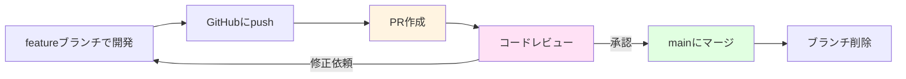
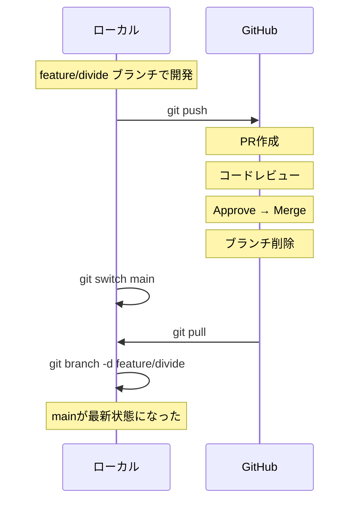

# プルリクエストとコードレビュー

この章で得られるスキル：
- ✅ プルリクエスト（PR）の意義を説明できる
- ✅ GitHub上でPRを作成できる
- ✅ PRの説明文を適切に書ける
- ✅ コードレビューでコメント・承認・修正依頼ができる
- ✅ PRをマージし、ローカルを最新状態に同期できる

---

## Step 0: まず体験してみよう

### シナリオ：mainに直接pushしたらバグが入った

ある日、Aさんがmainブランチに直接pushした。
ところが、そのコードにはバグが混入していた。

チームメンバーが全員pullした後にバグに気づき、全員の開発が止まってしまった。

**もし、pushする前に誰かがコードを確認していたら？**
→ バグに気づけたはずである。

:::caution 重要
mainブランチに直接pushすると、バグが入ったときの影響範囲が大きい。
変更をmainに取り込む前に、チームメンバーに確認してもらう仕組みが必要である。
:::

→ **プルリクエスト（Pull Request）** を使えば、マージ前にコードレビューを受けられる。
この章では、PRの作成からレビュー、マージまでの流れを学ぶ。

---

## Step 1: プルリクエスト（PR）とは

### PRの基本的な流れ

**プルリクエスト（Pull Request、通称PR）** とは、featureブランチの変更をmainに取り込んでほしいという **「依頼」** である。

PRを作成すると、チームメンバーが変更内容を確認（コードレビュー）し、問題がなければmainにマージする。



### PRを使うメリット

| メリット | 説明 |
|---------|------|
| **バグの早期発見** | マージ前にチームがコードを確認するため、バグが本番に混入しにくい |
| **知識の共有** | 他の人のコードを読むことで、チーム全体のスキルが向上する |
| **変更の記録** | 「なぜこの変更をしたか」がPRの説明文として残る |
| **品質の向上** | 「人に見せる」意識がコードの品質を上げる |

:::info PRは開発現場の必須プロセス
実務では、mainに直接pushすることは禁止されていることがほとんどである。
必ずPRを通してコードレビューを受けるのが、チーム開発の基本ルールである。
:::

---

## Step 2: PRの作成手順

### 前提：featureブランチをpush済みであること

PRを作成する前に、featureブランチをGitHubにpushしておく必要がある。

```bash
# featureブランチで開発・コミット
git switch -c feature/divide
# Calculator.java に割り算メソッドを追加
git add Calculator.java
git commit -m "割り算メソッドを追加"

# GitHubにpush
git push -u origin feature/divide
```

### GitHub上でのPR作成

1. GitHubのリポジトリページを開く
2. 「Compare & pull request」ボタンをクリック（pushした直後に表示される）
   または、「Pull requests」タブ → 「New pull request」をクリック
3. ブランチの設定を確認する
   - **base**: `main`（マージ先）
   - **compare**: `feature/divide`（マージ元）
4. タイトルと説明文を入力する
5. 「Create pull request」をクリック

### PRの説明文の書き方

PRの説明文は「何を・なぜ・どうやって」変更したかを伝える重要な情報である。

以下のテンプレートを使うと、漏れなく情報を伝えられる。

```markdown
## 何を変更したか
- Calculator クラスに割り算メソッド（divide）を追加した

## なぜ変更したか
- 四則演算の機能を完成させるため

## どうやって確認するか
- Calculator の divide メソッドを呼び出して、正しい結果が返ることを確認
- 0 で割った場合にエラーメッセージが表示されることを確認
```

:::tip ポイント
PRの説明文は、レビュアーが変更の意図を理解するための手がかりになる。
「何を変えたか」だけでなく、「なぜ変えたか」「どう確認するか」も書くことで、スムーズなレビューにつながる。
:::

---

## Step 3: コードレビューの進め方

### レビュアーの操作

PRが作成されると、チームメンバー（レビュアー）がコードを確認する。

1. PRの「Files changed」タブを開く
2. 変更内容を確認する（追加行が緑、削除行が赤で表示される）
3. 気になる行にカーソルを合わせ、`+` ボタンをクリックしてコメントを書く
4. コメントを書き終えたら「Start a review」をクリック
5. すべての確認が終わったら「Review changes」をクリックし、以下のいずれかを選ぶ

| 選択肢 | 意味 | 使う場面 |
|--------|------|---------|
| **Approve** | 承認 | 問題なし。マージしてよい |
| **Request Changes** | 修正依頼 | 問題あり。修正が必要 |
| **Comment** | コメントのみ | 承認でも却下でもない。質問や感想 |

### レビューコメントの書き方

良いコメントは、具体的で建設的なものである。

| ❌ 悪いコメント | ✅ 良いコメント |
|---------------|---------------|
| 「これはダメ」 | 「ゼロで割った場合の処理が必要です。if文でチェックしましょう」 |
| 「意味がわからない」 | 「この変数名はもう少し具体的にできそうです。例えば `result` → `quotient` はいかがですか？」 |
| （何もコメントなし） | 「このロジック、わかりやすくていいですね！」 |

:::caution 重要
コードレビューは **コードに対する指摘** であり、 **人に対する批判** ではない。
「このコードは改善できる」と伝えるのであって、「あなたはダメだ」と言っているのではない。
良いところは積極的に褒めるコメントも書こう。
:::

---

## Step 4: 修正依頼への対応

### Request Changes を受けた場合

レビュアーから修正依頼を受けた場合、以下の流れで対応する。

```bash
# 1. ローカルでfeatureブランチに切り替え
git switch feature/divide

# 2. 指摘された箇所を修正

# 3. 修正をコミット
git add Calculator.java
git commit -m "レビュー指摘を修正: ゼロ除算チェックを追加"

# 4. GitHubにpush（追加のコミットが自動的にPRに反映される）
git push
```

pushすると、PRに新しいコミットが自動的に追加される。
レビュアーは修正内容を確認し、問題なければApproveする。

---

## Step 5: PRのマージとローカルの同期

### GitHub上でのマージ

Approveされたら、「Merge pull request」ボタンをクリックしてマージする。

1. 「Merge pull request」をクリック
2. 「Confirm merge」をクリック
3. 「Delete branch」をクリック（featureブランチはもう不要）

### ローカルの同期

GitHub上でマージが完了したら、ローカルのmainブランチを最新状態にする。

```bash
# 1. mainブランチに切り替え
git switch main

# 2. リモートの最新を取り込む
git pull

# 3. マージ済みのローカルブランチを削除
git branch -d feature/divide
```

### PRマージ後の全体フロー



:::tip ポイント
PRのマージ後は必ずローカルを同期すること。
`git switch main` → `git pull` → `git branch -d ブランチ名` の3ステップを習慣にしよう。
:::

---

## Step 6: 実践課題

### 課題1：PRの作成

1. `feature/subtract` ブランチを作成し、`Calculator.java` に引き算メソッドを追加してコミットせよ
2. `git push -u origin feature/subtract` でGitHubにpushせよ
3. GitHub上でPRを作成し、説明文を「何を・なぜ・どうやって」の形式で書け�

### 課題2：コードレビューの体験（ペアワーク）

1. ペアの相手が作成したPRの「Files changed」タブを確認せよ
2. 少なくとも1つのコメントを書き、Approveまたは Request Changes を選べ
3. 修正依頼を受けた場合は、修正してpushせよ

### 課題3：マージとローカル同期

1. ApproveされたPRをGitHub上でマージせよ
2. ローカルで `git switch main` → `git pull` を実行し、変更が反映されていることを確認せよ
3. `git branch -d feature/subtract` でブランチを削除せよ

---

## まとめ

この章では、 **プルリクエストとコードレビュー** について学んだ。

### 🎯 達成できたこと
- ✅ PRの意義（mainを守るレビュー体制）を説明できるようになった
- ✅ GitHub上でPRを作成できるようになった
- ✅ PRの説明文を「何を・なぜ・どうやって」の形式で書けるようになった
- ✅ コードレビューでコメント・承認・修正依頼ができるようになった
- ✅ PRマージ後にローカルを同期できるようになった

### 📚 学んだ内容
- PRはfeatureブランチの変更をmainに取り込む「依頼」である
- PRを作成するにはfeatureブランチをGitHubにpushする必要がある
- 説明文には「何を・なぜ・どうやって」を書く
- レビューではApprove（承認）、Request Changes（修正依頼）、Comment（コメント）を選べる
- PRマージ後は `git switch main` → `git pull` → `git branch -d` で同期する

### 🚀 次のステップ
次の章では、 **Issueとチーム開発実践** について学ぶ。
Issueで作業を管理し、PRと連携させることで、チーム開発の全体像を身につけよう。

---

## 💡 よくある質問

### Q1: PRを作成せずに直接mainにpushすることはできるか？

**A:** 技術的にはできる。しかし、チーム開発では原則禁止である。GitHubの「Branch protection rules」を設定すれば、PRなしのmainへのpushを技術的にも防止できる。

### Q2: PRのレビュアーは誰が設定するのか？

**A:** PR作成時に「Reviewers」から指名できる。チームのルールによっては、特定の人が必ずレビューすることになっている場合もある。小規模チームでは、自分以外の全員がレビュアーになることが多い。

### Q3: 1つのPRにどれくらいの変更を含めるべきか？

**A:** 1つのPRは **1つの機能や修正に絞る** のが原則である。変更が大きすぎるとレビューが困難になり、品質が下がる。目安として、変更ファイルが5-10個以内、レビューに30分以内で済む程度が理想的である。

### Q4: PRでコンフリクトが表示された場合はどうすればよいか？

**A:** ローカルでmainの最新を取り込み、コンフリクトを解決してからpushし直す。具体的には `git switch feature/ブランチ名` → `git merge main`（ここでコンフリクト解決）→ `git push` の流れである。

### Q5: Approve後にさらに変更を加えてもよいか？

**A:** できるが、大きな変更を加えた場合は再度レビューを受けるべきである。Approve後の追加コミットでPRの意図が変わってしまうことを避けよう。
