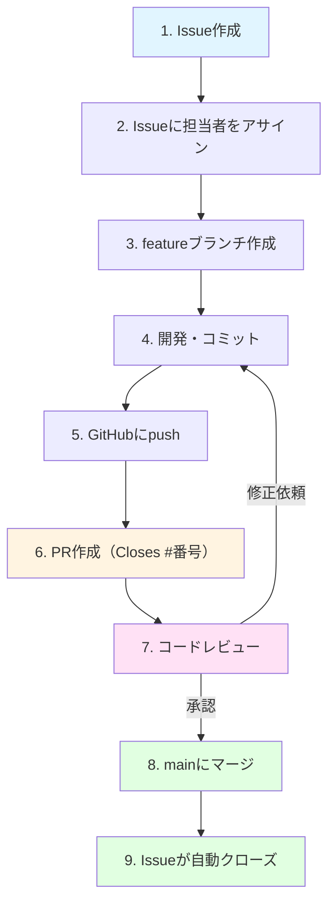
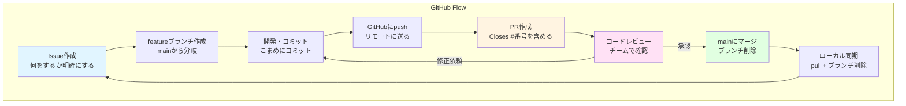

# Issueとチーム開発実践

この章で得られるスキル：
- ✅ GitHub Issueの作成方法と活用方法を説明できる
- ✅ Issue駆動開発の流れを説明できる
- ✅ `Closes #番号` でPRとIssueを紐づけられる
- ✅ GitHub Flowの全体像を説明できる
- ✅ ペアでIssue → ブランチ → PR → レビュー → マージの一連の流れを実践できる

---

## Step 0: まず体験してみよう

### シナリオ：チームで「何をやるか」がわからない

チーム開発が始まった。メンバーは3人いるが、以下の問題が起きている。

- Aさん：「何から手を付ければいいんだろう？」
- Bさん：「この機能、もう誰かやってるのかな？」
- Cさん：「バグを見つけたけど、どこに報告すればいいんだろう？」

→ 各自がバラバラに作業していて、 **誰が何をしているかわからない** 状態である。

:::caution 重要
チーム開発の失敗原因の多くは、技術的な問題ではなく **「コミュニケーション」と「タスク管理」の不備** である。
「誰が何をいつまでにやるか」を明確にする仕組みが必要である。
:::

→ **GitHub Issue** を使えば、タスクの管理・分担・進捗の可視化ができる。
この章では、Issueを中心としたチーム開発の進め方を学ぶ。

---

## Step 1: GitHub Issue とは

### Issueの役割

**Issue（イシュー）** とは、GitHub上でタスク・バグ・機能要望などを管理する仕組みである。

「チームの TODO リスト」と考えるとわかりやすい。

| Issueの用途 | 例 |
|------------|-----|
| **機能追加** | 「割り算メソッドを追加する」 |
| **バグ報告** | 「0で割ったときにエラーが出る」 |
| **改善提案** | 「READMEに使い方を追記する」 |
| **質問・議論** | 「メソッド名はどちらがよいか？」 |

### Issueの作成手順

1. GitHubのリポジトリページで「Issues」タブを開く
2. 「New issue」ボタンをクリック
3. 以下の情報を入力する

| 項目 | 説明 | 例 |
|------|------|-----|
| **Title** | 何をするかを簡潔に | 「割り算メソッドを追加する」 |
| **Description** | 詳細や背景 | 「四則演算の機能を完成させるため、divideメソッドを追加する。ゼロ除算のチェックも含める」 |
| **Assignees** | 担当者 | Aさん |
| **Labels** | 分類ラベル | `enhancement`（機能追加） |

4. 「Submit new issue」をクリック

作成すると、Issueに **番号（例：#1, #2）** が自動的に割り振られる。
この番号は後でPRと紐づける際に使用する。

:::tip ポイント
Issueのタイトルは「何をするか」を動詞で始めると明確になる。
- ✅ 良い例：「割り算メソッドを追加する」「ゼロ除算のバグを修正する」
- ❌ 悪い例：「割り算」「バグ」
:::

---

## Step 2: Issue駆動開発の流れ

### Issue駆動開発とは

**Issue駆動開発** とは、すべての作業を **Issueから始める** 開発スタイルである。
コードを書き始める前に、まずIssueを作成し、何をするかを明確にする。

### 基本の流れ



### やってみよう（Issue → ブランチ → PR）

以下の手順を実際に行ってみよう。

**1. Issueを作成する**

- タイトル：「割り算メソッドを追加する」
- 説明：「Calculatorクラスにdivideメソッドを追加する。ゼロ除算のチェックを含める」
- 自分をAssigneesに設定する
- Issueの番号を確認する（例：#3）

**2. ブランチを作成する**

```bash
# Issue番号をブランチ名に含めると、関連が明確になる
git switch -c feature/#3-divide
```

**3. 開発してコミットする**

```bash
# Calculator.java に割り算メソッドを追加
git add Calculator.java
git commit -m "feat: 割り算メソッドを追加 #3"
```

**4. pushしてPRを作成する**

```bash
git push -u origin feature/#3-divide
```

---

## Step 3: PRとIssueの紐づけ（Closes キーワード）

### Closes キーワードとは

PRの説明文に `Closes #番号` と書くと、そのPRがマージされたときに **対応するIssueが自動的にクローズ** される。

```markdown
## 何を変更したか
- Calculator クラスに割り算メソッド（divide）を追加した
- ゼロで割った場合は -1 を返すようにした

## なぜ変更したか
- 四則演算の機能を完成させるため

Closes #3
```

### 使えるキーワード

以下のキーワードはすべて同じ動作をする。

- `Closes #番号`
- `Fixes #番号`
- `Resolves #番号`

どれを使ってもよいが、このブートキャンプでは `Closes` に統一する。

:::info なぜ紐づけが重要か
IssueとPRを紐づけると、以下のメリットがある。
- Issueの画面から「どのPRで解決されたか」がわかる
- PRの画面から「どのIssueに対応しているか」がわかる
- マージ時にIssueが自動クローズされるため、閉じ忘れがない
:::

### コミットメッセージにも書ける

```bash
git commit -m "feat: 割り算メソッドを追加 #3"
```

コミットメッセージに `#番号` を含めると、GitHubのコミット履歴からIssueへのリンクが生成される。
ただし、コミットメッセージの `#番号` ではIssueは自動クローズされない。自動クローズにはPRの説明文に `Closes` を書く必要がある。

---

## Step 4: GitHub Flowのまとめ

ここまで学んだ内容を整理すると、 **GitHub Flow** と呼ばれるワークフローになる。

### GitHub Flowの全体像



### 日常の開発サイクル

チーム開発では、このサイクルを毎日繰り返す。

**朝のルーティン:**

```bash
git switch main
git pull
# Issueを確認し、担当するタスクを選ぶ
git switch -c feature/#番号-タスク名
```

**開発中:**

```bash
# こまめにコミット
git add .
git commit -m "feat: ○○機能を追加 #番号"
```

**作業完了時:**

```bash
git push -u origin feature/#番号-タスク名
# GitHubでPRを作成（Closes #番号を含める）
```

**レビュー・マージ後:**

```bash
git switch main
git pull
git branch -d feature/#番号-タスク名
```

:::tip ポイント
この流れを体に覚えさせよう。最初は手順が多く感じるが、毎日繰り返すうちに自然にできるようになる。
:::

---

## Step 5: コミットメッセージの規約

チーム開発では、コミットメッセージに **プレフィクス（接頭辞）** を付けると、変更の種類がひと目でわかる。

### よく使うプレフィクス

| プレフィクス | 用途 | 例 |
|------------|------|-----|
| `feat:` | 新機能の追加 | `feat: 割り算メソッドを追加` |
| `fix:` | バグ修正 | `fix: ゼロ除算のエラーを修正` |
| `docs:` | ドキュメント | `docs: READMEに使い方を追記` |
| `refactor:` | リファクタリング | `refactor: Calculatorのメソッド名を変更` |
| `test:` | テスト | `test: 割り算のテストを追加` |

### やってみよう

次のコミットから、プレフィクスを付けてコミットメッセージを書いてみよう。

```bash
# 機能追加の場合
git commit -m "feat: 掛け算メソッドを追加 #5"

# バグ修正の場合
git commit -m "fix: ゼロ除算時のエラーハンドリングを追加 #7"
```

:::note 補足
プレフィクスのルール（ **Conventional Commits** と呼ばれる）は、チームによって異なる場合がある。
ここで紹介したのは最も一般的なルールである。チームで統一されたルールがあれば、それに従おう。
:::

---

## Step 6: ペアワーク実践課題

ここからは、2人1組のペアワークで実践する。
以下の手順で、Issue駆動開発の一連の流れを体験しよう。

### 準備

1. ペアで共有リポジトリを1つ用意する（片方が作成し、もう一方をCollaboratorとして招待する）
2. 両方が `git clone` でリポジトリをローカルにコピーする
3. `Calculator.java` を作成し、`add` メソッドだけ実装した状態でmainにpushする

### 実践1：機能追加（各自で担当）

**Aさんの作業:**

1. Issue「引き算メソッドを追加する」を作成し、自分をアサインする（例：#1）
2. `feature/#1-subtract` ブランチを作成する
3. `Calculator.java` に引き算メソッドを追加してコミットする
4. pushしてPRを作成する（説明文に `Closes #1` を含める）
5. Bさんのレビューを待つ

**Bさんの作業:**

1. Issue「掛け算メソッドを追加する」を作成し、自分をアサインする（例：#2）
2. `feature/#2-multiply` ブランチを作成する
3. `Calculator.java` に掛け算メソッドを追加してコミットする
4. pushしてPRを作成する（説明文に `Closes #2` を含める）
5. Aさんのレビューを待つ

### 実践2：コードレビュー

1. お互いのPRを確認し、コードレビューを行う
2. 少なくとも1つコメントを書く（良い点でも改善点でもよい）
3. 問題がなければApproveする
4. 修正が必要な場合はRequest Changesし、修正後に再度レビューする

### 実践3：マージとローカル同期

1. ApproveされたPRをマージする
2. GitHub上でブランチを削除する
3. ローカルで `git switch main` → `git pull` → `git branch -d ブランチ名` を実行する
4. `Calculator.java` に両方のメソッドが追加されていることを確認する

### 実践4：コンフリクトの体験

1. Issue「READMEを更新する」を **両方** が作成する（#3, #4）
2. 両方が同時に `README.md` の同じ行を変更する
3. 先にマージした方は成功する
4. 後からマージしようとする方はコンフリクトが発生する
5. コンフリクトを解決し、マージを完了する

:::caution 重要
実践4で意図的にコンフリクトを体験しよう。
研修中に安全な環境でコンフリクトを経験しておくと、実務で遭遇しても焦らずに対応できる。
:::

---

## Step 7: チーム開発のベストプラクティス

### 作業の進め方

| ルール | 理由 |
|--------|------|
| **作業前にIssueを作成する** | 何をするか明確にし、重複作業を防ぐ |
| **こまめにコミットする** | 変更を小さな単位で記録し、問題の特定を容易にする |
| **1つのPRは1つの機能に絞る** | レビューしやすく、問題があった場合のrevertも簡単 |
| **毎朝 `git pull` する** | mainの最新を取り込み、コンフリクトを減らす |

### レビューの心構え

| ルール | 理由 |
|--------|------|
| **コードを批判しても人を批判しない** | チームの信頼関係を守る |
| **良いところは積極的に褒める** | モチベーションを高め、学習を促進する |
| **曖昧な指摘は避け、具体的に提案する** | 修正方法が明確になり、スムーズに進む |
| **レビューは24時間以内に行う** | 開発のスピードを落とさない |

---

## まとめ

この章では、 **Issueとチーム開発実践** について学んだ。

### 🎯 達成できたこと
- ✅ GitHub Issueの作成と活用方法を説明できるようになった
- ✅ Issue駆動開発の流れを説明できるようになった
- ✅ `Closes #番号` でPRとIssueを紐づけられるようになった
- ✅ GitHub Flowの全体像を説明できるようになった
- ✅ ペアでIssue → ブランチ → PR → レビュー → マージの流れを実践できるようになった

### 📚 学んだ内容
- Issueはチームのタスク管理ツールである
- Issue駆動開発では、すべての作業をIssueから始める
- PRの説明文に `Closes #番号` を書くと、マージ時にIssueが自動クローズされる
- GitHub Flowは Issue → Branch → PR → Review → Merge のサイクルである
- コミットメッセージにプレフィクス（`feat:`, `fix:` 等）を付けると見やすい
- コードレビューでは具体的で建設的なコメントを書く

### 🚀 次のステップ
Git教材はこの章で完了である。
ここで学んだGitHub Flowの知識は、チーム開発の演習で実際に活用する。
最初は手順を確認しながら進め、徐々に体に覚えさせていこう。

---

## 💡 よくある質問

### Q1: Issueは誰が作成するのか？

**A:** チームの誰でも作成できる。機能追加であればリーダーやプロダクトオーナーが、バグ報告であれば発見した人が作成するのが一般的である。このブートキャンプでは、各自が自分のタスクのIssueを作成する。

### Q2: Issueに書く情報はどれくらい詳しくすべきか？

**A:** 第三者が読んでも「何をすればよいか」がわかる程度に書くのが理想的である。最低限、「何をするか」「なぜ必要か」「完了条件は何か」を含めよう。

### Q3: Closes キーワードを書き忘れた場合はどうなるか？

**A:** Issueは自動クローズされないだけで、マージ自体は正常に行われる。手動でIssueを「Close」すればよい。次回以降は忘れないようにしよう。

### Q4: 1つのPRで複数のIssueを閉じることはできるか？

**A:** できる。`Closes #1, Closes #2` のように書けば、マージ時に両方のIssueがクローズされる。ただし、1つのPRが複数のIssueにまたがる場合は、PRの粒度が大きすぎる可能性がある。

### Q5: GitHub以外でもIssue駆動開発はできるか？

**A:** できる。GitLabやBitbucketにも同様のIssue機能がある。また、JiraやTrelloなどのプロジェクト管理ツールとGitHubを連携させることもできる。基本的な考え方（タスクを明確にし、PRと紐づける）はどのツールでも同じである。
