# プログラミングの世界へようこそ

プログラミングの学習は、算数や数学を学ぶのと同じように、**積み重ねの学習**です。  
たとえば歴史の学習では、幕末だけ詳しく学ぶこともできますが、プログラミングは積み重ねが重要です。  
足し算や引き算がわからないと掛け算や割り算が理解できないように、  
プログラミングでも基本的な概念を理解していないと、応用的な内容を学んでもうまくついていけません。

学習に苦手意識を持つことは自然なことです。  
しかし諦めず、少しずつ理解を積み重ねていけば、必ず Web アプリケーション開発ができるようになります。  
「今日は理解できなかったけれど、明日はもっとわかるかもしれない」という気持ちで学習を進めてください。

# 学習ロードマップ

以下は Web アプリ開発までの学習ロードマップです。

<!-- FIXME: 元々は mermaid のコードブロックで図表を描画しようとしていましたが、 -->
<!-- エラー "Hook useColorMode is called outside the <ColorModeProvider>" が発生したため、 -->
<!-- 現在はSVG画像として表示しています -->

# 学習の進め方のポイント

1. **基本を理解することを最優先**  
   プログラムの基本ルールや変数の扱いなど、基礎を飛ばすと後で苦労します。

2. **手を動かして確かめる**  
   読むだけではなく、実際にプログラムを書いて挙動を確認することが大切です。

3. **つまずいても焦らない**  
   初学者は誰でもエラーや理解できない部分に出会います。  
   そのときは少し戻って基礎を復習しましょう。

4. **小さな成功体験を積む**  
   簡単なプログラムを完成させることで自信をつけ、次のステップに進みやすくなります。

プログラミングは最初は難しく感じるかもしれませんが、**少しずつ積み重ねることで確実にできるようになる**学習です。  
あなたもこのロードマップに沿って学習を進めれば、必ず Web アプリ開発ができるようになります。
