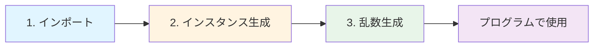

# 乱数生成（Random）

import { OneCompilerCodeBlock } from "@site/src/components/OneCompilerCodeBlock";

この章で得られるスキル：
- ✅ ランダムな数を使ったゲームやアプリが作れる
- ✅ じゃんけん、サイコロ、くじ引きなどを実装できる
- ✅ 実行するたびに違う動作をするプログラムが書ける
- ✅ シミュレーションやテストデータ生成ができる

---

## Step 0: 乱数がないとどうなる？

まず、乱数を使わないプログラムを見てみよう。

### 予測可能なゲーム

以下は、サイコロの出目をシミュレートしようとしたプログラムである：

<OneCompilerCodeBlock
  language="java"
  code={`public class Main {
    public static void main(String[] args) {
        int dice = 3;  // 常に3が出る
        System.out.println("サイコロの出目: " + dice);

        if (dice >= 4) {
            System.out.println("勝ち！");
        } else {
            System.out.println("負け...");
        }
    }
}`}
/>

このプログラムには致命的な問題がある：

- **常に同じ結果になる**：何度実行しても3が出る
- **ゲームとして成立しない**：結果が予測できてしまう
- **現実のサイコロを再現できない**：1〜6のランダムな値が必要

### 現実世界での乱数の必要性

乱数が必要な場面は多い：

- **ゲーム**：サイコロ、カード、敵の行動パターン
- **抽選**：当選者の選定、ランダムな順序
- **シミュレーション**：株価の変動、天気の予測
- **セキュリティ**：パスワード生成、暗号化キー

では、どうやってランダムな値を生成するのか？

---

## Step 1: 乱数とは

### 乱数の定義

**乱数（らんすう、Random Number）** とは、予測不可能な値のことである。

プログラムでは、 **疑似乱数** という「本物の乱数のように見える数」を使う：


- **シード（seed）**：乱数生成の開始点
- **疑似乱数**：計算で作られた、ランダムに見える数
- **真の乱数**：物理現象から生成される、完全にランダムな数

:::tip

Javaの `Random` クラスは疑似乱数を生成する。
シードが同じなら同じ乱数列が生成されるが、通常は現在時刻をシードにするため、毎回異なる値になる。

:::

### Randomクラスの登場

Javaでは、 **`java.util.Random`** クラスを使って乱数を生成する：

```java
import java.util.Random;

Random random = new Random();
int number = random.nextInt();  // ランダムな整数
```

これで、予測不可能な値を生成できるようになる。

---

## Step 2: Randomの基本的な使い方

### Randomクラスを使う4つのステップ

Randomクラスの使い方は、Scannerと同じく4ステップである：



### 基本形

以下が最も基本的な形である：

<OneCompilerCodeBlock
  language="java"
  code={`import java.util.Random;

public class Main {
    public static void main(String[] args) {
        // 1. インポート（上で実施済み）

        // 2. Randomインスタンスを生成
        Random random = new Random();

        // 3. 乱数を生成（0〜9の整数）
        int number = random.nextInt(10);

        // 4. 使用
        System.out.println("生成された乱数: " + number);
    }
}`}
/>

**実行結果例**：
```
生成された乱数: 7
```

実行するたびに異なる値が出力される。

### コードの解説

```java
Random random = new Random();
```

- **`Random`**：乱数生成器のクラス
- **`random`**：変数名（慣例的に `random` を使う）
- **`new Random()`**：新しい乱数生成器を作成

```java
int number = random.nextInt(10);
```

- **`nextInt(10)`**：0〜9の範囲でランダムな整数を生成
- **戻り値**：`int` 型の乱数

:::warning

`nextInt(10)` は **0以上10未満** の整数を返す。
つまり、0, 1, 2, 3, 4, 5, 6, 7, 8, 9 のいずれか。10は含まれない。

:::

---

## Step 3: 様々な乱数生成メソッド

Randomクラスには、さまざまな種類の乱数を生成するメソッドがある。

### 主な乱数生成メソッド

| メソッド | 戻り値の型 | 説明 | 範囲 |
|---------|-----------|------|------|
| `nextInt()` | `int` | ランダムな整数 | -2147483648 〜 2147483647 |
| `nextInt(n)` | `int` | 0以上n未満の整数 | 0 〜 n-1 |
| `nextDouble()` | `double` | ランダムな小数 | 0.0以上1.0未満 |
| `nextBoolean()` | `boolean` | trueまたはfalse | true / false |
| `nextLong()` | `long` | ランダムな長整数 | 非常に大きな範囲 |

### 各メソッドの使用例

<OneCompilerCodeBlock
  language="java"
  code={`import java.util.Random;

public class Main {
    public static void main(String[] args) {
        Random random = new Random();

        // 1. nextInt() - 任意の整数
        int anyInt = random.nextInt();
        System.out.println("任意の整数: " + anyInt);

        // 2. nextInt(n) - 0〜n-1の整数
        int dice = random.nextInt(6) + 1;  // 1〜6
        System.out.println("サイコロ: " + dice);

        // 3. nextDouble() - 0.0〜1.0未満の小数
        double percent = random.nextDouble();
        System.out.println("確率: " + percent);

        // 4. nextBoolean() - trueまたはfalse
        boolean coinFlip = random.nextBoolean();
        System.out.println("コイン: " + (coinFlip ? "表" : "裏"));
    }
}`}
/>

**実行結果例**：
```
任意の整数: -1234567890
サイコロ: 4
確率: 0.7234892341
コイン: 表
```

---

## Step 4: 範囲指定のテクニック

### 1〜6のサイコロを作る

**問題**：`nextInt(6)` は0〜5を返すが、サイコロは1〜6である。

**解決策**：生成した値に1を足す。

```java
int dice = random.nextInt(6) + 1;  // 0〜5 → 1〜6
```

**なぜこうなるか**：

- `nextInt(6)` → 0, 1, 2, 3, 4, 5 のいずれか
- `+1` → 1, 2, 3, 4, 5, 6 のいずれか

### 10〜20の整数を作る

**問題**：10〜20の範囲の乱数を生成したい。

**解決策**：範囲の幅を計算し、最小値を足す。

```java
int min = 10;
int max = 20;
int number = random.nextInt(max - min + 1) + min;
```

**計算式の意味**：

1. **範囲の幅を計算**：`max - min + 1 = 20 - 10 + 1 = 11`
2. **0〜10の乱数を生成**：`nextInt(11)` → 0〜10
3. **最小値を足す**：`+10` → 10〜20

### 小数の範囲指定

**問題**：0.0〜100.0の範囲の小数を生成したい。

**解決策**：`nextDouble()` の結果に倍率を掛ける。

```java
double score = random.nextDouble() * 100;  // 0.0〜100.0
```

### 実践例

<OneCompilerCodeBlock
  language="java"
  code={`import java.util.Random;

public class Main {
    public static void main(String[] args) {
        Random random = new Random();

        // 1. サイコロ（1〜6）
        int dice = random.nextInt(6) + 1;
        System.out.println("サイコロ: " + dice);

        // 2. 年齢（0〜99）
        int age = random.nextInt(100);
        System.out.println("年齢: " + age);

        // 3. 気温（10〜35度）
        int temperature = random.nextInt(26) + 10;
        System.out.println("気温: " + temperature + "度");

        // 4. テストの点数（0.0〜100.0）
        double score = random.nextDouble() * 100;
        System.out.printf("点数: %.1f点\\n", score);

        // 5. 当たりかハズレか（20%の確率で当たり）
        boolean isWinner = random.nextDouble() < 0.2;
        System.out.println("結果: " + (isWinner ? "当たり！" : "ハズレ"));
    }
}`}
/>

---

## Step 5: シードを使った制御

### シードとは

**シード（seed）** とは、乱数生成の開始点となる値である。

- **同じシード** → **同じ乱数列**
- **異なるシード** → **異なる乱数列**

### シードを指定する理由

通常は指定しない方が良いが、以下の場合に有用である：

1. **デバッグ**：再現可能なテストを行いたい
2. **ゲームのリプレイ**：同じ展開を再現したい
3. **テストの自動化**：予測可能な結果が必要

### シードの指定方法

```java
Random random = new Random(12345);  // シードを指定
```

### シード有無の比較

<OneCompilerCodeBlock
  language="java"
  code={`import java.util.Random;

public class Main {
    public static void main(String[] args) {
        // シード指定なし（毎回異なる）
        System.out.println("--- シード指定なし ---");
        Random random1 = new Random();
        for (int i = 0; i < 5; i++) {
            System.out.print(random1.nextInt(10) + " ");
        }
        System.out.println();

        // シード指定あり（毎回同じ）
        System.out.println("\\n--- シード指定あり（12345） ---");
        Random random2 = new Random(12345);
        for (int i = 0; i < 5; i++) {
            System.out.print(random2.nextInt(10) + " ");
        }
        System.out.println();

        // 同じシードで再度生成
        System.out.println("\\n--- 同じシード（12345）で再生成 ---");
        Random random3 = new Random(12345);
        for (int i = 0; i < 5; i++) {
            System.out.print(random3.nextInt(10) + " ");
        }
        System.out.println();
    }
}`}
/>

**実行結果例**：
```
--- シード指定なし ---
3 7 1 9 4

--- シード指定あり（12345） ---
7 3 9 1 0

--- 同じシード（12345）で再生成 ---
7 3 9 1 0
```

シード指定ありの2回は、まったく同じ乱数列になることに注目。

:::tip

**実際の開発では、通常はシードを指定しない**。
`new Random()` とだけ書けば、現在時刻を元に自動的にシードが設定され、毎回異なる乱数が生成される。

:::

---

## Step 6: よくある使用パターン

### パターン1: 配列からランダムに選ぶ

配列の要素をランダムに選択する：

<OneCompilerCodeBlock
  language="java"
  code={`import java.util.Random;

public class Main {
    public static void main(String[] args) {
        String[] fruits = {"りんご", "バナナ", "みかん", "ぶどう", "いちご"};
        Random random = new Random();

        // ランダムなインデックスを生成（0〜4）
        int index = random.nextInt(fruits.length);

        System.out.println("今日のおすすめ: " + fruits[index]);
    }
}`}
/>

### パターン2: 配列をシャッフルする

配列の要素をランダムに並び替える（Fisher-Yatesアルゴリズム）：

<OneCompilerCodeBlock
  language="java"
  code={`import java.util.Random;

public class Main {
    public static void main(String[] args) {
        int[] cards = {1, 2, 3, 4, 5, 6, 7, 8, 9, 10};
        Random random = new Random();

        // シャッフル
        for (int i = cards.length - 1; i > 0; i--) {
            int j = random.nextInt(i + 1);
            // cards[i]とcards[j]を交換
            int temp = cards[i];
            cards[i] = cards[j];
            cards[j] = temp;
        }

        // 結果表示
        System.out.print("シャッフル結果: ");
        for (int card : cards) {
            System.out.print(card + " ");
        }
        System.out.println();
    }
}`}
/>

### パターン3: 重み付き抽選

確率を指定して抽選する：

<OneCompilerCodeBlock
  language="java"
  code={`import java.util.Random;

public class Main {
    public static void main(String[] args) {
        Random random = new Random();
        double probability = random.nextDouble();  // 0.0〜1.0

        String result;
        if (probability < 0.7) {
            result = "ノーマル（70%）";
        } else if (probability < 0.95) {
            result = "レア（25%）";
        } else {
            result = "激レア（5%）";
        }

        System.out.printf("確率: %.4f → %s\\n", probability, result);
    }
}`}
/>

### パターン4: ランダムな文字列生成

パスワードやIDをランダムに生成する：

<OneCompilerCodeBlock
  language="java"
  code={`import java.util.Random;

public class Main {
    public static void main(String[] args) {
        String chars = "ABCDEFGHIJKLMNOPQRSTUVWXYZ0123456789";
        Random random = new Random();
        StringBuilder password = new StringBuilder();

        // 8文字のランダムな文字列を生成
        for (int i = 0; i < 8; i++) {
            int index = random.nextInt(chars.length());
            password.append(chars.charAt(index));
        }

        System.out.println("生成されたパスワード: " + password);
    }
}`}
/>

---

## Step 7: 実践課題

ここまで学んだ知識を使って、以下の3つの課題に挑戦しよう。

### 課題1: じゃんけんゲーム

**要件**：
1. コンピュータがランダムに「グー」「チョキ」「パー」のいずれかを出す
2. ユーザーは0（グー）、1（チョキ）、2（パー）を入力
3. 勝敗を判定して表示

**ヒント**：
```java
String[] hands = {"グー", "チョキ", "パー"};
int computer = random.nextInt(3);  // 0, 1, 2のいずれか
```

**期待される実行例**：
```
じゃんけんゲーム！
0:グー, 1:チョキ, 2:パー > 0
あなた: グー
コンピュータ: チョキ
あなたの勝ち！
```

<details>
<summary>解答例を見る</summary>

<OneCompilerCodeBlock
  language="java"
  code={`import java.util.Random;
import java.util.Scanner;

public class Main {
    public static void main(String[] args) {
        String[] hands = {"グー", "チョキ", "パー"};
        Random random = new Random();
        Scanner scanner = new Scanner(System.in);

        System.out.println("じゃんけんゲーム！");
        System.out.print("0:グー, 1:チョキ, 2:パー > ");
        int user = scanner.nextInt();

        int computer = random.nextInt(3);

        System.out.println("あなた: " + hands[user]);
        System.out.println("コンピュータ: " + hands[computer]);

        if (user == computer) {
            System.out.println("引き分け！");
        } else if ((user == 0 && computer == 1) ||
                   (user == 1 && computer == 2) ||
                   (user == 2 && computer == 0)) {
            System.out.println("あなたの勝ち！");
        } else {
            System.out.println("コンピュータの勝ち！");
        }

        scanner.close();
    }
}`}
/>

</details>

---

### 課題2: ガチャシミュレーター

**要件**：
1. 10回分のガチャを引く
2. 各回で以下の確率でアイテムが出る：
   - ノーマル: 70%
   - レア: 25%
   - 激レア: 5%
3. 各レアリティの出現回数を集計して表示

**ヒント**：
```java
int normal = 0, rare = 0, superRare = 0;
for (int i = 0; i < 10; i++) {
    double prob = random.nextDouble();
    if (prob < 0.7) {
        normal++;
    } else if (prob < 0.95) {
        rare++;
    } else {
        superRare++;
    }
}
```

**期待される実行例**：
```
ガチャ10回分の結果:
第1回: ノーマル
第2回: レア
第3回: ノーマル
...
第10回: ノーマル

【結果】
ノーマル: 7回
レア: 2回
激レア: 1回
```

<details>
<summary>解答例を見る</summary>

<OneCompilerCodeBlock
  language="java"
  code={`import java.util.Random;

public class Main {
    public static void main(String[] args) {
        Random random = new Random();
        int normal = 0, rare = 0, superRare = 0;

        System.out.println("ガチャ10回分の結果:");

        for (int i = 1; i <= 10; i++) {
            double prob = random.nextDouble();
            String result;

            if (prob < 0.7) {
                result = "ノーマル";
                normal++;
            } else if (prob < 0.95) {
                result = "レア";
                rare++;
            } else {
                result = "激レア";
                superRare++;
            }

            System.out.println("第" + i + "回: " + result);
        }

        System.out.println("\\n【結果】");
        System.out.println("ノーマル: " + normal + "回");
        System.out.println("レア: " + rare + "回");
        System.out.println("激レア: " + superRare + "回");
    }
}`}
/>

</details>

---

### 課題3: 数当てゲーム（拡張版）

**要件**：
1. プログラムが1〜100のランダムな数を生成
2. ユーザーが数を入力
3. 「もっと大きい」「もっと小さい」「正解！」をヒントとして表示
4. 正解するまで繰り返す
5. 最後に試行回数を表示

**ヒント**：
```java
int answer = random.nextInt(100) + 1;  // 1〜100
int count = 0;
while (true) {
    count++;
    // 入力と判定
}
```

**期待される実行例**：
```
数当てゲーム（1〜100）
予想を入力 > 50
もっと大きい数です

予想を入力 > 75
もっと小さい数です

予想を入力 > 63
正解！ 3回で当たりました！
```

<details>
<summary>解答例を見る</summary>

<OneCompilerCodeBlock
  language="java"
  code={`import java.util.Random;
import java.util.Scanner;

public class Main {
    public static void main(String[] args) {
        Random random = new Random();
        Scanner scanner = new Scanner(System.in);

        int answer = random.nextInt(100) + 1;  // 1〜100
        int count = 0;

        System.out.println("数当てゲーム（1〜100）");

        while (true) {
            System.out.print("予想を入力 > ");
            int guess = scanner.nextInt();
            count++;

            if (guess == answer) {
                System.out.println("正解！ " + count + "回で当たりました！");
                break;
            } else if (guess < answer) {
                System.out.println("もっと大きい数です\\n");
            } else {
                System.out.println("もっと小さい数です\\n");
            }
        }

        scanner.close();
    }
}`}
/>

</details>

---

## FAQ

### Q1: `random.nextInt()` と `random.nextInt(10)` の違いは？

**A1:**

- **`nextInt()`**：-2147483648 〜 2147483647 の **任意の整数**
- **`nextInt(10)`**：0 〜 9 の **範囲指定された整数**

通常は `nextInt(n)` の方を使う場面が多い。

---

### Q2: Math.random() とRandomクラスの違いは？

**A2:**

Javaには2つの乱数生成方法がある：

| 特徴 | Math.random() | Random |
|-----|---------------|--------|
| **型** | staticメソッド | クラス |
| **戻り値** | double (0.0〜1.0) | 様々な型 |
| **使いやすさ** | シンプル | 高機能 |
| **インスタンス** | 不要 | 必要 |

**Math.random() の例**：
```java
double r = Math.random();  // 0.0〜1.0
int dice = (int)(Math.random() * 6) + 1;  // 1〜6
```

**使い分け**：
- **Math.random()**：簡単な乱数が1つだけ必要な場合
- **Random**：複数の乱数、様々な型、シード制御が必要な場合

---

### Q3: 毎回同じ乱数が出るのはなぜ？

**A3:**

以下のパターンで毎回同じ乱数が出ることがある：

**パターン1: ループ内でRandomを再生成している**

```java
// ❌ 悪い例
for (int i = 0; i < 5; i++) {
    Random random = new Random();  // ループ内で生成
    System.out.println(random.nextInt(10));
}
```

短時間に複数のRandomインスタンスを作ると、同じシード（時刻）になる可能性がある。

**解決策**：Randomは1回だけ生成する

```java
// ✅ 良い例
Random random = new Random();  // ループの外
for (int i = 0; i < 5; i++) {
    System.out.println(random.nextInt(10));
}
```

**パターン2: シードを固定している**

```java
Random random = new Random(12345);  // 固定シード
```

デバッグ目的でない限り、シードは指定しない。

---

### Q4: 1〜10の範囲を指定する正しい方法は？

**A4:**

**間違った方法**：
```java
int number = random.nextInt(10);  // 0〜9（10は含まれない）
```

**正しい方法**：
```java
int number = random.nextInt(10) + 1;  // 1〜10
```

**一般化した公式**：
```java
int min = 最小値;
int max = 最大値;
int number = random.nextInt(max - min + 1) + min;
```

**例（50〜100の範囲）**：
```java
int number = random.nextInt(51) + 50;  // 50〜100
```

---

### Q5: 配列からランダムに選ぶ時の注意点は？

**A5:**

配列の長さを超えないように注意する。

**間違った方法**：
```java
String[] items = {"A", "B", "C"};
int index = random.nextInt(4);  // ❌ 0〜3（範囲外の可能性）
System.out.println(items[index]);  // ArrayIndexOutOfBoundsException
```

**正しい方法**：
```java
String[] items = {"A", "B", "C"};
int index = random.nextInt(items.length);  // ✅ 0〜2
System.out.println(items[index]);
```

**配列の長さ（`items.length`）を使う** ことで、配列のサイズが変わっても安全。

---

## まとめ

この章では、Javaで乱数を扱う方法を学んだ：

1. **Randomクラス**：`java.util.Random` で乱数を生成
2. **基本形**：`Random random = new Random(); int n = random.nextInt(10);`
3. **様々なメソッド**：`nextInt()`, `nextDouble()`, `nextBoolean()`
4. **範囲指定**：`nextInt(max - min + 1) + min` で任意の範囲
5. **シード**：同じシードで同じ乱数列（デバッグに有用）
6. **実践パターン**：配列から選択、シャッフル、重み付き抽選

乱数は、ゲーム、シミュレーション、セキュリティなど、多くの場面で必要になる重要な技術である。

**次章では**、オブジェクト指向プログラミングの基礎を学び、より複雑なプログラムを設計する方法を身につける。
