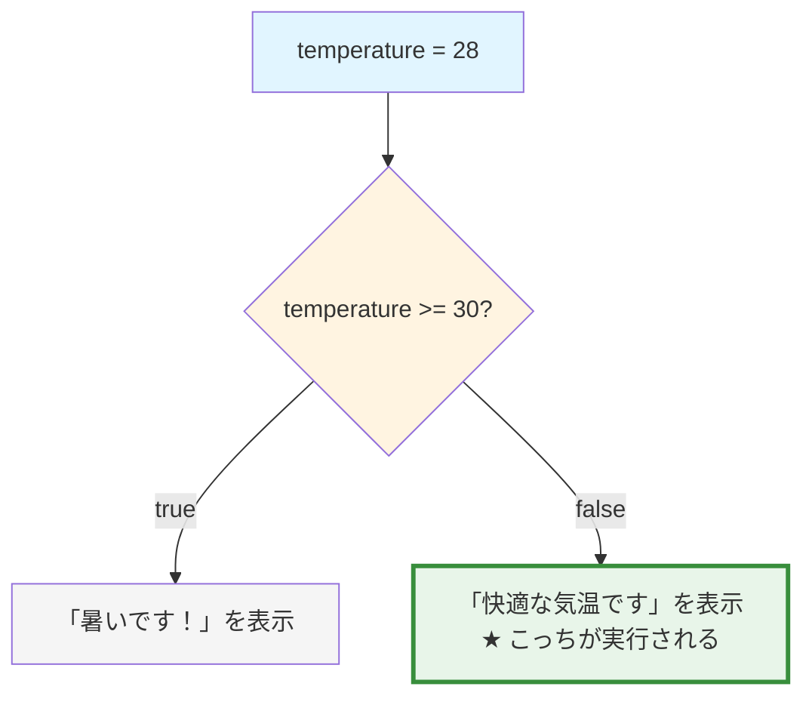

import { OneCompilerCodeBlock } from "@site/src/components/OneCompilerCodeBlock";

# 条件分岐

この章で得られるスキル：
- ✅ 状況に応じて異なる処理を実行できる
- ✅ ユーザーの入力に応じた柔軟なプログラムが作れる
- ✅ 複雑な条件を組み合わせられる
- ✅ 実務でよく使うif文のパターンを理解できる

---

## Step 0: まず体験してみよう

説明の前に、まず **条件分岐がないと何が困るのか** を体験しよう。

### シナリオ：SNSの「いいね」機能を作りたい

SNSアプリで、投稿に「いいね」を押す機能を作るとしよう。

**仕様：**
- いいね数が0のとき：「まだいいねがありません」
- いいね数が1〜99のとき：「XX人がいいねしました」
- いいね数が100以上のとき：「100人以上がいいねしました」

**実行してみよう（条件分岐なし）:**

<OneCompilerCodeBlock
  language="java"
  code={`public class Main {
    public static void main(String[] args) {
        int likes = 5;

        // 条件分岐がないと...
        // いいね数に関わらず、同じメッセージしか表示できない
        System.out.println("いいねがあります");

        // これでは困る！
        // いいね数が0でも100でも同じメッセージ...
    }
}`}
/>

**問題点：**
- いいね数が何個でも、同じメッセージしか出せない
- ユーザーに正確な情報を伝えられない
- アプリとして役に立たない

**どうすればいいのか？**

→ 条件によって処理を変える **条件分岐** が必要！

---

## Step 1: if文で解決する

同じプログラムを、 **if文** で書き直してみよう。

<OneCompilerCodeBlock
  language="java"
  code={`public class Main {
    public static void main(String[] args) {
        int likes = 5;

        // if文を使うと...
        if (likes == 0) {
            System.out.println("まだいいねがありません");
        }

        if (likes >= 1 && likes <= 99) {
            System.out.println(likes + "人がいいねしました");
        }

        if (likes >= 100) {
            System.out.println("100人以上がいいねしました");
        }
    }
}`}
/>

**何が起きたか？**
1. `likes = 5`なので、2番目の条件（`likes >= 1 && likes <= 99`）が真（true）
2. 2番目のブロックだけが実行される
3. 「5人がいいねしました」と表示される

**試してみよう：**
- `likes`を0に変えて実行 → 「まだいいねがありません」
- `likes`を150に変えて実行 → 「100人以上がいいねしました」

:::tip 重要な気づき
変数の値を変えるだけで、プログラムの動作が変わる！
これが条件分岐の威力である。
:::

---

## Step 2: if文の仕組みを理解しよう

### if文の基本形

```java
if (条件式) {
    // 条件が真（true）のときに実行される処理
}
```

**各部分の説明：**

```java
if (likes >= 100) {
//  ↑ 条件式：trueかfalseを返す
    System.out.println("100人以上");
//  ↑ ブロック：条件が真のときに実行
}
```

### 条件式とは？

**条件式** は、 **真（true）か偽（false）を返す式** のこと。

**よく使う比較演算子：**

| 演算子 | 意味 | 例 | 結果 |
|--------|------|-----|------|
| `==` | 等しい | `5 == 5` | true |
| `!=` | 等しくない | `5 != 3` | true |
| `>` | より大きい | `10 > 5` | true |
| `<` | より小さい | `3 < 10` | true |
| `>=` | 以上 | `5 >= 5` | true |
| `<=` | 以下 | `3 <= 5` | true |

**実行してみよう：**

<OneCompilerCodeBlock
  language="java"
  code={`public class Main {
    public static void main(String[] args) {
        int score = 85;

        System.out.println("現在の点数: " + score);
        System.out.println("---");

        // いろいろな条件を試してみよう
        if (score >= 80) {
            System.out.println("80点以上です！");
        }

        if (score == 100) {
            System.out.println("満点です！");
        }

        if (score < 60) {
            System.out.println("もっと頑張りましょう");
        }

        System.out.println("---");
        System.out.println("プログラム終了");
    }
}`}
/>

**やってみよう：**
- `score`を100にして実行 → 「満点です！」が追加で表示される
- `score`を50にして実行 → どのメッセージが表示されるか確認しよう

---

## Step 3: if-else文で「それ以外」を扱う

### 問題：コードが重複している

先ほどの「いいね」の例を見返してみよう：

```java
if (likes == 0) {
    System.out.println("まだいいねがありません");
}

if (likes >= 1 && likes <= 99) {
    System.out.println(likes + "人がいいねしました");
}

if (likes >= 100) {
    System.out.println("100人以上がいいねしました");
}
```

3つのif文を書いているが、 **実行されるのは常に1つだけ** である。
もっと効率的な書き方がある。

### if-else文で書き直す

**if-else文** は、「条件が真のとき」と「それ以外」を明確に分ける。

```java
if (条件式) {
    // 条件が真のときの処理
} else {
    // 条件が偽のときの処理
}
```

**実行してみよう：**

<OneCompilerCodeBlock
  language="java"
  code={`public class Main {
    public static void main(String[] args) {
        int temperature = 28;

        System.out.println("現在の気温: " + temperature + "度");

        // if-else文
        if (temperature >= 30) {
            System.out.println("暑いです！エアコンをつけましょう");
        } else {
            System.out.println("快適な気温です");
        }

        // 別の例：偶数・奇数判定
        int number = 7;

        System.out.println("---");
        System.out.println("数値: " + number);

        if (number % 2 == 0) {
            System.out.println("偶数です");
        } else {
            System.out.println("奇数です");
        }
    }
}`}
/>

**やってみよう：**
1. `temperature`を35に変えて実行
2. `number`を8に変えて実行
3. 偶数・奇数の判定がどう変わるか確認しよう

### 視覚的に理解しよう

**実行の流れ（temperature = 28の場合）:**



---

## Step 4: if-else if-elseで複数の条件を扱う

### シナリオ：成績判定システム

テストの点数に応じて、評価を出すプログラムを作ろう。

**仕様：**
- 90点以上：「優」
- 70〜89点：「良」
- 60〜69点：「可」
- 60点未満：「不可」

### if-else if-elseの書き方

```java
if (条件1) {
    // 条件1が真のときの処理
} else if (条件2) {
    // 条件1が偽で、条件2が真のときの処理
} else if (条件3) {
    // 条件1と2が偽で、条件3が真のときの処理
} else {
    // すべての条件が偽のときの処理
}
```

:::caution 重要
条件は **上から順番に** チェックされ、 **最初に真になった条件のブロックだけが実行される**。
それ以降の条件はチェックされない。
:::

**実行してみよう：**

<OneCompilerCodeBlock
  language="java"
  code={`public class Main {
    public static void main(String[] args) {
        int score = 75;

        System.out.println("テスト結果: " + score + "点");
        System.out.print("評価: ");

        if (score >= 90) {
            System.out.println("優（素晴らしい！）");
        } else if (score >= 70) {
            System.out.println("良（よくできました）");
        } else if (score >= 60) {
            System.out.println("可（合格です）");
        } else {
            System.out.println("不可（もう少し頑張りましょう）");
        }

        // ゲームの例：HPに応じたメッセージ
        System.out.println("---");

        int hp = 30;
        int maxHp = 100;

        System.out.println("HP: " + hp + "/" + maxHp);
        System.out.print("状態: ");

        if (hp == 0) {
            System.out.println("戦闘不能");
        } else if (hp <= maxHp * 0.2) {
            System.out.println("危険！（赤）");
        } else if (hp <= maxHp * 0.5) {
            System.out.println("注意（黄）");
        } else {
            System.out.println("安全（緑）");
        }
    }
}`}
/>

**やってみよう：**
1. `score`を95、65、50に変えて、それぞれどの評価になるか確認
2. `hp`を0、15、60、80に変えて、状態がどう変わるか確認

### 実行の流れを追ってみよう

```
score = 75の場合の処理の流れ:

1. score >= 90 ? → false → スキップ
2. score >= 70 ? → true  → 「良」を表示して終了 ★
3. score >= 60 ? → （チェックされない）
4. else          → （実行されない）
```

:::tip ポイント
最初に真になった条件で処理が終わるので、 **条件の順序が重要** である。
:::

---

## Step 5: 複雑な条件を作る

### 論理演算子で条件を組み合わせる

**論理演算子：**

| 演算子 | 意味 | 例 | 読み方 |
|--------|------|-----|--------|
| `&&` | かつ（AND） | `age >= 18 && hasLicense` | 「年齢が18以上 **かつ** 免許を持っている」 |
| `\|\|` | または（OR） | `day == 6 \|\| day == 7` | 「曜日が6 **または** 7」 |
| `!` | でない（NOT） | `!isRaining` | 「雨が降って **いない**」 |

**実行してみよう：**

<OneCompilerCodeBlock
  language="java"
  code={`public class Main {
    public static void main(String[] args) {
        // SNSの投稿可否判定
        int age = 20;
        boolean isLoggedIn = true;
        boolean hasVerifiedEmail = true;

        System.out.println("投稿可否チェック");
        System.out.println("年齢: " + age);
        System.out.println("ログイン状態: " + isLoggedIn);
        System.out.println("メール認証: " + hasVerifiedEmail);
        System.out.println("---");

        // 複数の条件をANDで組み合わせる
        if (age >= 13 && isLoggedIn && hasVerifiedEmail) {
            System.out.println("✓ 投稿できます");
        } else {
            System.out.println("✗ 投稿できません");

            // 詳しい理由を表示
            if (age < 13) {
                System.out.println("  理由: 年齢が足りません");
            }
            if (!isLoggedIn) {
                System.out.println("  理由: ログインしてください");
            }
            if (!hasVerifiedEmail) {
                System.out.println("  理由: メールアドレスを認証してください");
            }
        }

        // 週末判定（ORの例）
        System.out.println("---");
        int dayOfWeek = 6;  // 1=月曜, ..., 6=土曜, 7=日曜

        if (dayOfWeek == 6 || dayOfWeek == 7) {
            System.out.println("今日は週末です！");
        } else {
            System.out.println("今日は平日です");
        }
    }
}`}
/>

**やってみよう：**
1. `age`を12にして実行 → 理由が表示される
2. `isLoggedIn`を`false`にして実行 → 別の理由が表示される
3. `dayOfWeek`を3にして実行 → 「平日です」になる

---

## Step 6: switch文で値による分岐

### switch文とは？

**switch文** は、変数の値によって処理を分岐させる構文。
特定の値による分岐が多い場合、if-else if-elseよりも見やすい。

### 基本的な書き方

```java
switch (変数) {
    case 値1:
        // 変数が値1のときの処理
        break;
    case 値2:
        // 変数が値2のときの処理
        break;
    default:
        // どの値にも一致しないときの処理
        break;
}
```

:::warning 重要
**break文** を忘れると、次のcaseも実行されてしまう（フォールスルー）。
必ずbreakを書こう。
:::

**実行してみよう：**

<OneCompilerCodeBlock
  language="java"
  code={`public class Main {
    public static void main(String[] args) {
        // ゲームのコマンド処理
        int command = 2;

        System.out.println("コマンド入力: " + command);
        System.out.print("実行: ");

        switch (command) {
            case 1:
                System.out.println("攻撃！");
                break;
            case 2:
                System.out.println("防御！");
                break;
            case 3:
                System.out.println("魔法を使う！");
                break;
            case 4:
                System.out.println("逃げる！");
                break;
            default:
                System.out.println("無効なコマンドです");
                break;
        }

        // 複数のcaseをまとめる例
        System.out.println("---");
        int month = 8;

        System.out.print(month + "月は");

        switch (month) {
            case 3:
            case 4:
            case 5:
                System.out.println("春です");
                break;
            case 6:
            case 7:
            case 8:
                System.out.println("夏です");
                break;
            case 9:
            case 10:
            case 11:
                System.out.println("秋です");
                break;
            case 12:
            case 1:
            case 2:
                System.out.println("冬です");
                break;
            default:
                System.out.println("無効な月です");
                break;
        }
    }
}`}
/>

**やってみよう：**
1. `command`を1〜5に変えて、それぞれの動作を確認
2. `month`を12、4、9に変えて、季節判定を確認
3. **挑戦：** いずれかのbreakを削除して、フォールスルーの動作を確認してみよう

---

## Step 7: 実践演習

以下の課題に挑戦して、条件分岐をマスターしよう！

### 課題1：パスワード強度チェッカー

パスワードの長さに応じて、強度を判定するプログラムを作ろう。

**仕様：**
- 8文字未満：「弱い」
- 8〜11文字：「普通」
- 12文字以上：「強い」

**ヒント：**
```java
String password = "mypassword";
int length = password.length();  // 文字列の長さを取得
```

**スタート地点：**
<OneCompilerCodeBlock
  language="java"
  code={`public class Main {
    public static void main(String[] args) {
        String password = "mypassword";
        int length = password.length();

        System.out.println("パスワード: " + password);
        System.out.println("文字数: " + length);
        System.out.print("強度: ");

        // ここにif-else if-elseを書こう！

    }
}`}
/>

### 課題2：BMI判定プログラム

身長と体重からBMIを計算し、判定結果を表示するプログラムを作ろう。

**BMI計算式：**
```
BMI = 体重(kg) ÷ (身長(m) × 身長(m))
```

**判定基準：**
- 18.5未満：やせ
- 18.5〜24.9：標準
- 25〜29.9：肥満（1度）
- 30以上：肥満（2度）

**ヒント：**
```java
double height = 1.70;  // メートル単位
double weight = 65.0;  // キログラム
double bmi = weight / (height * height);
```

### 課題3：じゃんけんゲーム

プレイヤーとコンピュータのじゃんけんの結果を判定しよう。

**仕様：**
- 1 = グー、2 = チョキ、3 = パー
- 勝敗を判定して表示する

**ヒント：**
```java
int player = 1;    // プレイヤーの手
int computer = 2;  // コンピュータの手

// switch文やif文を使って判定しよう！
// 例：player == 1 && computer == 2 なら「あなたの勝ち」
```

---

## まとめ

この章では、 **条件分岐** について学んだ。

### 🎯 達成できたこと

- ✅ **状況に応じて異なる処理**を実行できるようになった
- ✅ **ユーザーの入力に応じた柔軟なプログラム**が作れるようになった
- ✅ **複雑な条件を組み合わせ**られるようになった
- ✅ **実務でよく使うif文のパターン**を理解できた

### 📚 学んだ構文

| 構文 | 使いどころ |
|------|-----------|
| **if文** | 条件が真のときだけ処理を実行 |
| **if-else文** | 「条件が真のとき」と「それ以外」で処理を分ける |
| **if-else if-else** | 複数の条件を順番にチェック |
| **switch文** | 値による分岐が多い場合 |

### 🚀 次のステップ

次の章では、 **繰り返し**（for文、while文）について学ぶ。

条件分岐と繰り返しを組み合わせることで、さらに強力なプログラムを作れるようになる：

```java
// 例：1から10までの偶数だけを表示
for (int i = 1; i <= 10; i++) {
    if (i % 2 == 0) {  // 条件分岐と繰り返しの組み合わせ！
        System.out.println(i);
    }
}
```

---

## 💡 よくある質問

### Q1: if文とswitch文、どっちを使えばいい？

**A:** 以下を目安に選ぼう：

- **値による分岐が多い** → switch文が見やすい
- **範囲で判定する** → if文を使う（switch文では範囲指定ができない）
- **複雑な条件** → if文を使う

### Q2: なぜbreakを忘れるとダメなの？

**A:** break文がないと、次のcaseも実行されてしまう（フォールスルー）。

```java
switch (value) {
    case 1:
        System.out.println("1");
        // breakがない！
    case 2:
        System.out.println("2");  // valueが1でも実行される
        break;
}
```

### Q3: elseは省略できる？

**A:** できる。「それ以外」の処理が不要なら、elseは書かなくてOK。

```java
if (score >= 90) {
    System.out.println("優秀です");
}
// elseなし - 90点未満のときは何も表示しない
```


