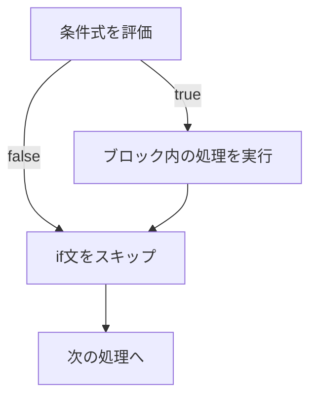
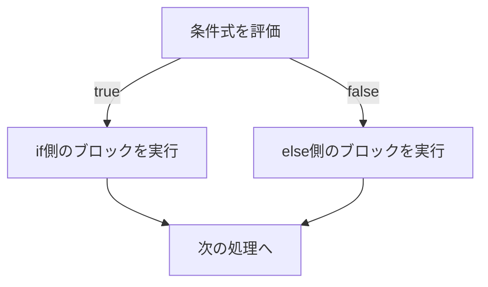

import { OneCompilerCodeBlock } from "@site/src/components/OneCompilerCodeBlock";

# 条件分岐

この章では、プログラムの実行を条件によって **分岐** させる方法を学ぶ。
条件分岐を使うことで、状況に応じた柔軟なプログラムを作ることができる。

---

## 学習のゴール

- if文の基本的な書き方を理解している
- if-else文を使いこなせる
- if-else if-elseの構造を理解している
- 条件式にboolean型の変数を使えることを理解している
- switch文の使い方を理解している
- 条件分岐を使ったプログラムを実装できる

---

## なぜこの技術が必要か

**条件分岐がないとどうなるか？**

条件分岐がないと、状況に応じた処理ができず、全てのパターンを別々に書く必要がある。
プログラムが柔軟でなくなる。

**例:**

```java
// 条件分岐がないと...
// 年齢が18歳以上の人も、18歳未満の人も、同じメッセージしか表示できない
System.out.println("ようこそ");

// 条件分岐があると...
int age = 20;
if (age >= 18) {
    System.out.println("成人です");
} else {
    System.out.println("未成年です");
}
```

条件分岐を使うことで、ユーザーの入力や状況に応じて、適切な処理を選択できる。

---

## 1. if文の基礎

### if文とは

**if文** は、条件が真（true）のときだけ、特定の処理を実行する構文である。

### 基本的な書き方

```java
if (条件式) {
    // 条件が真のときに実行される処理
}
```

- **条件式**：真（true）または偽（false）を返す式（例：`age >= 18`）
- **ブロック**：`{}`で囲まれた部分が、条件が真のときに実行される

### 処理の流れ



:::info 【共通】
if文は、ほとんどのプログラミング言語で共通である。
:::

**実行してみよう:**

<OneCompilerCodeBlock
  language="java"
  code={`public class IfExample {
    public static void main(String[] args) {
        int age = 20;

        if (age >= 18) {
            System.out.println("成人です");
        }

        System.out.println("プログラム終了");
    }
}`}
/>

**やってみよう:**
- `age`を15に変えて実行してみよう（「成人です」が表示されなくなる）

---

## 2. if-else文

### if-else文とは

**if-else文** は、条件が真のときと偽のときで、異なる処理を実行する構文である。

### 基本的な書き方

```java
if (条件式) {
    // 条件が真のときに実行される処理
} else {
    // 条件が偽のときに実行される処理
}
```

### 処理の流れ



**実行してみよう:**

<OneCompilerCodeBlock
  language="java"
  code={`public class IfElseExample {
    public static void main(String[] args) {
        int age = 15;

        if (age >= 18) {
            System.out.println("成人です");
        } else {
            System.out.println("未成年です");
        }

        // 実践例：偶数・奇数の判定
        int number = 7;

        if (number % 2 == 0) {
            System.out.println(number + "は偶数です");
        } else {
            System.out.println(number + "は奇数です");
        }
    }
}`}
/>

**やってみよう:**
- `age`を20に変えて実行してみよう
- `number`を8に変えて実行してみよう

---

## 3. if-else if-else

### 複数の条件分岐

**if-else if-else** は、複数の条件を順番にチェックする構文である。

### 基本的な書き方

```java
if (条件式1) {
    // 条件式1が真のときに実行される処理
} else if (条件式2) {
    // 条件式1が偽で、条件式2が真のときに実行される処理
} else if (条件式3) {
    // 条件式1と2が偽で、条件式3が真のときに実行される処理
} else {
    // すべての条件が偽のときに実行される処理
}
```

:::caution 重要
条件は **上から順番に** チェックされ、**最初に真になった条件のブロックだけが実行される**。
:::

**実行してみよう:**

<OneCompilerCodeBlock
  language="java"
  code={`public class IfElseIfExample {
    public static void main(String[] args) {
        int score = 75;

        if (score >= 90) {
            System.out.println("優");
        } else if (score >= 70) {
            System.out.println("良");
        } else if (score >= 60) {
            System.out.println("可");
        } else {
            System.out.println("不可");
        }

        // 実践例：時間帯の判定
        int hour = 14;

        if (hour < 12) {
            System.out.println("午前中です");
        } else if (hour < 18) {
            System.out.println("午後です");
        } else {
            System.out.println("夜です");
        }
    }
}`}
/>

**やってみよう:**
- `score`を95、65、50に変えてそれぞれ実行してみよう
- `hour`を10、15、20に変えて実行してみよう

---

## 4. 条件式にboolean型の変数を使う

### boolean変数をそのまま条件式に使う

第2章で学んだ **boolean型** の変数は、if文の条件式にそのまま使える。

```java
boolean isAdult = age >= 18;

if (isAdult) {  // boolean変数をそのまま条件式に使える
    System.out.println("成人です");
}
```

:::tip ポイント
`if (isAdult == true)` と書く必要はない。
`if (isAdult)` だけで十分である。
:::

### NOT演算子と組み合わせる

**NOT演算子**（`!`）を使って、条件を反転させることもできる。

```java
boolean isRaining = false;

if (!isRaining) {  // isRainingがfalseなら
    System.out.println("傘は不要です");
}
```

**実行してみよう:**

<OneCompilerCodeBlock
  language="java"
  code={`public class BooleanConditionExample {
    public static void main(String[] args) {
        int age = 20;
        boolean isAdult = age >= 18;

        if (isAdult) {
            System.out.println("成人です");
        } else {
            System.out.println("未成年です");
        }

        // 複数の条件を組み合わせる
        boolean hasLicense = true;
        boolean hasExperience = false;

        if (isAdult && hasLicense && hasExperience) {
            System.out.println("一人で運転できます");
        } else {
            System.out.println("同乗者が必要です");
        }
    }
}`}
/>

**やってみよう:**
- `hasExperience`をtrueに変えて実行してみよう

---

## 5. switch文

### switch文とは

**switch文** は、変数の値によって処理を分岐させる構文である。
特定の値による分岐が多い場合、if-else if-elseよりも見やすくなる。

### 基本的な書き方

```java
switch (変数) {
    case 値1:
        // 変数が値1のときの処理
        break;
    case 値2:
        // 変数が値2のときの処理
        break;
    default:
        // どの値にも一致しないときの処理
        break;
}
```

### break文の重要性

**break文** は、switch文から抜け出すための命令である。
**break文がないと、次のcaseの処理も実行されてしまう**（フォールスルー）。

:::warning 注意
break文を忘れると、意図しない動作になる。
:::

### default節

**default節** は、どのcaseにも一致しないときに実行される（省略可能）。

**実行してみよう:**

<OneCompilerCodeBlock
  language="java"
  code={`public class SwitchExample {
    public static void main(String[] args) {
        int day = 3;

        switch (day) {
            case 1:
                System.out.println("月曜日");
                break;
            case 2:
                System.out.println("火曜日");
                break;
            case 3:
                System.out.println("水曜日");
                break;
            case 4:
                System.out.println("木曜日");
                break;
            case 5:
                System.out.println("金曜日");
                break;
            case 6:
                System.out.println("土曜日");
                break;
            case 7:
                System.out.println("日曜日");
                break;
            default:
                System.out.println("無効な日");
                break;
        }

        // 実践例：月の季節判定
        int month = 8;

        switch (month) {
            case 3:
            case 4:
            case 5:
                System.out.println("春");
                break;
            case 6:
            case 7:
            case 8:
                System.out.println("夏");
                break;
            case 9:
            case 10:
            case 11:
                System.out.println("秋");
                break;
            case 12:
            case 1:
            case 2:
                System.out.println("冬");
                break;
            default:
                System.out.println("無効な月");
                break;
        }
    }
}`}
/>

**やってみよう:**
- `day`を1〜7、そして8に変えて実行してみよう
- `month`を12、4に変えて実行してみよう
- いずれかのbreakを削除して、フォールスルーの動作を確認してみよう

:::info 【共通】
switch文は、多くのプログラミング言語で共通である（一部の言語には存在しない）。
:::

---

## 6. ネストした条件分岐

### if文の中にif文を入れる

**ネスト**（入れ子）とは、if文の中にさらにif文を書くことである。

```java
if (条件1) {
    if (条件2) {
        // 条件1と条件2が両方真のときの処理
    }
}
```

### 論理演算子との使い分け

ネストは、論理演算子（`&&`）で置き換えられることが多い。

```java
// ネストを使った場合
if (age >= 18) {
    if (hasLicense) {
        System.out.println("運転できます");
    }
}

// 論理演算子を使った場合（推奨）
if (age >= 18 && hasLicense) {
    System.out.println("運転できます");
}
```

:::tip ポイント
単純な条件の組み合わせなら、論理演算子を使う方が読みやすい。
複雑な条件や、途中で異なる処理が必要な場合は、ネストを使う。
:::

**実行してみよう:**

<OneCompilerCodeBlock
  language="java"
  code={`public class NestedIfExample {
    public static void main(String[] args) {
        int age = 20;
        boolean hasLicense = true;
        int experience = 2;  // 運転経験年数

        // ネストしたif文
        if (age >= 18) {
            System.out.println("年齢は満たしています");
            if (hasLicense) {
                System.out.println("免許も持っています");
                if (experience >= 1) {
                    System.out.println("一人で運転できます");
                } else {
                    System.out.println("初心者なので同乗者が必要です");
                }
            } else {
                System.out.println("免許を取得してください");
            }
        } else {
            System.out.println("年齢が足りません");
        }
    }
}`}
/>

**やってみよう:**
- `age`、`hasLicense`、`experience`の値を変えて、どのメッセージが表示されるか確認してみよう

---

## まとめ

この章では、Javaの **条件分岐** について学んだ。

### 学んだ内容

- **if文** で条件が真のときだけ処理を実行できる
- **if-else文** で条件が真/偽で処理を分岐できる
- **if-else if-else** で複数の条件を順番にチェックできる
- **boolean型の変数** をそのまま条件式に使える
- **switch文** で値による分岐を見やすく書ける
- **break文** がないとフォールスルーする
- **ネストした条件分岐** で複雑な条件を表現できる

### 次のステップ

次の章では、**繰り返し**（for文、while文）について学ぶ。
条件分岐と繰り返しを組み合わせることで、より複雑で柔軟なプログラムを作れるようになる。

---

## 演習

未作成
