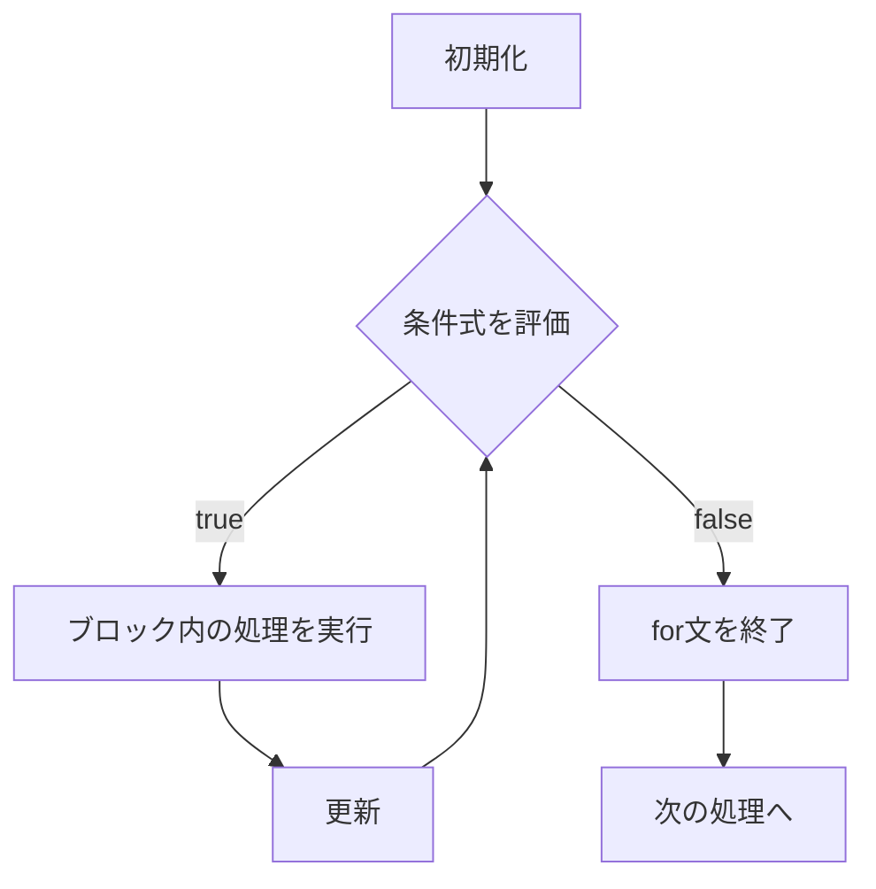
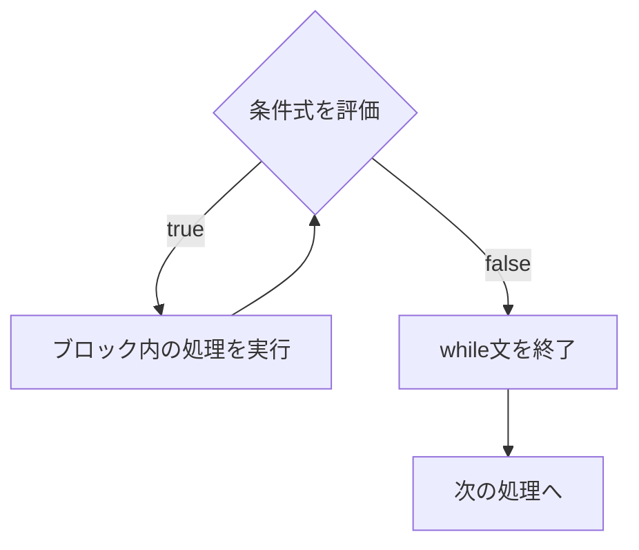

import { OneCompilerCodeBlock } from "@site/src/components/OneCompilerCodeBlock";

# 繰り返し

この章では、プログラムで **同じ処理を繰り返す** 方法を学ぶ。
繰り返し（ループ）を使うことで、効率的で柔軟なプログラムを作ることができる。

---

## 学習のゴール

- for文の基本的な書き方を理解している
- while文の使い方を理解している
- do-while文の使い方を理解している
- break文とcontinue文の違いを説明できる
- ネストしたループを理解している

---

## なぜこの技術が必要か

**ループがないとどうなるか？**

ループがないと、同じ処理を100回書く必要がある。
コードが長く、読みにくくなり、繰り返し回数が変わると全て書き直しが必要になる。

**例:**

```java
// ループがないと...
System.out.println("1回目");
System.out.println("2回目");
System.out.println("3回目");
// ... 100回書く必要がある

// ループがあると...
for (int i = 1; i <= 100; i++) {
    System.out.println(i + "回目");
}
```

ループを使うことで、少ないコードで多くの処理を効率的に実行できる。

---

## 1. for文の基礎

### for文とは

**for文** は、決まった回数だけ処理を繰り返す構文である。

### 基本的な書き方

```java
for (初期化; 条件式; 更新) {
    // 繰り返し実行される処理
}
```

- **初期化**：カウンタ変数の初期値を設定（例：`int i = 0`）
- **条件式**：繰り返しを続ける条件（例：`i < 10`）
- **更新**：カウンタ変数の値を変更（例：`i++`）

### 処理の流れ



### 実例

```java
for (int i = 0; i < 5; i++) {
    System.out.println(i);
}
```

**動作の流れ：**
1. `i = 0`（初期化）
2. `i < 5`が真か？（Yes）→ `0`を出力
3. `i++`（iが1になる）
4. `i < 5`が真か？（Yes）→ `1`を出力
5. `i++`（iが2になる）
6. 繰り返す...
7. `i < 5`が偽（i=5）→ ループ終了

:::info 【共通】
for文は、ほとんどのプログラミング言語で共通である。
:::

**実行してみよう:**

<OneCompilerCodeBlock
  language="java"
  code={`public class ForExample {
    public static void main(String[] args) {
        // 基本的なfor文
        for (int i = 0; i < 5; i++) {
            System.out.println("i = " + i);
        }

        System.out.println("---");

        // 10から1までカウントダウン
        for (int i = 10; i >= 1; i--) {
            System.out.println(i);
        }

        System.out.println("発射！");

        System.out.println("---");

        // 2ずつ増やす
        for (int i = 0; i <= 10; i += 2) {
            System.out.println(i);
        }
    }
}`}
/>

**やってみよう:**
- `i < 5`を`i < 10`に変えて実行してみよう
- `i++`を`i += 3`に変えて、3ずつ増やしてみよう

---

## 2. while文

### while文とは

**while文** は、条件が真の間、処理を繰り返す構文である。
繰り返し回数が事前に分からない場合に使う。

### 基本的な書き方

```java
while (条件式) {
    // 繰り返し実行される処理
}
```

### for文との違い

- **for文**：繰り返し回数が決まっている場合に使う
- **while文**：条件が成立する間繰り返す場合に使う

### 処理の流れ



:::warning 注意：無限ループ
条件式が常に真の場合、ループが終わらない **無限ループ** になる。
プログラムが止まらなくなるので注意が必要である。
:::

**実行してみよう:**

<OneCompilerCodeBlock
  language="java"
  code={`public class WhileExample {
    public static void main(String[] args) {
        // 基本的なwhile文
        int i = 0;
        while (i < 5) {
            System.out.println("i = " + i);
            i++;
        }

        System.out.println("---");

        // カウントダウン
        int count = 3;
        while (count > 0) {
            System.out.println(count);
            count--;
        }
        System.out.println("発射！");

        System.out.println("---");

        // 条件が満たされるまで繰り返す
        int num = 1;
        while (num < 100) {
            System.out.println(num);
            num *= 2;  // 2倍にする
        }
    }
}`}
/>

**やってみよう:**
- `i < 5`を`i < 10`に変えて実行してみよう
- `num *= 2`を`num *= 3`に変えて、3倍ずつ増やしてみよう

:::info 【共通】
while文は、ほとんどのプログラミング言語で共通である。
:::

---

## 3. do-while文

### do-while文とは

**do-while文** は、**最低1回は必ず実行される** while文である。

### 基本的な書き方

```java
do {
    // 繰り返し実行される処理
} while (条件式);
```

:::caution 重要
do-while文は、**条件式の判定が後**（処理の後）なので、最低1回は実行される。
:::

### while文との違い

| while文 | do-while文 |
|---------|------------|
| 条件を **先に** 判定 | 条件を **後で** 判定 |
| 条件が最初から偽なら、1回も実行されない | 条件が最初から偽でも、1回は実行される |

**実行してみよう:**

<OneCompilerCodeBlock
  language="java"
  code={`public class DoWhileExample {
    public static void main(String[] args) {
        // while文の例（条件が最初から偽）
        System.out.println("while文:");
        int i = 10;
        while (i < 5) {
            System.out.println("i = " + i);
            i++;
        }
        System.out.println("while文は1回も実行されませんでした");

        System.out.println("---");

        // do-while文の例（条件が最初から偽）
        System.out.println("do-while文:");
        int j = 10;
        do {
            System.out.println("j = " + j);
            j++;
        } while (j < 5);
        System.out.println("do-while文は1回実行されました");

        System.out.println("---");

        // 実践例：ユーザー入力のシミュレーション
        int input = 0;
        int attempt = 0;
        do {
            attempt++;
            System.out.println(attempt + "回目の入力を処理中...");
            input = attempt * 3;  // 入力のシミュレーション
        } while (input < 10);
        System.out.println("入力値が10以上になりました: " + input);
    }
}`}
/>

**やってみよう:**
- while文とdo-while文の違いを確認してみよう

:::info 【共通】
do-while文は、多くのプログラミング言語で共通である。
:::

---

## 4. break文とcontinue文

### break文：ループを抜ける

**break文** は、ループを **途中で抜ける** ための命令である。

```java
for (int i = 0; i < 10; i++) {
    if (i == 5) {
        break;  // i が 5 になったらループを抜ける
    }
    System.out.println(i);
}
// 0, 1, 2, 3, 4 が出力される
```

### continue文：次の繰り返しへ

**continue文** は、現在の繰り返しをスキップして、**次の繰り返しへ進む** 命令である。

```java
for (int i = 0; i < 10; i++) {
    if (i % 2 == 0) {
        continue;  // 偶数はスキップ
    }
    System.out.println(i);
}
// 1, 3, 5, 7, 9 が出力される（奇数のみ）
```

### breakとcontinueの違い

| break | continue |
|-------|----------|
| ループを **抜ける** | 現在の繰り返しを **スキップ** して次へ |
| ループ自体が終了 | ループは続く |

**実行してみよう:**

<OneCompilerCodeBlock
  language="java"
  code={`public class BreakContinueExample {
    public static void main(String[] args) {
        // break文の例
        System.out.println("break文の例:");
        for (int i = 0; i < 10; i++) {
            if (i == 5) {
                System.out.println("i が 5 になったのでループを抜けます");
                break;
            }
            System.out.println(i);
        }

        System.out.println("---");

        // continue文の例
        System.out.println("continue文の例:");
        for (int i = 0; i < 10; i++) {
            if (i % 2 == 0) {
                continue;  // 偶数はスキップ
            }
            System.out.println(i + " は奇数です");
        }

        System.out.println("---");

        // 実践例：条件に合う値を探す
        System.out.println("100以下で7の倍数:");
        for (int i = 1; i <= 100; i++) {
            if (i % 7 != 0) {
                continue;  // 7の倍数でなければスキップ
            }
            System.out.print(i + " ");
        }
        System.out.println();
    }
}`}
/>

**やってみよう:**
- `if (i == 5)`を`if (i == 7)`に変えて、break文の動作を確認してみよう
- `i % 2 == 0`を`i % 3 == 0`に変えて、3の倍数をスキップしてみよう

:::info 【共通】
break文とcontinue文は、多くのプログラミング言語で共通である。
:::

---

## 5. ネストしたループ

### ループの中にループを入れる

**ネスト**（入れ子）とは、ループの中にさらにループを書くことである。

### 二重ループの例

```java
for (int i = 1; i <= 3; i++) {
    for (int j = 1; j <= 3; j++) {
        System.out.println("i=" + i + ", j=" + j);
    }
}
```

**動作：**
- 外側のループ（i）が1回実行されるごとに、内側のループ（j）が3回実行される
- 合計で 3 × 3 = 9 回出力される

### 実践例：九九の表

二重ループを使えば、九九の表を簡単に作成できる。

**実行してみよう:**

<OneCompilerCodeBlock
  language="java"
  code={`public class NestedLoopExample {
    public static void main(String[] args) {
        // 基本的な二重ループ
        System.out.println("二重ループの例:");
        for (int i = 1; i <= 3; i++) {
            for (int j = 1; j <= 3; j++) {
                System.out.println("i=" + i + ", j=" + j);
            }
        }

        System.out.println("---");

        // 九九の表
        System.out.println("九九の表:");
        for (int i = 1; i <= 9; i++) {
            for (int j = 1; j <= 9; j++) {
                System.out.print(i * j + "\\t");
            }
            System.out.println();  // 行の終わりで改行
        }

        System.out.println("---");

        // 三角形を描く
        System.out.println("三角形:");
        for (int i = 1; i <= 5; i++) {
            for (int j = 1; j <= i; j++) {
                System.out.print("*");
            }
            System.out.println();
        }
    }
}`}
/>

**やってみよう:**
- 九九の表を5×5に変えてみよう
- 三角形の大きさを変えてみよう（`i <= 5`を`i <= 10`に変更）

:::tip ポイント
ネストしたループは、表やパターンを作成するときに便利である。
ただし、ループの階層が深くなりすぎると、処理が遅くなったり、コードが読みにくくなったりする。
:::

---

## まとめ

この章では、Javaの **繰り返し** について学んだ。

### 学んだ内容

- **for文** で決まった回数だけ処理を繰り返せる
- **while文** で条件が成立する間繰り返せる
- **do-while文** で最低1回は必ず実行される繰り返しができる
- **break文** でループを途中で抜けられる
- **continue文** で現在の繰り返しをスキップできる
- **ネストしたループ** で複雑なパターンを作成できる

### 次のステップ

次の章では、**配列** について学ぶ。
配列とループを組み合わせることで、大量のデータを効率的に処理できるようになる。

---

## 演習

未作成
