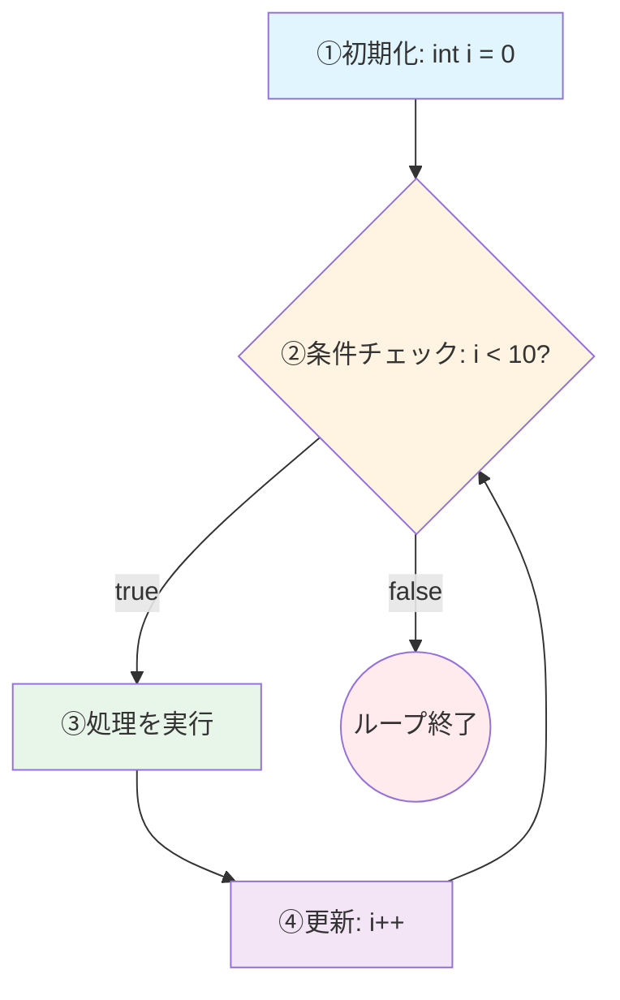
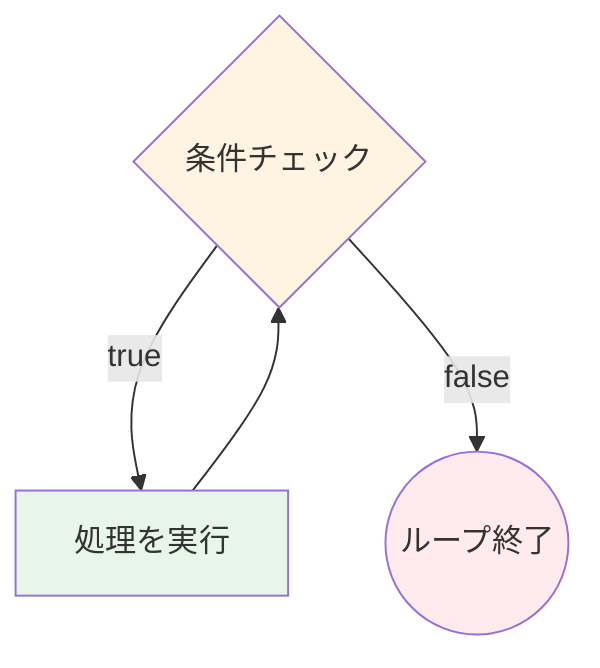

import { OneCompilerCodeBlock } from "@site/src/components/OneCompilerCodeBlock";

# 繰り返し

この章で得られるスキル：
- ✅ 同じ処理を効率的に繰り返すプログラムが書ける
- ✅ for文とwhile文を使い分けられる
- ✅ ループの途中で抜ける・スキップする処理が実装できる
- ✅ 実務でよく使うループのパターンを理解できる

---

## Step 0: まず体験してみよう

説明の前に、まず **繰り返しがないと何が困るのか** を体験しよう。

### シナリオ：ゲームのスコアボードを作りたい

あなたはゲームアプリを作っている。プレイヤー10人のスコアを表示したい。

**実行してみよう（繰り返しなし）:**

<OneCompilerCodeBlock
  language="java"
  code={`public class Main {
    public static void main(String[] args) {
        // プレイヤー10人のスコアを表示したい
        // でも、繰り返しがないと...

        System.out.println("プレイヤー1: 1200点");
        System.out.println("プレイヤー2: 850点");
        System.out.println("プレイヤー3: 1500点");
        System.out.println("プレイヤー4: 920点");
        System.out.println("プレイヤー5: 1100点");
        // ... あと5人分書く必要がある

        // もし100人になったら？1000人になったら？
        // コードが膨大になってしまう...
    }
}`}
/>

**問題点：**
- 10人分のコードを手作業で書く必要がある
- 100人になったら100行書く必要がある
- プレイヤー数が変わるたびに、コードを書き直す必要がある
- 途中で表示形式を変えたくなったら、全行修正が必要

**では、繰り返しを使うとどうなるか？**

<OneCompilerCodeBlock
  language="java"
  code={`public class Main {
    public static void main(String[] args) {
        // 繰り返しを使うと、わずか3行で完成！
        for (int i = 1; i <= 10; i++) {
            System.out.println("プレイヤー" + i + ": " + (i * 100) + "点");
        }

        // 100人に増えても、10を100に変えるだけ！
    }
}`}
/>

**解決できたこと：**
- ✅ わずか3行で10人分の処理が完成
- ✅ 人数が変わっても、数字を1つ変えるだけ
- ✅ 表示形式を変えても、1箇所直せばOK

---

## Step 1: for文の基本を理解する

**for文** は、**決まった回数だけ処理を繰り返す** ための構文である。

### 書き方

```java
for (初期化; 条件式; 更新) {
    // 繰り返したい処理
}
```

### 3つの部分の役割

| 部分 | 役割 | 例 |
|------|------|-----|
| **初期化** | カウンタ変数の初期値を設定 | `int i = 0` |
| **条件式** | 繰り返しを続ける条件 | `i < 10` |
| **更新** | カウンタ変数をどう変化させるか | `i++` |

### 処理の流れ



**実行してみよう:**

<OneCompilerCodeBlock
  language="java"
  code={`public class Main {
    public static void main(String[] args) {
        // 基本的なfor文
        System.out.println("0から4まで表示:");
        for (int i = 0; i < 5; i++) {
            System.out.println(i);
        }

        System.out.println("---");

        // 1から5まで表示
        System.out.println("1から5まで表示:");
        for (int i = 1; i <= 5; i++) {
            System.out.println(i);
        }
    }
}`}
/>

**やってみよう:**
- `i < 5`を`i < 10`に変えて、0から9まで表示してみよう
- `i++`を`i += 2`に変えて、2ずつ増やしてみよう

:::tip ポイント
`i++`は「iを1増やす」という意味。`i += 2`は「iを2増やす」、`i += 3`は「iを3増やす」という意味である。
:::

---

## Step 2: for文のバリエーション

### カウントダウンも簡単

<OneCompilerCodeBlock
  language="java"
  code={`public class Main {
    public static void main(String[] args) {
        // ロケット発射のカウントダウン
        System.out.println("ロケット発射まで:");
        for (int i = 10; i >= 1; i--) {
            System.out.println(i);
        }
        System.out.println("発射！🚀");

        System.out.println("---");

        // 偶数だけ表示
        System.out.println("0から10までの偶数:");
        for (int i = 0; i <= 10; i += 2) {
            System.out.print(i + " ");
        }
        System.out.println();
    }
}`}
/>

**やってみよう:**
- `i--`を使ってカウントダウンの開始数を変えてみよう
- `i += 3`に変えて、3の倍数を表示してみよう

---

## Step 3: while文を理解する

**while文** は、**条件が成立する間、処理を繰り返す** ための構文である。
繰り返し回数が事前に分からない場合に使う。

### 書き方

```java
while (条件式) {
    // 繰り返したい処理
}
```

### 処理の流れ



### for文との使い分け

| for文 | while文 |
|-------|---------|
| 繰り返し回数が **決まっている** | 繰り返し回数が **不明** |
| 「10回繰り返す」 | 「条件を満たすまで繰り返す」 |

**実行してみよう:**

<OneCompilerCodeBlock
  language="java"
  code={`public class Main {
    public static void main(String[] args) {
        // 基本的なwhile文
        System.out.println("0から4まで表示:");
        int i = 0;
        while (i < 5) {
            System.out.println(i);
            i++;  // これを忘れると無限ループ！
        }

        System.out.println("---");

        // 実用例：2倍ずつ増やして100を超えるまで
        System.out.println("2倍ずつ増やす:");
        int num = 1;
        while (num <= 100) {
            System.out.println(num);
            num *= 2;  // 2倍にする
        }
    }
}`}
/>

**やってみよう:**
- `i++`の行をコメントアウト（`//`を前に付ける）して実行してみよう → 無限ループになる（ブラウザが重くなるので注意！）
- `num *= 3`に変えて、3倍ずつ増やしてみよう

:::warning 注意：無限ループ
while文では、**条件式を更新する処理を忘れる**と、条件が永遠に成立してしまい、プログラムが止まらなくなる。
これを **無限ループ** という。開発中は注意が必要である。
:::

---

## Step 4: while文の実践例

### シナリオ：パスワード試行回数の制限

実務では、「3回まで試行可能」などの制限をかける場面がよくある。

<OneCompilerCodeBlock
  language="java"
  code={`public class Main {
    public static void main(String[] args) {
        // パスワード試行のシミュレーション
        String correctPassword = "java123";
        String[] attempts = {"password", "12345", "java123"};  // 試行するパスワード（配列は後の章で学ぶ）

        int attemptCount = 0;
        int maxAttempts = 3;
        boolean isAuthenticated = false;

        System.out.println("パスワード認証システム（最大" + maxAttempts + "回まで）");
        System.out.println("---");

        while (attemptCount < maxAttempts && !isAuthenticated) {
            String inputPassword = attempts[attemptCount];  // 配列から取得
            attemptCount++;

            System.out.println(attemptCount + "回目の試行: " + inputPassword);

            if (inputPassword.equals(correctPassword)) {
                isAuthenticated = true;
                System.out.println("✅ 認証成功！");
            } else {
                System.out.println("❌ パスワードが違います");
                int remaining = maxAttempts - attemptCount;
                if (remaining > 0) {
                    System.out.println("残り試行回数: " + remaining);
                }
            }
            System.out.println();
        }

        if (!isAuthenticated) {
            System.out.println("🚫 試行回数の上限に達しました。アカウントをロックします。");
        }
    }
}`}
/>

**このコードで学べること:**
- while文で「最大3回まで」の制限を実装
- `&&`で複数の条件を組み合わせ
- 実務でよくある「試行回数制限」のパターン

---

## Step 5: do-while文を理解する

**do-while文** は、**最低1回は必ず実行される** while文である。

### 書き方

```java
do {
    // 繰り返したい処理
} while (条件式);
```

### while文との違い

| while文 | do-while文 |
|---------|-------------|
| 条件を **先に** 判定 | 条件を **後で** 判定 |
| 条件が最初から偽なら、1回も実行されない | 条件が最初から偽でも、**1回は実行される** |

**実行してみよう:**

<OneCompilerCodeBlock
  language="java"
  code={`public class Main {
    public static void main(String[] args) {
        // while文（条件が最初から偽）
        System.out.println("【while文】");
        int i = 10;
        while (i < 5) {
            System.out.println("i = " + i);
            i++;
        }
        System.out.println("→ while文は1回も実行されませんでした");

        System.out.println("---");

        // do-while文（条件が最初から偽）
        System.out.println("【do-while文】");
        int j = 10;
        do {
            System.out.println("j = " + j);
            j++;
        } while (j < 5);
        System.out.println("→ do-while文は1回実行されました");

        System.out.println("---");

        // 実用例：メニュー表示（最低1回は表示したい）
        System.out.println("【実用例：メニュー表示】");
        int choice = 0;
        int count = 0;
        do {
            count++;
            System.out.println(count + "回目のメニュー表示");
            System.out.println("1. 新規作成");
            System.out.println("2. 開く");
            System.out.println("3. 終了");
            choice = (count == 2) ? 3 : 0;  // 2回目で終了を選択
            System.out.println("選択: " + choice);
            System.out.println();
        } while (choice != 3);
        System.out.println("プログラムを終了します");
    }
}`}
/>

**やってみよう:**
- while文とdo-while文の出力の違いを確認してみよう

:::tip ポイント
do-while文は、**「メニューを最低1回は表示したい」** などの場面で使われる。
実務ではwhile文の方がよく使われるが、do-while文の存在は知っておこう。
:::

---

## Step 6: break文とcontinue文

### break文：ループを途中で抜ける

**break文** は、ループを **途中で強制的に終了** する命令である。

```java
for (int i = 0; i < 10; i++) {
    if (i == 5) {
        break;  // i が 5 になったらループを抜ける
    }
    System.out.println(i);
}
// 出力: 0, 1, 2, 3, 4（5以降は実行されない）
```

### continue文：現在の繰り返しをスキップ

**continue文** は、現在の繰り返しを **スキップして次へ進む** 命令である。

```java
for (int i = 0; i < 10; i++) {
    if (i % 2 == 0) {
        continue;  // 偶数はスキップ
    }
    System.out.println(i);
}
// 出力: 1, 3, 5, 7, 9（奇数のみ）
```

### 違いを図で理解

| break | continue |
|-------|----------|
| ループを **抜ける** | 現在の繰り返しを **スキップ** |
| ループ自体が終了 | ループは続く（次の繰り返しへ） |

**実行してみよう:**

<OneCompilerCodeBlock
  language="java"
  code={`public class Main {
    public static void main(String[] args) {
        // break文の例
        System.out.println("【break文】");
        for (int i = 0; i < 10; i++) {
            if (i == 5) {
                System.out.println("→ i が 5 になったのでループを終了");
                break;
            }
            System.out.println(i);
        }

        System.out.println("---");

        // continue文の例
        System.out.println("【continue文】");
        for (int i = 0; i < 10; i++) {
            if (i % 2 == 0) {
                continue;  // 偶数はスキップ
            }
            System.out.println(i + " は奇数です");
        }

        System.out.println("---");

        // 実用例：条件に合う値を探す
        System.out.println("【実用例：条件に合う値を探す】");
        System.out.println("1から100までで、最初に見つかる「7の倍数かつ偶数」:");
        for (int i = 1; i <= 100; i++) {
            if (i % 7 != 0) {
                continue;  // 7の倍数でなければスキップ
            }
            if (i % 2 != 0) {
                continue;  // 奇数ならスキップ
            }
            System.out.println("見つかりました: " + i);
            break;  // 最初の1つが見つかったら終了
        }
    }
}`}
/>

**やってみよう:**
- `if (i == 5)`を`if (i == 7)`に変えて、breakの動作を確認してみよう
- `i % 2 == 0`を`i % 3 == 0`に変えて、3の倍数をスキップしてみよう

---

## Step 7: ネストしたループ（二重ループ）

**ネスト**（入れ子）とは、ループの中にさらにループを書くことである。

### 基本的な二重ループ

```java
for (int i = 1; i <= 3; i++) {
    for (int j = 1; j <= 3; j++) {
        System.out.println("i=" + i + ", j=" + j);
    }
}
```

**動作：**
- 外側のループ（i）が1回実行されるごとに、内側のループ（j）が3回実行される
- 合計で 3 × 3 = 9 回出力される

### 実用例

**実行してみよう:**

<OneCompilerCodeBlock
  language="java"
  code={`public class Main {
    public static void main(String[] args) {
        // 基本的な二重ループ
        System.out.println("【基本的な二重ループ】");
        for (int i = 1; i <= 3; i++) {
            System.out.print("外側 i=" + i + " → 内側: ");
            for (int j = 1; j <= 3; j++) {
                System.out.print("j=" + j + " ");
            }
            System.out.println();
        }

        System.out.println("---");

        // 実用例1：九九の表
        System.out.println("【九九の表】");
        for (int i = 1; i <= 9; i++) {
            for (int j = 1; j <= 9; j++) {
                System.out.print((i * j) + "\\t");
            }
            System.out.println();
        }

        System.out.println("---");

        // 実用例2：座席表の生成
        System.out.println("【座席表（3行5列）】");
        for (int row = 1; row <= 3; row++) {
            System.out.print(row + "行目: ");
            for (int col = 1; col <= 5; col++) {
                System.out.print("[" + row + "-" + col + "] ");
            }
            System.out.println();
        }

        System.out.println("---");

        // 実用例3：三角形を描く
        System.out.println("【三角形】");
        for (int i = 1; i <= 5; i++) {
            for (int j = 1; j <= i; j++) {
                System.out.print("*");
            }
            System.out.println();
        }
    }
}`}
/>

**やってみよう:**
- 九九の表を5×5に変えてみよう（`i <= 5`、`j <= 5`）
- 三角形の大きさを変えてみよう（`i <= 10`）
- 逆三角形を作ってみよう（`j <= 6 - i`）

:::tip ポイント
ネストしたループは、**表やパターンを作成するとき**に便利である。
ただし、ループの階層が深くなりすぎると、処理が遅くなったり、コードが読みにくくなったりするので注意。
:::

---

## Step 8: 実践課題

これまで学んだことを組み合わせて、実践的なプログラムを作ってみよう。

### 課題1：FizzBuzz

**仕様：**
- 1から100までの数を表示する
- 3の倍数のときは「Fizz」
- 5の倍数のときは「Buzz」
- 15の倍数のときは「FizzBuzz」

<OneCompilerCodeBlock
  language="java"
  code={`public class Main {
    public static void main(String[] args) {
        System.out.println("FizzBuzz（1〜30）:");
        for (int i = 1; i <= 30; i++) {
            if (i % 15 == 0) {
                System.out.println("FizzBuzz");
            } else if (i % 3 == 0) {
                System.out.println("Fizz");
            } else if (i % 5 == 0) {
                System.out.println("Buzz");
            } else {
                System.out.println(i);
            }
        }
    }
}`}
/>

**やってみよう:**
- 100まで表示してみよう（`i <= 100`）

---

### 課題2：合計と平均の計算

**仕様：**
- 1から100までの合計を計算する
- 平均を計算する

<OneCompilerCodeBlock
  language="java"
  code={`public class Main {
    public static void main(String[] args) {
        int sum = 0;
        int count = 0;

        for (int i = 1; i <= 100; i++) {
            sum += i;  // sumにiを加算
            count++;
        }

        double average = (double) sum / count;

        System.out.println("1から100までの合計: " + sum);
        System.out.println("平均: " + average);
    }
}`}
/>

**やってみよう:**
- 1から1000までの合計を計算してみよう
- 偶数だけの合計を計算してみよう（`if (i % 2 == 0)`を使う）

---

### 課題3：パターン描画

**仕様：**
- 以下のようなパターンを描く

```
    *
   ***
  *****
 *******
*********
```

<OneCompilerCodeBlock
  language="java"
  code={`public class Main {
    public static void main(String[] args) {
        int height = 5;

        for (int i = 1; i <= height; i++) {
            // 空白を表示
            for (int j = 1; j <= height - i; j++) {
                System.out.print(" ");
            }
            // アスタリスクを表示
            for (int j = 1; j <= 2 * i - 1; j++) {
                System.out.print("*");
            }
            System.out.println();
        }
    }
}`}
/>

**やってみよう:**
- `height`を変えて、大きさを変えてみよう

---

## まとめ

この章では、Javaの **繰り返し** について学んだ。

### 🎯 達成できたこと

- ✅ for文で決まった回数の処理を効率的に書けるようになった
- ✅ while文で条件による繰り返しが実装できるようになった
- ✅ break/continueでループを制御できるようになった
- ✅ 二重ループで複雑なパターンが作れるようになった

### 📚 学んだ内容

| 構文 | 使い方 | 使い分け |
|------|--------|----------|
| **for文** | 決まった回数繰り返す | 繰り返し回数が明確なとき |
| **while文** | 条件を満たす間繰り返す | 繰り返し回数が不明なとき |
| **do-while文** | 最低1回は実行する | 最低1回の実行が必要なとき |
| **break** | ループを途中で抜ける | 条件を満たしたら即終了 |
| **continue** | 現在の繰り返しをスキップ | 特定の条件をスキップ |

### 🚀 次のステップ

次の章では、**配列** について学ぶ。
配列とループを組み合わせることで、大量のデータを効率的に処理できるようになる。

---

## 💡 よくある質問

### Q1: for文とwhile文、どっちを使えばいい？

**A:** 繰り返し回数が **決まっている** ならfor文、**条件による** ならwhile文を使う。

- ✅ for文：「10回繰り返す」「1から100まで」
- ✅ while文：「ユーザーが終了を選ぶまで」「条件を満たすまで」

### Q2: 無限ループになったらどうすればいい？

**A:** ブラウザのタブを閉じるか、ページをリロードする。
開発中は、**条件式が必ず偽になるか**、**カウンタ変数を更新しているか** を確認しよう。

### Q3: i++と++i、どっちを使えばいい？

**A:** for文の更新部分では、どちらでも同じ結果になる。
慣習として`i++`を使うことが多い。

```java
for (int i = 0; i < 10; i++)   // ✅ よく使われる
for (int i = 0; i < 10; ++i)   // ✅ これでも同じ
```

### Q4: ネストしたループで、外側のループを抜けるには？

**A:** `break`は最も内側のループしか抜けない。外側のループも抜けたい場合は、以下の方法がある：

- **方法1：** フラグ変数を使う
- **方法2：** ラベル付きbreakを使う（`break outerLoop;`）
- **方法3：** メソッドに分割してreturnを使う（第7章で学ぶ）

### Q5: for文の初期化で、なぜ int i = 0 から始めることが多いの？

**A:** プログラミングの世界では、**0から数え始める** 慣習がある。
配列（次の章）やリストのインデックスが0から始まるため、for文も0から始めることが多い。
ただし、「1から10まで」のように自然な数え方をする場合は、`int i = 1`から始めても問題ない。
