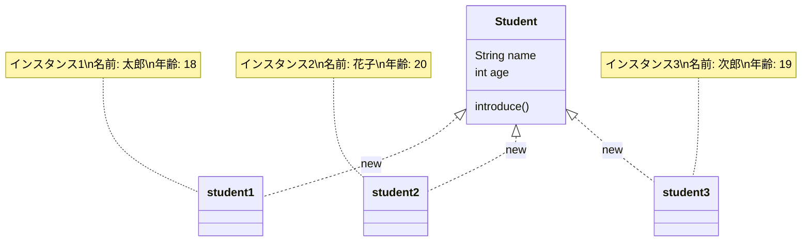

# オブジェクト指向の基礎

import { OneCompilerCodeBlock } from "@site/src/components/OneCompilerCodeBlock";

この章では、プログラミングにおける重要な考え方である **オブジェクト指向** について学ぶ。
オブジェクト指向は、**データと処理をまとめて管理する設計思想** であり、現代のプログラミングの基盤となっている。

---

## 初学者への励まし

この章は、**初学者にとって最初の鬼門** である。オブジェクト指向は、プログラミングを学ぶ上で避けて通れない重要な概念だが、
最初は難しく感じるのが普通である。

### オブジェクト指向が難しい理由

1. **用語が聞き慣れない**：クラス、インスタンス、フィールド、メソッド、カプセル化、継承など、初めて聞く言葉ばかり
2. **概念的で抽象的**：目に見えないものをイメージする必要がある
3. **今まで学んだこととの違い**：変数や条件分岐は「手順」だったが、オブジェクト指向は「設計」の話

### 学習のコツ

1. **まずは用語に慣れる**：完璧に理解しようとせず、何度も読んで用語に慣れることから始める
2. **具体例で考える**：「車」「犬」など、身近なものに置き換えて考える
3. **繰り返し学習**：1回で理解できなくても大丈夫。繰り返し読んで、少しずつ理解を深めていく

:::tip 重要
オブジェクト指向は、すぐに理解できなくても、コードを書いているうちに自然と身についてくる。
焦らず、じっくり学んでいこう。
:::

---

## Step 0: オブジェクト指向がないとどうなる？

まず、オブジェクト指向を使わずにプログラムを書いてみよう。

### 問題シナリオ：3人の学生を管理する

3人の学生（太郎、花子、次郎）の名前と年齢を管理し、全員の情報を表示したいとする。

**オブジェクト指向を使わない場合：**

<OneCompilerCodeBlock
  language="java"
  code={`public class Main {
    public static void main(String[] args) {
        // 太郎のデータ
        String name1 = "太郎";
        int age1 = 18;

        // 花子のデータ
        String name2 = "花子";
        int age2 = 20;

        // 次郎のデータ
        String name3 = "次郎";
        int age3 = 19;

        // 全員の情報を表示
        System.out.println(name1 + "は" + age1 + "歳です");
        System.out.println(name2 + "は" + age2 + "歳です");
        System.out.println(name3 + "は" + age3 + "歳です");
    }
}`}
/>

### 問題点

このコードには、いくつかの深刻な問題がある：

**1. データがバラバラ**

- `name1`と`age1`が同じ「太郎」に関連するデータだが、その関連性がコードから読み取りにくい
- 変数が増えると、どの名前とどの年齢が対応するのか分からなくなる

**2. スケールしない**

- 学生が10人、100人になったら、`name1`〜`name100`、`age1`〜`age100`を個別に管理する必要がある
- 変数が爆発的に増える

**3. 処理を追加しにくい**

- 「自己紹介する」などの処理を追加したい場合、同じコードを3回書く必要がある：
  ```java
  System.out.println("私の名前は" + name1 + "で、" + age1 + "歳です");
  System.out.println("私の名前は" + name2 + "で、" + age2 + "歳です");
  System.out.println("私の名前は" + name3 + "で、" + age3 + "歳です");
  ```

**4. 配列でも限界がある**

配列を使えば少しマシになるが、それでも名前と年齢を別々の配列で管理する必要がある：

<OneCompilerCodeBlock
  language="java"
  code={`public class Main {
    public static void main(String[] args) {
        String[] names = {"太郎", "花子", "次郎"};
        int[] ages = {18, 20, 19};

        for (int i = 0; i < names.length; i++) {
            System.out.println(names[i] + "は" + ages[i] + "歳です");
        }
    }
}`}
/>

これでも問題は残る：

- `names[i]`と`ages[i]`の対応関係が暗黙的（インデックスが一致していることを前提とする）
- データが増えると配列が増える（名前、年齢、住所、電話番号...）
- 処理（自己紹介、誕生日など）をどこに書けばよいのか不明確

### 本質的な課題

**関連するデータと処理をまとめる仕組みがない。**

- 「太郎」というデータと「自己紹介する」という処理は密接に関連している
- しかし、バラバラに定義されているため、管理が煩雑

ではどうすれば良いのか？

---

## Step 1: オブジェクト指向という解決策

### オブジェクト指向とは

**オブジェクト指向** は、**「もの」を中心にプログラムを設計する考え方** である。

**「もの」とは**：

- 関連するデータ（属性）と処理（振る舞い）をまとめたもの
- 例：「学生」というもの
  - データ：名前、年齢
  - 処理：自己紹介する、誕生日を迎える

### 手続き型との違い

| 比較項目 | 手続き型 | オブジェクト指向 |
|---------|---------|------------------|
| **考え方** | 「何をするか」（処理の手順）中心 | 「何があるか」（ものとその性質・振る舞い）中心 |
| **データと処理** | バラバラに定義 | まとめて定義 |
| **例** | `name1`, `age1`, `printInfo(name, age)` | `Student`に`name`, `age`, `introduce()`をまとめる |

### 現実世界の例：車

**手続き型の考え方**（処理中心）：
1. エンジンをかける
2. アクセルを踏む
3. ブレーキを踏む

**オブジェクト指向の考え方**（もの中心）：
- **車** というもの（オブジェクト）がある
- 車は **色、速度** などの性質（データ）を持つ
- 車は **発進する、停止する** などの振る舞い（処理）を持つ

:::info ポイント
オブジェクト指向では、「もの」を単位として、データと処理をまとめて考える。
:::

### オブジェクト指向の3つの利点

1. **データと処理の関連性が明確**：`Student`クラスに`name`と`introduce()`がまとまっているため、関連性が一目瞭然
2. **スケーラビリティ**：学生が何人になっても、`Student`の配列やリストで管理できる
3. **再利用性**：一度`Student`クラスを定義すれば、何度でも使える

### オブジェクト指向の用語整理

この章で登場する重要な用語を整理しておこう。最初は用語に慣れることが大切である。

| 用語 | 意味 | 例 |
|------|------|-----|
| **クラス** | オブジェクトの設計図 | `Student`クラス（学生の設計図） |
| **オブジェクト** | 「もの」そのもの、データと処理のまとまり | 学生、車、商品など |
| **インスタンス** | クラスから生成された実体 | `new Student()`で作られた具体的な学生 |
| **フィールド** | クラスが持つデータ（変数） | `name`（名前）、`age`（年齢） |
| **インスタンスメソッド** | インスタンスが持つ処理（関数） | `introduce()`（自己紹介） |
| **staticメソッド** | クラスに属する処理、インスタンス不要 | `Math.abs()`、`main()` |
| **new** | クラスからインスタンスを生成するキーワード | `new Student()` |

:::tip ポイント
最初は用語を全て覚える必要はない。この章を読み進めながら、何度もこの表を見返して、徐々に慣れていこう。
:::

---

## Step 2: クラスとインスタンス

### クラスとは

**クラス** は、**オブジェクトの設計図** である。

### インスタンスとは

**インスタンス**（または **オブジェクト**）は、**設計図（クラス）から作られた実体** である。

### 例：クッキーの型と実際のクッキー

- **クラス**：クッキーの型（設計図）
- **インスタンス**：型を使って作った実際のクッキー（実体）

1つの型（クラス）から、たくさんのクッキー（インスタンス）を作ることができる。

### 図解



**図の見方：**
- **Student**（上）：クラス（設計図）
- **student1, student2, student3**（下）：`new`によって生成されたインスタンス（実体）
- 1つのクラスから複数のインスタンスを生成できる

:::note 用語
「オブジェクト」と「インスタンス」は、ほぼ同じ意味で使われる。
厳密には「クラスから生成された実体」を指すとき「インスタンス」という。
:::

---

## Step 3: クラスの定義とフィールド

### クラスの定義

Javaでクラスを定義する基本形は以下の通り：

```java
class クラス名 {
    // フィールド（データ）
    // メソッド（処理）
}
```

### Studentクラスの定義例

<OneCompilerCodeBlock
  language="java"
  code={`// Studentクラスの定義
class Student {
    String name;  // フィールド（名前）
    int age;      // フィールド（年齢）
}

public class Main {
    public static void main(String[] args) {
        // インスタンスを生成
        Student student1 = new Student();
        student1.name = "太郎";
        student1.age = 18;

        Student student2 = new Student();
        student2.name = "花子";
        student2.age = 20;

        // フィールドにアクセス
        System.out.println(student1.name + "は" + student1.age + "歳です");
        System.out.println(student2.name + "は" + student2.age + "歳です");
    }
}`}
/>

### フィールドとは

**フィールド** は、**クラスが持つデータ**（変数）である。
インスタンスごとに異なる値を持つことができる。

```java
class Student {
    String name;  // フィールド（名前）
    int age;      // フィールド（年齢）
}
```

### インスタンスごとに異なる値

```java
Student student1 = new Student();
student1.name = "太郎";
student1.age = 18;

Student student2 = new Student();
student2.name = "花子";
student2.age = 20;
```

- `student1`は「太郎、18歳」
- `student2`は「花子、20歳」

**それぞれのインスタンスが独立したデータを持つ。**

### フィールドへのアクセス

フィールドにアクセスするには、 **ドット記法** を使う：

```java
インスタンス名.フィールド名
```

例：
```java
student1.name  // student1のnameフィールド
student2.age   // student2のageフィールド
```

---

## Step 4: インスタンスメソッド

### インスタンスメソッドとは

**インスタンスメソッド** は、**インスタンスが持つ処理**（振る舞い）である。

### Studentクラスにメソッドを追加

<OneCompilerCodeBlock
  language="java"
  code={`class Student {
    String name;
    int age;

    // インスタンスメソッド
    void introduce() {
        System.out.println("私の名前は" + name + "で、" + age + "歳です");
    }

    void birthday() {
        age++;
        System.out.println("誕生日を迎えました。" + age + "歳になりました");
    }
}

public class Main {
    public static void main(String[] args) {
        // 太郎のインスタンス
        Student taro = new Student();
        taro.name = "太郎";
        taro.age = 18;
        taro.introduce();
        taro.birthday();

        System.out.println("---");

        // 花子のインスタンス
        Student hanako = new Student();
        hanako.name = "花子";
        hanako.age = 20;
        hanako.introduce();
    }
}`}
/>

### メソッド内でフィールドにアクセス

インスタンスメソッドの中では、 **そのインスタンスのフィールドに直接アクセスできる**：

```java
void introduce() {
    System.out.println("私の名前は" + name + "で、" + age + "歳です");
    // ↑ このnameとageは、呼び出したインスタンスのフィールド
}
```

- `taro.introduce()`を呼ぶと、`taro`の`name`と`age`が使われる
- `hanako.introduce()`を呼ぶと、`hanako`の`name`と`age`が使われる

### メソッドの呼び出し方

```java
インスタンス名.メソッド名()
```

例：
```java
taro.introduce();     // 太郎のintroduce()メソッドを呼ぶ
hanako.birthday();    // 花子のbirthday()メソッドを呼ぶ
```

---

## Step 5: staticメソッドとの違い

### staticメソッドとインスタンスメソッドの違い

| 比較項目 | staticメソッド | インスタンスメソッド |
|---------|---------------|---------------------|
| **定義** | `static`キーワードを付ける | `static`を付けない |
| **呼び出し方** | `クラス名.メソッド名()` | `インスタンス名.メソッド名()` |
| **インスタンス** | 不要 | 必要（`new`で生成） |
| **フィールドへのアクセス** | インスタンスのフィールドにアクセス不可 | インスタンスのフィールドにアクセス可能 |
| **例** | `Math.abs(-5)` | `student.introduce()` |

### 具体例

<OneCompilerCodeBlock
  language="java"
  code={`class MathUtils {
    // staticメソッド
    static int add(int a, int b) {
        return a + b;
    }
}

class Student {
    String name;

    // インスタンスメソッド
    void introduce() {
        System.out.println("私の名前は" + name + "です");
    }
}

public class Main {
    public static void main(String[] args) {
        // staticメソッド：クラス名.メソッド名()
        int result = MathUtils.add(10, 20);
        System.out.println("結果: " + result);

        // インスタンスメソッド：インスタンス名.メソッド名()
        Student student = new Student();
        student.name = "太郎";
        student.introduce();
    }
}`}
/>

### なぜstaticとインスタンスの2種類があるのか

**staticメソッド**：

- インスタンスに依存しない汎用的な処理に使う
- 例：`Math.abs()`、`Math.max()`、ユーティリティ関数

**インスタンスメソッド**：

- インスタンスのデータに依存する処理に使う
- 例：`student.introduce()`（特定の学生の名前を表示）

:::tip ポイント
`public static void main`の`static`は、「mainメソッドはインスタンスなしで呼び出される」という意味だった。
今後、クラスを設計するときは、インスタンスメソッドを使うことが多い。
:::

---

## Step 6: インスタンスの生成とnewキーワード

### newキーワード

**`new`キーワード** は、**クラスからインスタンスを生成する** ための命令である。

```java
Student student = new Student();
```

**処理の流れ：**
1. `new Student()`：Studentクラスのインスタンスを生成
2. `Student student`：生成したインスタンスを変数`student`に代入

### インスタンスは変数に代入され、変数の中に構造を持つ

**重要な理解ポイント：**
- **インスタンスは変数に代入できる**
- **変数の中にフィールド（データ）の構造を持つ**

```java
Student student = new Student();
student.name = "太郎";   // 変数studentの中のnameフィールドに値を設定
student.age = 18;        // 変数studentの中のageフィールドに値を設定
```

変数`student`は、単なる値ではなく、 **複数のフィールドを持つ構造** を格納している。
これが、オブジェクト指向プログラミングの核心である。

**図解：**
```
student（変数）
  ├─ name: "太郎"  （フィールド）
  ├─ age: 18       （フィールド）
  └─ introduce()   （メソッド）
```

1つの変数の中に、複数のデータと処理をまとめて管理できる。
これにより、関連するデータをバラバラに管理する必要がなくなる。

### 複数のインスタンス

1つのクラスから、複数のインスタンスを生成できる。
それぞれのインスタンスは、独立したデータを持つ。

<OneCompilerCodeBlock
  language="java"
  code={`class Student {
    String name;
    int age;

    void introduce() {
        System.out.println("私の名前は" + name + "で、" + age + "歳です");
    }
}

public class Main {
    public static void main(String[] args) {
        // 3人の学生インスタンスを生成
        Student student1 = new Student();
        student1.name = "太郎";
        student1.age = 18;

        Student student2 = new Student();
        student2.name = "花子";
        student2.age = 20;

        Student student3 = new Student();
        student3.name = "次郎";
        student3.age = 19;

        // それぞれが独立している
        student1.introduce();
        student2.introduce();
        student3.introduce();

        // student1の年齢を変更してもstudent2には影響しない
        student1.age = 19;
        System.out.println("\\n--- 太郎の年齢変更後 ---");
        student1.introduce();
        student2.introduce();
    }
}`}
/>

---

## Step 7: 配列とオブジェクト指向の組み合わせ

### 複数のインスタンスを配列で管理

Step 0で見た「配列でも限界がある」問題を、オブジェクト指向で解決しよう。

**オブジェクト指向を使わない場合**（Step 0の再掲）：

```java
String[] names = {"太郎", "花子", "次郎"};
int[] ages = {18, 20, 19};
// 名前と年齢が別々の配列 → 対応関係が暗黙的
```

**オブジェクト指向を使う場合**：

<OneCompilerCodeBlock
  language="java"
  code={`class Student {
    String name;
    int age;

    void introduce() {
        System.out.println("私の名前は" + name + "で、" + age + "歳です");
    }
}

public class Main {
    public static void main(String[] args) {
        // Student型の配列を作成
        Student[] students = new Student[3];

        // インスタンスを生成して配列に格納
        students[0] = new Student();
        students[0].name = "太郎";
        students[0].age = 18;

        students[1] = new Student();
        students[1].name = "花子";
        students[1].age = 20;

        students[2] = new Student();
        students[2].name = "次郎";
        students[2].age = 19;

        // ループで全員の自己紹介
        for (int i = 0; i < students.length; i++) {
            students[i].introduce();
        }

        System.out.println("\\n--- 拡張forループ ---");
        for (Student s : students) {
            s.introduce();
        }
    }
}`}
/>

### 利点

1. **データの関連性が明確**：`students[0]`に名前と年齢がまとまっている
2. **スケーラビリティ**：学生が何人になっても、配列のサイズを変えるだけ
3. **処理が簡潔**：`students[i].introduce()`でメソッドを呼べる

### データを追加しても影響が小さい

学生に「住所」フィールドを追加したいとしよう。

**オブジェクト指向を使わない場合**：

```java
String[] names = {"太郎", "花子", "次郎"};
int[] ages = {18, 20, 19};
String[] addresses = {"東京", "大阪", "福岡"};  // 新しい配列を追加
// 配列が3つになり、対応関係がますます複雑に
```

**オブジェクト指向を使う場合**：

```java
class Student {
    String name;
    int age;
    String address;  // フィールドを1行追加するだけ

    void introduce() {
        System.out.println("私の名前は" + name + "で、" + age + "歳、" + address + "在住です");
    }
}
```

クラス定義を変更するだけで、全てのインスタンスに変更が適用される。

---

## Step 8: 実践課題

ここまで学んだ知識を使って、以下の3つの課題に挑戦しよう。

### 課題1: Carクラスの作成

**要件**：
1. `Car`クラスを定義する
2. フィールド：`color`（String）、`speed`（int）
3. メソッド：
   - `start()`：速度を50に設定し、「〇〇の車が発進しました。速度: 50」と表示
   - `stop()`：速度を0に設定し、「〇〇の車が停止しました」と表示
   - `accelerate(int increase)`：速度を増加させ、「加速しました。現在の速度: 〇〇」と表示
4. 2台の車を作成し、それぞれ異なる操作をさせる

**ヒント**：
```java
Car car1 = new Car();
car1.color = "赤";
car1.speed = 0;
car1.start();
```

<details>
<summary>解答例を見る</summary>

<OneCompilerCodeBlock
  language="java"
  code={`class Car {
    String color;
    int speed;

    void start() {
        speed = 50;
        System.out.println(color + "の車が発進しました。速度: " + speed);
    }

    void stop() {
        speed = 0;
        System.out.println(color + "の車が停止しました");
    }

    void accelerate(int increase) {
        speed += increase;
        System.out.println("加速しました。現在の速度: " + speed);
    }
}

public class Main {
    public static void main(String[] args) {
        // 赤い車
        Car car1 = new Car();
        car1.color = "赤";
        car1.speed = 0;
        car1.start();
        car1.accelerate(30);
        car1.stop();

        System.out.println("---");

        // 青い車
        Car car2 = new Car();
        car2.color = "青";
        car2.speed = 0;
        car2.start();
        car2.accelerate(20);
        car2.accelerate(10);
        car2.stop();
    }
}`}
/>

</details>

---

### 課題2: Bookクラスの作成

**要件**：
1. `Book`クラスを定義する
2. フィールド：`title`（String）、`author`（String）、`price`（int）
3. メソッド：
   - `showInfo()`：「『〇〇』 著者: 〇〇, 価格: 〇〇円」と表示
   - `applyDiscount(int discountPercent)`：価格を指定した割引率で割引し、「〇〇%割引適用。新しい価格: 〇〇円」と表示
4. 3冊の本を配列で管理し、全ての本の情報を表示
5. 1冊目の本に30%割引を適用

**ヒント**：
```java
Book[] books = new Book[3];
books[0] = new Book();
books[0].title = "Javaの教科書";
```

<details>
<summary>解答例を見る</summary>

<OneCompilerCodeBlock
  language="java"
  code={`class Book {
    String title;
    String author;
    int price;

    void showInfo() {
        System.out.println("『" + title + "』 著者: " + author + ", 価格: " + price + "円");
    }

    void applyDiscount(int discountPercent) {
        price = price * (100 - discountPercent) / 100;
        System.out.println(discountPercent + "%割引適用。新しい価格: " + price + "円");
    }
}

public class Main {
    public static void main(String[] args) {
        // 3冊の本を配列で管理
        Book[] books = new Book[3];

        books[0] = new Book();
        books[0].title = "Javaの教科書";
        books[0].author = "山田太郎";
        books[0].price = 3000;

        books[1] = new Book();
        books[1].title = "データベース入門";
        books[1].author = "田中花子";
        books[1].price = 2500;

        books[2] = new Book();
        books[2].title = "Web開発の基礎";
        books[2].author = "佐藤次郎";
        books[2].price = 2800;

        // 全ての本の情報を表示
        System.out.println("--- 全ての本 ---");
        for (Book book : books) {
            book.showInfo();
        }

        // 1冊目の本に30%割引
        System.out.println("\\n--- 1冊目に割引適用 ---");
        books[0].applyDiscount(30);
        books[0].showInfo();
    }
}`}
/>

</details>

---

### 課題3: RPGのキャラクター管理

**要件**：
1. `Character`クラスを定義する
2. フィールド：`name`（String）、`hp`（int）、`attackPower`（int）
3. メソッド：
   - `showStatus()`：「〇〇 HP: 〇〇, 攻撃力: 〇〇」と表示
   - `attack(Character target)`：相手のHPを自分の攻撃力分減らし、「〇〇が〇〇を攻撃！ 〇〇のHPが〇〇減少」と表示
   - `isAlive()`：HPが0より大きければtrue、そうでなければfalseを返す
4. 2人のキャラクター（勇者とモンスター）を作成
5. 勇者がモンスターを攻撃し、モンスターが倒れるまで繰り返す

**ヒント**：
```java
void attack(Character target) {
    target.hp -= this.attackPower;
    System.out.println(this.name + "が" + target.name + "を攻撃！");
}
```

<details>
<summary>解答例を見る</summary>

<OneCompilerCodeBlock
  language="java"
  code={`class Character {
    String name;
    int hp;
    int attackPower;

    void showStatus() {
        System.out.println(name + " HP: " + hp + ", 攻撃力: " + attackPower);
    }

    void attack(Character target) {
        target.hp -= this.attackPower;
        System.out.println(this.name + "が" + target.name + "を攻撃！ " + target.name + "のHPが" + this.attackPower + "減少");
    }

    boolean isAlive() {
        return hp > 0;
    }
}

public class Main {
    public static void main(String[] args) {
        // 勇者を作成
        Character hero = new Character();
        hero.name = "勇者";
        hero.hp = 100;
        hero.attackPower = 25;

        // モンスターを作成
        Character monster = new Character();
        monster.name = "ドラゴン";
        monster.hp = 80;
        monster.attackPower = 20;

        System.out.println("--- 戦闘開始 ---");
        hero.showStatus();
        monster.showStatus();
        System.out.println();

        // 勇者がモンスターを倒すまで攻撃
        int turn = 1;
        while (monster.isAlive()) {
            System.out.println("【ターン" + turn + "】");
            hero.attack(monster);
            monster.showStatus();
            System.out.println();
            turn++;
        }

        System.out.println("--- 戦闘終了 ---");
        System.out.println(monster.name + "を倒した！");
    }
}`}
/>

</details>

---

## FAQ

### Q1: クラス名は何でも良いのか？

**A1:**

クラス名には **命名規則** がある：

1. **PascalCase（パスカルケース）**：各単語の頭文字を大文字にする
   - 良い例：`Student`, `Car`, `BookStore`
   - 悪い例：`student`, `car`, `bookstore`

2. **名詞を使う**：クラスは「もの」を表すため
   - 良い例：`User`, `Product`, `Order`
   - 悪い例：`Run`, `Calculate`（動詞は避ける）

3. **意味のある名前**：クラスの役割が分かる名前
   - 良い例：`ShoppingCart`, `CustomerAccount`
   - 悪い例：`Data`, `Object`, `Thing`

---

### Q2: フィールドを直接書き換えて良いのか？

**A2:**

この章では学習のため直接書き換えているが、**実務では推奨されない**。

**理由**：

- データの整合性が保てない（例：年齢に負の値を設定できてしまう）
- 外部から自由に変更できると、予期しないバグが発生する

**解決策（次章以降で学ぶ）**：

1. **カプセル化**：フィールドを`private`にし、外部から直接アクセスできなくする
2. **getter/setter**：メソッド経由でアクセスし、バリデーションを入れる

```java
class Student {
    private int age;  // privateにする

    public void setAge(int age) {
        if (age < 0) {
            System.out.println("年齢は0以上で設定してください");
            return;
        }
        this.age = age;
    }

    public int getAge() {
        return age;
    }
}
```

---

### Q3: staticメソッドからインスタンスメソッドを呼べるか？

**A3:**

**直接は呼べない。** インスタンスを経由すれば呼べる。

**エラーになる例**：

```java
class Student {
    String name;

    void introduce() {
        System.out.println("私の名前は" + name + "です");
    }

    public static void main(String[] args) {
        introduce();  // エラー！staticからインスタンスメソッドを直接呼べない
    }
}
```

**正しい方法**：

```java
class Student {
    String name;

    void introduce() {
        System.out.println("私の名前は" + name + "です");
    }

    public static void main(String[] args) {
        Student student = new Student();  // インスタンスを生成
        student.name = "太郎";
        student.introduce();  // インスタンス経由で呼ぶ（OK）
    }
}
```

**理由**：

staticメソッドはクラスに属し、特定のインスタンスに依存しない。
インスタンスメソッドは特定のインスタンスに属するため、どのインスタンスを指すのか明示する必要がある。

---

### Q4: newを忘れるとどうなるか？

**A4:**

**NullPointerException**（ヌルポインター例外）が発生する。

**エラーになる例**：

```java
Student student;  // インスタンスを生成していない
student.name = "太郎";  // エラー！NullPointerException
```

**エラーメッセージ：**
```
Exception in thread "main" java.lang.NullPointerException
```

**原因**：

`new`を忘れて、インスタンスを生成していない。変数`student`は`null`（何も指していない）状態。

**解決策**：

```java
Student student = new Student();  // newでインスタンスを生成
student.name = "太郎";  // OK
```

**nullとは**：

`null`は「何も参照していない」という特別な値。
インスタンスを生成せずに変数だけ宣言すると、変数には`null`が入る。

---

### Q5: クラスとファイルの関係は？

**A5:**

**原則**：1つのファイルに1つのpublicクラス。

**詳細**：

1. **publicクラスはファイル名と一致させる**
   - `public class Student`なら、ファイル名は`Student.java`

2. **1つのファイルに複数のクラスを定義できる**
   - ただし、publicクラスは1つだけ
   - 他のクラスはpublicを付けない

**例**：

```java
// Student.java
public class Student {
    String name;
    int age;
}

// publicでない補助クラス（同じファイル内に定義可能）
class StudentHelper {
    static void printAllStudents(Student[] students) {
        for (Student s : students) {
            System.out.println(s.name);
        }
    }
}
```

**この章のサンプルコード**：

OneCompilerでは便宜上、1つのファイルに複数のクラスを書いている。
実務では、各クラスを別ファイルに分けるのが一般的。

---

## まとめ

この章では、**オブジェクト指向の基礎** について学んだ。

### 学んだ内容

1. **Step 0**: オブジェクト指向がないと、関連するデータと処理をまとめる仕組みがなく、管理が煩雑になる
2. **Step 1**: オブジェクト指向は「もの」を中心にプログラムを設計する考え方である
3. **Step 2**: クラスは設計図、インスタンスは設計図から作られた実体である
4. **Step 3**: フィールドはクラスが持つデータであり、インスタンスごとに異なる値を持つ
5. **Step 4**: インスタンスメソッドはインスタンスが持つ処理であり、フィールドにアクセスできる
6. **Step 5**: staticメソッドはクラスに属し、インスタンスメソッドはインスタンスに属する
7. **Step 6**: `new`キーワードでインスタンスを生成し、変数に代入する
8. **Step 7**: 複数のインスタンスを配列で管理すると、データの関連性が明確になる
9. **Step 8**: 実践課題で、クラス設計とインスタンス操作を体験した

### 次のステップ

次の章では、**コンストラクタ** について学ぶ。
インスタンス生成時に自動的に実行される特別なメソッドを使って、
インスタンスの初期化をより効率的に行う方法を学ぶ。

---

## 演習

未作成
