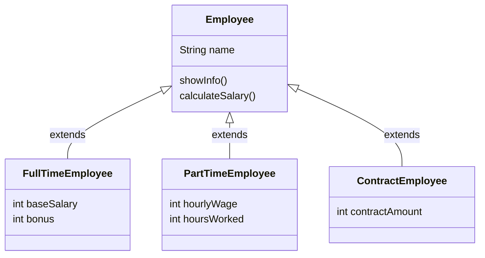

# 継承

import { OneCompilerCodeBlock } from "@site/src/components/OneCompilerCodeBlock";

この章で得られるスキル：
- ✅ 共通部分を親クラスにまとめて重複コードを削減できる
- ✅ 既存のクラスを拡張して新しい機能を追加できる
- ✅ 親クラスのメソッドを上書きして動作を変更できる
- ✅ 複数のクラスを体系的に整理できる

---

## Step 0: 継承がないとどうなる？

まず、継承を使わずに複数の似たクラスを作ってみよう。

### 問題シナリオ：社員管理システム

会社には、正社員、アルバイト、契約社員がいる。それぞれの給与を計算するシステムを作りたいとする。

**継承を使わない場合：**

<OneCompilerCodeBlock
  language="java"
  code={`class FullTimeEmployee {
    String name;
    int baseSalary;
    int bonus;

    void showInfo() {
        System.out.println("名前: " + name);
        System.out.println("基本給: " + baseSalary + "円");
        System.out.println("ボーナス: " + bonus + "円");
    }

    int calculateSalary() {
        return baseSalary + bonus;
    }
}

class PartTimeEmployee {
    String name;
    int hourlyWage;
    int hoursWorked;

    // showInfo()が重複
    void showInfo() {
        System.out.println("名前: " + name);
        System.out.println("時給: " + hourlyWage + "円");
        System.out.println("勤務時間: " + hoursWorked + "時間");
    }

    int calculateSalary() {
        return hourlyWage * hoursWorked;
    }
}

class ContractEmployee {
    String name;
    int contractAmount;

    // showInfo()がまた重複
    void showInfo() {
        System.out.println("名前: " + name);
        System.out.println("契約金額: " + contractAmount + "円");
    }

    int calculateSalary() {
        return contractAmount;
    }
}

public class Main {
    public static void main(String[] args) {
        FullTimeEmployee emp1 = new FullTimeEmployee();
        emp1.name = "太郎";
        emp1.baseSalary = 300000;
        emp1.bonus = 50000;
        emp1.showInfo();
        System.out.println("給与: " + emp1.calculateSalary() + "円\\n");

        PartTimeEmployee emp2 = new PartTimeEmployee();
        emp2.name = "花子";
        emp2.hourlyWage = 1200;
        emp2.hoursWorked = 100;
        emp2.showInfo();
        System.out.println("給与: " + emp2.calculateSalary() + "円\\n");

        ContractEmployee emp3 = new ContractEmployee();
        emp3.name = "次郎";
        emp3.contractAmount = 200000;
        emp3.showInfo();
        System.out.println("給与: " + emp3.calculateSalary() + "円");
    }
}`}
/>

### 問題点

このコードには、いくつかの深刻な問題がある：

**1. コードの重複**

- 全てのクラスに`name`フィールドがある（重複）
- `showInfo()`メソッドで「名前: 〇〇」を表示する部分が重複
- `calculateSalary()`メソッドの枠組みが重複

**2. 保守性の低下**

- 共通部分を変更したい場合、全てのクラスを修正する必要がある
- 例：`showInfo()`の表示形式を変えたい → 3箇所修正
- 修正漏れのリスクが高い

**3. 統一的な扱いができない**

- 3つの社員を配列で管理できない
- 型が異なるため、共通のインターフェースがない

**4. スケーラビリティの欠如**

- 新しい雇用形態（例：派遣社員）を追加すると、また同じコードを書く必要がある
- 社員の種類が増えるほど、重複コードが爆発的に増える

### 理想的な形

こうできたら良いのに：

```java
// 共通部分を1箇所に定義
class Employee {
    String name;
    void showInfo() { /* 共通処理 */ }
    int calculateSalary() { /* 各クラスで実装 */ }
}

// 固有部分だけ追加
class FullTimeEmployee extends Employee { /* ... */ }
class PartTimeEmployee extends Employee { /* ... */ }
class ContractEmployee extends Employee { /* ... */ }
```

これを実現するのが **継承** である。

---

## Step 1: 継承という解決策

### 継承とは

**継承** は、**既存のクラスを拡張して新しいクラスを作る仕組み** である。
複数のクラスに共通する部分をまとめ、効率的に管理するために使う。

### 親クラス（スーパークラス）と子クラス（サブクラス）

| 用語 | 意味 |
|------|------|
| **親クラス**（スーパークラス、基底クラス） | 継承される側のクラス |
| **子クラス**（サブクラス、派生クラス） | 継承する側のクラス |

子クラスは、親クラスの **フィールドとメソッドを引き継ぐ**。

### 継承の図解



**図の見方：**
- **Employee**（上）：親クラス（共通部分）
- **FullTimeEmployee, PartTimeEmployee, ContractEmployee**（下）：子クラス（固有部分）
- 子クラスは親クラスの`name`や`showInfo()`を引き継ぐ

### 継承のメリット

1. **コードの重複を削減**：共通部分を1箇所に定義
2. **保守性の向上**：共通部分の変更は親クラスだけ修正すればよい
3. **統一的な扱い**：全ての子クラスを親クラスの型として扱える
4. **スケーラビリティ**：新しい種類を追加しやすい

---

## Step 2: extendsキーワードで継承を実装

### 基本的な書き方

継承を実装するには、**`extends`キーワード** を使う。

```java
class 子クラス extends 親クラス {
    // 子クラス固有のフィールドやメソッド
}
```

### 例：Employeeを継承

<OneCompilerCodeBlock
  language="java"
  code={`class Employee {
    String name;

    void showInfo() {
        System.out.println("名前: " + name);
    }
}

// FullTimeEmployeeがEmployeeを継承
class FullTimeEmployee extends Employee {
    int baseSalary;
    int bonus;

    int calculateSalary() {
        return baseSalary + bonus;
    }
}

public class Main {
    public static void main(String[] args) {
        FullTimeEmployee emp = new FullTimeEmployee();
        emp.name = "太郎";           // 親クラスのフィールド
        emp.baseSalary = 300000;     // 子クラスのフィールド
        emp.bonus = 50000;           // 子クラスのフィールド

        emp.showInfo();              // 親クラスのメソッド
        System.out.println("給与: " + emp.calculateSalary() + "円");
    }
}`}
/>

### コードの解説

```java
class FullTimeEmployee extends Employee {
```

- **`extends Employee`**：Employeeクラスを継承
- FullTimeEmployeeは、Employeeの`name`フィールドと`showInfo()`メソッドを引き継ぐ
- FullTimeEmployee固有の`baseSalary`、`bonus`、`calculateSalary()`を追加

### 複数の子クラス

<OneCompilerCodeBlock
  language="java"
  code={`class Employee {
    String name;

    void showInfo() {
        System.out.println("名前: " + name);
    }
}

class FullTimeEmployee extends Employee {
    int baseSalary;
    int bonus;

    int calculateSalary() {
        return baseSalary + bonus;
    }
}

class PartTimeEmployee extends Employee {
    int hourlyWage;
    int hoursWorked;

    int calculateSalary() {
        return hourlyWage * hoursWorked;
    }
}

public class Main {
    public static void main(String[] args) {
        FullTimeEmployee emp1 = new FullTimeEmployee();
        emp1.name = "太郎";
        emp1.baseSalary = 300000;
        emp1.bonus = 50000;
        emp1.showInfo();
        System.out.println("給与: " + emp1.calculateSalary() + "円\\n");

        PartTimeEmployee emp2 = new PartTimeEmployee();
        emp2.name = "花子";
        emp2.hourlyWage = 1200;
        emp2.hoursWorked = 100;
        emp2.showInfo();
        System.out.println("給与: " + emp2.calculateSalary() + "円");
    }
}`}
/>

**利点**：

- `name`フィールドと`showInfo()`メソッドは1箇所（Employeeクラス）に定義
- コードの重複がない
- 新しい雇用形態を追加する場合も、Employeeを継承するだけ

---

## Step 3: superキーワードで親クラスにアクセス

### superキーワードとは

**`super`キーワード** は、**親クラスを指す** キーワードである。

### 用途1：親クラスのメソッドを呼ぶ

親クラスのメソッドを子クラスから呼びたい場合、`super`を使う。

<OneCompilerCodeBlock
  language="java"
  code={`class Animal {
    void greet() {
        System.out.println("こんにちは");
    }
}

class Dog extends Animal {
    @Override
    void greet() {
        super.greet();  // 親クラスのgreet()を呼ぶ
        System.out.println("ワン");
    }
}

public class Main {
    public static void main(String[] args) {
        Dog dog = new Dog();
        dog.greet();
    }
}`}
/>

**実行結果：**
```
こんにちは
ワン
```

### 用途2：親クラスのコンストラクタを呼ぶ

子クラスのコンストラクタから、親クラスのコンストラクタを呼ぶことができる。

<OneCompilerCodeBlock
  language="java"
  code={`class Employee {
    String name;

    Employee(String name) {
        this.name = name;
        System.out.println("Employeeのコンストラクタが呼ばれました");
    }

    void showInfo() {
        System.out.println("名前: " + name);
    }
}

class FullTimeEmployee extends Employee {
    int baseSalary;

    FullTimeEmployee(String name, int baseSalary) {
        super(name);  // 親クラスのコンストラクタを呼ぶ
        this.baseSalary = baseSalary;
        System.out.println("FullTimeEmployeeのコンストラクタが呼ばれました");
    }

    int calculateSalary() {
        return baseSalary;
    }
}

public class Main {
    public static void main(String[] args) {
        FullTimeEmployee emp = new FullTimeEmployee("太郎", 300000);
        emp.showInfo();
        System.out.println("給与: " + emp.calculateSalary() + "円");
    }
}`}
/>

**実行結果：**
```
Employeeのコンストラクタが呼ばれました
FullTimeEmployeeのコンストラクタが呼ばれました
名前: 太郎
給与: 300000円
```

:::caution 重要
`super()`でコンストラクタを呼ぶ場合、**コンストラクタの最初の行**に書く必要がある（`this()`と同じ）。
:::

### super()を書かない場合

子クラスのコンストラクタで`super()`を明示的に呼ばない場合、**自動的に親クラスのデフォルトコンストラクタが呼ばれる**。

```java
class Employee {
    String name;

    // デフォルトコンストラクタ
    Employee() {
        this.name = "名無し";
    }
}

class FullTimeEmployee extends Employee {
    int baseSalary;

    FullTimeEmployee(int baseSalary) {
        // super()が自動的に呼ばれる
        this.baseSalary = baseSalary;
    }
}
```

**注意**：親クラスにデフォルトコンストラクタがない場合、エラーになる。

---

## Step 4: メソッドのオーバーライド

### オーバーライドとは

**オーバーライド** は、**親クラスのメソッドを子クラスで上書きすること** である。

### 基本的な書き方

<OneCompilerCodeBlock
  language="java"
  code={`class Animal {
    String name;

    Animal(String name) {
        this.name = name;
    }

    void makeSound() {
        System.out.println("何か鳴く");
    }
}

class Dog extends Animal {
    Dog(String name) {
        super(name);
    }

    @Override  // オーバーライドのアノテーション
    void makeSound() {
        System.out.println("ワン");
    }
}

class Cat extends Animal {
    Cat(String name) {
        super(name);
    }

    @Override
    void makeSound() {
        System.out.println("ニャー");
    }
}

public class Main {
    public static void main(String[] args) {
        Animal animal = new Animal("動物");
        animal.makeSound();

        Dog dog = new Dog("ポチ");
        dog.makeSound();

        Cat cat = new Cat("タマ");
        cat.makeSound();
    }
}`}
/>

**実行結果：**
```
何か鳴く
ワン
ニャー
```

### @Overrideアノテーション

**`@Override`アノテーション** は、「このメソッドは親クラスのメソッドをオーバーライドしている」と明示するものである。

**メリット**：

- タイプミスを防げる
- 親クラスに同名のメソッドがない場合、コンパイルエラーになる
- コードの意図が明確になる

**例：タイプミスを防ぐ**

```java
class Animal {
    void makeSound() { }
}

class Dog extends Animal {
    @Override
    void makeSund() {  // タイプミス！
        // エラー：親クラスにmakeSund()は存在しない
    }
}
```

`@Override`がないと、新しいメソッドとして扱われてしまう。

---

## Step 5: オーバーロードとオーバーライドの違い

### 2つの違い

| 比較項目 | オーバーロード | オーバーライド |
|---------|--------------|--------------|
| **場所** | 同じクラス内 | 親クラスと子クラス |
| **メソッド名** | 同じ | 同じ |
| **引数** | 異なる | 同じ |
| **戻り値** | 任意 | 同じ（またはサブタイプ） |
| **目的** | 引数によって処理を変える | 親クラスの動作を変更 |

### 例：オーバーロード

<OneCompilerCodeBlock
  language="java"
  code={`class Calculator {
    // オーバーロード：同じクラス内で、同じ名前・異なる引数
    int add(int a, int b) {
        return a + b;
    }

    double add(double a, double b) {
        return a + b;
    }

    int add(int a, int b, int c) {
        return a + b + c;
    }
}

public class Main {
    public static void main(String[] args) {
        Calculator calc = new Calculator();
        System.out.println(calc.add(10, 20));        // int版
        System.out.println(calc.add(10.5, 20.5));    // double版
        System.out.println(calc.add(10, 20, 30));    // 3引数版
    }
}`}
/>

### 例：オーバーライド

<OneCompilerCodeBlock
  language="java"
  code={`class Animal {
    void makeSound() {
        System.out.println("何か鳴く");
    }
}

class Dog extends Animal {
    // オーバーライド：親クラスのメソッドを子クラスで上書き
    @Override
    void makeSound() {
        System.out.println("ワン");
    }
}

public class Main {
    public static void main(String[] args) {
        Animal animal = new Animal();
        animal.makeSound();  // 何か鳴く

        Dog dog = new Dog();
        dog.makeSound();  // ワン（オーバーライドされた）
    }
}`}
/>

---

## Step 6: ポリモーフィズム（多態性）

### ポリモーフィズムとは

**ポリモーフィズム**（多態性）は、**同じ型で異なる振る舞いを実現する** 仕組みである。

### 親クラスの型で子クラスのインスタンスを扱う

<OneCompilerCodeBlock
  language="java"
  code={`class Animal {
    String name;

    Animal(String name) {
        this.name = name;
    }

    void makeSound() {
        System.out.println("何か鳴く");
    }
}

class Dog extends Animal {
    Dog(String name) {
        super(name);
    }

    @Override
    void makeSound() {
        System.out.println("ワン");
    }
}

class Cat extends Animal {
    Cat(String name) {
        super(name);
    }

    @Override
    void makeSound() {
        System.out.println("ニャー");
    }
}

public class Main {
    public static void main(String[] args) {
        // 親クラスの型で子クラスのインスタンスを扱う
        Animal animal1 = new Dog("ポチ");
        Animal animal2 = new Cat("タマ");

        animal1.makeSound();  // ワン
        animal2.makeSound();  // ニャー
    }
}`}
/>

**重要なポイント**：

- `Animal`型の変数に`Dog`や`Cat`のインスタンスを代入できる
- `makeSound()`を呼ぶと、実際のインスタンス（DogまたはCat）のメソッドが呼ばれる

### 配列でまとめて管理

ポリモーフィズムを使うと、異なる種類のインスタンスを配列でまとめて管理できる。

<OneCompilerCodeBlock
  language="java"
  code={`class Animal {
    String name;

    Animal(String name) {
        this.name = name;
    }

    void makeSound() {
        System.out.println(name + "が鳴く");
    }
}

class Dog extends Animal {
    Dog(String name) {
        super(name);
    }

    @Override
    void makeSound() {
        System.out.println(name + "がワンと鳴く");
    }
}

class Cat extends Animal {
    Cat(String name) {
        super(name);
    }

    @Override
    void makeSound() {
        System.out.println(name + "がニャーと鳴く");
    }
}

class Bird extends Animal {
    Bird(String name) {
        super(name);
    }

    @Override
    void makeSound() {
        System.out.println(name + "がチュンと鳴く");
    }
}

public class Main {
    public static void main(String[] args) {
        // Animal型の配列で様々な動物を管理
        Animal[] animals = new Animal[3];
        animals[0] = new Dog("ポチ");
        animals[1] = new Cat("タマ");
        animals[2] = new Bird("ピーちゃん");

        // ループで全ての動物を鳴かせる
        for (Animal animal : animals) {
            animal.makeSound();  // 実際の型に応じたメソッドが呼ばれる
        }
    }
}`}
/>

**実行結果：**
```
ポチがワンと鳴く
タマがニャーと鳴く
ピーちゃんがチュンと鳴く
```

### ポリモーフィズムのメリット

1. **統一的な処理**：異なる種類のインスタンスを同じように扱える
2. **拡張性**：新しい種類を追加しても、既存のコードを変更不要
3. **柔軟性**：実行時に実際の型に応じた処理が実行される

---

## Step 7: 継承の設計原則

### is-a関係

継承を使う際は、**is-a関係**（「〜は〜である」という関係）が成り立つか確認する。

**良い例（is-a関係が成り立つ）：**

- Dog **is a** Animal（犬は動物である）→ ✅ 継承が適切
- Cat **is a** Animal（猫は動物である）→ ✅ 継承が適切
- FullTimeEmployee **is an** Employee（正社員は社員である）→ ✅ 継承が適切

**悪い例（is-a関係が成り立たない）：**

- Car **is an** Engine（車はエンジンである）→ ❌ 継承は不適切
  - 正しくは、CarがEngineを**持つ**（has-a関係）→ コンポジション
- Student **is a** Classroom（学生は教室である）→ ❌ 継承は不適切
  - 正しくは、ClassroomがStudentを**持つ**（has-a関係）

### has-a関係との違い

| 関係 | 意味 | 実装方法 | 例 |
|------|------|---------|-----|
| **is-a** | 〜は〜である | 継承 | Dog is an Animal |
| **has-a** | 〜は〜を持つ | フィールドで保持 | Car has an Engine |

**has-a関係の例：**

```java
class Engine {
    void start() {
        System.out.println("エンジン始動");
    }
}

class Car {
    Engine engine;  // Carは Engineを持つ（has-a）

    Car() {
        engine = new Engine();
    }

    void drive() {
        engine.start();
        System.out.println("走る");
    }
}
```

### 適切な継承の使い方

1. **共通部分を親クラスにまとめる**
   - 複数のクラスに共通するフィールドやメソッドを親クラスに定義

2. **子クラス固有の部分だけを追加**
   - 子クラスには、固有のフィールドやメソッドだけを追加

3. **is-a関係を確認**
   - 継承を使う前に、「〜は〜である」が成り立つか確認

4. **深い継承階層を避ける**
   - 継承の階層が深くなりすぎると、複雑になる
   - 一般的には、3階層程度に抑える

:::warning 注意
継承は強力な機能だが、過度に使うとクラス間の関係が複雑になる。
シンプルな設計を心がけることが重要である。
:::

---

---

## 実践的な演習

ここまで学んだ知識を使って、以下の3つの課題に挑戦しよう。

### 課題1: 図形クラスの作成

**要件**：
1. `Shape`（図形）クラスを定義する
   - フィールド：`color`（String）
   - メソッド：`getArea()`（面積を返す、戻り値はdouble）
2. `Rectangle`（長方形）クラスを`Shape`を継承して定義
   - フィールド：`width`（double）、`height`（double）
   - `getArea()`をオーバーライド：`width * height`を返す
3. `Circle`（円）クラスを`Shape`を継承して定義
   - フィールド：`radius`（double）
   - `getArea()`をオーバーライド：`Math.PI * radius * radius`を返す
4. 3つの図形を作成し、それぞれの面積を表示

**ヒント**：
```java
Shape[] shapes = new Shape[3];
shapes[0] = new Rectangle("赤", 10, 20);
shapes[1] = new Circle("青", 5);
shapes[2] = new Rectangle("緑", 15, 15);
```

<details>
<summary>解答例を見る</summary>

<OneCompilerCodeBlock
  language="java"
  code={`class Shape {
    String color;

    Shape(String color) {
        this.color = color;
    }

    double getArea() {
        return 0;  // 親クラスではデフォルト値
    }

    void showInfo() {
        System.out.println("色: " + color + ", 面積: " + getArea());
    }
}

class Rectangle extends Shape {
    double width;
    double height;

    Rectangle(String color, double width, double height) {
        super(color);
        this.width = width;
        this.height = height;
    }

    @Override
    double getArea() {
        return width * height;
    }
}

class Circle extends Shape {
    double radius;

    Circle(String color, double radius) {
        super(color);
        this.radius = radius;
    }

    @Override
    double getArea() {
        return Math.PI * radius * radius;
    }
}

public class Main {
    public static void main(String[] args) {
        Shape[] shapes = new Shape[3];
        shapes[0] = new Rectangle("赤", 10, 20);
        shapes[1] = new Circle("青", 5);
        shapes[2] = new Rectangle("緑", 15, 15);

        for (Shape shape : shapes) {
            shape.showInfo();
        }
    }
}`}
/>

</details>

---

### 課題2: ゲームキャラクターの作成

**要件**：
1. `GameCharacter`クラスを定義する
   - フィールド：`name`（String）、`hp`（int）、`attackPower`（int）
   - メソッド：
     - `showStatus()`：ステータスを表示
     - `attack(GameCharacter target)`：相手を攻撃
     - `specialAttack(GameCharacter target)`：特殊攻撃（子クラスでオーバーライド）
2. `Warrior`（戦士）クラスを継承
   - `specialAttack()`：攻撃力の2倍のダメージ
3. `Mage`（魔法使い）クラスを継承
   - `specialAttack()`：攻撃力の3倍のダメージ（MPを消費するイメージ）
4. 2人のキャラクターでバトルをシミュレート

**ヒント**：
```java
void attack(GameCharacter target) {
    target.hp -= this.attackPower;
    System.out.println(this.name + "が" + target.name + "を攻撃！");
}
```

<details>
<summary>解答例を見る</summary>

<OneCompilerCodeBlock
  language="java"
  code={`class GameCharacter {
    String name;
    int hp;
    int attackPower;

    GameCharacter(String name, int hp, int attackPower) {
        this.name = name;
        this.hp = hp;
        this.attackPower = attackPower;
    }

    void showStatus() {
        System.out.println(name + " HP: " + hp + ", 攻撃力: " + attackPower);
    }

    void attack(GameCharacter target) {
        target.hp -= this.attackPower;
        System.out.println(this.name + "が" + target.name + "を攻撃！ ダメージ: " + this.attackPower);
    }

    void specialAttack(GameCharacter target) {
        target.hp -= this.attackPower;
        System.out.println(this.name + "の特殊攻撃！");
    }

    boolean isAlive() {
        return hp > 0;
    }
}

class Warrior extends GameCharacter {
    Warrior(String name, int hp, int attackPower) {
        super(name, hp, attackPower);
    }

    @Override
    void specialAttack(GameCharacter target) {
        int damage = this.attackPower * 2;
        target.hp -= damage;
        System.out.println(this.name + "の剣技！ ダメージ: " + damage);
    }
}

class Mage extends GameCharacter {
    Mage(String name, int hp, int attackPower) {
        super(name, hp, attackPower);
    }

    @Override
    void specialAttack(GameCharacter target) {
        int damage = this.attackPower * 3;
        target.hp -= damage;
        System.out.println(this.name + "の魔法攻撃！ ダメージ: " + damage);
    }
}

public class Main {
    public static void main(String[] args) {
        Warrior warrior = new Warrior("戦士", 100, 20);
        Mage mage = new Mage("魔法使い", 80, 15);

        System.out.println("--- バトル開始 ---");
        warrior.showStatus();
        mage.showStatus();
        System.out.println();

        // ターン1
        System.out.println("【ターン1】");
        warrior.attack(mage);
        mage.showStatus();
        System.out.println();

        // ターン2
        System.out.println("【ターン2】");
        mage.specialAttack(warrior);
        warrior.showStatus();
        System.out.println();

        // ターン3
        System.out.println("【ターン3】");
        warrior.specialAttack(mage);
        mage.showStatus();
        System.out.println();

        if (mage.isAlive()) {
            System.out.println(mage.name + "の勝利！");
        } else {
            System.out.println(warrior.name + "の勝利！");
        }
    }
}`}
/>

</details>

---

### 課題3: 銀行口座システム（発展）

**要件**：
1. `BankAccount`クラスを定義する
   - フィールド：`accountNumber`（String）、`balance`（int）
   - メソッド：
     - `deposit(int amount)`：入金
     - `withdraw(int amount)`：出金（残高不足ならエラーメッセージ）
     - `getInterest()`：利息を計算（子クラスでオーバーライド）
2. `SavingsAccount`（普通預金）クラスを継承
   - `getInterest()`：残高の1%
3. `FixedDepositAccount`（定期預金）クラスを継承
   - フィールド：`term`（int、預金期間）
   - `getInterest()`：残高の3%
   - `withdraw()`をオーバーライド：期間内は出金不可
4. 2つの口座を作成し、入金・出金・利息計算を行う

**ヒント**：
```java
@Override
void withdraw(int amount) {
    if (term > 0) {
        System.out.println("定期預金は満期まで出金できません");
        return;
    }
    super.withdraw(amount);
}
```

<details>
<summary>解答例を見る</summary>

<OneCompilerCodeBlock
  language="java"
  code={`class BankAccount {
    String accountNumber;
    int balance;

    BankAccount(String accountNumber, int balance) {
        this.accountNumber = accountNumber;
        this.balance = balance;
    }

    void deposit(int amount) {
        balance += amount;
        System.out.println(amount + "円入金しました。残高: " + balance + "円");
    }

    void withdraw(int amount) {
        if (balance < amount) {
            System.out.println("残高不足です。残高: " + balance + "円");
            return;
        }
        balance -= amount;
        System.out.println(amount + "円出金しました。残高: " + balance + "円");
    }

    int getInterest() {
        return 0;  // 基本クラスではデフォルト0
    }

    void showInfo() {
        System.out.println("口座番号: " + accountNumber + ", 残高: " + balance + "円, 利息: " + getInterest() + "円");
    }
}

class SavingsAccount extends BankAccount {
    SavingsAccount(String accountNumber, int balance) {
        super(accountNumber, balance);
    }

    @Override
    int getInterest() {
        return balance * 1 / 100;  // 1%
    }
}

class FixedDepositAccount extends BankAccount {
    int term;

    FixedDepositAccount(String accountNumber, int balance, int term) {
        super(accountNumber, balance);
        this.term = term;
    }

    @Override
    int getInterest() {
        return balance * 3 / 100;  // 3%
    }

    @Override
    void withdraw(int amount) {
        if (term > 0) {
            System.out.println("定期預金は満期まで出金できません（残り" + term + "ヶ月）");
            return;
        }
        super.withdraw(amount);
    }

    void decrementTerm() {
        if (term > 0) {
            term--;
            System.out.println("1ヶ月経過しました。残り期間: " + term + "ヶ月");
        }
    }
}

public class Main {
    public static void main(String[] args) {
        SavingsAccount savings = new SavingsAccount("001", 100000);
        FixedDepositAccount fixed = new FixedDepositAccount("002", 500000, 3);

        System.out.println("--- 普通預金 ---");
        savings.showInfo();
        savings.deposit(50000);
        savings.withdraw(30000);
        savings.showInfo();

        System.out.println("\\n--- 定期預金 ---");
        fixed.showInfo();
        fixed.deposit(100000);
        fixed.withdraw(50000);  // 出金不可

        System.out.println();
        fixed.decrementTerm();
        fixed.decrementTerm();
        fixed.decrementTerm();
        fixed.withdraw(50000);  // 満期後は出金可能
        fixed.showInfo();
    }
}`}
/>

</details>

---

## FAQ

### Q1: 1つのクラスが複数のクラスを継承できるか？

**A1:**

**Javaでは、複数のクラスを継承できない**（単一継承）。

**エラーになる例：**

```java
class Animal { }
class Flyable { }

class Bird extends Animal, Flyable {  // エラー！複数継承は不可
}
```

**理由**：

複数継承を許すと、**ダイヤモンド問題**（同じメソッドが複数の親から継承される）が発生する。
Javaは単純さを保つため、複数継承を禁止している。

**解決策**：

インターフェースを使う（次章で学ぶ）。

```java
class Animal { }
interface Flyable { }

class Bird extends Animal implements Flyable {  // OK
}
```

---

### Q2: 親クラスのprivateフィールドは継承されるか？

**A2:**

**継承されるが、直接アクセスできない。**

<OneCompilerCodeBlock
  language="java"
  code={`class Parent {
    private int privateField = 10;
    public int publicField = 20;

    public int getPrivateField() {
        return privateField;
    }
}

class Child extends Parent {
    void showFields() {
        // System.out.println(privateField);  // エラー！アクセスできない
        System.out.println(publicField);      // OK
        System.out.println(getPrivateField());  // メソッド経由ならOK
    }
}

public class Main {
    public static void main(String[] args) {
        Child child = new Child();
        child.showFields();
    }
}`}
/>

**privateフィールドにアクセスする方法**：

- getter/setterメソッドを使う
- `protected`にする（子クラスからアクセス可能）

---

### Q3: super.super.method()のように、祖父クラスのメソッドを呼べるか？

**A3:**

**呼べない。** `super`は直接の親クラスしか指せない。

**エラーになる例：**

```java
class GrandParent {
    void greet() {
        System.out.println("祖父");
    }
}

class Parent extends GrandParent {
    @Override
    void greet() {
        System.out.println("親");
    }
}

class Child extends Parent {
    @Override
    void greet() {
        super.super.greet();  // エラー！super.superは不可
    }
}
```

**解決策**：

親クラスで祖父クラスのメソッドを呼ぶメソッドを用意する。

```java
class Parent extends GrandParent {
    @Override
    void greet() {
        System.out.println("親");
    }

    void callGrandParentGreet() {
        super.greet();  // 祖父クラスのgreet()
    }
}

class Child extends Parent {
    @Override
    void greet() {
        callGrandParentGreet();  // 親クラス経由で祖父クラスのメソッドを呼ぶ
    }
}
```

---

### Q4: コンストラクタは継承されるか？

**A4:**

**継承されない。** 各クラスは独自のコンストラクタを定義する必要がある。

```java
class Parent {
    Parent(String name) {
        System.out.println("親のコンストラクタ: " + name);
    }
}

class Child extends Parent {
    // Parentのコンストラクタは継承されない
    // Child()というコンストラクタは自動で作られない

    Child(String name) {
        super(name);  // 親のコンストラクタを明示的に呼ぶ
        System.out.println("子のコンストラクタ: " + name);
    }
}
```

**子クラスのコンストラクタでは、必ず親クラスのコンストラクタを呼ぶ必要がある**（明示的または暗黙的）。

---

### Q5: 継承とコンポジション、どちらを使うべきか？

**A5:**

**基本的にはコンポジション（has-a）を優先し、is-a関係が明確な場合のみ継承を使う。**

**継承を使うべき場合**：

- is-a関係が成り立つ
- 親クラスの全てのメソッドが子クラスでも意味を持つ
- ポリモーフィズムを活用したい

**コンポジションを使うべき場合**：

- has-a関係が成り立つ
- 一部の機能だけを使いたい
- 柔軟な設計が必要

**例**：

```java
// 継承（is-a）
class Dog extends Animal { }  // 犬は動物である

// コンポジション（has-a）
class Car {
    Engine engine;  // 車はエンジンを持つ
}
```

**実務では、「継承より委譲を優先せよ」という設計原則がある**（Effective Java）。

---

## まとめ

この章では、**継承** について学んだ。

### 学んだ内容

1. **Step 0**: 継承がないと、コードの重複が増え、保守性が低下する
2. **Step 1**: 継承は既存のクラスを拡張して新しいクラスを作る仕組みである
3. **Step 2**: `extends`キーワードで継承を実装する
4. **Step 3**: `super`キーワードで親クラスのメソッドやコンストラクタを呼ぶ
5. **Step 4**: オーバーライドで親クラスのメソッドを子クラスで上書きできる
6. **Step 5**: オーバーロードとオーバーライドは異なる概念である
7. **Step 6**: ポリモーフィズムで統一的な処理を実現できる
8. **Step 7**: is-a関係が成り立つか確認し、適切に継承を使う
9. **Step 8**: 実践課題で、継承を使ったプログラム設計を体験した

### 次のステップ

次の章では、**インターフェース** について学ぶ。
継承とは異なるアプローチで、クラスに共通の振る舞いを定義する方法を学ぶ。

---

## 演習

未作成
