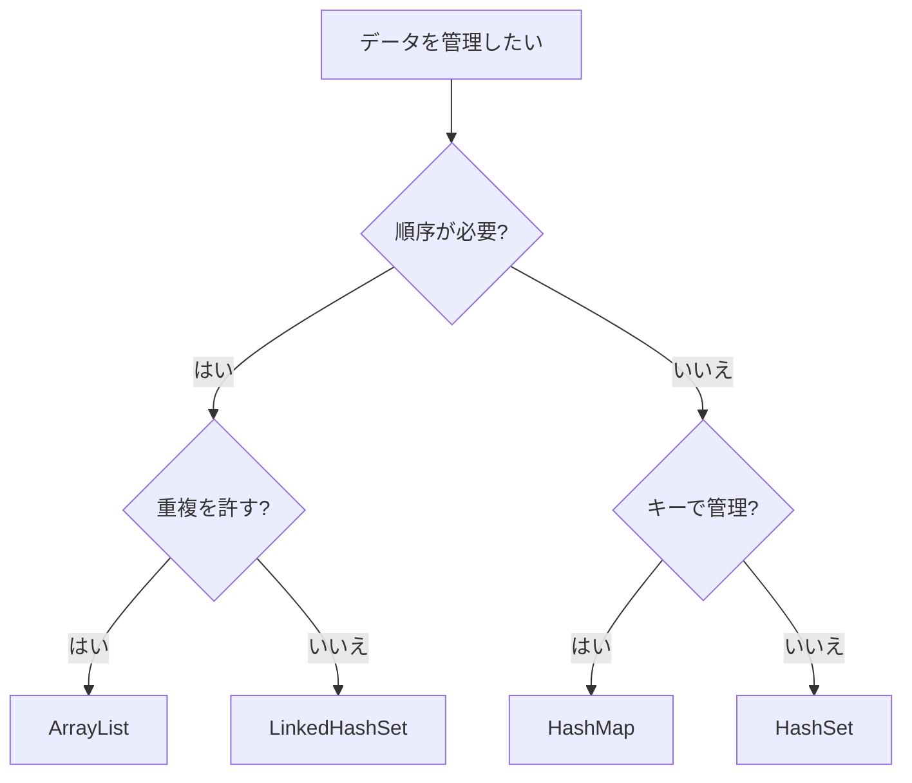

import { OneCompilerCodeBlock } from "@site/src/components/OneCompilerCodeBlock";

# コレクション

この章では、複数のデータを効率的に管理するための **コレクション** について学ぶ。
コレクションを使うことで、配列よりも柔軟にデータを扱うことができる。

---

## この章で得られるスキル

- コレクションとは何か、配列との違いを説明できる
- `ArrayList`の基本的な使い方を理解している
- `HashSet`の基本的な使い方を理解している
- `HashMap`の基本的な使い方を理解している
- 適切なコレクションを選択できる
- コレクションを使ったプログラムを実装できる

---

## なぜこの技術が必要か

**コレクションがないとどうなるか？**

配列だけでは、要素数を後から変更できず、柔軟なデータ管理が難しい。
また、重複を許さないデータや、キーと値のペアを管理するのが面倒になる。

**例:**

```java
// 配列だけでは...
String[] names = new String[3];  // サイズ固定
names[0] = "太郎";
names[1] = "花子";
names[2] = "次郎";
// 4人目を追加したい → 新しい配列を作り直す必要がある

// コレクションがあると...
ArrayList<String> names = new ArrayList<>();
names.add("太郎");
names.add("花子");
names.add("次郎");
names.add("四郎");  // 簡単に追加できる
```

コレクションを使うことで、データの追加・削除・検索が簡単になる。

---

## 1. コレクションとは

### コレクションの概念

**コレクション** は、**複数のデータをまとめて管理するための仕組み** である。
Javaでは、`java.util`パッケージにコレクションのクラスが用意されている。

### 配列との違い

| 比較項目 | 配列 | コレクション |
|---------|------|------------|
| **サイズ** | 固定 | 可変 |
| **型** | プリミティブ型も可 | オブジェクトのみ |
| **機能** | 基本的な操作のみ | 便利なメソッドが豊富 |

:::tip ポイント
配列はサイズが固定なので、要素数が変わる場合はコレクションを使う方が便利である。
:::

### 主なコレクション

| コレクション | 説明 | 特徴 |
|------------|------|------|
| **`ArrayList`** | リスト（順序あり） | インデックスでアクセス、重複可 |
| **`HashSet`** | セット（順序なし） | 重複なし、高速検索 |
| **`HashMap`** | マップ（キーと値） | キーで値を管理 |

:::info コレクションの内部実装
`ArrayList`は内部で配列を使い、`HashSet`と`HashMap`はハッシュテーブルを使って実装されている。
`ArrayList`は要素の追加時にサイズが足りなくなると、自動的に内部配列を拡張する（通常は1.5倍）。
`HashMap`のキー検索がO(1)（定数時間）で高速なのは、ハッシュ値を使ってデータの位置を特定するためである。
これらの内部実装を理解することで、適切なコレクションを選択できるようになる。
:::

---

## 2. ArrayList

### ArrayListとは

**`ArrayList`** は、**可変長の配列** のようなコレクションである。
要素の追加・削除が自由にでき、インデックスで要素にアクセスできる。

### 基本的な使い方

```java
import java.util.ArrayList;

ArrayList<String> list = new ArrayList<>();  // 空のリストを作成
list.add("太郎");       // 要素を追加
list.add("花子");
list.add("次郎");

String name = list.get(0);  // インデックスで取得
int size = list.size();     // 要素数を取得
```

:::caution 重要
`ArrayList<String>`の `<String>` は **ジェネリクス** と呼ばれ、リストに格納する要素の型を指定する。
これにより、型安全なコレクションを使える。
:::

### 主なメソッド

| メソッド | 説明 | 例 |
|---------|------|-----|
| `add(要素)` | 末尾に要素を追加 | `list.add("太郎")` |
| `get(インデックス)` | 要素を取得 | `list.get(0)` |
| `set(インデックス, 要素)` | 要素を変更 | `list.set(0, "一郎")` |
| `remove(インデックス)` | 要素を削除 | `list.remove(0)` |
| `size()` | 要素数を取得 | `list.size()` |
| `contains(要素)` | 要素が含まれるか | `list.contains("太郎")` |

**実行してみよう:**

<OneCompilerCodeBlock
  language="java"
  code={`import java.util.ArrayList;

public class Main {
    public static void main(String[] args) {
        // ArrayListの作成
        ArrayList<String> fruits = new ArrayList<>();

        // 要素の追加
        fruits.add("りんご");
        fruits.add("バナナ");
        fruits.add("みかん");
        System.out.println("追加後: " + fruits);

        // 要素の取得
        String first = fruits.get(0);
        System.out.println("最初の要素: " + first);

        // 要素数
        System.out.println("要素数: " + fruits.size());

        // 要素の変更
        fruits.set(1, "ぶどう");
        System.out.println("変更後: " + fruits);

        // 要素の削除
        fruits.remove(0);
        System.out.println("削除後: " + fruits);

        // 要素が含まれるか
        boolean hasOrange = fruits.contains("みかん");
        System.out.println("みかんは含まれるか: " + hasOrange);
    }
}`}
/>

**やってみよう:**
- 新しい果物を追加してみよう
- すべての要素を表示するループを追加してみよう

### ArrayListのループ

```java
ArrayList<String> list = new ArrayList<>();
list.add("太郎");
list.add("花子");
list.add("次郎");

// 通常のforループ
for (int i = 0; i < list.size(); i++) {
    System.out.println(list.get(i));
}

// 拡張forループ
for (String name : list) {
    System.out.println(name);
}
```

**実行してみよう:**

<OneCompilerCodeBlock
  language="java"
  code={`import java.util.ArrayList;

public class Main {
    public static void main(String[] args) {
        ArrayList<Integer> numbers = new ArrayList<>();
        numbers.add(10);
        numbers.add(20);
        numbers.add(30);
        numbers.add(40);
        numbers.add(50);

        System.out.println("通常のforループ:");
        for (int i = 0; i < numbers.size(); i++) {
            System.out.println(i + "番目: " + numbers.get(i));
        }

        System.out.println("\\n拡張forループ:");
        for (int num : numbers) {
            System.out.println(num);
        }

        System.out.println("\\n合計を計算:");
        int sum = 0;
        for (int num : numbers) {
            sum += num;
        }
        System.out.println("合計: " + sum);
    }
}`}
/>

**やってみよう:**
- 数値のリストから最大値を見つけるコードを追加してみよう

:::warning よくあるエラー
`IndexOutOfBoundsException`：存在しないインデックスにアクセスした場合に発生する。
```java
ArrayList<String> list = new ArrayList<>();
list.add("太郎");
String name = list.get(10);  // エラー！要素は1つしかない
```
リストのサイズを超えるインデックスにアクセスしないよう注意が必要である。
:::

---

## 3. HashSet

### HashSetとは

**`HashSet`** は、**重複を許さない** コレクションである。
順序は保証されないが、要素の存在確認が高速である。

### 基本的な使い方

```java
import java.util.HashSet;

HashSet<String> set = new HashSet<>();
set.add("りんご");
set.add("バナナ");
set.add("りんご");  // 重複は無視される

System.out.println(set);  // [バナナ, りんご] または [りんご, バナナ]
```

### 主なメソッド

| メソッド | 説明 | 例 |
|---------|------|-----|
| `add(要素)` | 要素を追加（重複は無視） | `set.add("りんご")` |
| `remove(要素)` | 要素を削除 | `set.remove("りんご")` |
| `contains(要素)` | 要素が含まれるか | `set.contains("りんご")` |
| `size()` | 要素数を取得 | `set.size()` |

**実行してみよう:**

<OneCompilerCodeBlock
  language="java"
  code={`import java.util.HashSet;

public class Main {
    public static void main(String[] args) {
        HashSet<String> tags = new HashSet<>();

        // 要素の追加
        tags.add("Java");
        tags.add("Python");
        tags.add("JavaScript");
        tags.add("Java");  // 重複は無視される
        System.out.println("追加後: " + tags);
        System.out.println("要素数: " + tags.size());  // 3

        // 要素が含まれるか
        System.out.println("Javaは含まれるか: " + tags.contains("Java"));
        System.out.println("Rubyは含まれるか: " + tags.contains("Ruby"));

        // 要素の削除
        tags.remove("Python");
        System.out.println("削除後: " + tags);

        // すべての要素を表示
        System.out.println("\\nすべての要素:");
        for (String tag : tags) {
            System.out.println("- " + tag);
        }
    }
}`}
/>

**やってみよう:**
- 数値のセットを作成して、重複が無視されることを確認しよう

:::warning よくあるエラー
`HashSet`は順序を保証しない。要素の追加順序と表示順序が異なることがある。
順序を保ちたい場合は `LinkedHashSet` を使う。
:::

---

## 4. HashMap

### HashMapとは

**`HashMap`** は、**キーと値のペア** を管理するコレクションである。
キーを使って値を高速に取得できる。

### 基本的な使い方

```java
import java.util.HashMap;

HashMap<String, Integer> map = new HashMap<>();
map.put("太郎", 20);  // キーと値を追加
map.put("花子", 18);
map.put("次郎", 22);

int age = map.get("太郎");  // キーで値を取得
```

:::caution 重要
`HashMap<String, Integer>`の最初の型がキー、2番目の型が値の型である。
:::

### 主なメソッド

| メソッド | 説明 | 例 |
|---------|------|-----|
| `put(キー, 値)` | キーと値を追加 | `map.put("太郎", 20)` |
| `get(キー)` | 値を取得 | `map.get("太郎")` |
| `remove(キー)` | キーと値を削除 | `map.remove("太郎")` |
| `containsKey(キー)` | キーが含まれるか | `map.containsKey("太郎")` |
| `size()` | 要素数を取得 | `map.size()` |
| `keySet()` | すべてのキーを取得 | `map.keySet()` |

**実行してみよう:**

<OneCompilerCodeBlock
  language="java"
  code={`import java.util.HashMap;

public class Main {
    public static void main(String[] args) {
        // 電話帳を作成
        HashMap<String, String> phoneBook = new HashMap<>();

        // データの追加
        phoneBook.put("太郎", "090-1234-5678");
        phoneBook.put("花子", "080-9876-5432");
        phoneBook.put("次郎", "070-1111-2222");
        System.out.println("追加後: " + phoneBook);

        // データの取得
        String phone = phoneBook.get("太郎");
        System.out.println("太郎の電話番号: " + phone);

        // キーが含まれるか
        System.out.println("\\n花子は登録されているか: " + phoneBook.containsKey("花子"));
        System.out.println("四郎は登録されているか: " + phoneBook.containsKey("四郎"));

        // データの削除
        phoneBook.remove("次郎");
        System.out.println("\\n削除後: " + phoneBook);

        // すべてのデータを表示
        System.out.println("\\nすべての電話番号:");
        for (String name : phoneBook.keySet()) {
            String number = phoneBook.get(name);
            System.out.println(name + ": " + number);
        }
    }
}`}
/>

**やってみよう:**
- 商品名と価格のマップを作成してみよう

### HashMapのループ

```java
HashMap<String, Integer> map = new HashMap<>();
map.put("太郎", 20);
map.put("花子", 18);

// キーでループ
for (String key : map.keySet()) {
    int value = map.get(key);
    System.out.println(key + ": " + value);
}

// entrySetでループ（効率的）
for (Map.Entry<String, Integer> entry : map.entrySet()) {
    String key = entry.getKey();
    int value = entry.getValue();
    System.out.println(key + ": " + value);
}
```

**実行してみよう:**

<OneCompilerCodeBlock
  language="java"
  code={`import java.util.HashMap;
import java.util.Map;

public class Main {
    public static void main(String[] args) {
        // 科目と点数のマップ
        HashMap<String, Integer> scores = new HashMap<>();
        scores.put("国語", 85);
        scores.put("数学", 92);
        scores.put("英語", 78);
        scores.put("理科", 88);
        scores.put("社会", 80);

        System.out.println("科目と点数:");
        for (Map.Entry<String, Integer> entry : scores.entrySet()) {
            System.out.println(entry.getKey() + ": " + entry.getValue() + "点");
        }

        // 合計点と平均点を計算
        int total = 0;
        for (int score : scores.values()) {
            total += score;
        }
        double average = (double) total / scores.size();

        System.out.println("\\n合計点: " + total + "点");
        System.out.println("平均点: " + average + "点");
    }
}`}
/>

**やってみよう:**
- 最高点と最低点を見つけるコードを追加してみよう

:::warning よくあるエラー
存在しないキーで `get()` を呼ぶと `null` が返される。
```java
HashMap<String, Integer> map = new HashMap<>();
map.put("太郎", 20);
Integer age = map.get("四郎");  // null
```
`containsKey()` で存在確認してから取得するのが安全である。
:::

---

## 5. コレクションの選び方

### どのコレクションを使うか



### 選択のポイント

| 状況 | 推奨コレクション |
|------|----------------|
| 順序を保ちたい、インデックスでアクセスしたい | `ArrayList` |
| 重複を許さない、存在確認が重要 | `HashSet` |
| キーと値のペアで管理したい | `HashMap` |

**実行してみよう:**

<OneCompilerCodeBlock
  language="java"
  code={`import java.util.ArrayList;
import java.util.HashSet;
import java.util.HashMap;

public class Main {
    public static void main(String[] args) {
        // ケース1: 順序を保ちたい → ArrayList
        System.out.println("ケース1: 待機リスト（順序が重要）");
        ArrayList<String> waitingList = new ArrayList<>();
        waitingList.add("太郎");
        waitingList.add("花子");
        waitingList.add("次郎");
        System.out.println("待機リスト: " + waitingList);
        System.out.println("1番目: " + waitingList.get(0));

        System.out.println("\\n---\\n");

        // ケース2: 重複を許さない → HashSet
        System.out.println("ケース2: 参加者リスト（重複なし）");
        HashSet<String> participants = new HashSet<>();
        participants.add("太郎");
        participants.add("花子");
        participants.add("太郎");  // 重複は無視
        System.out.println("参加者: " + participants);
        System.out.println("人数: " + participants.size());

        System.out.println("\\n---\\n");

        // ケース3: キーで管理 → HashMap
        System.out.println("ケース3: 在庫管理（商品名で検索）");
        HashMap<String, Integer> stock = new HashMap<>();
        stock.put("りんご", 50);
        stock.put("バナナ", 30);
        stock.put("みかん", 40);
        System.out.println("在庫: " + stock);
        System.out.println("りんごの在庫: " + stock.get("りんご") + "個");
    }
}`}
/>

**やってみよう:**
- 自分でユースケースを考えて、適切なコレクションを選んでみよう

---

## 6. コレクションとジェネリクス

### ジェネリクスとは

**ジェネリクス** は、**コレクションに格納する要素の型を指定する仕組み** である。
`<型名>` の形で指定する。

```java
ArrayList<String> names = new ArrayList<>();  // String型のみ格納可能
ArrayList<Integer> numbers = new ArrayList<>();  // Integer型のみ格納可能
```

:::tip ポイント
ジェネリクスを使うことで、間違った型の要素を追加するコンパイルエラーで防げる。
型安全性が向上する。
:::

### プリミティブ型とラッパークラス

コレクションには **オブジェクト** しか格納できないため、プリミティブ型を格納する場合は **ラッパークラス** を使う。

| プリミティブ型 | ラッパークラス |
|--------------|--------------|
| `int` | `Integer` |
| `double` | `Double` |
| `boolean` | `Boolean` |
| `char` | `Character` |

```java
ArrayList<Integer> numbers = new ArrayList<>();
numbers.add(10);  // int が自動的に Integer に変換される（オートボクシング）
int num = numbers.get(0);  // Integer が自動的に int に変換される（アンボクシング）
```

:::info オートボクシングのパフォーマンス注意点
オートボクシングは便利だが、**頻繁に発生するとパフォーマンスに影響** する。
特に大量のデータを扱うループ内では、毎回オブジェクトが生成されるため、メモリとCPU負荷が増大する。
パフォーマンスが重要な場合は、プリミティブ型の配列を使うか、ライブラリ（例：Apache Commons、Trove）の専用コレクションを検討する。
実務では、まず正しく動作するコードを書き、パフォーマンスボトルネックが判明してから最適化する。
:::

---

## まとめ

この章では、**コレクション** について学んだ。

### 学んだ内容

- **コレクション** は複数のデータを効率的に管理する仕組みである
- **`ArrayList`** は可変長のリストで、順序を保ち、インデックスでアクセスできる
- **`HashSet`** は重複を許さないセットで、高速な存在確認ができる
- **`HashMap`** はキーと値のペアを管理するマップで、キーで値を取得できる
- **ジェネリクス** で要素の型を指定し、型安全なコレクションを使える
- 状況に応じて適切なコレクションを選択できる

### 次のステップ

次の章では、**日時操作** について学ぶ。
日付や時刻を扱う方法を学び、より実用的なプログラムを作る方法を学ぶ。

---

## 演習

未作成
