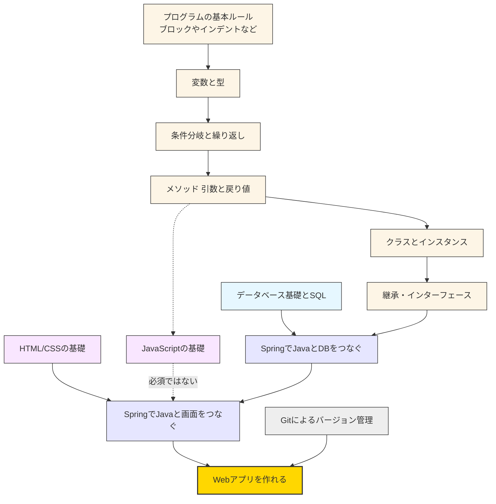

# WEB 開発学習ロードマップ

プログラミングの学習は、算数や数学を学ぶのと同じように、**積み重ねの学習**です。  
足し算や引き算がわからないと方程式やベクトルが理解できないように、  
プログラミングでも基本的な概念を理解していないと、応用的な内容を学んでもうまくついていけません。  
(一方で、**積み重ねの学習**が重要ではない例として、たとえば歴史の学習が挙げられます。平安時代のことは一切知らないが、幕末のこととなると異様に詳しいといった人はよくいるのではないでしょうか)

プログラミング以外では触れることのない概念も多いため、学習に苦手意識を持つことは自然なことです。

苦手意識を持った時に突破口となるのが、この学習ロードマップです。  
ロードマップなしに学習することは、マップなしに RPG ゲームをクリアしようとするようなものです。

# 学習ロードマップ

以下は Web アプリ開発までの学習ロードマップです。

 

# 学習の進め方のポイント

1. **基本を理解することを最優先**  
   プログラムの基本ルールや変数の扱いなど、基礎を飛ばすと後で苦労します。

2. **手を動かして確かめる**  
   読むだけではなく、実際にプログラムを書いて挙動を確認することが大切です。

3. **つまずいても焦らない**  
   初学者は誰でもエラーや理解できない部分に出会います。  
   そのときは少し戻って基礎を復習しましょう。

4. **小さな成功体験を積む**  
   簡単なプログラムを完成させることで自信をつけ、次のステップに進みやすくなります。

プログラミングは最初は難しく感じるかもしれませんが、**少しずつ積み重ねることで確実にできるようになる**学習です。  
あなたもこのロードマップに沿って学習を進めれば、必ず Web アプリ開発ができるようになります。
