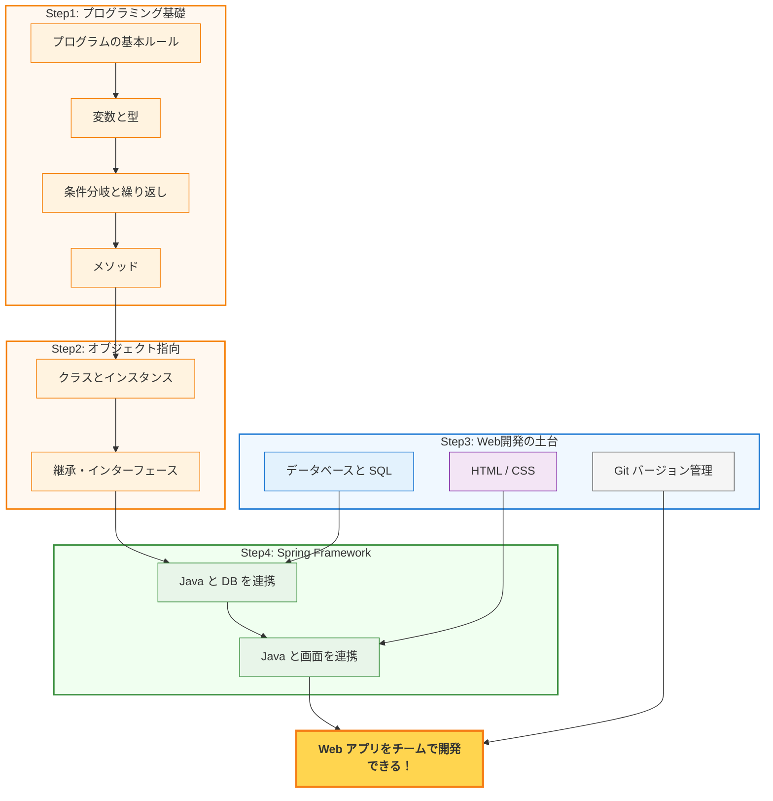

# WEB開発 学習ロードマップ

## このロードマップについて

プログラミングの学習は **積み上げ型** である。
算数で足し算がわからなければ掛け算ができないように、プログラミングでも基礎の上に応用が成り立つ。
裏を返せば、 **基礎をしっかり固めれば、その先は着実に理解できる** ということでもある。

このロードマップは、ゴールまでの道のりを示す **地図** である。
「今どこにいるのか」「次に何を学ぶのか」が見えていれば、学習はぐっと進めやすくなる。
迷ったときはいつでもこのページに戻ってこよう。

## 学習の全体像

このブートキャンプのゴールは、 **チームで Web アプリケーションを開発できるようになること** である。
以下の図は、そのゴールに向けた学習の流れを示している。

> **図の読み方:** 矢印は「この知識が次のステップの土台になる」という関係を示している。
> データベース・HTML/CSS・Git は Java の学習と並行して進めることができる。

## 各ステップの概要

### Step 1 : プログラミングの基礎（Java）

プログラムの書き方の基本ルールから始め、変数、条件分岐、繰り返し、メソッドといった **あらゆるプログラミング言語に共通する考え方** を身につける。
ここが最も大切な土台となる。焦らず、じっくり取り組もう。

### Step 2 : オブジェクト指向（Java）

「クラス」や「継承」など、 **現実世界のモノや関係をプログラムで表現する方法** を学ぶ。
Step 1 の知識があれば、自然とステップアップできる内容である。

### Step 3 : Web 開発の土台

Web アプリに欠かせない 3 つの技術を身につける。これらは Java の学習と並行して進められる。

- **データベースと SQL** ─ データを保存・検索するための技術
- **HTML / CSS** ─ Web ページの見た目を作る技術
- **Git** ─ コードの変更履歴を管理し、チームで共同開発するためのツール

### Step 4 : Web アプリ開発（Spring Framework）

Step 1〜3 で学んだすべての技術を **Spring Framework** でつなぎ合わせ、実際に動く Web アプリケーションを開発する。
ここまで来れば、学んできたことが一つにつながる達成感を味わえるはずである。

## 学習を進めるコツ

### 基礎を飛ばさない

「簡単そうだから」と飛ばした基礎が、後の章でつまずく原因になりやすい。
基礎に時間をかけることは、結果的に最短ルートである。

### 手を動かす

読んで理解した「つもり」と、実際にコードを書けることは別物である。
教材のサンプルコードは、必ず自分の手で書いて動かしてみよう。

### エラーを恐れない

プログラミングでエラーが出るのは日常茶飯事である。プロのエンジニアでも毎日エラーと向き合っている。
エラーメッセージは「ここを直せばいいよ」というヒントだと捉えよう。

### わからなくなったら戻る

先に進んでいて理解できない部分が出てきたら、このロードマップを見て前提となる章に戻ろう。
「戻る」ことは後退ではなく、 **確実に前に進むための戦略** である。

## ダッシュボードの使い方

このサイトのトップページには、学習の進捗を管理するための **ダッシュボード** が用意されている。
ダッシュボードを活用することで、「どこまで理解できたか」「どこを復習すべきか」を一目で把握できる。

### 画面の構成

ダッシュボードは大きく 2 つのエリアで構成されている。

**1. 全体達成率の推移（折れ線グラフ）**

ページ上部に表示される折れ線グラフで、日ごとの達成率の変化を確認できる。
学習を続けるほどグラフが右肩上がりになっていくので、自分の成長を実感しやすい。

**2. カテゴリ別の進捗一覧**

「Java - 基本文法」「データベース - SELECT」など、分野ごとの達成率がプログレスバーで表示される。
各カテゴリの中にはトピック（章）が並んでおり、クリックして開くと **達成目標の一覧** が表示される。

### 達成目標のチェック方法

各トピックを開くと、「〜を説明できる」「〜を実装できる」といった達成目標がチェックボックス付きで並んでいる。
教材を読み、内容を理解できたと思ったら、対応するチェックボックスにチェックを入れよう。

- チェックを入れると、その日付が記録される
- チェック状況はブラウザに自動保存されるため、ページを閉じても消えない
- 達成目標のタイトルをクリックすると、理解度を確かめるための **確認問題** が表示される

### 経過日数の色で復習タイミングを知る

チェックを入れた達成目標には、最後にチェックした日からの経過日数が表示される。
色で復習の目安がわかるようになっている。

| 色 | 経過日数 | 意味 |
|---|---|---|
| 緑 | 0〜2 日 | 最近チェックした項目。記憶が新しい |
| オレンジ | 3〜6 日 | そろそろ復習すると定着しやすい |
| 赤 | 7 日以上 | 忘れている可能性が高い。復習しよう |

一度チェックして終わりではなく、 **定期的に見直してチェックし直す** ことで、知識がしっかり定着する。

