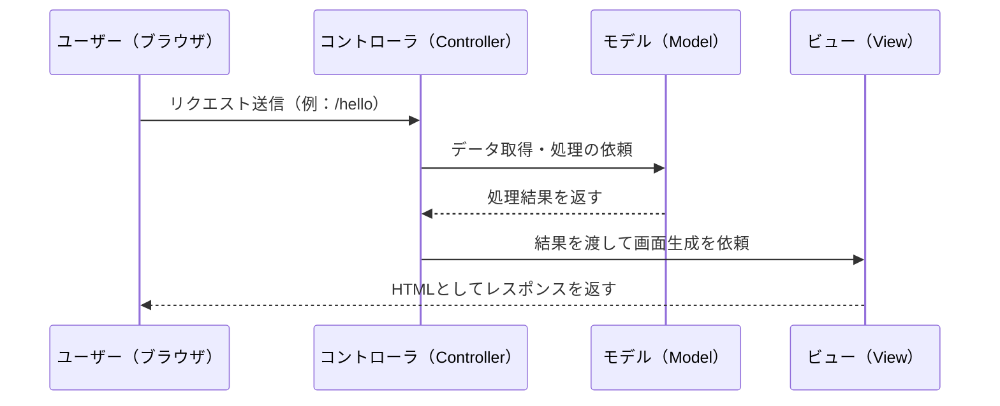
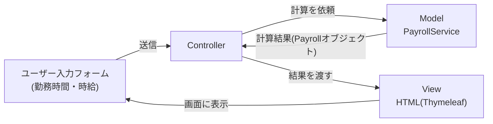
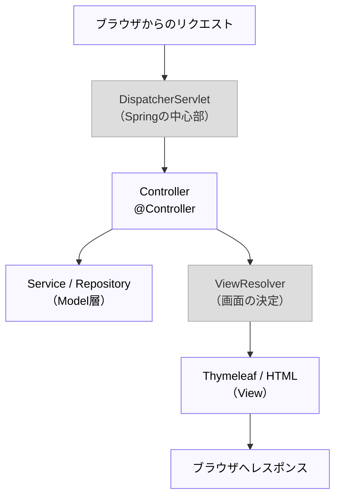
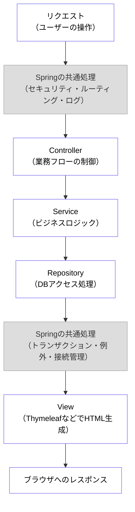

# MVCモデルの基本

この章では、Webアプリケーションの構造を理解するための基本概念である  
**MVCモデル（Model-View-Controller）** について学ぶ。  

Spring Frameworkを学ぶ前に、「Webアプリはどのようなプログラムから構成されるのか？」という全体像を掴むことが目的である。  
この章を通して、**アプリ全体の仕組みを俯瞰し、Springが何を自動化してくれるのか** を理解できるようにする。

## 学習のゴール

- MVCモデルの3つの役割（Model / View / Controller）を説明できる  
- ユーザーからのリクエストがどのように処理されるかを理解できる  
- 画面表示と処理の分離がなぜ重要かを説明できる  
- SpringがこのMVCモデルをどのように実現しているかをイメージできる  
- フレームワークが「共通処理」を肩代わりする意義を理解できる  

---


## 1. MVCとは？

**MVC** とは、アプリケーションを3つの役割に分けて設計する考え方である。

| 役割 | 担当すること | 具体例 |
|------|---------------|--------|
| **Model（モデル）** | データやビジネスロジックを扱う | データベースの操作、計算処理など |
| **View（ビュー）** | ユーザーに見せる画面を作る | HTML、Thymeleaf、CSSなど |
| **Controller（コントローラ）** | ユーザーからの操作を受け取り、ModelとViewをつなぐ | Springの`@Controller`クラスなど |

---

## 2. MVCの流れ（全体像）

ユーザーがブラウザからアクセスしてから、画面が表示されるまでの流れは以下の通り。



---

## 3. 具体的なイメージ（シンプルな例）

ここでは「給与計算アプリ」を題材に、MVCの流れを図でイメージする。  
ユーザーが勤務時間と時給を入力し、給与が自動で計算・表示される仕組みを例にとる。





---

## 4. 各役割のイメージ（Javaでの擬似例）

ここではSpringをまだ使わず、MVCの概念を掴むための最小サンプルを示す。  
単純な「給与計算アプリ」を例に、**Model（処理）とView（見た目）を分ける理由** を体感してみよう。

シナリオ：  
ユーザーが「勤務時間」と「時給」を入力すると、アプリが給与を計算して表示する。


```java showLineNumbers
// Controller（ユーザーのリクエストを受け取る）
public class PayrollController {
    private PayrollService service = new PayrollService();

    public String handleRequest(int hours, int hourlyWage) { // ユーザー入力を受け取る
        // Model層（Service）に処理を依頼
        Payroll payroll = service.calculateSalary(hours, hourlyWage); // ユーザー入力を元に給与計算する

        // View層に結果を渡してHTMLを生成
        return View.render(payroll);
    }
}
```

```java showLineNumbers
// Model（ビジネスロジックを扱う）
/** 給与計算を行うクラス */
public class PayrollService {
    /**　給与計算を行う */
    public Payroll calculateSalary(int hours, int hourlyWage) {
        int total = hours * hourlyWage;
        double tax = total * 0.1; // 仮に10%の税金
        int net = total - (int) tax;

        // 計算結果をオブジェクトにまとめて返す
        return new Payroll(hours, hourlyWage, total, net);
    }

    // 他にも、税率変更やボーナス計算など、ビジネスロジックをここに集約する
}
```

```java showLineNumbers
// 結果を保持するデータクラス（DTO）
public class Payroll {
    /** 勤務時間 */
    private final int hours;
    /** 時給 */
    private final int hourlyWage;
    /** 総支給額 */
    private final int total;
    /** 手取り額 */
    private final int net;

    public Payroll(int hours, int hourlyWage, int total, int net) {
        this.hours = hours;
        this.hourlyWage = hourlyWage;
        this.total = total;
        this.net = net;
    }

    public int getHours() { return hours; }
    public int getHourlyWage() { return hourlyWage; }
    public int getTotal() { return total; }
    public int getNet() { return net; }
}

```

```java showLineNumbers
// View（画面を作る）
public class View {
    public static String render(Payroll payroll) {
        // HTMLを組み立てる責務のみ
        return "<html><body>"
             + "<h1>給与計算結果</h1>"
             + "<p>勤務時間：" + payroll.getHours() + " 時間</p>"
             + "<p>時給：" + payroll.getHourlyWage() + " 円</p>"
             + "<p>支給額（税引前）：" + payroll.getTotal() + " 円</p>"
             + "<p>手取り（税引後）：" + payroll.getNet() + " 円</p>"
             + "</body></html>";
    }
}

```

**ポイント**

- `Model`（PayrollService）は「給与の計算」というビジネスロジックを担当  
  - 税率の変更や計算ルールの変更があっても、画面に影響しない  
- `View` は「どのように見せるか」を担当  
  - HTMLやレイアウトを変更しても、計算ロジックには影響しない  
    ※実際のSpringアプリでは、上記のようにJavaコードでHTMLを組み立てることはせず、Thymeleafを使う。
- `Controller` は両者をつなぐ橋渡し役であり、ユーザー入力を受け取り、Model → View の流れを制御する  

---

※悪例（全部ベタ書き）  
「入力の受け取り」 「計算ロジック」 「HTML生成」 「例外処理やログ」までを**1つのクラス・1つのメソッド**に押し込めた例。  
小さいうちは動いて見えるが、要件変更・デザイン変更・テストのたびに壊れやすく、保守性が極端に低い。

```java showLineNumbers
// 悪例：MVCの責務が分離されていない「なんでも入り」クラス
public class PayrollPage {

    // すべてを1メソッドで実施：入力 → 検証 → 計算 → HTML生成 → 例外まで
    public String handle(int hours, int hourlyWage) {
        long start = System.currentTimeMillis();

        try {
            // --- 入力検証（本来はControllerまたは専用バリデータの責務） ---
            if (hours < 0 || hourlyWage < 0) {
                return "<html><body><p style='color:red'>不正な入力です</p></body></html>";
            }

            // --- ビジネスロジック（本来はServiceの責務） ---
            int total = hours * hourlyWage;
            double tax = Math.floor(total * 0.10); // 10%の仮税
            int net = total - (int) tax;

            // 将来：残業、深夜、手当、控除… すべてここに加筆されていく地獄

            // --- 表示ロジック（本来はView/テンプレートの責務） ---
            StringBuilder html = new StringBuilder();
            html.append("<html><head><title>給与計算結果</title></head><body>");
            html.append("<h1>給与計算結果</h1>");
            html.append("<p>勤務時間：").append(hours).append(" 時間</p>");
            html.append("<p>時給：").append(hourlyWage).append(" 円</p>");
            html.append("<p>支給額（税引前）：").append(total).append(" 円</p>");
            html.append("<p>税額（10%）：").append((int) tax).append(" 円</p>");
            html.append("<p>手取り（税引後）：").append(net).append(" 円</p>");

            // 将来：デザイン変更や多言語化もここを直接編集（ロジックと表示が密結合）
            html.append("<footer style='font-size:12px;color:#666'>© PayrollPage</footer>");
            html.append("</body></html>");

            return html.toString();

        } catch (Exception e) {
            // --- 例外処理（本来は共通ハンドラ / AOP の責務） ---
            System.err.println("[ERROR] " + e.getMessage());
            return "<html><body><p style='color:red'>内部エラーが発生しました</p></body></html>";
        }
    }
}
```

**なぜ悪いか（問題点）**

- 表示（HTML）と計算（ビジネスロジック）と制御（入力/例外）が**密結合**しており、どれか1つの変更が他に波及する  
- テンプレート（Thymeleaf）を使えず、デザイナーと分業しづらい  
- 単体テストが困難（HTML文字列の中にロジックが埋まっている）  
- 再利用性が低い（計算処理を他画面で使い回せない）  

→ **MVCに分割する**ことで、ロジック・見た目・制御を疎結合にし、保守性・再利用性・テスト容易性を高めるのが目的。

---

## 5. MVCのメリット

| メリット | 説明 |
|-----------|------|
| **役割分担が明確** | 「画面」と「処理」を分けて開発できる |
| **保守性が高い** | デザイン変更時にビジネスロジックへ影響が少ない |
| **再利用性が高い** | Modelの処理を他画面でも使い回せる |
| **テストしやすい** | ビジネスロジックを単体テストしやすい |

---

## 6. Spring MVCとの関係

Spring Framework はこの **MVCモデルをベース** に設計されている。  
Springを学ぶ際は、「Controller」「Model」「View」がどう連携するかの流れをイメージすることが重要。

※グレーの部分はSpring内部の仕組みであり、本質的には理解しなくてもよいため、本テキストでは扱わない。



## 7. Springとアスペクト指向プログラミング（AOP）

ここまでの内容で「Webアプリは Model・View・Controller の3つの役割で構成される」ことを学んだ。  
しかし実際の開発では、アプリの種類に関わらず毎回必要になる**共通処理**が存在する。

- リクエストの受け付け・ルーティング  
- 認証・認可（ログイン制御）  
- 例外（エラー）処理  
- ログ出力（監査・計測）  
- トランザクション（処理の一貫性）管理  
- DBコネクションの取得・クローズ など  

これらは**どんなアプリでも共通**の処理であり、サービスの本質（ビジネスロジック）ではない。  
毎回自前で書くと、コードが複雑化し保守が難しくなる。  

Springはこれらの**共通処理をフレームワーク側で肩代わり**し、  
開発者が本質的な部分（＝Serviceのビジネスロジック）に集中できるよう設計されている。

下の図では、  
- **自前で書くべき箇所（開発者の責務）** を **白色**、  
- **Springが肩代わりする箇所（共通処理）** を **灰色**  
で表している。



この図の通り、Springはアプリ全体の「土台」部分（灰色）を担当している。  
開発者はそれ以外の「アプリ固有の本質部分（白色）」に注力できる。  

たとえば次のように考えるとわかりやすい：

| 処理の種類 | 誰が書く？ | 例 |
|-------------|-------------|----|
| 共通処理（ログ・セキュリティ・トランザクション管理など） | **Springが担当** | `@Transactional`, `@ControllerAdvice`, Security設定など |
| 本質処理（ビジネスロジック・業務フロー） | **開発者が担当** | `Service`, `Repository`, `Controller` の実装 |

Springは、**AOP（アスペクト指向プログラミング）** の仕組みにより、  
共通処理を必要な箇所に**自動的に差し込む**ことができる。  

この仕組みこそが、Springの「開発者をビジネスロジックに集中させる」本質である。

### AOP（アスペクト指向プログラミング）とは？

**AOP = 共通処理を横断的にまとめ、必要な箇所へ自動で差し込む仕組み。**  
これにより、各メソッドの冒頭・末尾に「ログ」「トランザクション」「例外処理」等を**毎回**書かなくてよくなる。  
結果として、**ビジネスロジックだけに集中した、読みやすいコード**になる。

```java showLineNumbers
// （AOPが無い世界の例）すべての業務メソッドに共通処理がベタ書きされる
public void registerUser(User user) {
    System.out.println("[LOG] start registerUser"); // 開始ログ出力
    try {
        transaction.begin();        // トランザクション開始
        repository.save(user);      // 本質：ユーザー登録
        transaction.commit();       // 正常終了
    } catch (Exception e) {
        transaction.rollback();     // 失敗時はロールバック
        errorLogger.error(e);
        throw e;
    } finally {
        System.out.println("[LOG] end registerUser"); // 終了ログ出力
    }
}
```

AOPを使うと、上の**ログ・トランザクション・例外処理**はフレームワークに任せられる。  
開発者は**本質の1行**だけを書けばよい。

```java showLineNumbers
// （Spring + AOP の世界）共通処理はフレームワークが自動付与
@Transactional        // ← トランザクションはアノテーション1つ
public void registerUser(User user) {
    repository.save(user); // ← 本質：ユーザー登録だけを書く
}
// ログや例外ハンドリングは @ControllerAdvice や AOP のアドバイスで一元管理
```

SpringがAOPをどのように実装しているかの詳細は、本テキストでは扱わない。  
重要なのは、**AOPにより共通処理をフレームワークが肩代わりできる** という点である。  

### Spring の目的（再確認）

| 処理の種類 | 誰が担当？ | 例 |
|---|---|---|
| 共通処理（セキュリティ/ログ/トランザクション/例外処理/接続管理） | **Spring** | `@Transactional`、フィルタ/インターセプタ、AOPアドバイス |
| 本質処理（ビジネスロジック） | **開発者** | `Service` の設計・実装 |

> **要点**：フレームワーク（Spring）は「システムの本質ではない部分」を引き受けるための仕組み。  
> だから Spring を使うと、**Controller と Service を中心に、システムの本質を書くことに集中できる**。

### 次章へのつながり

- この章で **MVCの全体像** と **共通処理はフレームワークに任せる意義** を掴んだ。  
- 以降の章では、Spring MVC / DI / MyBatis / Spring Security / Thymeleaf を使い、  
  ここで述べた考え方を**実際のコード**で体験していく。  
- 「なぜ省略されていると嬉しいのか？」――それは**本質に集中できるから**。  
  その設計思想こそが Spring の価値であり、以降の章の理解の土台になる。


---

## まとめ

- MVCは **Model（処理）・View（画面）・Controller（橋渡し）** に分けて設計する手法  
- この分離により、保守性・再利用性・テストのしやすさが向上する  
- Spring MVCはこの構造を自動化し、開発者がビジネスロジックに集中できるよう支援する  
- AOP（アスペクト指向）の考え方により、ログ・認証・トランザクションなどの**共通処理**をフレームワークが肩代わりし、開発者は「何を実現するか（Service）」に注力できるようになる  
