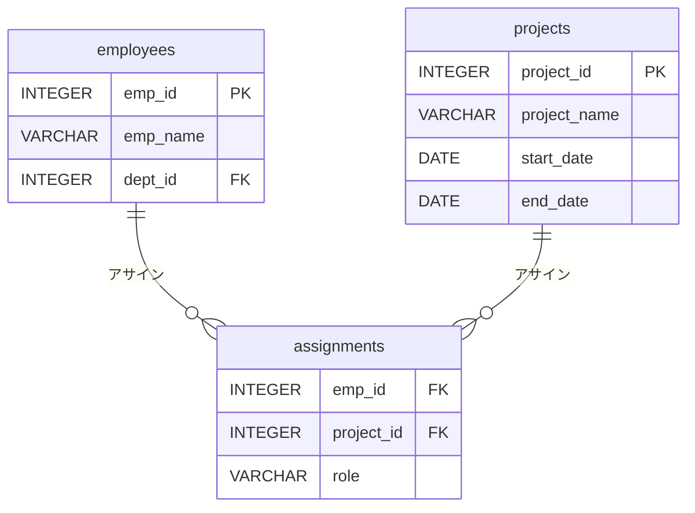

以下のER図において、`employees`（社員）と `projects`（プロジェクト）の関係のカーディナリティを選べ。

```mermaid
erDiagram
    employees {
        INTEGER emp_id PK
        VARCHAR emp_name
        INTEGER dept_id FK
    }
    assignments {
        INTEGER emp_id FK
        INTEGER project_id FK
        VARCHAR role
    }
    projects {
        INTEGER project_id PK
        VARCHAR project_name
        DATE start_date
        DATE end_date
    }
    employees ||--o{ assignments : "アサイン"
    projects ||--o{ assignments : "アサイン"
```
