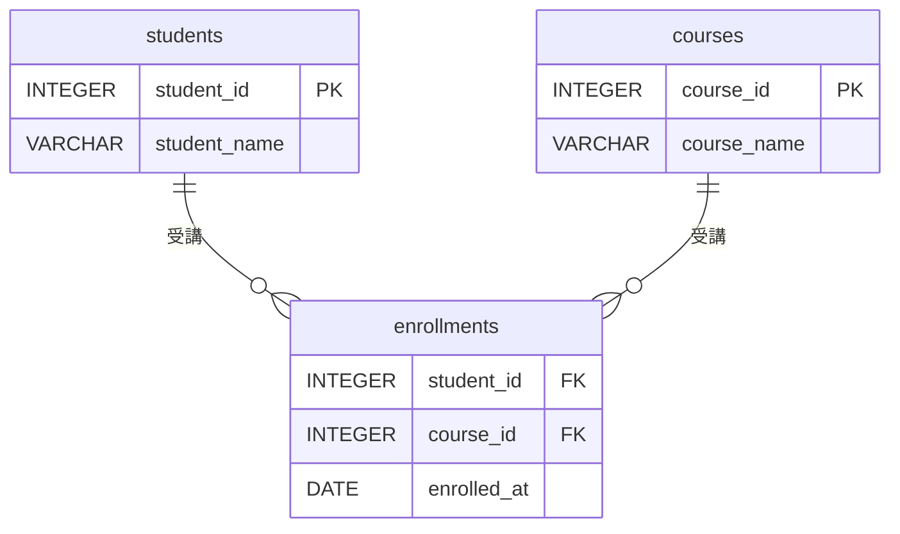

import { BlankInput } from '@site/src/components/question/inputs/BlankInput';
import { CodeBlock } from '@site/src/components/question/CodeBlock';

:::note SQL記述の約束
- テーブル名・カラム名は **小文字** で入力する（例: `employees`, `dept_id`）
- SQLキーワードは **大文字** で入力する（例: `SELECT`, `FROM`, `WHERE`）

正しい例: `SELECT emp_name FROM employees WHERE dept_id = 1;`
:::

以下のER図を参照し、`enrollments`（中間テーブル）を作成するCREATE TABLE文を完成させよ。

「学生（`students`）と授業（`courses`）の多対多関係を管理する中間テーブル `enrollments` を設計せよ」
という要件で、以下のCREATE TABLE文を完成させよ。

<CodeBlock>
{`CREATE TABLE enrollments (
    student_id  INTEGER `}<BlankInput id="blank1" />{` students(student_id),
    course_id   INTEGER `}<BlankInput id="blank2" />{` courses(course_id),
    enrolled_at DATE,
    `}<BlankInput id="blank3" />{` KEY (student_id, course_id)
);`}
</CodeBlock>
