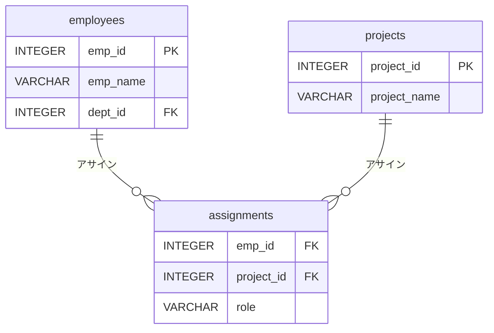

import { BlankInput } from '@site/src/components/question/inputs/BlankInput';
import { CodeBlock } from '@site/src/components/question/CodeBlock';

:::note SQL記述の約束
- テーブル名・カラム名は **小文字** で入力する（例: `employees`, `dept_id`）
- SQLキーワードは **大文字** で入力する（例: `SELECT`, `FROM`, `WHERE`）

正しい例: `SELECT emp_name FROM employees WHERE dept_id = 1;`
:::

以下のER図を参照し、`assignments` テーブルを作成するCREATE TABLE文を完成させよ。
（`emp_id` と `project_id` が複合主キー、それぞれ外部キー）

<CodeBlock>
{`CREATE TABLE assignments (
    emp_id     INTEGER `}<BlankInput id="blank1" />{` employees(emp_id),
    project_id INTEGER REFERENCES projects(project_id),
    role       VARCHAR(50),
    `}<BlankInput id="blank2" />{` KEY (emp_id, project_id)
);`}
</CodeBlock>
