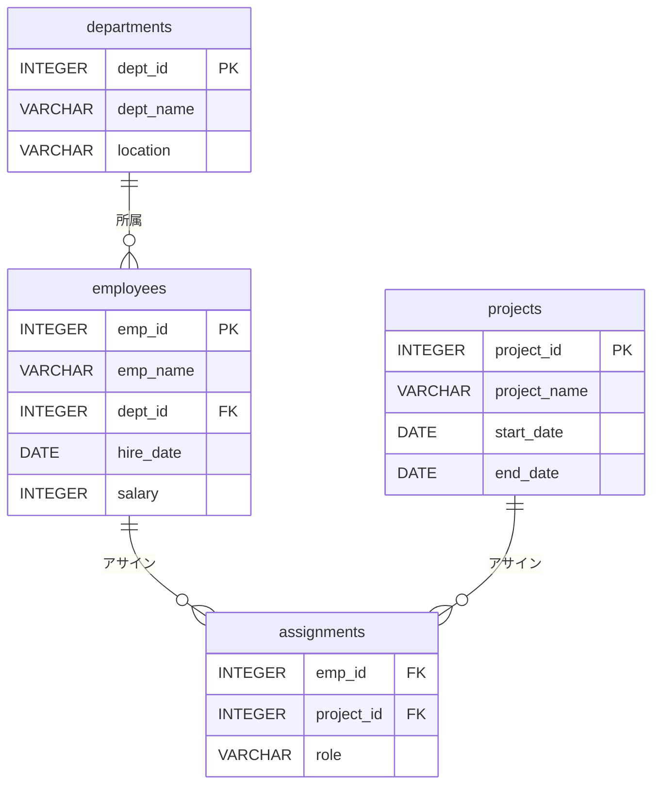

以下のER図を参照し、`employees` エンティティの属性（列に対応する情報）として正しいものを選べ。

```mermaid
erDiagram
    departments {
        INTEGER dept_id PK
        VARCHAR dept_name
        VARCHAR location
    }
    employees {
        INTEGER emp_id PK
        VARCHAR emp_name
        INTEGER dept_id FK
        DATE hire_date
        INTEGER salary
    }
    projects {
        INTEGER project_id PK
        VARCHAR project_name
        DATE start_date
        DATE end_date
    }
    assignments {
        INTEGER emp_id FK
        INTEGER project_id FK
        VARCHAR role
    }
    departments ||--o{ employees : "所属"
    employees ||--o{ assignments : "アサイン"
    projects ||--o{ assignments : "アサイン"
```
