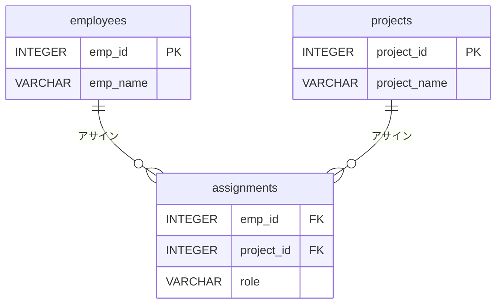

以下のER図は、社員（`employees`）とプロジェクト（`projects`）の多対多関係を実装したものである。
多対多のリレーションシップをRDBで実装する方法として正しいものを選べ。

```mermaid
erDiagram
    employees {
        INTEGER emp_id PK
        VARCHAR emp_name
    }
    assignments {
        INTEGER emp_id FK
        INTEGER project_id FK
        VARCHAR role
    }
    projects {
        INTEGER project_id PK
        VARCHAR project_name
    }
    employees ||--o{ assignments : "アサイン"
    projects ||--o{ assignments : "アサイン"
```
