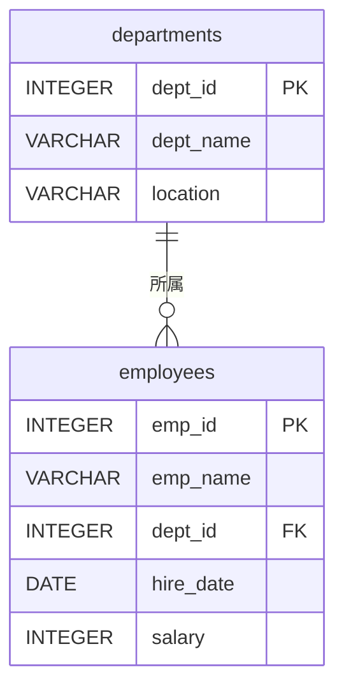

以下のER図が表す意味として正しいものを選べ。

```mermaid
erDiagram
    departments {
        INTEGER dept_id PK
        VARCHAR dept_name
        VARCHAR location
    }
    employees {
        INTEGER emp_id PK
        VARCHAR emp_name
        INTEGER dept_id FK
        DATE hire_date
        INTEGER salary
    }
    departments ||--o{ employees : "所属"
```
