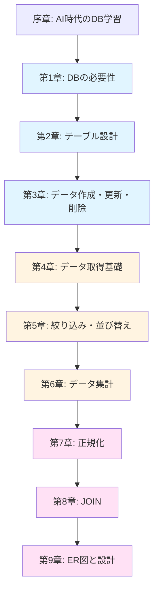

# データベース教材設計書

**最終更新:** 2026年1月30日  
**対象:** プログラミングブートキャンプ受講生（Java基礎学習済み、DB未経験）  
**学習期間:** 3日間（Day 5, 10, 15）  
**使用DBMS:** PostgreSQL（OneCompiler実行環境）

---

## 教材の基本方針

### AI時代のデータベース学習

本教材は、AI支援ツールが普及した現代において、**なぜデータベースの概念理解が重要か**を明確に位置づける。

**AIがSQLを生成できる時代に、なぜDB学習が必要なのか:**

1. **要件をAIに正確に伝えるには概念理解が不可欠**
   - 「部門ごとの平均年齢を出して」と伝えるには、GROUP BYの概念を知る必要がある
   - 「社員と部門を紐づけて表示」と伝えるには、JOINの必要性を理解する必要がある

2. **AIが生成したSQLの妥当性を判断できる**
   - 生成されたSQLが要件を満たしているかレビューできる
   - パフォーマンス問題や論理エラーに気づける

3. **データベース設計はAIに任せられない**
   - ER図の作成、正規化判断は人間の業務理解が必要
   - チーム開発でのDB設計議論に参加できる

### 教材の特徴

- **構文暗記ではなく「なぜ必要か」から理解する**
  - 各章のStep 0で問題を体験し、技術の必要性を実感させる
  - 「テーブルを分割する理由」「JOINが必要な理由」など本質的な問いから始める

- **Spring/MyBatisでの実践を見据えた学習**
  - 最終目標: チームでER図を設計し、MyBatisでDB操作するWebアプリを作る
  - Day 18のMyBatis学習にスムーズに接続できる内容

- **PostgreSQL標準SQLで学習**
  - OneCompilerで実行可能なサンプルDBを使用
  - PostgreSQL方言は最小限に抑え、標準SQLを優先

- **AI活用を前提とした演習設計**
  - 「AIに指示を出してSQLを生成させる」演習も含む
  - 生成されたSQLをレビューする力を養成

---

## 全体構成

### 章立て一覧

| 章    | タイトル                   | Day | 推定時間 | 主な学習内容                                 |
| ----- | -------------------------- | --- | -------- | -------------------------------------------- |
| 序章  | AI時代のデータベース学習   | 5   | 0.5h     | なぜDB学習が必要か、教材の使い方             |
| 第1章 | データベースの必要性       | 5   | 1.5h     | データ管理の課題、DBMSの役割、RDBの特徴      |
| 第2章 | テーブル設計の基礎         | 5   | 2h       | テーブル構造、データ型、制約、主キー         |
| 第3章 | データの作成・更新・削除   | 5   | 2h       | INSERT, UPDATE, DELETE、トランザクション概念 |
| 第4章 | データの取得（基礎）       | 10  | 1.5h     | SELECT基礎、列指定、重複除去                 |
| 第5章 | データの絞り込みと並び替え | 10  | 2h       | WHERE句、比較演算子、LIKE、ORDER BY          |
| 第6章 | データの集計               | 10  | 2.5h     | GROUP BY、集約関数、HAVING句                 |
| 第7章 | テーブルの分割と正規化     | 15  | 2h       | 正規化の必要性、第1-3正規形、更新不整合      |
| 第8章 | テーブルの結合             | 15  | 2.5h     | INNER JOIN、LEFT JOIN、自己結合              |
| 第9章 | ER図とデータベース設計     | 15  | 1.5h     | ER図の読み書き、カーディナリティ、設計演習   |

**合計推定時間:** 18時間（3日間 × 6時間）

### カテゴリ分類

```typescript
// docs/src/structure.ts での定義
const DB_CATEGORY = {
  basics: "db/basics", // 第1-3章: DB基礎とCRUD操作
  select: "db/select", // 第4-6章: SELECT文とデータ取得
  design: "db/design", // 第7-9章: 正規化、JOIN、ER図
};
```

### 章間の依存関係



---

## サンプルデータベース設計

### 使用するサンプルDB: 「社員管理システム」

**選定理由:**

- ビジネスの基本概念で理解しやすい
- 正規化、JOINの必要性を説明しやすい
- チーム開発での設計演習に応用可能

### テーブル構成

#### 1. departments（部門テーブル）

| 列名      | 型          | 制約            | 説明   |
| --------- | ----------- | --------------- | ------ |
| dept_id   | INTEGER     | PRIMARY KEY     | 部門ID |
| dept_name | VARCHAR(50) | NOT NULL UNIQUE | 部門名 |
| location  | VARCHAR(50) |                 | 所在地 |

#### 2. employees（社員テーブル）

| 列名      | 型           | 制約                      | 説明           |
| --------- | ------------ | ------------------------- | -------------- |
| emp_id    | INTEGER      | PRIMARY KEY               | 社員ID         |
| emp_name  | VARCHAR(50)  | NOT NULL                  | 氏名           |
| dept_id   | INTEGER      | FOREIGN KEY → departments | 所属部門ID     |
| hire_date | DATE         | NOT NULL                  | 入社日         |
| salary    | INTEGER      | CHECK (salary > 0)        | 給与           |
| email     | VARCHAR(100) | UNIQUE                    | メールアドレス |

#### 3. projects（プロジェクトテーブル）

| 列名         | 型           | 制約        | 説明           |
| ------------ | ------------ | ----------- | -------------- |
| project_id   | INTEGER      | PRIMARY KEY | プロジェクトID |
| project_name | VARCHAR(100) | NOT NULL    | プロジェクト名 |
| start_date   | DATE         |             | 開始日         |
| end_date     | DATE         |             | 終了予定日     |

#### 4. assignments（アサインメントテーブル - 中間テーブル）

| 列名          | 型          | 制約                    | 説明           |
| ------------- | ----------- | ----------------------- | -------------- |
| assignment_id | INTEGER     | PRIMARY KEY             | アサインID     |
| emp_id        | INTEGER     | FOREIGN KEY → employees | 社員ID         |
| project_id    | INTEGER     | FOREIGN KEY → projects  | プロジェクトID |
| role          | VARCHAR(50) |                         | 役割           |

**正規化のポイント:**

- 社員と部門: 1対多（1部門に複数社員）
- 社員とプロジェクト: 多対多（中間テーブルで解決）

---

## 各章の詳細設計

### 序章: AI時代のデータベース学習

#### この章で得られるスキル

- [ ] AI時代になぜDB学習が必要かを説明できる
- [ ] データベースとファイルの違いを説明できる
- [ ] 本教材の学習の進め方を理解している

#### なぜこの内容が必要か

プログラミング未経験者は「AIが書いてくれるのに、なぜSQLを学ぶのか?」という疑問を持つ。この疑問に最初に答えることで、学習のモチベーションを高める。

#### 章構成

- **導入**: ChatGPTにSQLを書かせるデモ
  - 「部門ごとの社員数を教えて」→ SQLが生成される
  - しかし「GROUP BY」の意味を知らないと要件を伝えられない
- **本質の説明**: AIに任せられない3つのこと
  1. 要件を正確に伝える（概念理解が必要）
  2. 生成されたSQLをレビューする
  3. データベース設計（ER図、正規化）

- **学習の進め方**
  - 構文暗記ではなく「なぜ必要か」から理解する
  - OneCompilerで実際に動かしながら学ぶ
  - チーム開発でのDB設計を最終目標とする

#### 全体の方針

- 序章は短く（15-20分）、本編に早く進めるようにする
- AI活用の事例を示し、概念理解の重要性を印象づける
- 学習者の不安（「覚えることが多そう」）を解消する

---

### 第1章: データベースの必要性

#### この章で得られるスキル

- [ ] ファイル管理とDB管理の違いを説明できる
- [ ] DBMSの主な機能（同時実行制御、トランザクション）を説明できる
- [ ] リレーショナルデータベースの特徴を理解している
- [ ] テーブル、行、列の概念を説明できる

#### なぜこの技術が必要か

**問題**: Excelやテキストファイルでデータを管理すると...

- 複数人で同時編集できない（ファイルがロックされる）
- データの整合性が保てない（社員情報と給与情報が別ファイルで食い違う）
- 大量データの検索が遅い

**解決**: データベース管理システム（DBMS）を使うと...

- 同時実行制御で複数人が安全に操作できる
- トランザクション管理でデータの整合性を保つ
- インデックスで高速検索

#### 章構成

**Step 0: まず体験してみよう**

- シナリオ: 社員名簿をExcelで管理している会社
- 問題発生: 2人が同時に編集→片方のデータが消える
- 問題発生: 部門名を変更したら、社員シートの部門名と食い違う
- → データベースならこの問題が起きない理由を後で学ぶ

**Step 1: データ管理の課題**

- ファイルベース管理の限界
- 複数人での作業、データの整合性、検索速度

**Step 2: DBMSの役割**

- データベース管理システムとは
- 主な機能の概要（詳細は後の章で学ぶ）
  - データ操作機能（SQL）
  - 同時実行制御
  - トランザクション管理（概念のみ、第3章で詳述）

**Step 3: リレーショナルデータベースとは**

- 「表」でデータを管理する
- テーブル、行（レコード）、列（カラム）の概念
- 主キーと外部キーの役割（概念のみ、第2章で詳述）

**Step 4: テーブルの例を見てみよう**

- departmentsテーブルとemployeesテーブルの例
- 2つのテーブルが「外部キー」で関連付けられている
- なぜ1つのテーブルにしないのか?（第7章で詳しく学ぶ）

**Step 5: OneCompilerでテーブルを見てみよう**

- OneCompilerの使い方
- サンプルDBの確認
- `SELECT * FROM departments;` を実行してみる

**Step 6: データベースを使う場面**

- Webアプリケーション（Spring + MyBatis）
- スマホアプリ
- 業務システム

**Step 7: Spring開発での位置づけ**

- MVCモデルの中でのDBの役割
- MyBatisがSQLとJavaを橋渡しする
- Day 18で学ぶ内容の予告

**Step 8: 実践課題**

1. 自分の身の回りでデータベースが使われている例を3つ挙げよ
2. ファイル管理とDB管理の違いを3つ説明せよ
3. OneCompilerでサンプルDBの全テーブルを表示せよ

#### 全体の方針

- 技術的な詳細に入る前に「なぜDBが必要か」を納得させる
- Step 0で問題を体験させ、学習の動機づけを行う
- 専門用語（DBMS、RDBMS、トランザクション）には必ず注釈を入れる
- 後の章で詳しく学ぶ内容は「概念のみ」にとどめる

#### structure.tsへの定義

```typescript
export const dbBasicsTopic: Topic = withAutoIds({
  id: 1,
  title: "データベースの必要性",
  categoryId: "db/basics",
  questions: [
    {
      type: QuestionType.KNOW,
      title: "ファイル管理の課題を説明できる",
      mdxPath: "db/basics/why-database.mdx",
      section: "ファイル管理の限界",
    },
    {
      type: QuestionType.KNOW,
      title: "DBMSの主な機能を説明できる",
      mdxPath: "db/basics/why-database.mdx",
      section: "DBMSの役割",
    },
    {
      type: QuestionType.KNOW,
      title: "テーブル、行、列の概念を説明できる",
      mdxPath: "db/basics/why-database.mdx",
      section: "テーブル構造",
    },
    {
      type: QuestionType.READ,
      title: "サンプルDBのテーブル構造を理解できる",
      mdxPath: "db/basics/why-database.mdx",
      section: "サンプルDB",
    },
    {
      type: QuestionType.WRITE,
      title: "OneCompilerでテーブルの内容を表示できる",
      mdxPath: "db/basics/why-database.mdx",
      section: "OneCompilerの使い方",
    },
  ],
});
```

#### 演習問題との対応

| Question ID | 演習ファイル                   | 内容                                 |
| ----------- | ------------------------------ | ------------------------------------ |
| db-basics-1 | -                              | 理論問題（ファイル管理の課題を説明） |
| db-basics-2 | -                              | 理論問題（DBMSの機能を説明）         |
| db-basics-3 | -                              | 理論問題（テーブル構造を説明）       |
| db-basics-4 | exercises/db/01_sample_db.sql  | サンプルDBのER図を読む               |
| db-basics-5 | exercises/db/01_select_all.sql | 全テーブルを表示するSQLを書く        |

---

### 第2章: テーブル設計の基礎

#### この章で得られるスキル

- [ ] CREATE TABLE文でテーブルを作成できる
- [ ] 適切なデータ型を選択できる
- [ ] NOT NULL制約、UNIQUE制約を設定できる
- [ ] 主キー（PRIMARY KEY）の役割を説明できる
- [ ] 外部キー（FOREIGN KEY）の役割を説明できる
- [ ] CHECK制約でデータの妥当性を保証できる

#### なぜこの技術が必要か

**問題**: テーブル設計が不適切だと...

- 不正なデータが登録されてしまう（例: 給与が負の数）
- 同じデータが重複して登録される（例: 同じメールアドレスの社員）
- データの関連性が壊れる（例: 存在しない部門IDが登録される）

**解決**: 適切な型と制約を設定すると...

- データベース側で自動的にチェックしてくれる
- アプリケーション側のバグがあっても、DBがデータを守る

#### 章構成

**Step 0: まず体験してみよう**

- シナリオ: 制約がないテーブルに不正データを入れてみる
  ```sql
  -- 給与が負の数で登録できてしまう！
  INSERT INTO employees_bad (name, salary) VALUES ('田中', -100000);
  -- 同じメールアドレスが重複登録できてしまう！
  INSERT INTO employees_bad (email) VALUES ('test@example.com');
  INSERT INTO employees_bad (email) VALUES ('test@example.com');
  ```
- → 制約があれば、これらのエラーを防げる

**Step 1: テーブルの作成（CREATE TABLE）**

- CREATE TABLE文の基本構文
- テーブル名、列名の命名規則
- 最もシンプルなテーブルの例

**Step 2: データ型の選択**

- 主なデータ型の紹介
  - 整数型（INTEGER）
  - 文字列型（VARCHAR、TEXT）
  - 日付型（DATE、TIMESTAMP）
  - 真偽値型（BOOLEAN）
- 型選択のポイント（桁数、精度、検索速度）

**Step 3: NOT NULL制約**

- NULLとは何か（「値がわからない」状態）
- 必須項目にはNOT NULLを付ける
- NULLを許可するケース

**Step 4: UNIQUE制約**

- 重複を許さない列の設定
- メールアドレス、ユーザー名などに使う
- PRIMARY KEYとの違い

**Step 5: PRIMARY KEY（主キー）**

- 主キーの役割（各行を一意に識別）
- 主キーの選び方（自然キー vs 代理キー）
- 複合主キー（複数列の組み合わせ）

**Step 6: FOREIGN KEY（外部キー）**

- 外部キーの役割（テーブル間の関連性を保証）
- 参照整合性制約
- 存在しない部門IDを登録しようとするとエラーになる例

**Step 7: CHECK制約**

- 値の範囲をチェックする
- 給与は正の数、メールアドレスには@が含まれる、など
- PostgreSQLでのCHECK制約の書き方

**Step 8: 実践課題**

1. 商品テーブル（products）を設計せよ
   - 商品ID、商品名、価格、在庫数
   - 適切な型と制約を設定
2. 制約違反のINSERT文を書いて、エラーを確認せよ
3. ER図からCREATE TABLE文を書く演習

#### 全体の方針

- Step 0で「制約がないと何が困るか」を体験させる
- 各制約の技術的な説明よりも「なぜ必要か」を重視
- Spring/MyBatisでは自動生成されるが、理解は必要であることを伝える
- OneCompilerで実際に作成・エラーを確認させる

#### structure.tsへの定義

```typescript
export const dbTableDesignTopic: Topic = withAutoIds({
  id: 2,
  title: "テーブル設計の基礎",
  categoryId: "db/basics",
  questions: [
    {
      type: QuestionType.WRITE,
      title: "テーブルを作成できる",
      mdxPath: "db/basics/table-design.mdx",
      section: "CREATE TABLE",
    },
    {
      type: QuestionType.KNOW,
      title: "適切なデータ型を選択できる",
      mdxPath: "db/basics/table-design.mdx",
      section: "データ型",
    },
    {
      type: QuestionType.KNOW,
      title: "NOT NULL制約の役割を説明できる",
      mdxPath: "db/basics/table-design.mdx",
      section: "NOT NULL制約",
    },
    {
      type: QuestionType.KNOW,
      title: "UNIQUE制約の役割を説明できる",
      mdxPath: "db/basics/table-design.mdx",
      section: "UNIQUE制約",
    },
    {
      type: QuestionType.KNOW,
      title: "主キーの役割を説明できる",
      mdxPath: "db/basics/table-design.mdx",
      section: "主キー",
    },
    {
      type: QuestionType.KNOW,
      title: "外部キーの役割を説明できる",
      mdxPath: "db/basics/table-design.mdx",
      section: "外部キー",
    },
    {
      type: QuestionType.WRITE,
      title: "CHECK制約でデータの妥当性を保証できる",
      mdxPath: "db/basics/table-design.mdx",
      section: "CHECK制約",
    },
    {
      type: QuestionType.WRITE,
      title: "要件からテーブル定義を作成できる",
      mdxPath: "db/basics/table-design.mdx",
      section: "実践課題",
    },
  ],
});
```

#### 演習問題との対応

| Question ID  | 演習ファイル                       | 内容                       |
| ------------ | ---------------------------------- | -------------------------- |
| db-basics-6  | exercises/db/02_create_table.sql   | シンプルなテーブル作成     |
| db-basics-7  | -                                  | 理論問題（データ型の選択） |
| db-basics-8  | exercises/db/02_not_null.sql       | NOT NULL制約の確認         |
| db-basics-9  | exercises/db/02_unique.sql         | UNIQUE制約の確認           |
| db-basics-10 | -                                  | 理論問題（主キーの説明）   |
| db-basics-11 | exercises/db/02_foreign_key.sql    | 外部キー制約の確認         |
| db-basics-12 | exercises/db/02_check.sql          | CHECK制約の設定            |
| db-basics-13 | exercises/db/02_products_table.sql | 商品テーブルの設計         |

---

### 第3章: データの作成・更新・削除

#### この章で得られるスキル

- [ ] INSERT文でデータを追加できる
- [ ] UPDATE文でデータを更新できる
- [ ] DELETE文でデータを削除できる
- [ ] 外部キー制約があるテーブルでのデータ操作ができる
- [ ] トランザクションの概念を説明できる
- [ ] COMMIT、ROLLBACKの役割を理解している

#### なぜこの技術が必要か

**問題**: データ操作中にエラーが起きると...

- 銀行の送金で、引き落としだけ成功して入金が失敗したら？
- 社員の削除で、社員テーブルから消えたがプロジェクトのアサイン情報は残ったら？

**解決**: トランザクションで「全部成功」か「全部失敗」にする

- 途中でエラーが起きたら全部取り消せる（ROLLBACK）
- 全部成功したら確定する（COMMIT）

#### 章構成

**Step 0: まず体験してみよう**

- シナリオ: 銀行の送金処理をシミュレーション
  ```sql
  -- Aさんの口座から1万円引き落とす
  UPDATE accounts SET balance = balance - 10000 WHERE account_id = 1;
  -- ここでエラーが起きたら？
  -- Bさんの口座に1万円入金する
  UPDATE accounts SET balance = balance + 10000 WHERE account_id = 2;
  ```
- → トランザクションがないと、Aさんのお金だけ減って消える！

**Step 1: データの追加（INSERT）**

- INSERT文の基本構文
- 全列を指定する方法、一部の列だけ指定する方法
- 複数行を一度に追加する方法

**Step 2: 外部キーがあるテーブルへの追加**

- 部門が存在しない社員は登録できない
- 参照整合性制約のエラーを確認
- 正しい順序でデータを登録する（親→子）

**Step 3: データの更新（UPDATE）**

- UPDATE文の基本構文
- WHERE句で更新対象を絞る（重要！）
- WHERE句を忘れると全行が更新されてしまう危険性

**Step 4: データの削除（DELETE）**

- DELETE文の基本構文
- WHERE句で削除対象を絞る（重要！）
- WHERE句を忘れると全行が削除されてしまう危険性

**Step 5: 外部キー制約と削除**

- 社員が所属している部門は削除できない
- 削除の順序（子→親）
- CASCADE オプション（参考）

**Step 6: トランザクションとは**

- 複数の操作を1つの単位として扱う
- ACID特性の概要（原子性、一貫性、独立性、永続性）
- なぜトランザクションが必要か（Step 0の問題を解決）

**Step 7: COMMIT と ROLLBACK**

- BEGIN、COMMIT、ROLLBACKの使い方
- トランザクション中のエラー処理
- Spring/MyBatisでは自動的に管理されることを説明

**Step 8: 実践課題**

1. 新しい部門と社員を追加せよ（外部キー制約を意識）
2. 全社員の給与を10%引き上げるUPDATEを書け
3. トランザクションを使って、複数テーブルの更新を安全に行え

#### 全体の方針

- CRUD操作の「CUD」をこの章で習得
- WHERE句の重要性を繰り返し強調（忘れると大惨事）
- トランザクションは概念のみ（Spring学習で詳しく扱う）
- OneCompilerでエラーを実際に体験させる

#### structure.tsへの定義

```typescript
export const dbCrudTopic: Topic = withAutoIds({
  id: 3,
  title: "データの作成・更新・削除",
  categoryId: "db/basics",
  questions: [
    {
      type: QuestionType.WRITE,
      title: "データを追加できる",
      mdxPath: "db/basics/crud-operations.mdx",
      section: "INSERT文",
    },
    {
      type: QuestionType.WRITE,
      title: "外部キー制約を考慮してデータを追加できる",
      mdxPath: "db/basics/crud-operations.mdx",
      section: "外部キーと追加",
    },
    {
      type: QuestionType.WRITE,
      title: "条件を指定してデータを更新できる",
      mdxPath: "db/basics/crud-operations.mdx",
      section: "UPDATE文",
    },
    {
      type: QuestionType.WRITE,
      title: "条件を指定してデータを削除できる",
      mdxPath: "db/basics/crud-operations.mdx",
      section: "DELETE文",
    },
    {
      type: QuestionType.KNOW,
      title: "外部キー制約が削除に与える影響を説明できる",
      mdxPath: "db/basics/crud-operations.mdx",
      section: "外部キーと削除",
    },
    {
      type: QuestionType.KNOW,
      title: "トランザクションの必要性を説明できる",
      mdxPath: "db/basics/crud-operations.mdx",
      section: "トランザクション概念",
    },
    {
      type: QuestionType.KNOW,
      title: "COMMITとROLLBACKの役割を説明できる",
      mdxPath: "db/basics/crud-operations.mdx",
      section: "COMMIT と ROLLBACK",
    },
    {
      type: QuestionType.WRITE,
      title: "複数テーブルを安全に更新できる",
      mdxPath: "db/basics/crud-operations.mdx",
      section: "実践課題",
    },
  ],
});
```

#### 演習問題との対応

| Question ID  | 演習ファイル                    | 内容                         |
| ------------ | ------------------------------- | ---------------------------- |
| db-basics-14 | exercises/db/03_insert.sql      | 基本的なINSERT文             |
| db-basics-15 | exercises/db/03_insert_fk.sql   | 外部キーを考慮したINSERT     |
| db-basics-16 | exercises/db/03_update.sql      | UPDATE文の練習               |
| db-basics-17 | exercises/db/03_delete.sql      | DELETE文の練習               |
| db-basics-18 | -                               | 理論問題（外部キーと削除）   |
| db-basics-19 | -                               | 理論問題（トランザクション） |
| db-basics-20 | -                               | 理論問題（COMMIT/ROLLBACK）  |
| db-basics-21 | exercises/db/03_transaction.sql | トランザクションの実践       |

---

### 第4章: データの取得（基礎）

#### この章で得られるスキル

- [ ] SELECT文でテーブルからデータを取得できる
- [ ] 特定の列だけを取得できる
- [ ] 列名に別名（エイリアス）を付けられる
- [ ] DISTINCTで重複を除去できる
- [ ] LIMITで取得件数を制限できる

#### なぜこの技術が必要か

**問題**: 大量のデータから必要な情報だけを取り出したい

- 社員テーブルに1万人のデータがあるが、最初の10人だけ見たい
- 所属部門の一覧を見たいが、重複した部門名が何度も表示される
- すべての列は不要で、名前とメールアドレスだけ見たい

**解決**: SELECT文で必要なデータだけを指定して取得

- DISTINCT: 重複を除去
- LIMIT: 件数制限
- 列指定: 必要な列だけ取得

#### 章構成

**Step 0: まず体験してみよう**

- シナリオ: `SELECT * FROM employees;` を実行
- 全列、全行が表示される → 見づらい
- 必要な情報だけを取り出す方法を学ぶ

**Step 1: SELECT文の基本**

- SELECT文の基本構文
- `SELECT * FROM テーブル名;` で全件取得
- SQL文の終わりにセミコロンを付ける

**Step 2: 列の指定**

- 特定の列だけを取得
- 複数列の指定
- 列の順序を変える

**Step 3: 列の別名（AS）**

- AS句で列名に別名を付ける
- 日本語の列名も使える（おすすめはしない）
- Spring/MyBatisでのフィールドマッピングに役立つ

**Step 4: 式を使った列の作成**

- 計算式を使った列
- 文字列の連結
- NULL値の扱い

**Step 5: 重複の除去（DISTINCT）**

- DISTINCTで重複を除去
- どんなときに使うか（部門の一覧、都道府県の一覧）
- 複数列に対するDISTINCT

**Step 6: 取得件数の制限（LIMIT）**

- LIMITで最初のN件だけ取得
- OFFSETで開始位置を指定（ページネーション）
- PostgreSQL標準の書き方

**Step 7: AI活用のポイント**

- ChatGPTに「社員の名前とメールアドレスを取得するSQL」を書かせる
- 生成されたSQLを読んで理解できるか確認
- 自分で修正できるレベルを目指す

**Step 8: 実践課題**

1. 部門の一覧（重複なし）を取得せよ
2. 社員の名前と給与だけを取得し、給与を「年収」と表示せよ
3. 最近入社した社員5人を取得せよ（ORDER BYは次章で学ぶので、ヒント付き）

#### 全体の方針

- SELECT文の基礎をしっかり固める（後の章で頻繁に使う）
- WHERE句、ORDER BYは次章に回し、まずは基本構文を理解させる
- AIに書かせたSQLを読めるようになることを強調
- OneCompilerで実行結果を確認させる

#### structure.tsへの定義

```typescript
export const dbSelectBasicsTopic: Topic = withAutoIds({
  id: 4,
  title: "データの取得（基礎）",
  categoryId: "db/select",
  questions: [
    {
      type: QuestionType.WRITE,
      title: "テーブルから全データを取得できる",
      mdxPath: "db/select/select-basics.mdx",
      section: "SELECT基本",
    },
    {
      type: QuestionType.WRITE,
      title: "特定の列だけを取得できる",
      mdxPath: "db/select/select-basics.mdx",
      section: "列の指定",
    },
    {
      type: QuestionType.WRITE,
      title: "列に別名を付けられる",
      mdxPath: "db/select/select-basics.mdx",
      section: "列の別名",
    },
    {
      type: QuestionType.WRITE,
      title: "計算式を使った列を作成できる",
      mdxPath: "db/select/select-basics.mdx",
      section: "式を使った列",
    },
    {
      type: QuestionType.WRITE,
      title: "重複を除去してデータを取得できる",
      mdxPath: "db/select/select-basics.mdx",
      section: "DISTINCT",
    },
    {
      type: QuestionType.WRITE,
      title: "取得件数を制限できる",
      mdxPath: "db/select/select-basics.mdx",
      section: "LIMIT",
    },
    {
      type: QuestionType.READ,
      title: "AIが生成したSELECT文を理解できる",
      mdxPath: "db/select/select-basics.mdx",
      section: "AI活用",
    },
    {
      type: QuestionType.WRITE,
      title: "要件に応じたSELECT文を書ける",
      mdxPath: "db/select/select-basics.mdx",
      section: "実践課題",
    },
  ],
});
```

#### 演習問題との対応

| Question ID | 演習ファイル                       | 内容                |
| ----------- | ---------------------------------- | ------------------- |
| db-select-1 | exercises/db/04_select_all.sql     | 全件取得            |
| db-select-2 | exercises/db/04_select_columns.sql | 列の指定            |
| db-select-3 | exercises/db/04_alias.sql          | 列の別名            |
| db-select-4 | exercises/db/04_expression.sql     | 計算式              |
| db-select-5 | exercises/db/04_distinct.sql       | DISTINCT            |
| db-select-6 | exercises/db/04_limit.sql          | LIMIT               |
| db-select-7 | exercises/db/04_ai_review.sql      | AI生成SQLのレビュー |
| db-select-8 | exercises/db/04_practice.sql       | 実践課題            |

---

### 第5章: データの絞り込みと並び替え

#### この章で得られるスキル

- [ ] WHERE句で条件を指定してデータを絞り込める
- [ ] 比較演算子（=、<>、>、<、>=、<=）を使える
- [ ] 論理演算子（AND、OR、NOT）を使って複雑な条件を書ける
- [ ] BETWEEN、INを使った条件指定ができる
- [ ] LIKEを使ったあいまい検索ができる
- [ ] NULL値の判定（IS NULL、IS NOT NULL）ができる
- [ ] ORDER BYでデータを並び替えられる

#### なぜこの技術が必要か

**問題**: 大量のデータから特定の条件に合うものだけを見たい

- 1万人の社員の中から、営業部の社員だけを見たい
- 給与が30万円以上の社員を探したい
- 名前に「田中」が含まれる社員を検索したい
- データを給与の高い順に並べたい

**解決**: WHERE句で条件を指定、ORDER BYで並び替え

- 必要なデータだけを効率的に取得できる
- 複数の条件を組み合わせた複雑な検索も可能

#### 章構成

**Step 0: まず体験してみよう**

- シナリオ: 全社員のリストから「営業部」の社員を探す
- 目視で探すのは大変 → WHERE句で一発

**Step 1: WHERE句の基本**

- WHERE句の位置と構文
- 等しい（=）、等しくない（<>）
- 大小比較（>、<、>=、<=）

**Step 2: 論理演算子（AND、OR、NOT）**

- 複数条件の組み合わせ
- ANDとORの違い
- 括弧を使った優先順位の制御

**Step 3: BETWEEN（範囲指定）**

- 数値の範囲指定
- 日付の範囲指定
- BETWEENは境界値を含む

**Step 4: IN（リスト指定）**

- 複数の値のいずれかに一致
- ORを使うより簡潔に書ける
- NOT INで除外

**Step 5: LIKE（あいまい検索）**

- ワイルドカード（%、\_）の使い方
- 前方一致、後方一致、部分一致
- 大文字小文字の扱い

**Step 6: NULL値の判定**

- NULLとは「値がわからない」状態
- IS NULL、IS NOT NULL
- NULLに対する比較演算子は使えない

**Step 7: ORDER BY（並び替え）**

- 昇順（ASC）、降順（DESC）
- 複数列による並び替え
- NULLの扱い（最初 or 最後）

**Step 8: 実践課題**

1. 給与が30万円以上40万円以下の社員を取得せよ
2. 営業部または開発部の社員を取得せよ
3. 名前に「田」が含まれる社員を給与の高い順に取得せよ
4. メールアドレスが未登録（NULL）の社員を取得せよ

#### 全体の方針

- WHERE句はSQLの最重要構文なので丁寧に説明
- 論理演算子の優先順位でつまずきやすいので、括弧を使う習慣をつけさせる
- NULLの扱いは初学者が混乱しやすいので、時間をかける
- OneCompilerで様々な条件を試させる

#### structure.tsへの定義

```typescript
export const dbWhereOrderTopic: Topic = withAutoIds({
  id: 5,
  title: "データの絞り込みと並び替え",
  categoryId: "db/select",
  questions: [
    {
      type: QuestionType.WRITE,
      title: "条件を指定してデータを絞り込める",
      mdxPath: "db/select/where-order.mdx",
      section: "WHERE句基本",
    },
    {
      type: QuestionType.WRITE,
      title: "複数条件を組み合わせて絞り込める",
      mdxPath: "db/select/where-order.mdx",
      section: "論理演算子",
    },
    {
      type: QuestionType.WRITE,
      title: "範囲を指定して絞り込める",
      mdxPath: "db/select/where-order.mdx",
      section: "BETWEEN",
    },
    {
      type: QuestionType.WRITE,
      title: "複数の値のいずれかに一致するデータを取得できる",
      mdxPath: "db/select/where-order.mdx",
      section: "IN",
    },
    {
      type: QuestionType.WRITE,
      title: "あいまい検索ができる",
      mdxPath: "db/select/where-order.mdx",
      section: "LIKE",
    },
    {
      type: QuestionType.WRITE,
      title: "NULL値を判定できる",
      mdxPath: "db/select/where-order.mdx",
      section: "NULL判定",
    },
    {
      type: QuestionType.WRITE,
      title: "データを並び替えられる",
      mdxPath: "db/select/where-order.mdx",
      section: "ORDER BY",
    },
    {
      type: QuestionType.WRITE,
      title: "複雑な条件でデータを取得できる",
      mdxPath: "db/select/where-order.mdx",
      section: "実践課題",
    },
  ],
});
```

#### 演習問題との対応

| Question ID  | 演習ファイル                    | 内容          |
| ------------ | ------------------------------- | ------------- |
| db-select-9  | exercises/db/05_where_basic.sql | WHERE句の基本 |
| db-select-10 | exercises/db/05_and_or.sql      | 論理演算子    |
| db-select-11 | exercises/db/05_between.sql     | BETWEEN       |
| db-select-12 | exercises/db/05_in.sql          | IN            |
| db-select-13 | exercises/db/05_like.sql        | LIKE          |
| db-select-14 | exercises/db/05_null.sql        | NULL判定      |
| db-select-15 | exercises/db/05_order_by.sql    | ORDER BY      |
| db-select-16 | exercises/db/05_practice.sql    | 実践課題      |

---

### 第6章: データの集計

#### この章で得られるスキル

- [ ] 集約関数（COUNT、SUM、AVG、MAX、MIN）を使える
- [ ] GROUP BYでデータをグループ化して集計できる
- [ ] HAVING句で集計結果を絞り込める
- [ ] GROUP BYとHAVINGの違いを説明できる
- [ ] NULLが集計に与える影響を理解している

#### なぜこの技術が必要か

**問題**: 大量のデータから統計情報を知りたい

- 社員は全部で何人いるか？
- 部門ごとの平均給与は？
- 給与の最高額と最低額は？
- 社員が5人以上いる部門はどこか？

**解決**: 集約関数とGROUP BYで集計

- 件数、合計、平均、最大、最小が計算できる
- グループごとに集計できる
- 集計結果をさらに絞り込める

#### 章構成

**Step 0: まず体験してみよう**

- シナリオ: Excelで「部門ごとの平均給与」を計算してみる
- フィルタとピボットテーブルを使う → 面倒
- SQLならGROUP BYで一発

**Step 1: 集約関数の基本**

- COUNT: 件数を数える
- SUM: 合計を計算する
- AVG: 平均を計算する
- MAX: 最大値を求める
- MIN: 最小値を求める

**Step 2: COUNT のバリエーション**

- `COUNT(*)`: 全行数
- `COUNT(列名)`: NULLを除いた行数
- `COUNT(DISTINCT 列名)`: 重複を除いた件数

**Step 3: NULLと集約関数**

- 集約関数はNULLを無視する
- AVGでの注意点（NULLを0とみなさない）
- COUNTでの注意点

**Step 4: GROUP BY（グループ化）**

- GROUP BYの基本構文
- 部門ごとの社員数
- 部門ごとの平均給与
- SELECT句に書ける列の制限

**Step 5: 複数列によるGROUP BY**

- 部門 × 入社年ごとの集計
- グループ化の軸を増やす

**Step 6: HAVING句（集計結果の絞り込み）**

- WHEREとHAVINGの違い
- WHERE: グループ化前に絞り込む
- HAVING: グループ化後に絞り込む
- 社員が5人以上いる部門を抽出

**Step 7: AI活用のポイント**

- ChatGPTに「部門ごとの平均給与」を依頼
- GROUP BYの概念を理解していないと、要件を正確に伝えられない
- 生成されたSQLをレビューできるようになる

**Step 8: 実践課題**

1. 全社員の給与の合計と平均を求めよ
2. 部門ごとの社員数を、多い順に表示せよ
3. 社員が3人以上いる部門の平均給与を求めよ
4. 入社年ごとの社員数を求めよ（YEAR関数を使う）

#### 全体の方針

- GROUP BYは初学者が混乱しやすいので、図を使って丁寧に説明
- WHERE と HAVING の違いを明確にする
- NULLの扱いを繰り返し確認させる
- OneCompilerで実際に集計結果を確認させる
- Spring開発で「部門別の統計」を出す場面を想定させる

#### structure.tsへの定義

```typescript
export const dbAggregationTopic: Topic = withAutoIds({
  id: 6,
  title: "データの集計",
  categoryId: "db/select",
  questions: [
    {
      type: QuestionType.WRITE,
      title: "件数を集計できる",
      mdxPath: "db/select/aggregation.mdx",
      section: "COUNT",
    },
    {
      type: QuestionType.WRITE,
      title: "合計、平均、最大、最小を計算できる",
      mdxPath: "db/select/aggregation.mdx",
      section: "集約関数",
    },
    {
      type: QuestionType.KNOW,
      title: "NULLが集計に与える影響を説明できる",
      mdxPath: "db/select/aggregation.mdx",
      section: "NULLと集約",
    },
    {
      type: QuestionType.WRITE,
      title: "グループごとに集計できる",
      mdxPath: "db/select/aggregation.mdx",
      section: "GROUP BY",
    },
    {
      type: QuestionType.WRITE,
      title: "複数列でグループ化できる",
      mdxPath: "db/select/aggregation.mdx",
      section: "複数列GROUP BY",
    },
    {
      type: QuestionType.WRITE,
      title: "集計結果を絞り込める",
      mdxPath: "db/select/aggregation.mdx",
      section: "HAVING句",
    },
    {
      type: QuestionType.KNOW,
      title: "WHEREとHAVINGの違いを説明できる",
      mdxPath: "db/select/aggregation.mdx",
      section: "WHERE vs HAVING",
    },
    {
      type: QuestionType.WRITE,
      title: "要件に応じた集計SQLを書ける",
      mdxPath: "db/select/aggregation.mdx",
      section: "実践課題",
    },
  ],
});
```

#### 演習問題との対応

| Question ID  | 演習ファイル                       | 内容                        |
| ------------ | ---------------------------------- | --------------------------- |
| db-select-17 | exercises/db/06_count.sql          | COUNT                       |
| db-select-18 | exercises/db/06_aggregate.sql      | 集約関数                    |
| db-select-19 | -                                  | 理論問題（NULLと集約）      |
| db-select-20 | exercises/db/06_group_by.sql       | GROUP BY                    |
| db-select-21 | exercises/db/06_group_by_multi.sql | 複数列GROUP BY              |
| db-select-22 | exercises/db/06_having.sql         | HAVING                      |
| db-select-23 | -                                  | 理論問題（WHERE vs HAVING） |
| db-select-24 | exercises/db/06_practice.sql       | 実践課題                    |

---

### 第7章: テーブルの分割と正規化

#### この章で得られるスキル

- [ ] なぜテーブルを分割する必要があるのかを説明できる
- [ ] 更新不整合（更新異常、挿入異常、削除異常）を説明できる
- [ ] 第1正規形、第2正規形、第3正規形を理解している
- [ ] 正規化の手順を実践できる
- [ ] 適切に正規化されたテーブル設計ができる

#### なぜこの技術が必要か

**問題**: 1つのテーブルに全データを詰め込むと...

| 社員ID | 氏名 | 部門ID | 部門名 | 部門所在地 |
| ------ | ---- | ------ | ------ | ---------- |
| 1      | 田中 | 10     | 営業部 | 東京       |
| 2      | 佐藤 | 10     | 営業部 | 東京       |
| 3      | 鈴木 | 20     | 開発部 | 大阪       |

- **更新異常**: 営業部の所在地を「横浜」に変更 → 2箇所を更新しないと不整合
- **挿入異常**: 新しい部門を登録したいが、社員がいないと登録できない
- **削除異常**: 鈴木さんを削除したら、開発部の情報も消えてしまう

**解決**: テーブルを分割（正規化）すると...

- 部門情報は部門テーブルに1回だけ保存
- 社員テーブルには部門IDだけを持たせる
- データの重複がなくなり、整合性が保たれる

#### 章構成

**Step 0: まず体験してみよう**

- シナリオ: 上記の「1テーブル」方式で管理してみる
- 営業部の所在地を変更 → 更新漏れで不整合発生
- → テーブル分割の必要性を実感

**Step 1: 正規化とは何か**

- 正規化の目的: データの重複を排除し、整合性を保つ
- 正規化の段階（第1～第3正規形）
- 正規化しすぎのデメリット（後で説明）

**Step 2: 更新不整合の3つの種類**

- 更新異常: 同じ情報が複数箇所にあり、更新漏れが起きる
- 挿入異常: 本来独立したデータなのに、別のデータがないと登録できない
- 削除異常: 別のデータを削除したら、必要なデータまで消えてしまう

**Step 3: 第1正規形**

- 繰り返し項目の排除
- 各列は単一の値を持つ（配列やリストは禁止）
- 例: 「趣味1、趣味2、趣味3」という列を持つテーブル → NG

**Step 4: 第2正規形**

- 部分関数従属の排除
- 主キーの一部で決まる列を分離
- 複合主キーのテーブルで問題になりやすい

**Step 5: 第3正規形**

- 推移的関数従属の排除
- 主キー以外の列で決まる列を分離
- 「社員ID → 部門ID → 部門名」の依存関係を解消

**Step 6: 正規化の実践**

- 非正規形のテーブルから第3正規形までの手順を実際にやってみる
- 社員管理システムの例で正規化
- ER図で表現する

**Step 7: 正規化のバランス**

- 正規化しすぎるとJOINが増えてパフォーマンスが悪化
- 実務では第3正規形までが一般的
- 意図的に非正規化するケース（レポートテーブルなど）

**Step 8: 実践課題**

1. 非正規形のテーブルを正規化せよ（注文管理システムの例）
2. ER図を書いて、テーブル間の関係を示せ
3. 正規化前と正規化後のメリット・デメリットを説明せよ

#### 全体の方針

- 「なぜテーブルを分割するのか」を徹底的に納得させる
- 更新不整合の実例を豊富に示す
- 正規化理論は最小限に、実践的な理解を優先
- JOINの必要性に自然につなげる
- チーム開発でのDB設計を見据える

#### structure.tsへの定義

```typescript
export const dbNormalizationTopic: Topic = withAutoIds({
  id: 7,
  title: "テーブルの分割と正規化",
  categoryId: "db/design",
  questions: [
    {
      type: QuestionType.KNOW,
      title: "テーブル分割の必要性を説明できる",
      mdxPath: "db/design/normalization.mdx",
      section: "正規化の目的",
    },
    {
      type: QuestionType.KNOW,
      title: "更新不整合の種類を説明できる",
      mdxPath: "db/design/normalization.mdx",
      section: "更新不整合",
    },
    {
      type: QuestionType.KNOW,
      title: "第1正規形を説明できる",
      mdxPath: "db/design/normalization.mdx",
      section: "第1正規形",
    },
    {
      type: QuestionType.KNOW,
      title: "第2正規形を説明できる",
      mdxPath: "db/design/normalization.mdx",
      section: "第2正規形",
    },
    {
      type: QuestionType.KNOW,
      title: "第3正規形を説明できる",
      mdxPath: "db/design/normalization.mdx",
      section: "第3正規形",
    },
    {
      type: QuestionType.WRITE,
      title: "非正規形のテーブルを正規化できる",
      mdxPath: "db/design/normalization.mdx",
      section: "正規化の実践",
    },
    {
      type: QuestionType.KNOW,
      title: "正規化のメリットとデメリットを説明できる",
      mdxPath: "db/design/normalization.mdx",
      section: "正規化のバランス",
    },
    {
      type: QuestionType.WRITE,
      title: "要件から正規化されたテーブル設計ができる",
      mdxPath: "db/design/normalization.mdx",
      section: "実践課題",
    },
  ],
});
```

#### 演習問題との対応

| Question ID | 演習ファイル                     | 内容                             |
| ----------- | -------------------------------- | -------------------------------- |
| db-design-1 | -                                | 理論問題（テーブル分割の必要性） |
| db-design-2 | -                                | 理論問題（更新不整合）           |
| db-design-3 | exercises/db/07_first_normal.md  | 第1正規形の実践                  |
| db-design-4 | exercises/db/07_second_normal.md | 第2正規形の実践                  |
| db-design-5 | exercises/db/07_third_normal.md  | 第3正規形の実践                  |
| db-design-6 | exercises/db/07_normalization.md | 正規化の総合演習                 |
| db-design-7 | -                                | 理論問題（正規化のバランス）     |
| db-design-8 | exercises/db/07_design.md        | DB設計課題                       |

---

### 第8章: テーブルの結合

#### この章で得られるスキル

- [ ] なぜJOINが必要なのかを説明できる
- [ ] INNER JOINで2つのテーブルを結合できる
- [ ] LEFT OUTER JOINで外部結合ができる
- [ ] 自己結合（同じテーブル同士の結合）ができる
- [ ] 3つ以上のテーブルを結合できる
- [ ] JOINとWHERE、GROUP BYを組み合わせられる

#### なぜこの技術が必要か

**問題**: 第7章で学んだようにテーブルを分割すると...

- 社員の名前と部門名を一緒に表示したい
- でも、社員テーブルには部門IDしかない
- 部門名は部門テーブルにある
- → 2つのテーブルを「結合」する必要がある

**解決**: JOINで分割したテーブルを再構成

- 外部キーを使ってテーブル同士を結びつける
- 必要な情報を1つの結果セットとして取得できる

#### 章構成

**Step 0: まず体験してみよう**

- シナリオ: 社員の名前と部門名を一覧表示したい
- 社員テーブルだけでは部門名がわからない
- 2回SELECTして手動で突き合わせる？ → 面倒
- → JOINで自動的に結合できる

**Step 1: JOINの基本概念**

- テーブルを分割したら、結合が必要になる
- 外部キーが結合の「橋渡し」をする
- 結合の種類（内部結合、外部結合）

**Step 2: INNER JOIN（内部結合）**

- 両方のテーブルに存在するデータだけを取得
- 基本構文: `FROM テーブル1 INNER JOIN テーブル2 ON 結合条件`
- 社員と部門の結合の例

**Step 3: テーブルの別名（エイリアス）**

- 長いテーブル名を短く書く
- 列名の曖昧性を解消
- `employees AS e` または `employees e`

**Step 4: LEFT OUTER JOIN（左外部結合）**

- 左側のテーブルの全行を取得、右側は一致するものだけ
- 一致しない場合はNULLになる
- 「部門に所属していない社員」も表示したい場合

**Step 5: 自己結合**

- 同じテーブル同士を結合
- 社員と上司の関係（上司も社員テーブルにいる）
- 別名が必須

**Step 6: 3つ以上のテーブルの結合**

- 社員 - 部門 - 拠点の結合
- JOINを連続して書く
- 結合順序の考慮

**Step 7: JOINとWHERE、GROUP BYの組み合わせ**

- JOINした結果をWHEREで絞り込む
- JOINした結果をGROUP BYで集計
- 「部門ごとの平均給与」をJOINとGROUP BYで実現

**Step 8: 実践課題**

1. 社員の名前、部門名、プロジェクト名を表示せよ（3テーブル結合）
2. 部門ごとの社員数と平均給与を、部門名とともに表示せよ
3. どの部門にも所属していない社員を表示せよ（LEFT JOIN + NULL判定）
4. 各社員と、その上司の名前を表示せよ（自己結合）

#### 全体の方針

- 第7章の正規化とセットで理解させる（分割したから結合が必要）
- INNER JOINとLEFT JOINの違いを図で明確にする
- NULLの扱いを繰り返し確認させる
- 複雑なJOINはAIに書かせ、レビューできるようにする
- Spring/MyBatisでの実践を見据える（ResultMapでの結合結果の扱い）

#### structure.tsへの定義

```typescript
export const dbJoinTopic: Topic = withAutoIds({
  id: 8,
  title: "テーブルの結合",
  categoryId: "db/design",
  questions: [
    {
      type: QuestionType.KNOW,
      title: "JOINの必要性を説明できる",
      mdxPath: "db/design/join.mdx",
      section: "JOINの基本概念",
    },
    {
      type: QuestionType.WRITE,
      title: "INNER JOINで2つのテーブルを結合できる",
      mdxPath: "db/design/join.mdx",
      section: "INNER JOIN",
    },
    {
      type: QuestionType.WRITE,
      title: "テーブルに別名を付けられる",
      mdxPath: "db/design/join.mdx",
      section: "テーブルの別名",
    },
    {
      type: QuestionType.WRITE,
      title: "LEFT OUTER JOINで外部結合ができる",
      mdxPath: "db/design/join.mdx",
      section: "LEFT OUTER JOIN",
    },
    {
      type: QuestionType.KNOW,
      title: "INNER JOINとLEFT JOINの違いを説明できる",
      mdxPath: "db/design/join.mdx",
      section: "内部結合と外部結合",
    },
    {
      type: QuestionType.WRITE,
      title: "自己結合ができる",
      mdxPath: "db/design/join.mdx",
      section: "自己結合",
    },
    {
      type: QuestionType.WRITE,
      title: "3つ以上のテーブルを結合できる",
      mdxPath: "db/design/join.mdx",
      section: "複数テーブルの結合",
    },
    {
      type: QuestionType.WRITE,
      title: "JOINとWHERE、GROUP BYを組み合わせられる",
      mdxPath: "db/design/join.mdx",
      section: "JOINと他の句の組み合わせ",
    },
    {
      type: QuestionType.WRITE,
      title: "複雑な結合を含むSQLを書ける",
      mdxPath: "db/design/join.mdx",
      section: "実践課題",
    },
  ],
});
```

#### 演習問題との対応

| Question ID  | 演習ファイル                         | 内容                                 |
| ------------ | ------------------------------------ | ------------------------------------ |
| db-design-9  | -                                    | 理論問題（JOINの必要性）             |
| db-design-10 | exercises/db/08_inner_join.sql       | INNER JOIN                           |
| db-design-11 | exercises/db/08_alias.sql            | テーブルの別名                       |
| db-design-12 | exercises/db/08_left_join.sql        | LEFT OUTER JOIN                      |
| db-design-13 | -                                    | 理論問題（内部結合と外部結合の違い） |
| db-design-14 | exercises/db/08_self_join.sql        | 自己結合                             |
| db-design-15 | exercises/db/08_multi_join.sql       | 3テーブル結合                        |
| db-design-16 | exercises/db/08_join_where_group.sql | JOINと他の句                         |
| db-design-17 | exercises/db/08_practice.sql         | 実践課題                             |

---

### 第9章: ER図とデータベース設計

#### この章で得られるスキル

- [ ] ER図の基本的な記法を理解している
- [ ] エンティティ、リレーションシップ、属性を識別できる
- [ ] カーディナリティ（1対多、多対多）を表現できる
- [ ] ER図からCREATE TABLE文を書ける
- [ ] 要件からER図を作成できる
- [ ] チーム開発でDB設計を議論できる

#### なぜこの技術が必要か

**問題**: 複雑なシステムのDB設計を口頭で説明するのは困難

- 「社員は部門に所属していて...」
- 「プロジェクトには複数の社員が...」
- → 言葉だけでは伝わりにくい

**解決**: ER図で視覚的に設計を共有

- テーブルとその関係を図で表現
- チームメンバー全員が同じ理解を持てる
- 実装前に設計の問題に気づける

#### 章構成

**Step 0: まず体験してみよう**

- シナリオ: チームでDB設計を議論する場面
- 口頭説明だけだと、メンバーごとに理解が異なる
- ER図を描くと、全員が同じ理解を持てる

**Step 1: ER図とは**

- Entity-Relationship Diagram（実体関連図）
- データベース設計の共通言語
- ツール紹介（draw.io、Mermaid、専門ツール）

**Step 2: エンティティ（実体）**

- データベースで管理したい「モノ」
- 長方形で表現
- 例: 社員、部門、プロジェクト

**Step 3: 属性**

- エンティティが持つ情報
- エンティティ内に列挙
- 主キーに下線を引く

**Step 4: リレーションシップ（関連）**

- エンティティ同士の関係
- 線で結ぶ
- 外部キーで実現される

**Step 5: カーディナリティ**

- 1対1、1対多、多対多
- Crow's foot記法（鳥の足記法）
- 社員と部門: 1対多（1部門に複数社員）
- 社員とプロジェクト: 多対多（中間テーブルが必要）

**Step 6: 多対多の解決**

- 中間テーブルの導入
- 多対多を2つの1対多に分解
- assignments テーブルの例

**Step 7: ER図からSQLへ**

- ER図をもとにCREATE TABLE文を書く
- エンティティ → テーブル
- リレーションシップ → 外部キー

**Step 8: 実践課題**

1. ECサイトのER図を描け（商品、カテゴリ、注文、注文明細）
2. ER図からCREATE TABLE文を書け
3. チームでDB設計を議論し、ER図を作成せよ

#### 全体の方針

- チーム開発（Day 24-28）での実践を強く意識させる
- IE記法（Crow's foot）に絞って説明
- 複雑な記法は省略し、最低限の内容にとどめる
- Mermaidを使ってMDX内でER図を描けるようにする
- Spring/MyBatisでの実装につなげる

#### structure.tsへの定義

```typescript
export const dbErDiagramTopic: Topic = withAutoIds({
  id: 9,
  title: "ER図とデータベース設計",
  categoryId: "db/design",
  questions: [
    {
      type: QuestionType.KNOW,
      title: "ER図の必要性を説明できる",
      mdxPath: "db/design/er-diagram.mdx",
      section: "ER図とは",
    },
    {
      type: QuestionType.READ,
      title: "ER図のエンティティを識別できる",
      mdxPath: "db/design/er-diagram.mdx",
      section: "エンティティ",
    },
    {
      type: QuestionType.READ,
      title: "ER図の属性を識別できる",
      mdxPath: "db/design/er-diagram.mdx",
      section: "属性",
    },
    {
      type: QuestionType.READ,
      title: "ER図のリレーションシップを理解できる",
      mdxPath: "db/design/er-diagram.mdx",
      section: "リレーションシップ",
    },
    {
      type: QuestionType.KNOW,
      title: "カーディナリティ（1対多、多対多）を説明できる",
      mdxPath: "db/design/er-diagram.mdx",
      section: "カーディナリティ",
    },
    {
      type: QuestionType.KNOW,
      title: "多対多を中間テーブルで解決できる",
      mdxPath: "db/design/er-diagram.mdx",
      section: "多対多の解決",
    },
    {
      type: QuestionType.WRITE,
      title: "ER図からCREATE TABLE文を書ける",
      mdxPath: "db/design/er-diagram.mdx",
      section: "ER図からSQL",
    },
    {
      type: QuestionType.WRITE,
      title: "要件からER図を作成できる",
      mdxPath: "db/design/er-diagram.mdx",
      section: "実践課題",
    },
  ],
});
```

#### 演習問題との対応

| Question ID  | 演習ファイル                    | 内容                         |
| ------------ | ------------------------------- | ---------------------------- |
| db-design-18 | -                               | 理論問題（ER図の必要性）     |
| db-design-19 | exercises/db/09_read_er.md      | ER図の読み取り               |
| db-design-20 | exercises/db/09_read_er.md      | 属性の識別                   |
| db-design-21 | exercises/db/09_read_er.md      | リレーションシップの理解     |
| db-design-22 | -                               | 理論問題（カーディナリティ） |
| db-design-23 | exercises/db/09_many_to_many.md | 多対多の解決                 |
| db-design-24 | exercises/db/09_er_to_sql.sql   | ER図からSQL生成              |
| db-design-25 | exercises/db/09_ec_site.md      | ECサイトのER図作成           |

---

## 補足・コラム

### コラム1: インデックスとパフォーマンス

**概要**: インデックスは検索を高速化する仕組みである。

**詳細**:

- 本のindex-page（索引）と同じ役割
- WHERE句やJOINでよく使う列に作成
- CREATE INDEX文で作成
- デメリット: INSERT/UPDATE/DELETEが遅くなる

**Spring開発での位置づけ**:

- 初期開発ではほとんど気にしなくてよい
- パフォーマンス問題が起きたら検討する

---

### コラム2: サブクエリ

**概要**: SELECT文の中にSELECT文を入れ子にする技法である。

**詳細**:

- WHERE句で使う: `WHERE salary > (SELECT AVG(salary) FROM employees)`
- FROM句で使う: `FROM (SELECT ...) AS sub`
- JOINで解決できることも多い

**Spring開発での位置づけ**:

- 複雑なサブクエリはAIに書かせ、レビューできるレベルでよい

---

### コラム3: ビュー（VIEW）

**概要**: SELECT文に名前を付けて再利用できるようにする。

**詳細**:

- CREATE VIEW文で作成
- 複雑なJOINを隠蔽できる
- セキュリティ（列の制限）にも使える

**Spring開発での位置づけ**:

- 実務ではよく使うが、ブートキャンプでは省略
- 余裕があれば自習

---

### コラム4: トランザクション分離レベル

**概要**: 同時実行制御の詳細設定である。

**詳細**:

- READ UNCOMMITTED、READ COMMITTED、REPEATABLE READ、SERIALIZABLE
- 分離レベルが高いほど安全だが、パフォーマンスが低下

**Spring開発での位置づけ**:

- Springの`@Transactional`で自動的に管理される
- デフォルト設定で問題なし

---

## Spring/MyBatis連携の展望

### Day 18での学習内容（予告）

**MyBatisの基本**:

- Mapperインターフェースの定義
- SQLをXMLまたはアノテーションで記述
- 結果をJavaオブジェクトにマッピング

**DB教材との接続**:

- 第2章で学んだテーブル設計 → エンティティクラスの作成
- 第3-6章で学んだSQL → Mapper XMLに記述
- 第8章で学んだJOIN → ResultMapで結合結果をマッピング
- 第9章で学んだER図 → チーム開発での設計

**チーム開発（Day 24-28）での実践**:

1. 要件からER図を作成
2. CREATE TABLE文を書いてDBを構築
3. エンティティクラスを作成
4. MapperインターフェースとXMLを作成
5. サービス層、コントローラ層を実装

---

## 教科書との対応表

提供された教科書「SQL&データベース」の章とシラバスの対応関係を示す。

| 教科書の章 | 教科書の内容      | シラバスの章 | 対応度 | 備考                       |
| ---------- | ----------------- | ------------ | ------ | -------------------------- |
| 第1章      | SQL&DBの基礎知識  | 序章、第1章  | ◎      | 概念理解を重視して再構成   |
| 第2章      | スタートアップSQL | 第2-6章      | ◎      | 実践重視で段階的に展開     |
| 第3章      | CREATE TABLE詳細  | 第2章        | △      | 初学者向けに簡略化         |
| 第4章      | 正規化            | 第7章        | ○      | 第3正規形まで、高次は省略  |
| 第5章      | ER図              | 第9章        | △      | IE記法のみ、詳細は省略     |
| 第6章      | データ操作        | 第3-8章      | ◎      | 全体に分散して実践的に学習 |
| 第7章      | ケーススタディー  | 各章Step 8   | ○      | 実践課題として組み込む     |

### 省略した内容と理由

| 教科書の内容                     | 省略理由                                   |
| -------------------------------- | ------------------------------------------ |
| 第3章の詳細な制約設定            | 3日間では時間不足、MyBatisで自動生成も可能 |
| 第4章のボイスコッド正規形以降    | 実務で使用頻度が低い、第3正規形で十分      |
| 第5章のスーパータイプ/サブタイプ | 初学者には難しすぎる                       |
| 第6章のウィンドウ関数            | 高度な内容、AIに任せられる                 |
| 第6章の商演算                    | 実務で使用頻度が低い                       |
| トランザクション分離レベル       | Springで自動管理、概念のみで十分           |

---

## 推定学習時間の詳細

| 章    | Step 0 | Step 1-3 | Step 4-6 | Step 7-8 | 合計 |
| ----- | ------ | -------- | -------- | -------- | ---- |
| 序章  | 0.1h   | 0.2h     | 0.2h     | -        | 0.5h |
| 第1章 | 0.2h   | 0.4h     | 0.5h     | 0.4h     | 1.5h |
| 第2章 | 0.2h   | 0.6h     | 0.6h     | 0.6h     | 2.0h |
| 第3章 | 0.2h   | 0.5h     | 0.5h     | 0.8h     | 2.0h |
| 第4章 | 0.2h   | 0.4h     | 0.4h     | 0.5h     | 1.5h |
| 第5章 | 0.2h   | 0.6h     | 0.6h     | 0.6h     | 2.0h |
| 第6章 | 0.3h   | 0.8h     | 0.8h     | 0.6h     | 2.5h |
| 第7章 | 0.2h   | 0.6h     | 0.6h     | 0.6h     | 2.0h |
| 第8章 | 0.2h   | 0.8h     | 0.9h     | 0.6h     | 2.5h |
| 第9章 | 0.2h   | 0.4h     | 0.4h     | 0.5h     | 1.5h |

**合計: 18時間（3日間 × 6時間）**

---

## まとめ

本シラバスは、AI時代のデータベース学習として、**構文暗記ではなく概念理解を重視**した設計となっている。

### 教材の3つの柱

1. **「なぜ必要か」から理解する**
   - 各章Step 0で問題を体験
   - 技術の必要性を納得してから学習
2. **AI活用を前提とする**
   - AIにSQLを書かせ、レビューできる力を養成
   - 要件を正確に伝える概念理解が重要
3. **Spring/MyBatis実践につなげる**
   - チーム開発でのDB設計（ER図、正規化）を重視
   - Day 18以降の学習にスムーズに接続

### 最終到達目標

- ER図を読み書きできる
- 正規化の必要性を理解し、適切にテーブルを設計できる
- 基本的なSQL（SELECT、INSERT、UPDATE、DELETE、JOIN）を書ける
- AIが生成したSQLをレビューできる
- チームでDB設計を議論できる

この土台の上に、Day 18でMyBatis、Day 24-28でチーム開発へと進んでいく。

---

以上
