# Git教材設計書

**最終更新:** 2026年2月8日
**対象:** プログラミングブートキャンプ受講生（Java基礎学習済み、Git未経験）
**学習期間:** 2日間（Day 7, 20）
**使用ツール:** Git, GitHub, ターミナル（コマンドライン）

---

## 教材の基本方針

### AI時代のGit学習

本教材は、AI支援ツールが普及した現代において、**なぜバージョン管理とチーム開発スキルが重要か**を明確に位置づける。

**AIがコードを生成できる時代に、なぜGit学習が必要なのか:**

1. **AIが生成したコードも管理が必要**
   - AIに書かせたコードをいつ・誰が・なぜ追加したかを記録する必要がある
   - AIの提案を採用するか却下するかの判断履歴を残せる

2. **チーム開発はAIに任せられない**
   - 複数人が同時に開発する際のコード統合は人間が管理する
   - Pull Requestでのコードレビューはチームのコミュニケーション手段である
   - コンフリクト解決にはビジネスロジックの理解が必要

3. **Git操作は開発者の基本スキル**
   - どの開発現場でもGitは必須ツールである
   - CIやCDなどの自動化もGitを前提に構築されている
   - 「Gitが使えない」は採用時の大きなマイナス要因になる

### 教材の特徴

- **「なぜ必要か」から理解する**
  - 各章のStep 0で問題を体験し、バージョン管理の必要性を実感させる
  - 「ファイル名にバージョンを付ける」管理の限界から始める

- **ターミナル操作を中心に学ぶ**
  - コマンドラインでGitの仕組みを理解してから、IDE操作に進む
  - 内部で何が起きているかを意識できるようにする

- **Spring開発でのチーム開発を見据えた学習**
  - 最終目標: チームでGitHub Flowに基づいたWebアプリ開発ができる
  - Day 24-28のチーム開発にスムーズに接続できる内容

- **安全な操作を優先する**
  - `git revert` と `git restore` を中心に教える
  - `git reset` はコラムで紹介にとどめ、破壊的操作のリスクを伝える

- **Mermaid図を積極的に活用する**
  - Git特有の抽象的な概念（3つのエリア、ブランチ、マージ等）は文章だけでは伝わりにくい
  - Mermaidの `graph`、`gitGraph`、`sequenceDiagram` 等を使い、視覚的に理解を促す
  - 各章に最低1つ以上のMermaid図を配置する
  - 主な図解対象:
    - 3つのエリア間のデータの流れ（`graph LR`）
    - ファイルの状態遷移（`graph LR`）
    - ローカルとリモートの関係（`graph LR`）
    - コミット履歴の時系列（`gitGraph`）
    - ブランチの分岐・マージ（`gitGraph`）
    - GitHub Flowのワークフロー（`graph TD`）
    - push/pull/cloneの操作フロー（`sequenceDiagram`）
    - コンフリクト発生のシナリオ（`sequenceDiagram`）

---

## 全体構成

### 章立て一覧

| 章    | タイトル                         | Day | 推定時間 | 主な学習内容                                          |
| ----- | -------------------------------- | --- | -------- | ----------------------------------------------------- |
| 第1章 | バージョン管理とGit              | 7   | 1h       | なぜバージョン管理が必要か、Gitの仕組み、3つのエリア  |
| 第2章 | Gitの基本操作                    | 7   | 1.5h     | init, add, commit, status, log, diff, .gitignore      |
| 第3章 | GitHubとリモート操作             | 7   | 1.5h     | GitHub概要, remote, push, pull, clone, HTTPS+PAT設定  |
| 第4章 | 変更の取り消しとバージョンの復元 | 20  | 1h       | restore, restore --staged, revert, log活用            |
| 第5章 | ブランチとマージ                 | 20  | 1.5h     | branch, switch, merge, ブランチ戦略（main + feature） |
| 第6章 | チーム開発ワークフロー           | 20  | 2h       | GitHub Flow, Pull Request, コードレビュー, コンフリクト解決 |

**合計推定時間:** 8.5時間（Day 7: 4h / Day 20: 4.5h）

### カテゴリ分類

```typescript
// docs/src/structure.ts での定義
const GIT_CATEGORY = {
  basics: "git/basics",     // 第1-3章: Git基礎とGitHub（Day 7）
  teamwork: "git/teamwork", // 第4-6章: チーム開発スキル（Day 20）
};
```

### 章間の依存関係

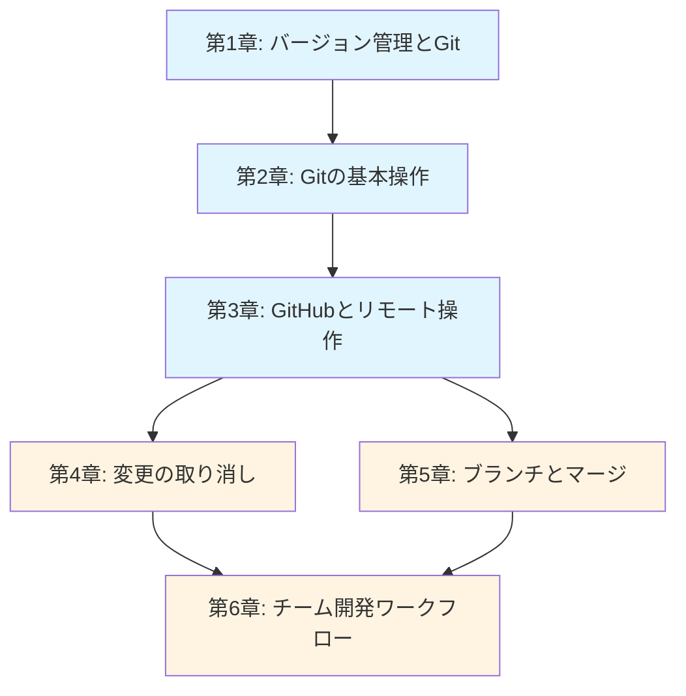

---

## サンプルプロジェクト設計

### 使用するサンプルプロジェクト: 「Javaコンソールアプリケーション」

**選定理由:**

- Day 1-6で学習済みのJava基礎知識で理解できる
- ファイルの追加・変更が段階的に行いやすい
- `.gitignore` の必要性（`.class` ファイル、IDE設定）が実感しやすい
- チーム開発演習で機能追加の単位が明確

### プロジェクト構成

```
hello-git/
├── src/
│   ├── Main.java          # エントリーポイント
│   ├── Calculator.java    # 計算機クラス（機能追加の練習用）
│   └── Greeting.java      # 挨拶クラス（コンフリクト体験用）
├── .gitignore             # Git管理対象外の設定
└── README.md              # プロジェクト説明
```

### 各ファイルの役割

| ファイル          | 使用する章 | 目的                                           |
| ----------------- | ---------- | ---------------------------------------------- |
| Main.java         | 第2-3章    | 最初のコミット、基本操作の練習                 |
| Calculator.java   | 第4-5章    | 機能追加によるブランチ・マージの体験           |
| Greeting.java     | 第6章      | 意図的にコンフリクトを発生させる体験           |
| .gitignore        | 第2章      | 管理対象外ファイルの設定                       |
| README.md         | 第3章      | GitHub上での表示を確認                         |

---

## 各章の詳細設計

### 第1章: バージョン管理とGit

#### この章で得られるスキル

- [ ] バージョン管理がない場合の問題点を説明できる
- [ ] Gitとは何かを説明できる
- [ ] Gitの3つのエリア（作業ディレクトリ、ステージ、リポジトリ）を説明できる
- [ ] リポジトリ、コミット、ブランチの用語を説明できる
- [ ] Gitの初期設定（user.name、user.email）ができる

#### なぜこの技術が必要か

**問題**: ファイルをコピーしてバージョン管理すると...

- ファイル名が `report_v1.txt`、`report_最終版.txt`、`report_最終版_修正2.txt` と増殖する
- どれが最新版かわからなくなる
- 誰がいつ何を変えたかの記録がない
- 間違えて上書きしたら元に戻せない

**解決**: Gitで変更履歴を自動管理すると...

- ファイルの変更履歴が時系列で記録される
- いつでも任意の時点に戻せる
- 誰がいつ何を変えたかが一目でわかる

#### 章構成

**Step 0: まず体験してみよう**

- シナリオ: チームでJavaプログラムを開発している
  - Aさんが `Main.java` を編集中にBさんも編集
  - Aさんがファイルを保存 → Bさんが上書き保存 → Aさんの変更が消える
  - ファイル名管理の例を見せる
    ```
    Main_v1.java
    Main_v2.java
    Main_最終版.java
    Main_最終版_田中修正.java
    Main_最終版_田中修正_佐藤追加.java  ← どれが最新？
    ```
- → Gitなら「いつ・誰が・何を変えたか」が自動で記録される

**Step 1: バージョン管理がない世界の問題**

- 上書き事故（変更が消える）
- どれが最新かわからない問題
- 「いつの変更でバグが入ったか」を追跡できない問題
- 複数人の変更を統合できない問題

**Step 2: Gitとは**

- 分散型バージョン管理システム（DVCS）
- 変更履歴を「コミット」という単位で記録する
- 「写真を撮るように」ファイルの状態を保存するイメージ
- Linus Torvaldsが2005年に開発した歴史的背景（コラム程度）
- 図解: コミットによる履歴管理のイメージ

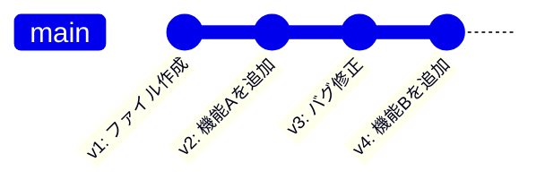

- → 各コミットが「いつ・誰が・何を変えたか」を記録している

**Step 3: Gitの3つのエリア**

- 作業ディレクトリ（Working Directory）: 実際にファイルを編集する場所
- ステージングエリア（Staging Area）: コミットする変更を選ぶ場所
- リポジトリ（Repository）: 変更履歴が保存される場所
- 図解: 3つのエリアとファイルの移動の流れ

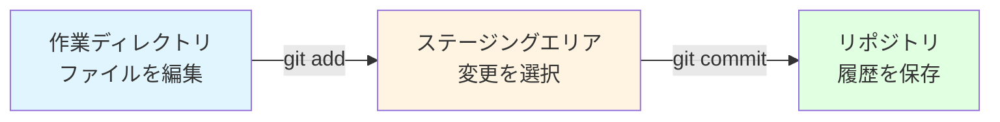

**Step 4: 基本用語の整理**

- **リポジトリ（repository）**: プロジェクトの全履歴を保存する場所
- **コミット（commit）**: ある時点のファイル状態を保存した記録（スナップショット）
- **ブランチ（branch）**: 開発の流れを分岐させる仕組み（第5章で詳述）
- **マージ（merge）**: 分岐した変更を統合する操作（第5章で詳述）
- **リモート（remote）**: ネットワーク上の共有リポジトリ（第3章で詳述）

**Step 5: Gitの初期設定**

- `git config --global user.name "自分の名前"`
- `git config --global user.email "自分のメールアドレス"`
- なぜ設定が必要か（コミットに「誰が」を記録するため）
- 設定の確認方法: `git config --list`

**Step 6: Spring開発での位置づけ**

- チーム開発では全員がGitを使ってコードを共有する
- Day 20以降の開発演習で実際に使う
- 就職後も毎日使うツールであることの強調

#### 全体の方針

- 技術的な操作に入る前に「なぜバージョン管理が必要か」を十分に納得させる
- 3つのエリアの概念は図解で視覚的に説明し、以降の章で繰り返し参照する
- 専門用語（リポジトリ、コミット、ブランチ等）には必ず日本語の注釈を入れる
- Step 5の初期設定は受講生が実際に手を動かすハンズオン形式にする

#### structure.tsへの定義

```typescript
export const gitIntroTopic: Topic = withAutoIds({
  id: 1,
  title: "バージョン管理とGit",
  categoryId: "git/basics",
  questions: [
    {
      type: QuestionType.KNOW,
      title: "バージョン管理の必要性を説明できる",
      mdxPath: "git/basics/version-control.mdx",
      section: "バージョン管理がない世界",
    },
    {
      type: QuestionType.KNOW,
      title: "Gitとは何かを説明できる",
      mdxPath: "git/basics/version-control.mdx",
      section: "Gitとは",
    },
    {
      type: QuestionType.KNOW,
      title: "3つのエリアの役割を説明できる",
      mdxPath: "git/basics/version-control.mdx",
      section: "3つのエリア",
    },
    {
      type: QuestionType.KNOW,
      title: "基本用語を説明できる",
      mdxPath: "git/basics/version-control.mdx",
      section: "基本用語",
    },
    {
      type: QuestionType.WRITE,
      title: "Gitの初期設定ができる",
      mdxPath: "git/basics/version-control.mdx",
      section: "初期設定",
    },
  ],
});
```

#### 演習問題との対応

| Question ID  | 演習ファイル | 内容                                   |
| ------------ | ------------ | -------------------------------------- |
| git-basics-1 | -            | 理論問題（バージョン管理の必要性）     |
| git-basics-2 | -            | 理論問題（Gitの概要説明）              |
| git-basics-3 | -            | 理論問題（3つのエリアの説明）          |
| git-basics-4 | -            | 理論問題（用語の説明）                 |
| git-basics-5 | -            | 実技問題（git configで初期設定を行う） |

---

### 第2章: Gitの基本操作

#### この章で得られるスキル

- [ ] git init でリポジトリを作成できる
- [ ] git status で現在の状態を確認できる
- [ ] git add でファイルをステージに追加できる
- [ ] git commit で変更を記録できる
- [ ] git log で履歴を確認できる
- [ ] git diff で変更内容を確認できる
- [ ] .gitignore で管理対象外のファイルを指定できる

#### なぜこの技術が必要か

**問題**: プログラミングの作業中に...

- 「さっきまで動いていたのに、何を変えたか思い出せない」
- 「昨日の状態に戻したいが、どこを変えたかわからない」
- 「コンパイルで生成された.classファイルまで記録してしまう」

**解決**: Gitの基本操作を使うと...

- 変更を「コミット」として記録し、いつでも振り返れる
- `git diff` で「何が変わったか」を確認できる
- `.gitignore` で不要なファイルを除外できる

#### 章構成

**Step 0: まず体験してみよう**

- 実際にリポジトリを作成し、ファイルを記録する一連の流れをまず体験
  ```bash
  mkdir hello-git
  cd hello-git
  git init
  echo "Hello, Git!" > hello.txt
  git add hello.txt
  git commit -m "最初のコミット"
  git log
  ```
- → たった数行のコマンドで、変更履歴が記録された！

**Step 1: git init — リポジトリの作成**

- `git init` で現在のディレクトリをGitリポジトリにする
- `.git` ディレクトリが作成される（中身は触らない）
- 「このフォルダをGitで管理しますよ」という宣言

**Step 2: git status — 現在の状態を確認する習慣**

- `git status` の出力の読み方
  - Untracked files（未追跡）
  - Changes not staged for commit（変更あり・未ステージ）
  - Changes to be committed（ステージ済み）
- **こまめに `git status` を実行する習慣**をつける
- 図解: ファイルの状態遷移

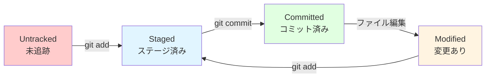

**Step 3: git add — ステージに追加する**

- `git add ファイル名` で特定のファイルをステージに追加
- `git add .` でディレクトリ内の全変更をステージに追加
- なぜステージが必要か: コミットする変更を選べる
  - 例: 3つのファイルを変更したが、2つだけコミットしたい場合
- 図解: ステージングによる選択的コミット

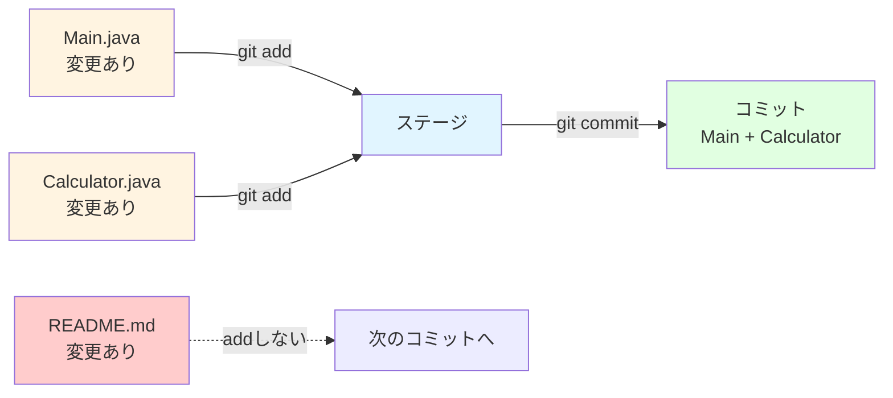

**Step 4: git commit — 変更を記録する**

- `git commit -m "コミットメッセージ"` で変更を記録
- **良いコミットメッセージの書き方**
  - 何を変更したかを簡潔に書く
  - 悪い例: `修正`、`更新`、`test`
  - 良い例: `Calculatorクラスに足し算メソッドを追加`、`READMEに使い方を記載`
- コミットIDについて（ハッシュ値の説明）

**Step 5: git log — 履歴を確認する**

- `git log` で全履歴を表示
- `git log --oneline` で簡潔な一覧を表示
- 表示される情報: コミットID、作者、日時、メッセージ
- `git log -n 5` で直近5件を表示

**Step 6: git diff — 何が変わったかを確認する**

- `git diff`: 作業ディレクトリの変更を表示
- `git diff --staged`: ステージ済みの変更を表示
- 出力の読み方（`+` が追加行、`-` が削除行）
- コミット前に必ず `git diff` で確認する習慣

**Step 7: .gitignore — 管理対象外のファイルを指定する**

- `.gitignore` ファイルの役割
- Java開発でよく除外するファイル
  ```
  # コンパイル済みファイル
  *.class

  # IDE設定ファイル
  .idea/
  .vscode/
  *.iml

  # ビルド出力
  target/
  build/
  ```
- `.gitignore` 自体はGitで管理する

**Step 8: 実践課題**

1. Javaプロジェクト `hello-git` を作成し、`Main.java` を書いてコミットせよ
2. `Main.java` を変更し、`git diff` で変更内容を確認してからコミットせよ
3. `.gitignore` を作成し、`.class` ファイルが追跡されないことを確認せよ
4. `git log --oneline` で3つ以上のコミット履歴を確認せよ

#### 全体の方針

- **繰り返しの操作で体に覚えさせる**: add → commit → log のサイクルを何度も実践
- 各コマンドの前に必ず `git status` を実行させ、状態変化を意識させる
- コミットメッセージの書き方は早い段階で習慣づける
- `.gitignore` はJavaプロジェクトに特化した実践的な内容にする
- 基本操作サイクルを図解し、繰り返しのリズムを視覚的に定着させる

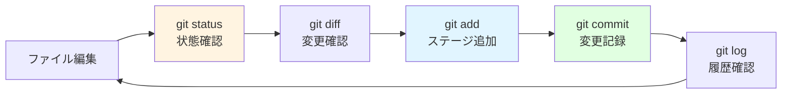

#### structure.tsへの定義

```typescript
export const gitBasicsTopic: Topic = withAutoIds({
  id: 2,
  title: "Gitの基本操作",
  categoryId: "git/basics",
  questions: [
    {
      type: QuestionType.WRITE,
      title: "リポジトリを作成できる",
      mdxPath: "git/basics/git-basics.mdx",
      section: "git init",
    },
    {
      type: QuestionType.WRITE,
      title: "ファイルの状態を確認できる",
      mdxPath: "git/basics/git-basics.mdx",
      section: "git status",
    },
    {
      type: QuestionType.WRITE,
      title: "ファイルをステージに追加できる",
      mdxPath: "git/basics/git-basics.mdx",
      section: "git add",
    },
    {
      type: QuestionType.WRITE,
      title: "変更を記録できる",
      mdxPath: "git/basics/git-basics.mdx",
      section: "git commit",
    },
    {
      type: QuestionType.WRITE,
      title: "履歴を確認できる",
      mdxPath: "git/basics/git-basics.mdx",
      section: "git log",
    },
    {
      type: QuestionType.WRITE,
      title: "変更内容を確認できる",
      mdxPath: "git/basics/git-basics.mdx",
      section: "git diff",
    },
    {
      type: QuestionType.WRITE,
      title: "管理対象外のファイルを設定できる",
      mdxPath: "git/basics/git-basics.mdx",
      section: ".gitignore",
    },
    {
      type: QuestionType.WRITE,
      title: "Javaプロジェクトで複数のコミットを行える",
      mdxPath: "git/basics/git-basics.mdx",
      section: "実践課題",
    },
  ],
});
```

#### 演習問題との対応

| Question ID  | 演習ファイル | 内容                                     |
| ------------ | ------------ | ---------------------------------------- |
| git-basics-6 | -            | 実技問題（リポジトリ作成とコミット）     |
| git-basics-7 | -            | 実技問題（git statusの状態を答える）     |
| git-basics-8 | -            | 実技問題（git addの使い分け）            |
| git-basics-9 | -            | 実技問題（適切なコミットメッセージ作成） |
| git-basics-10 | -           | 実技問題（git logで履歴を確認）          |
| git-basics-11 | -           | 実技問題（git diffの出力を読む）         |
| git-basics-12 | -           | 実技問題（.gitignore設定）               |
| git-basics-13 | -           | 実技問題（総合: 複数コミットの実践）     |

---

### 第3章: GitHubとリモート操作

#### この章で得られるスキル

- [ ] GitHubの役割を説明できる
- [ ] GitHubアカウントを作成し、リポジトリを作成できる
- [ ] HTTPS + Personal Access Token でGitHub接続を設定できる
- [ ] git remote add でリモートリポジトリを登録できる
- [ ] git push でローカルの変更をリモートに送れる
- [ ] git pull でリモートの変更をローカルに取り込める
- [ ] git clone で既存リポジトリをコピーできる

#### なぜこの技術が必要か

**問題**: ローカルだけでGitを使っていると...

- PCが壊れたら全てのコードと履歴が失われる
- 自宅と学校で同じプロジェクトを開発できない
- チームメンバーとコードを共有できない

**解決**: GitHub（リモートリポジトリ）を使うと...

- コードと履歴がクラウドに安全に保存される
- どこからでも同じプロジェクトにアクセスできる
- チームでコードを共有・統合できる

#### 章構成

**Step 0: まず体験してみよう**

- シナリオ: 「PCが壊れたらコードが全部消える」問題
  - ローカルにしかないコード → PCの故障で全滅
  - USBメモリでバックアップ → バージョンの混乱
- → GitHubに保存しておけば安心

**Step 1: GitHubとは**

- リモートリポジトリのホスティングサービス
- ローカルリポジトリとリモートリポジトリの関係
- GitHub以外のサービス（GitLab、Bitbucket）の存在にも触れる

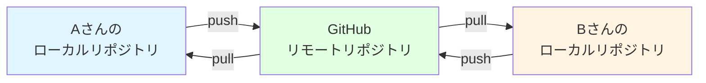

**Step 2: GitHubアカウント作成とリポジトリ作成**

- GitHubアカウントの作成手順（画面キャプチャ付き）
- 新しいリポジトリの作成（GitHub上の操作）
  - リポジトリ名の付け方
  - Public / Private の選択
  - READMEやLICENSEの追加（ここでは追加しない選択を推奨）

**Step 3: HTTPS接続の設定（Personal Access Token）**

- なぜ認証が必要か（誰でもpushできたら困る）
- Personal Access Token（PAT）の作成手順
  - Settings → Developer settings → Personal access tokens → Tokens (classic)
  - スコープの設定（`repo` にチェック）
  - 有効期限の設定
- PATの保存と管理の注意点
  - パスワードマネージャーに保存する
  - 絶対にコードに書かない

**Step 4: git remote add / git push — リモートに送る**

- `git remote add origin URL` でリモートリポジトリを登録
- `git push -u origin main` で最初のプッシュ
  - `-u` オプションの意味（上流ブランチの設定）
  - 2回目以降は `git push` だけでよい
- プッシュ後にGitHub上でコミット履歴を確認

**Step 5: git pull — リモートの変更を取り込む**

- `git pull origin main` でリモートの最新を取得
- いつ `git pull` するか
  - 作業開始前に必ず `git pull` する習慣
  - チーム開発では特に重要（第6章で詳述）

**Step 6: git clone — 既存リポジトリをコピーする**

- `git clone URL` でリモートリポジトリをローカルにコピー
- cloneとinitの違い
  - init: 新しいリポジトリを作る
  - clone: 既存のリポジトリをコピーする
- clone後は `git remote` が自動的に設定されている

**push / pull / clone の操作フロー（図解）**

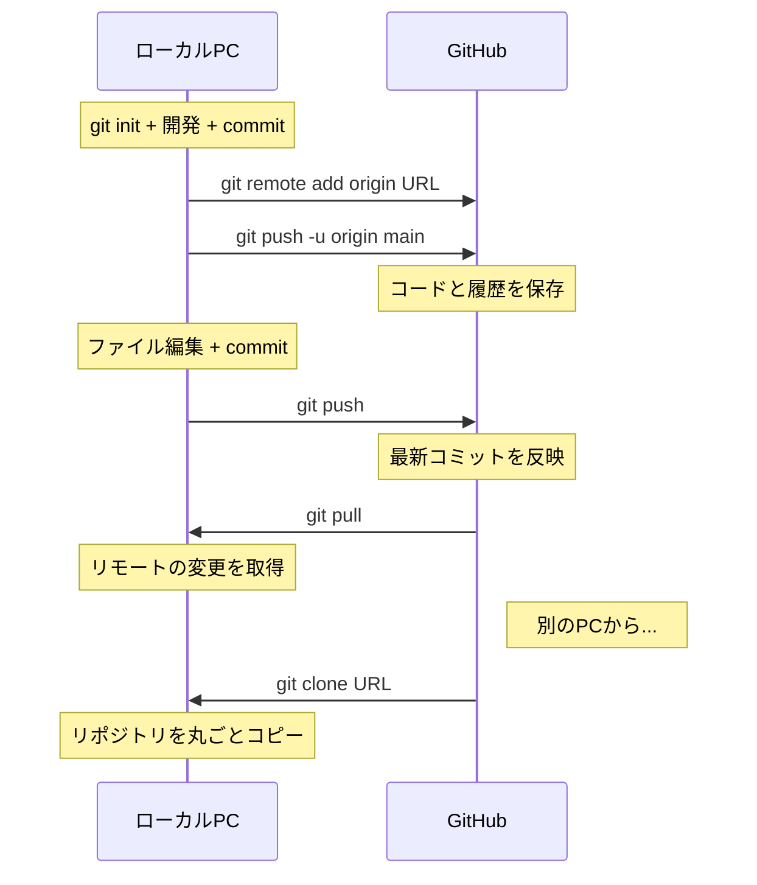

**Step 7: GitHubの画面の見方**

- コードタブ: ファイル一覧、ディレクトリ構造
- コミット履歴の確認
- ファイルの変更履歴（Blame機能）
- README.md の表示
- Issues、Pull Requestsタブ（第6章で詳述）

**Step 8: 実践課題**

1. GitHubに新しいリポジトリを作成し、第2章で作った `hello-git` をpushせよ
2. GitHub上でコミット履歴が正しく表示されることを確認せよ
3. 別のディレクトリにcloneし、ファイルが正しくコピーされることを確認せよ
4. clone先でファイルを変更・コミット・pushし、GitHub上で確認せよ

#### 全体の方針

- HTTPS + PATを推奨し、SSH設定は触れない（初学者の環境差異を最小化）
- GitHubの操作画面は可能な限りスクリーンショット付きで説明
- push/pullの概念を「郵便の送受信」に例えて説明
- 最初の1回がハードルなので、手順を丁寧にステップバイステップで示す

#### structure.tsへの定義

```typescript
export const gitRemoteTopic: Topic = withAutoIds({
  id: 3,
  title: "GitHubとリモート操作",
  categoryId: "git/basics",
  questions: [
    {
      type: QuestionType.KNOW,
      title: "GitHubの役割を説明できる",
      mdxPath: "git/basics/github-remote.mdx",
      section: "GitHubとは",
    },
    {
      type: QuestionType.WRITE,
      title: "リポジトリを作成できる",
      mdxPath: "git/basics/github-remote.mdx",
      section: "リポジトリ作成",
    },
    {
      type: QuestionType.WRITE,
      title: "HTTPS接続を設定できる",
      mdxPath: "git/basics/github-remote.mdx",
      section: "HTTPS接続設定",
    },
    {
      type: QuestionType.WRITE,
      title: "ローカルの変更をリモートに送れる",
      mdxPath: "git/basics/github-remote.mdx",
      section: "git push",
    },
    {
      type: QuestionType.WRITE,
      title: "リモートの変更をローカルに取り込める",
      mdxPath: "git/basics/github-remote.mdx",
      section: "git pull",
    },
    {
      type: QuestionType.WRITE,
      title: "既存リポジトリをクローンできる",
      mdxPath: "git/basics/github-remote.mdx",
      section: "git clone",
    },
    {
      type: QuestionType.READ,
      title: "GitHubの画面を理解できる",
      mdxPath: "git/basics/github-remote.mdx",
      section: "GitHubの画面",
    },
    {
      type: QuestionType.WRITE,
      title: "push・clone・pullの一連の流れを実践できる",
      mdxPath: "git/basics/github-remote.mdx",
      section: "実践課題",
    },
  ],
});
```

#### 演習問題との対応

| Question ID   | 演習ファイル | 内容                                       |
| ------------- | ------------ | ------------------------------------------ |
| git-basics-14 | -            | 理論問題（GitHubの役割を説明）             |
| git-basics-15 | -            | 実技問題（リポジトリ作成とPAT設定）        |
| git-basics-16 | -            | 実技問題（remote add とpush）              |
| git-basics-17 | -            | 実技問題（pull操作）                       |
| git-basics-18 | -            | 実技問題（clone操作）                      |
| git-basics-19 | -            | 理論問題（GitHub画面の読み取り）           |
| git-basics-20 | -            | 実技問題（総合: push・clone・pull の実践） |

---

### 第4章: 変更の取り消しとバージョンの復元

#### この章で得られるスキル

- [ ] 取り消し操作の全体像を図で説明できる
- [ ] git restore で作業ディレクトリの変更を元に戻せる
- [ ] git restore --staged でステージの取り消しができる
- [ ] git revert でコミットを安全に取り消せる
- [ ] git log --oneline, git show で過去のコミットを確認できる

#### なぜこの技術が必要か

**問題**: 開発中にミスをしたとき...

- ファイルを壊してしまったが、最後にコミットした状態に戻したい
- 間違えて `git add` してしまったが、ステージから外したい
- コミットしてしまったが、その変更を取り消したい

**解決**: 段階に応じた取り消し操作を使うと...

- `git restore`: 編集中のファイルを最後のコミット状態に戻す
- `git restore --staged`: ステージしたファイルを取り下げる
- `git revert`: コミット済みの変更を打ち消す新しいコミットを作成

#### 章構成

**Step 0: まず体験してみよう**

- シナリオ: `Calculator.java` にメソッドを追加したが、バグがある
  ```java
  // 間違えて割り算メソッドでゼロ除算チェックを忘れた
  public int divide(int a, int b) {
      return a / b;  // b が 0 だとエラー！
  }
  ```
- コミットしてしまった → どうやって戻す？
- → 状況に応じた3つの取り消し方法がある

**Step 1: 取り消し操作の全体像**

- どの段階の変更を戻すかで使うコマンドが異なる

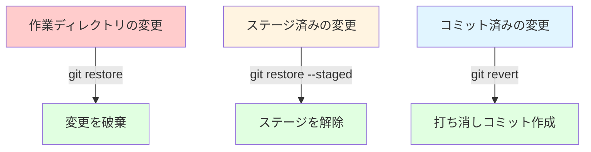

**Step 2: 作業ディレクトリの変更を元に戻す（git restore）**

- `git restore ファイル名`: ファイルを最後のコミット状態に戻す
- **注意: この操作は元に戻せない**（コミットしていない変更は消える）
- `git restore .`: 全ファイルの変更を元に戻す
- 使うタイミング: 試行錯誤した結果、最初からやり直したいとき

**Step 3: ステージの取り消し（git restore --staged）**

- `git restore --staged ファイル名`: ステージからファイルを外す
- ファイルの変更内容自体は残る（作業ディレクトリに戻るだけ）
- 使うタイミング: 間違えて `git add` してしまったとき

**Step 4: コミットの取り消し（git revert）**

- `git revert コミットID`: 指定したコミットを打ち消す新しいコミットを作成
- **元のコミットは履歴に残る**（安全に取り消せる）
- revert後にpushすれば、チームメンバーにも反映される
- 使うタイミング: コミット済みの変更にバグがあったとき
- 図解: revertは「打ち消しコミット」を追加する（履歴は消えない）

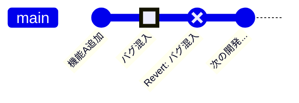

**Step 5: 過去のコミットの確認**

- `git log --oneline`: コミットIDとメッセージの一覧
- `git show コミットID`: 特定のコミットの変更内容を確認
- `git log --oneline -n 10`: 直近10件を表示
- コミットIDの指定方法（先頭7文字で十分）

**Step 6: 実践課題**

1. ファイルを編集し、`git restore` で変更を元に戻せ
2. ファイルをステージに追加し、`git restore --staged` でステージを解除せよ
3. 意図的にバグを含むコミットを作成し、`git revert` で取り消せ
4. `git log --oneline` と `git show` でrevert前後のコミットを確認せよ

#### 全体の方針

- 3つの取り消し操作を「どの段階の変更を戻すか」で整理する
- **安全な操作（restore, revert）を中心に教え、resetはコラムで軽く紹介**
- 「元に戻せない操作」と「元に戻せる操作」の区別を明確にする
- 実際にファイルを壊して → 復元する体験を重視

#### structure.tsへの定義

```typescript
export const gitUndoTopic: Topic = withAutoIds({
  id: 4,
  title: "変更の取り消しとバージョンの復元",
  categoryId: "git/teamwork",
  questions: [
    {
      type: QuestionType.KNOW,
      title: "取り消し操作の全体像を説明できる",
      mdxPath: "git/teamwork/undo-restore.mdx",
      section: "取り消しの全体像",
    },
    {
      type: QuestionType.WRITE,
      title: "作業ディレクトリの変更を元に戻せる",
      mdxPath: "git/teamwork/undo-restore.mdx",
      section: "git restore",
    },
    {
      type: QuestionType.WRITE,
      title: "ステージの取り消しができる",
      mdxPath: "git/teamwork/undo-restore.mdx",
      section: "git restore --staged",
    },
    {
      type: QuestionType.WRITE,
      title: "コミットを安全に取り消せる",
      mdxPath: "git/teamwork/undo-restore.mdx",
      section: "git revert",
    },
    {
      type: QuestionType.WRITE,
      title: "過去のコミットを確認できる",
      mdxPath: "git/teamwork/undo-restore.mdx",
      section: "コミット確認",
    },
    {
      type: QuestionType.WRITE,
      title: "各取り消し操作を状況に応じて使い分けられる",
      mdxPath: "git/teamwork/undo-restore.mdx",
      section: "実践課題",
    },
  ],
});
```

#### 演習問題との対応

| Question ID     | 演習ファイル | 内容                                         |
| --------------- | ------------ | -------------------------------------------- |
| git-teamwork-1  | -            | 理論問題（取り消し操作の使い分けを説明）     |
| git-teamwork-2  | -            | 実技問題（git restore で変更を元に戻す）     |
| git-teamwork-3  | -            | 実技問題（git restore --staged でステージ解除） |
| git-teamwork-4  | -            | 実技問題（git revert でコミットを取り消す）  |
| git-teamwork-5  | -            | 実技問題（git log と git show でコミット確認） |
| git-teamwork-6  | -            | 実技問題（総合: ファイル破壊 → 復元）        |

---

### 第5章: ブランチとマージ

#### この章で得られるスキル

- [ ] ブランチの概念を図で説明できる
- [ ] git branch でブランチを一覧・作成できる
- [ ] git switch でブランチを切り替えられる
- [ ] ブランチ上で作業してコミットできる
- [ ] git merge でブランチを統合できる
- [ ] main + feature branch のブランチ戦略を説明できる
- [ ] 不要なブランチを削除できる

#### なぜこの技術が必要か

**問題**: main ブランチだけで開発すると...

- 新機能を試したいが、動くコードを壊したくない
- 複数人が同じブランチで作業すると、頻繁に衝突が起きる
- リリース前の安定版を維持しながら開発を続けたい

**解決**: ブランチを使うと...

- mainブランチを安定した状態に保ちつつ、別のブランチで自由に開発できる
- 完成したらmainにマージする
- 問題があればブランチを捨てればよい

#### 章構成

**Step 0: まず体験してみよう**

- シナリオ: `Calculator.java` に掛け算メソッドを追加したいが、mainは壊したくない
  ```bash
  git switch -c feature/multiply   # 新しいブランチを作成して切り替え
  # Calculator.java に掛け算メソッドを追加
  git add Calculator.java
  git commit -m "掛け算メソッドを追加"
  git switch main                  # mainブランチに戻る
  # → Calculator.java は元のまま！
  git merge feature/multiply       # マージ
  # → mainにも掛け算メソッドが追加された！
  ```
- → ブランチは「並行世界」のように安全に開発できる

**Step 1: ブランチとは**

- ブランチ = 開発の流れを分岐させる仕組み
- mainブランチ: 常に動作するコードが入っているブランチ
- featureブランチ: 新機能を開発するための一時的なブランチ
- 図解: ブランチの分岐と統合

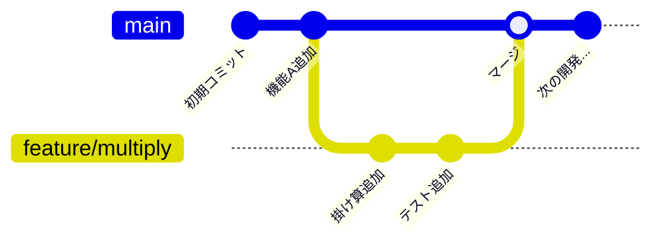

**Step 2: git branch / git switch — ブランチの作成と切り替え**

- `git branch`: ブランチ一覧を表示（`*` が現在のブランチ）
- `git branch ブランチ名`: 新しいブランチを作成
- `git switch ブランチ名`: ブランチを切り替える
- `git switch -c ブランチ名`: 作成と切り替えを同時に行う
- ブランチ名の規約
  - `feature/機能名`: 新機能の開発
  - `fix/バグ内容`: バグ修正
  - 例: `feature/multiply`, `fix/divide-by-zero`

**Step 3: ブランチ上での作業とコミット**

- ブランチ上でのadd, commit, log は通常のGit操作と同じ
- ブランチを切り替えるとファイルの中身が変わる
- **切り替え前にcommit（またはstash）しておく**

**Step 4: git merge — ブランチの統合**

- `git switch main` → `git merge ブランチ名` の流れ
- Fast-forward マージ（分岐がない場合の単純な統合）
- 三方マージ（分岐がある場合の統合）
- マージコミットの作成
- 図解: Fast-forwardマージ（mainが進んでいない場合）

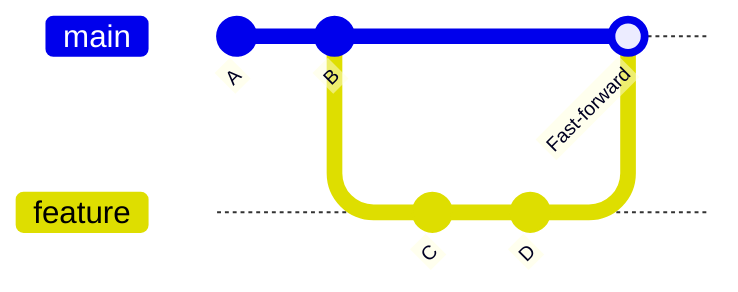

- 図解: 三方マージ（mainも進んでいる場合 → マージコミットが作成される）

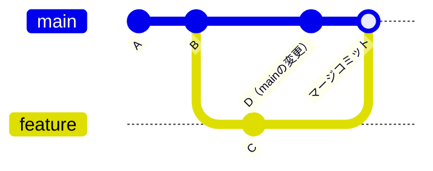

**Step 5: ブランチ戦略の基本（main + feature branch）**

- main ブランチ: 常に動作するコード
- feature ブランチ: 機能ごとに作成し、完了後にマージ
- ルール
  1. mainブランチで直接コミットしない
  2. 新機能はfeatureブランチで開発する
  3. 完了したらmainにマージする

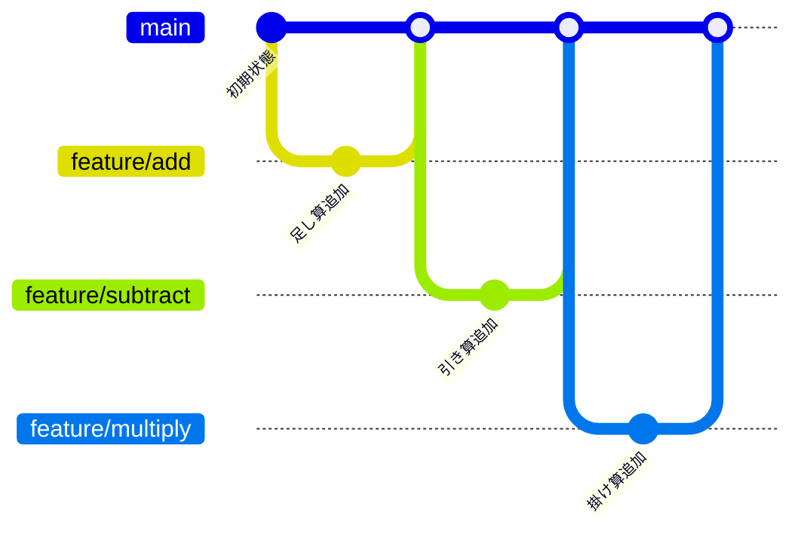

**Step 6: ブランチの削除と整理**

- `git branch -d ブランチ名`: マージ済みのブランチを削除
- `git branch -D ブランチ名`: マージしていないブランチを強制削除
- マージ済みのブランチは削除して整理する習慣

**Step 7: 実践課題**

1. `feature/subtract` ブランチを作成し、`Calculator.java` に引き算メソッドを追加してmainにマージせよ
2. `feature/multiply` ブランチを作成し、掛け算メソッドを追加してmainにマージせよ
3. マージ後、不要なブランチを削除せよ
4. `git log --oneline --graph` でブランチの分岐と統合を確認せよ

#### 全体の方針

- ブランチは「並行世界」の比喩で直感的に理解させる
- `git checkout` ではなく `git switch` を使用（Git 2.23以降の推奨コマンド）
- ブランチ名の命名規約を早い段階で習慣づける
- コンフリクトは第6章で扱うため、ここではコンフリクトが起きないケースで練習

#### structure.tsへの定義

```typescript
export const gitBranchTopic: Topic = withAutoIds({
  id: 5,
  title: "ブランチとマージ",
  categoryId: "git/teamwork",
  questions: [
    {
      type: QuestionType.KNOW,
      title: "ブランチの概念を説明できる",
      mdxPath: "git/teamwork/branch-merge.mdx",
      section: "ブランチとは",
    },
    {
      type: QuestionType.WRITE,
      title: "ブランチを作成・切り替えできる",
      mdxPath: "git/teamwork/branch-merge.mdx",
      section: "branch と switch",
    },
    {
      type: QuestionType.WRITE,
      title: "ブランチ上で作業してコミットできる",
      mdxPath: "git/teamwork/branch-merge.mdx",
      section: "ブランチでの作業",
    },
    {
      type: QuestionType.WRITE,
      title: "ブランチをマージできる",
      mdxPath: "git/teamwork/branch-merge.mdx",
      section: "git merge",
    },
    {
      type: QuestionType.KNOW,
      title: "ブランチ戦略を説明できる",
      mdxPath: "git/teamwork/branch-merge.mdx",
      section: "ブランチ戦略",
    },
    {
      type: QuestionType.WRITE,
      title: "不要なブランチを削除できる",
      mdxPath: "git/teamwork/branch-merge.mdx",
      section: "ブランチ削除",
    },
    {
      type: QuestionType.WRITE,
      title: "featureブランチで機能追加しmainにマージできる",
      mdxPath: "git/teamwork/branch-merge.mdx",
      section: "実践課題",
    },
  ],
});
```

#### 演習問題との対応

| Question ID     | 演習ファイル | 内容                                          |
| --------------- | ------------ | --------------------------------------------- |
| git-teamwork-7  | -            | 理論問題（ブランチの概念を図で説明）          |
| git-teamwork-8  | -            | 実技問題（ブランチの作成と切り替え）          |
| git-teamwork-9  | -            | 実技問題（ブランチ上でのコミット）            |
| git-teamwork-10 | -            | 実技問題（マージの実行）                      |
| git-teamwork-11 | -            | 理論問題（ブランチ戦略の説明）                |
| git-teamwork-12 | -            | 実技問題（ブランチ削除）                      |
| git-teamwork-13 | -            | 実技問題（総合: feature開発 → mainマージ）    |

---

### 第6章: チーム開発ワークフロー

#### この章で得られるスキル

- [ ] GitHub Flowの流れを説明できる
- [ ] Pull Requestを作成できる
- [ ] コードレビューでコメント・Approve・Request Changesができる
- [ ] Pull Requestをマージできる
- [ ] コンフリクトが発生する原因を説明できる
- [ ] コンフリクトを手動で解決できる
- [ ] チーム開発のベストプラクティスを理解している

#### なぜこの技術が必要か

**問題**: チームで開発すると...

- 誰かが書いたコードにバグがあっても気づかない
- 2人が同じファイルの同じ行を編集すると衝突が起きる
- 「どのブランチが最新か」「この変更は誰が承認したか」が不明確

**解決**: GitHub Flowとコードレビューを使うと...

- Pull Requestで変更内容をチームに共有し、レビューを受けてからマージする
- コンフリクトが発生してもGitが検知し、手動で安全に解決できる
- 変更の承認プロセスが記録に残る

#### 章構成

**Step 0: まず体験してみよう**

- シナリオ: 2人が `Greeting.java` の同じ行を編集
  - Aさん: `"こんにちは"` → `"おはようございます"`
  - Bさん: `"こんにちは"` → `"こんばんは"`
  - → どちらの変更を採用するか、Gitには判断できない！
- → コンフリクトの解決と、それを防ぐワークフローが必要

**Step 1: GitHub Flow — チーム開発の基本ワークフロー**

- GitHub Flowの5ステップ
  1. mainからfeatureブランチを作成
  2. featureブランチで開発・コミット
  3. GitHubにpush
  4. Pull Requestを作成
  5. レビューを受けてmainにマージ
- 図解: GitHub Flowの全体像

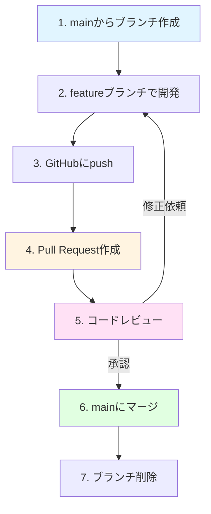

**Step 2: Pull Requestの作成**

- GitHub上でPull Requestを作成する手順
  - ブランチをpush後、GitHub上で「Compare & pull request」
  - タイトル: 変更内容を簡潔に書く
  - 説明: 何をなぜ変更したか、テスト方法
- Pull Requestの構成要素
  - タイトルと説明
  - 変更されたファイルの差分
  - レビュアーの指定

**Step 3: コードレビューの進め方**

- レビュアーの操作
  - 「Files changed」タブで変更内容を確認
  - 行単位でコメントを付ける
  - 全体のレビュー結果を送信
    - **Approve**: 承認（マージしてOK）
    - **Request Changes**: 修正を依頼
    - **Comment**: コメントのみ（承認でも却下でもない）
- レビューのポイント
  - コードの正しさ、読みやすさ
  - 命名規則は守られているか
  - 不要なコードやコメントはないか

**Step 4: Pull Requestのマージ**

- 「Merge pull request」ボタンでマージ
- マージの種類（基本は「Create a merge commit」でよい）
- マージ後のブランチ削除（「Delete branch」ボタン）
- ローカルでの後始末
  ```bash
  git switch main
  git pull
  git branch -d feature/ブランチ名
  ```

**Step 5: コンフリクトとは — なぜ起きるのか**

- 2人が同じファイルの同じ部分を変更した場合に発生
- Gitは自動でマージできないため、人間に判断を委ねる
- コンフリクトが発生するシナリオ
  1. AさんがファイルのX行を変更してmainにマージ
  2. Bさんも同じファイルのX行を変更していた
  3. Bさんがマージしようとするとコンフリクト発生
- 図解: コンフリクト発生のシナリオ

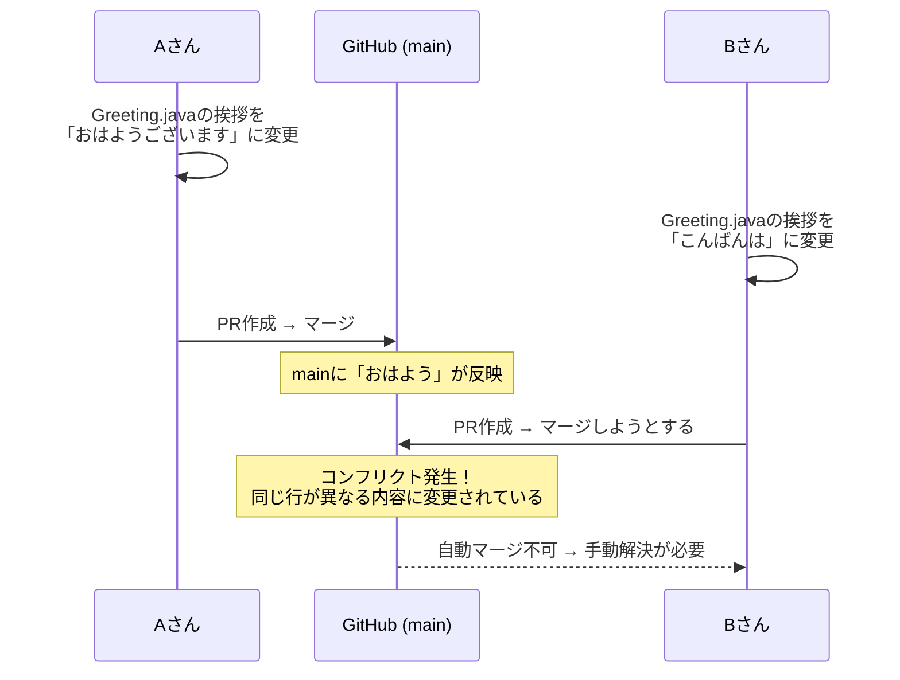

**Step 6: コンフリクトの解決方法**

- コンフリクトマーカーの読み方
  ```
  <<<<<<< HEAD
  Aさんの変更（現在のブランチの内容）
  =======
  Bさんの変更（マージしようとしているブランチの内容）
  >>>>>>> feature/branch-name
  ```
- 解決手順
  1. コンフリクトが起きたファイルを開く
  2. コンフリクトマーカーを削除し、正しい内容に修正
  3. `git add` でステージに追加
  4. `git commit` でマージコミットを作成
- コンフリクトを減らすコツ
  - こまめに `git pull` する
  - 小さな単位でブランチを作り、早くマージする
  - チームで担当範囲を分ける

**Step 7: チーム開発のベストプラクティス**

- **コミットメッセージの規約**
  - プレフィクスの使用: `feat:`, `fix:`, `docs:`, `refactor:`
  - 例: `feat: 掛け算メソッドを追加`, `fix: ゼロ除算のバグを修正`
- **Pull Requestの粒度**
  - 1つのPRは1つの機能・修正に絞る
  - 大きなPRは分割する
- **レビューの心構え**
  - コードの問題を指摘するのであって、人を批判するのではない
  - 良いコードには褒めるコメントも書く
  - 曖昧な指摘は避け、具体的に提案する

**Step 8: 実践課題（ペアワーク）**

1. ペアでリポジトリを共有し、各自featureブランチで機能を追加せよ
2. Pull Requestを作成し、お互いにコードレビューを行え
3. レビュー後にマージし、ローカルでpullして最新状態にせよ
4. 意図的にコンフリクトを発生させ、解決せよ

#### 全体の方針

- **ペアワーク形式**で実際のチーム開発を体験させる
- コンフリクト解決は「怖くないもの」として扱い、積極的に体験させる
- レビュー文化の重要性を伝える（技術スキルだけでなくコミュニケーションスキル）
- Day 24-28のチーム開発に直結する実践的な内容にする
- コミットメッセージの規約やPRの粒度は、チーム開発の品質に直結することを強調

#### structure.tsへの定義

```typescript
export const gitTeamworkTopic: Topic = withAutoIds({
  id: 6,
  title: "チーム開発ワークフロー",
  categoryId: "git/teamwork",
  questions: [
    {
      type: QuestionType.KNOW,
      title: "GitHub Flowの流れを説明できる",
      mdxPath: "git/teamwork/team-workflow.mdx",
      section: "GitHub Flow",
    },
    {
      type: QuestionType.WRITE,
      title: "Pull Requestを作成できる",
      mdxPath: "git/teamwork/team-workflow.mdx",
      section: "Pull Request作成",
    },
    {
      type: QuestionType.WRITE,
      title: "コードレビューができる",
      mdxPath: "git/teamwork/team-workflow.mdx",
      section: "コードレビュー",
    },
    {
      type: QuestionType.WRITE,
      title: "Pull Requestをマージできる",
      mdxPath: "git/teamwork/team-workflow.mdx",
      section: "PRマージ",
    },
    {
      type: QuestionType.KNOW,
      title: "コンフリクトが発生する原因を説明できる",
      mdxPath: "git/teamwork/team-workflow.mdx",
      section: "コンフリクトとは",
    },
    {
      type: QuestionType.WRITE,
      title: "コンフリクトを解決できる",
      mdxPath: "git/teamwork/team-workflow.mdx",
      section: "コンフリクト解決",
    },
    {
      type: QuestionType.KNOW,
      title: "チーム開発のベストプラクティスを理解している",
      mdxPath: "git/teamwork/team-workflow.mdx",
      section: "ベストプラクティス",
    },
    {
      type: QuestionType.WRITE,
      title: "ペアでPRベースの開発を実践できる",
      mdxPath: "git/teamwork/team-workflow.mdx",
      section: "実践課題",
    },
  ],
});
```

#### 演習問題との対応

| Question ID     | 演習ファイル | 内容                                            |
| --------------- | ------------ | ----------------------------------------------- |
| git-teamwork-14 | -            | 理論問題（GitHub Flowの説明）                   |
| git-teamwork-15 | -            | 実技問題（Pull Requestの作成）                  |
| git-teamwork-16 | -            | 実技問題（コードレビューの実施）                |
| git-teamwork-17 | -            | 実技問題（PRのマージとローカルの同期）          |
| git-teamwork-18 | -            | 理論問題（コンフリクトの原因を説明）            |
| git-teamwork-19 | -            | 実技問題（コンフリクト解決）                    |
| git-teamwork-20 | -            | 理論問題（ベストプラクティス）                  |
| git-teamwork-21 | -            | 実技問題（総合: ペアでのPR開発ワークフロー）    |

---

## 補足・コラム

### コラム1: git reset について

**概要**: `git reset` はコミット履歴を巻き戻すコマンドである。本教材では `git revert` を推奨するが、実務では `git reset` も使われるため概要を紹介する。

**3つのモード:**

| モード    | コマンド              | 作業ディレクトリ | ステージ | コミット履歴 |
| --------- | --------------------- | ---------------- | -------- | ------------ |
| `--soft`  | `git reset --soft`    | そのまま         | そのまま | 巻き戻す     |
| `--mixed` | `git reset --mixed`   | そのまま         | 戻す     | 巻き戻す     |
| `--hard`  | `git reset --hard`    | 戻す             | 戻す     | 巻き戻す     |

**注意:**

- `git reset` は**コミット履歴を書き換える**ため、pushした後に使うと危険
- チーム開発では `git revert` を使うべき
- `--hard` は変更が完全に失われるため、特に注意が必要

**推奨: まずは `git revert` を使い、`git reset` は十分に理解してから使うこと。**

---

### コラム2: git stash — 作業の一時退避

**概要**: 作業中の変更をコミットせずに一時的に退避させる機能である。

**使用場面:**

- 作業中に急なバグ修正が入り、ブランチを切り替えたい
- まだコミットしたくないが、別の作業をしたい

**基本操作:**

```bash
git stash              # 変更を退避
git stash list         # 退避した一覧を表示
git stash pop          # 最新の退避を復元
git stash drop         # 退避を削除
```

**Spring開発での位置づけ:**

- 頻繁に使うわけではないが、知っておくと便利
- 余裕があれば自習

---

### コラム3: git cherry-pick — 特定のコミットだけを取り込む

**概要**: 別のブランチの特定のコミットだけを現在のブランチに取り込む。

**使用場面:**

- featureブランチのバグ修正コミットだけをmainに取り込みたい

**基本操作:**

```bash
git cherry-pick コミットID
```

**Spring開発での位置づけ:**

- 高度な操作のため、ブートキャンプでは省略
- 実務で必要になったら学べばよい

---

### コラム4: git rebase — 履歴を整理する

**概要**: ブランチの分岐点を変更し、履歴を一直線にする操作である。

**mergeとの違い:**

- merge: 分岐の履歴が残る（マージコミットが作成される）
- rebase: 分岐の履歴が消え、一直線になる

**注意:**

- rebaseは**コミット履歴を書き換える**ため、push済みのコミットにはrebaseしない
- チーム開発では原則merge（rebaseは個人のローカル作業のみ）
- ブートキャンプでは使用しない

---

### コラム5: git tag — バージョンに名前を付ける

**概要**: 特定のコミットに「v1.0.0」のようなバージョン名を付ける機能である。

**基本操作:**

```bash
git tag v1.0.0              # 現在のコミットにタグを付ける
git tag                     # タグ一覧
git push origin v1.0.0      # タグをリモートに送る
```

**Spring開発での位置づけ:**

- リリース管理で使うが、ブートキャンプでは省略
- チーム開発の最終発表時に使えると良い

---

### コラム6: IDEでのGit操作

**概要**: IntelliJ IDEAやVS CodeにはGit操作をGUIで行う機能が内蔵されている。

**IntelliJ IDEAの場合:**

- VCSメニューからコミット、プッシュ、プルが可能
- 変更ファイルの色分け表示（緑: 新規、青: 変更、灰: 削除）
- コンフリクト解決のGUIツール
- Git logのグラフィカル表示

**推奨:**

- まずはコマンドラインで仕組みを理解してからIDE操作を使う
- コマンドラインを理解していれば、どのIDEでも応用が利く

---

## Spring開発との連携

### Day 24-28 チーム開発での実践

**Git教材との接続:**

| Git教材の内容 | チーム開発での活用                               |
| ------------- | ------------------------------------------------ |
| 第1-2章の基本操作 | 毎日のコミット・プッシュ作業                 |
| 第3章のGitHub操作 | チームリポジトリの管理                       |
| 第4章の取り消し操作 | 開発中のミスからの復旧                     |
| 第5章のブランチ | 機能ごとにfeatureブランチを作成              |
| 第6章のGitHub Flow | PR → レビュー → マージ の開発サイクル    |

### チーム開発の推奨ワークフロー

1. **朝のルーティン**
   ```bash
   git switch main
   git pull
   git switch -c feature/今日の作業内容
   ```

2. **開発中**
   ```bash
   # こまめにコミット
   git add .
   git commit -m "feat: ○○機能を追加"
   ```

3. **作業終了時**
   ```bash
   git push -u origin feature/今日の作業内容
   # GitHubでPull Requestを作成
   ```

4. **レビュー・マージ後**
   ```bash
   git switch main
   git pull
   git branch -d feature/今日の作業内容
   ```

---

## 推定学習時間の詳細

| 章    | Step 0 | Step 1-3 | Step 4-6 | Step 7-8 | 合計 |
| ----- | ------ | -------- | -------- | -------- | ---- |
| 第1章 | 0.1h   | 0.3h     | 0.3h     | 0.3h     | 1.0h |
| 第2章 | 0.2h   | 0.4h     | 0.4h     | 0.5h     | 1.5h |
| 第3章 | 0.1h   | 0.4h     | 0.5h     | 0.5h     | 1.5h |
| 第4章 | 0.1h   | 0.3h     | 0.3h     | 0.3h     | 1.0h |
| 第5章 | 0.2h   | 0.4h     | 0.4h     | 0.5h     | 1.5h |
| 第6章 | 0.2h   | 0.5h     | 0.5h     | 0.8h     | 2.0h |

**合計: 8.5時間（Day 7: 4h / Day 20: 4.5h）**

---

## まとめ

本設計書は、AI時代のGit学習として、**操作の暗記ではなく「なぜバージョン管理が必要か」「なぜチーム開発にワークフローが必要か」の理解を重視**した設計となっている。

### 教材の3つの柱

1. **「なぜ必要か」から理解する**
   - 各章Step 0で問題を体験
   - バージョン管理・チーム開発の必要性を納得してから学習

2. **安全な操作を優先する**
   - `git restore` と `git revert` を中心に教える
   - `git reset`, `git rebase` はコラムで紹介にとどめる
   - 破壊的操作のリスクを理解させる

3. **チーム開発実践につなげる**
   - GitHub Flowに基づいたPRベースの開発を体験
   - Day 24-28のチーム開発にスムーズに接続

### 最終到達目標

- Gitの基本操作（init, add, commit, log, diff）が一人で行える
- GitHubにコードをpush/pull/cloneできる
- 変更の取り消し操作を状況に応じて使い分けられる
- featureブランチで開発し、mainにマージできる
- GitHub Flowに基づいたPR・コードレビュー・マージができる
- コンフリクトを手動で解決できる

この土台の上に、Day 24-28でSpring Bootを用いたチーム開発へと進んでいく。

---
