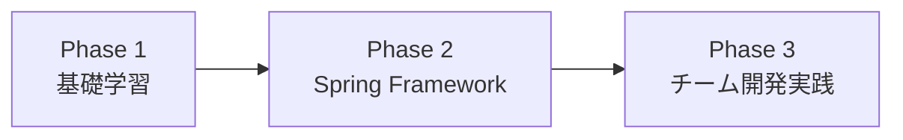

# プログラミングブートキャンプ - カリキュラムスケジュール

**対象:** プログラミング未経験者（特に文系出身者）
**期間:** 約1〜3ヶ月（全29日間）

---

## カリキュラム全体の構成

---

## Phase 1: 基礎学習（Day 1-15）

### Day 1: 自己紹介 / Java(変数、演算子)
- Javaとは
- 変数と型
- 演算子

### Day 2: Java(条件分岐)
- if文、if-else
- switch文

### Day 3: Java(繰り返し、配列) / ChatGPTを活用した学習法
- for文、while文、do-while文
- 配列の基礎
- ChatGPTを使った効果的な学習方法

### Day 4: HTML(マークダウン言語とは、セレクタとCSS、インライン要素とブロック要素、aタグ、img)
- HTML基礎
- CSS基礎
- セレクタ
- リンクと画像

### Day 5: DB(DBとは、INSERT, UPDATE, DELETE)
- データベースの基礎
- CRUDのうちC, U, D（作成、更新、削除）

### Day 6: Java(メソッド)
- メソッドの定義と呼び出し
- 引数と戻り値
- オーバーロード

### Day 7: Java(複数クラスを用いた開発) / Git
- パッケージとimport
- 複数クラスの連携
- Gitの基本操作

### Day 8: Java(オブジェクト指向①[クラス、フィールド、メソッド])
- クラスとオブジェクト
- フィールドとメソッド
- インスタンスの生成

### Day 9: Java(オブジェクト指向②[コンストラクタ]) / HTML(form, label, input)
- コンストラクタの役割
- オーバーロード
- HTMLフォーム要素

### Day 10: DB(SELECT, sort, group by)
- SELECT文
- ORDER BY（並び替え）
- GROUP BY（グループ化）

### Day 11: Java(オブジェクト指向③[継承、インターフェース])
- 継承の基礎
- superキーワード
- インターフェース

### Day 12: Java(カプセル化)
- アクセス修飾子
- getter/setter
- カプセル化の意義

### Day 13: Java(例外処理)
- 例外とは
- try-catch-finally
- 例外の種類

### Day 14: Java(コレクション) / HTML(様々なUIの名称、Bootstrap)
- List、Set、Map
- ジェネリクス
- BootstrapによるUI構築

### Day 15: Java(日時) / DB(正規化、JOIN)
- LocalDate、LocalTime、LocalDateTime
- データベース正規化
- JOIN（テーブル結合）

---

## Phase 2: Spring Framework（Day 16-19）

### Day 16: Webアプリ概要 / Spring(MVC、ルーティングからビューの表示、コントローラ)
- MVCモデルの基礎
- ルーティング
- コントローラとビュー

### Day 17: Spring(GET/POST、フォームからビューへの受け渡し、バリデーション) / チーム演習課題
- GETとPOST
- フォームデータの受け取り
- バリデーション

### Day 18: Spring(MyBatisを用いたDB操作、Service)
- MyBatisの基礎
- Mapperインターフェース
- サービス層の設計

### Day 19: Spring(Spring Securityを用いた認証認可)
- 認証と認可
- Spring Securityの導入
- ログイン機能の実装

---

## Phase 3: チーム開発実践（Day 20-29）

### Day 20: Gitを用いたチーム開発手法 / チーム演習
- ブランチ戦略
- プルリクエスト
- コンフリクト解決

### Day 21: テスト技法 / チーム演習
- 単体テストの基礎
- テストケースの設計

### Day 22: JUnit / チーム演習
- JUnitの使い方
- アサーション
- テストの実行

### Day 23: バグ修正演習 / チーム演習
- デバッグ手法
- ログの読み方

### Day 24-28: チーム演習
- チームでWebアプリケーションを開発
- 要件定義、設計、実装、テスト

### Day 29: 成果物発表会
- 各チームの成果物を発表
- 相互フィードバック

---

## 技術スタック

### 言語・フレームワーク

| 技術 | バージョン | 用途 |
|------|-----------|------|
| Java | 17以降 | バックエンド開発 |
| Spring Boot | 3.x | Webアプリケーションフレームワーク |
| MyBatis | 3.x | O/Rマッパー |
| Thymeleaf | 3.x | テンプレートエンジン |
| HTML/CSS | - | フロントエンド |
| JavaScript | ES6+ | フロントエンド（最小限） |
| Bootstrap | 5.x | CSSフレームワーク |

### ツール

| ツール | 用途 |
|--------|------|
| Git | バージョン管理 |
| GitHub | リモートリポジトリ |
| IntelliJ IDEA / Eclipse | IDE |
| MySQL / PostgreSQL | データベース |

---

## 補足

### スケジュールの活用方針

このスケジュールは「**教えるべき内容**」の参考資料として活用する。

実際の教材作成では：
- **章構成は教育的に適切な粒度で設計**する
- スケジュールの「Day X」に縛られず、自然な章分けを行う
- 学習者の理解を優先し、必要に応じてスケジュールを調整する

### 各技術分野の詳細設計

各技術分野ごとの詳細なカリキュラム設計は、以下のファイルを参照：

| 設計書 | 対応するカリキュラム | カテゴリ |
|--------|---------------------|----------|
| `01_java-design.md` | Day 1-3, 6-15 | java/basics, java/oop, java/stdlib |
| `02_html-css-design.md` | Day 4, 9, 14 | frontend |
| `03_sql-design.md` | Day 5, 10, 15 | db |
| `04_git-design.md` | Day 7, 20 | git |
| `05_spring-design.md` | Day 16-19 | spring（既存教材を活用） |

---

以上
